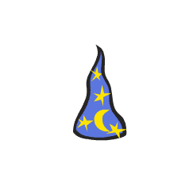

# Introduksjon {.intro}

I denne oppgåva skal me importere ein geometrisk figur og så
`rotere`{.blockmotion} den. Merk at viss du allereie har gjort oppgåva om
[rotasjon kring eigen akse](../rotasjon/rotasjon_nn.html) kan du hoppe over steg 1
og heller laste inn den førre oppgåva di frå "Mine ting"-mappa.




# Steg 1: Førebuingar {.activity}

*For å gjere det enkelt å kome i gang skal me hente inn ein figur frå
 Scratch-biblioteket. Denne figuren er tilnærma lik ein likebeint trekant.*

## Sjekkliste {.check}

- [ ] Start eit nytt prosjekt.

- [ ] Slett kattefiguren ved å høgreklikke på den og velje `slett`.

- [ ] Legg til ein ny figur. Klikk på -knappen og vel
  trollmannshatten. Me har brukt `Ting/Wizard Hat`-figuren.

- [ ] Gi den nye figuren namnet `Hattulf` ved å klikke på `i`.

- [ ] Før me startar med sjølve oppgåva skal me leggje inn ein hjelpefunksjon i
  tilfelle noko uventa skjer:

  ```blocks
  når [n v] vert trykt
  vis
  peik i retning [90 v]
  gå til x: (0) y: (0)
  ```

- [ ] Viss noko uventa skjer kan du berre trykke på `N`-tasten, så vil Hattulf
  gå tilbake til utgangspunktet slik at du kan prøve på nytt.

## Test prosjektet {.flag}

- [ ] Bruk musepeikaren og flytt Hattulf til ein ny stad i vindauget.

- [ ] Trykk `N` på tastaturet ditt. Hoppar Hattulf tilbake til midten av
  vingauget? Viss ja: gå vidare til steg 2. Viss nei: feilsøk koden din, fiks
  den og test om att.


# Steg 2: Rotasjon i eit koordinatsystem {.activity}

- [ ] Importer bakgrunnen `xy-grid`

- [ ] Vel Hattulf. I skriptet

  ```blocks
  når [n v] vert trykt
  vis
  peik i retning [90 v]
  gå til x: (0) y: (0)
  ```

  endrar me `x`-verdien til `-100`, og `y`-verdien til `100`.

- [ ] Legg merke til punktet der `x`-aksen (vassrett) og `y`-aksen (loddrett)
  kryssar kvarandre. Det punktet kallar me origo, og det er staden der både `x`
  og `y` er `0`.

## Test prosjektet {.flag}

- [ ] Trykk `N` på tastaturet. No skal Hattulf havne der dei to grå linjene for
  `x = -100` og `y = 100` kryssar kvarandre.

- [ ] Viss alt ser greitt ut kan du gå vidare til neste steg.

- [ ] Viss noko ikkje ser riktig ut må du prøve å finne ut om du har gjort ein
  feil i koden din, rette det opp, og trykke `N` på nytt.


# Steg 3: Hattulf roterer om origo {.activity}

No skal me rotere Hattulf om origo på ein ganske enkel måte.

- [ ] Lag dette skriptet til Hattulf:

  ```blocks
  når [pil høgre v] vert trykt
  gå (200) steg
  snu @turnRight (90) gradar
  ```

## Test prosjektet {.flag}

- [ ] Trykk tasten `pil høgre` på tastaturet. Kva skjer? Fortset til Hattulf er
  attende der han starta.

- [ ] Viss du studerer koden me laga til Hattulf ser du at me ber Hattulf gå 200
  steg. Kvifor må me gå så langt?

- [ ] Prøv å endre talet steg Hattulf tek. Endar Hattulf på same stad som han
  starta når du har trykka `pil høgre` fire gonger?


# Steg 4: Ein ny ven! {.activity}

- [ ] Legg til ein ny figur. Denne gongen vel du figur heilt sjølv. Viss den
  blir veldig stor i forhold til alt det andre kan du krympe den til passe
  storleik. Kall den nye figuren `Ven`.

- [ ] Lag ein kopi av "Når `N` vert trykt"-skriptet frå Hattulf til `Ven`, men
  endre `y`-verdien til `50`.

- [ ] Kopier rotasjonsskriptet frå Hattulf, men halver både talet på steg og
  talet på gradar i skriptet.

- [ ] For litt meir moro kan du leggje til ei linje med kode som skrur på
  `pennen`{.blockpen} for begge figurane. Øvste del av pil høgre-skriptet skal
  sjå slik ut:

  ```blocks
  når [pil høgre v] vert trykt
  penn på
  ```

## Test prosjektet {.flag}

- [ ] Trykk pil høgre. Kva skjer?

- [ ] Trykk pil høgre slik at Hattulf kjem attende til utgangspunktet. Kor langt
  har `Ven` kome?

- [ ] Kor mange gonger må du trykkje for at `Ven` skal kome attende til
  utgangspunktet?

- [ ] Klarar du å justere utgangspunktet til `Ven` slik at figuren har like lang
  avstand til origo for kvar gong du trykker pil høgre?
