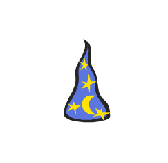

# Læringsmål {.tips}
+ beskrive og gjennomføre spegling, rotasjon og parallellforskyving
+ beskrive plassering og flytting i rutenett, på kart og i koordinatsystem, med og utan digitale hjelpemiddel, og bruke koordinatar til å berekne avstandar parallelt med aksane i eit koordinatsystem

# Introduksjon {.intro}
I denne oppgaven skal vi importere en geometrisk figur og deretter `rotere`{.blockmotion} den.
OBS! Har du allerede løst oppgaven med rotasjon rundt egen akse kan du hoppe over Steg 1 og heller bare laste inn den forrige oppgaven din fra "Mine ting"-mappen.



# Steg 1: Forberedelser {.activity}

*For å gjøre det enkelt å komme i gang, henter vi inn en ferdig figur fra biblioteket til Scratch.
Denne figuren er tilnærmet lik en likebeint trekant*

## Sjekkliste {.check}

+ Start et nytt prosjekt.
+ Slett kattefiguren ved å høyreklikke på den og velge `slett`.
+ Legg til en ny figur. Klikk på -knappen og velg trollmannshatten. Vi har brukt `Ting/Wizard Hat`-figuren.
+ Gi den nye figuren navnet `Hattulf` ved å klikke på `i`.
+ Før vi begynner med selve oppgaven, skal vi legge inn en liten hjelpefunksjon om noe uventet skulle skje:

  ```blocks
  når [n v] trykkes
  vis
  pek i retning [90 v]
  gå til x: (0) y: (0)
  ```
+ Skulle noe uventet skje nå, trenger du bare å trykke på tasten N på tastaturet, så vil Hattulf gå tilbake til utgangspunktet, slik at du kan prøve på nytt.

## Test prosjektet {.flag}

+ Bruk musepekeren og flytt Hattulf til et nytt sted i bildet.
+ Trykk N på tastaturet ditt. Hopper Hattulf tilbake til midten av bildet? Hvis ja: Gå videre til steg 2. Hvis nei: Feilsøk koden din, fiks den, test på nytt.

# Steg 2: Rotasjon i et koordinatsystem {.activity}

+ Importer bakgrunnen 'xy-grid'
+ Velg Hattulf. I scriptet

  ```blocks
  når [n v] trykkes
  vis
  pek i retning [90 v]
  gå til x: (0) y: (0)
  ```
endrer vi x-verdien til -100, og y-verdien til 100.

+ Legg merke til punktet der x-aksen (vannrett) og y-aksen (loddrett) krysses. Det punktet kalles origo og er det stedet hvor både x = 0 og y = 0.

## Test prosjektet {.flag}

+ Trykk N på tastaturet. Hattulf skal havne akkurat der de to grå linjene for X = -100 og Y = 100 krysses.
+ Hvis alt ser greit ut, fortsett til neste steg.
+ Hvis noe ikke ser riktig ut, prøv å finne ut om du har gjort en feil i koden din og prøv å trykke N på nytt.

# Steg 3: Hattulf roteres rundt origo {.activity}

Nå skal vi altså rotere Hattulf rundt origo på en ganske enkel måte.

+ Lag dette skriptet til Hattulf:

  ```blocks
  når [pil høyre v] trykkes
  gå (200) steg
  vend høyre (90) grader
  ```

## Test prosjektet {.flag}

+ Trykk tasten "pil høyre" på tastaturet. Hva skjer? Fortsett til Hattulf er tilbake ved startpunktet sitt.
+ Hvis du studerer koden vi nettopp laget til Hattulf, ser du at vi ber Hattulf gå 200 steg. Hvorfor må vi gå så langt?
+ Prøv å endre på antall steg Hattulf tar. Ender Hattulf opp på samme sted som han startet etter at du har trykket "pil høyre" fire ganger?

# Steg 4: En ny venn! {.activity}

+ Legg til en ny figur. Denne gangen skal du få velge figur selv. Hvis den blir veldig stor i forhold til alt det andre, kan du krympe den ned til en passelig størrelse. Kall den nye figuren for "Venn"
+ Lag en kopi av "Når N trykkes"-skriptet fra Hattulf til Venn, men endre y-verdien til 50.
+ Kopier også over "Når pil høyre trykkes"-skriptet fra Hattulf, men halver både antall steg og antall grader i skriptet.
+ For litt mer moro kan du legge til en linje med kode som skrur på `pennen`{.blockpen} for begge figurene. Øverste del av pil høyre-skriptet skal da se slik ut:

  ```blocks
  når [pil høyre v] trykkes
  penn på
  ```
## Test prosjektet {.flag}

+ Trykk pil høyre. Hva skjer?
+ Trykk pil høyre slik at Hattulf kommer tilbake til utgangspunktet. Hvor langt har Venn kommet nå?
+ Hvor mange ganger på du trykke for at Venn kommer tilbake til utgangspunktet?
+ Klarer du å justere utgangspunktet til Venn, slik at figuren har like lang avstand til origo for hver gang du trykker pil høyre?
