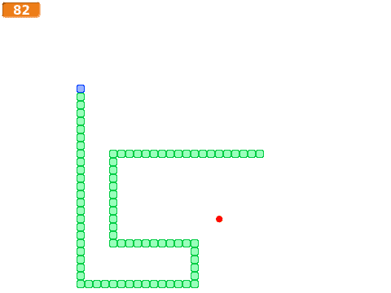

# Om oppgaven {.activity}

En eller annen variant av Snake har eksistert på nesten alle personlige
datamaskiner helt siden slutten av 1970-tallet. Ekstra populært ble spillet da
det dukket opp i Nokias mobiltelefoner i 1997, og de seneste årene har spillet
til og med blitt innlemmet i New Yorks Museum of Modern Arts samling.

Selve spillet går enkelt og greit ut på å styre en slange rundt på skjermen,
mens slangen må unngå å krasje i kanten av skjermen eller seg selv. Slangen
vokser ved å spise epler som dukker opp tilfeldige steder på skjermen. Snake kan
videreutvikles på mange måter, enten ved å lage ekstra hindringer på skjermen,
ved forskjellige typer bonusepler, eller for eksempel ved at to slanger
konkurrerer om å spise eplene og om å stenge hverandre inne.



## Oppgaven passer til: {.check}

 __Fag__: Kunst og håndtverk, matematikk, programmering.

__Anbefalte trinn__: 5.-10. trinn.

__Tema__: Grunnleggende geometriske former, koordinatsystem, variabler.

__Tidsbruk__: Dobbelttime eller mer.

## Kompetansemål {.challenge}

- [ ] __Kunst og håndtverk, 4. trinn__: bruke enkle funksjoner i digitale
      bildebehandlingsprogram.

- [ ] __Kunst og håndtverk, 4. trinn__: eksperimentere med enkle geometriske
      former i konstruksjon og som dekorative formelementer.

- [ ] __Matematikk, 4. trinn__: lese av, plassere og beskrive posisjoner i
      rutenett, på kart og i koordinatsystemer, både med og uten digitale
      verktøy.

- [ ] __Matematikk, 7. trinn__: beskrive plassering og flytting i rutenett, på
      kart og i koordinatsystem, med og uten digitale hjelpemidler, og bruke
      koordinater til å beregne avstander parallelt med aksene i et
      koordinatsystem

- [ ] __Programmering, 10. trinn__: bruke grunnleggende prinsipper i
      programmering, slik som løkker, tester, variabler, funksjoner og enkel
      brukerinteraksjon

## Forslag til læringsmål {.challenge}

- [ ] Elevene kan lage enkle figurer som representerer en slangekropp og epler,
      og bruke dem i et spill.

- [ ] Elevene kan plassere elementer i bestemte posisjoner ved hjelp av et
      koordinatsystem.

- [ ] Elevene kan få en figur til å bevege seg i et koordinatsystem ved hjelp av
      retning og hastighet, og at tilhørende figurer følger etter.

- [ ] Elevene kan lage et spill med kontinuerlig brukerinteraksjon.

## Forslag til vurderingskriterier {.challenge}

- [ ] Eleven viser middels måloppnåelse ved å fullføre oppgaven.

- [ ] Eleven viser høy måloppnåelse ved å videreutvikle egen kode basert på
      oppgaven, for eksempel ved å gjøre en eller flere av variasjonene
      nedenfor.

## Forutsetninger og utstyr {.challenge}

- [ ] __Forutsetninger__: Elevene må ha god kunnskap i Scratch. De bør ha gjort
      flere prosjekter på erfaren-nivået før de begynner med denne oppgaven.

- [ ] __Utstyr__: Datamaskiner med Scratch installert. Eventuelt kan elevene
      bruke Scratch i nettleseren dersom de har en bruker (eller registrerer
      seg) på [scratch.mit.edu/](http://scratch.mit.edu/){target=_blank}.

## Fremgangsmåte

[Klikk her for å se oppgaveteksten.](../snake/snake.html){target=_blank}


# Når jeg mottar [nytt spill] {.activity}

I de mer avanserte Scratch-oppgavene bruker vi kodeblokken

```blocks
når jeg mottar [Nytt spill v]
```

i stedet for

```blocks
når grønt flagg klikkes
```

Det blir introdusert litt subtilt i hver oppgave, så de fleste elevene får det
ikke med seg når de programmerer. Å bruke en slik melding har flere fordeler,
blant annet at det går an å starte spillet på nytt uten å måtte trykke på det
grønne flagget (for eksempel kan meldingen `Nytt spill` sendes ut når en bestemt
tast på tastaturet trykkes). Gjerne diskuter fordeler og ulemper ved dette med
elevene for å gjøre et poeng av det.

## Variasjoner {.challenge}

- [ ] Elevene kan lage en variabel som teller poeng.

- [ ] Elevene kan lage en funksjon som øker hastigheten i spillet. Merk at å øke
      antall steg slangen går ikke vil fungere direkte, fordi alle leddene i
      kroppen også må henge med.

- [ ] Elevene kan lage epler med ulike effekter, for eksempel at slangekroppen
      øker med to ledd i stedet for ett.

- [ ] Elevene kan la flere epler være synlige samtidig.

- [ ] Elevene kan la eplene flytte seg dersom det går for lang tid før de blir
      spist.

- [ ] Elevene kan lage en to-spiller-versjon, der spillerne både konkurrerer om
      å spise epler og å låse hverandre inne.

- [ ] Elevene kan lage en forside og en menyside for spillet.

## Eksterne ressurser {.challenge}

- [ ] Foreløpig ingen eksterne ressurser...
