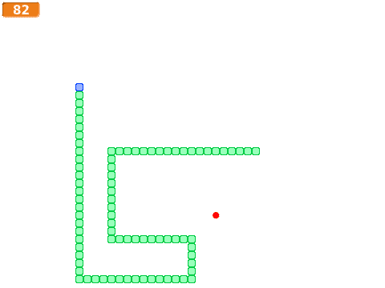
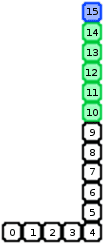

# Introduksjon {.intro}

En eller annen variant av Snake har eksistert på nesten alle
personlige datamaskiner helt siden slutten av 1970-tallet. Ekstra
populært ble spillet da det dukket opp i Nokias mobiltelefoner i 1997,
og de seneste årene har spillet til og med blitt innlemmet i New Yorks
Museum of Modern Arts samling.

Selve spillet går enkelt og greit ut på å styre en slange rundt på
skjermen, mens slangen må unngå å krasje i kanten av skjermen eller
seg selv. Slangen vokser ved å spise epler som dukker opp tilfeldige
steder på skjermen. Snake kan videreutvikles på mange måter, enten ved
å lage ekstra hindringer på skjermen, ved forskjellige typer
bonusepler, eller for eksempel ved at to slanger konkurrerer om å
spise eplene og om å stenge hverandre inne.



# Oversikt over prosjektet {.activity}

*Mesteparten av kodingen av Snake skal du gjøre selv. I Snake bruker
 vi kloner på en litt spesiell og ganske smart måte. Vi vil derfor
 fokusere på kloning i begynnelsen av denne leksjonen.*

## Plan {.check}

+ Slangen flytter på seg ... eller?

+ Styr slangen til den krasjer!

+ Epler og annet snadder.

+ Vegger, bonusepler, flere slanger og andre utfordringer.

# Steg 1: Slangen flytter på seg ... eller? {.activity}

*Snake er i prinsippet et enkelt spill å lage. Men en utfordring er
 hvordan selve slangen skal flyttes rundt. Først virker det kanskje
 som om man trenger en eller annen liste som husker hvor hver del av
 slangen er slik at man kan flytte den.*

I stedet for å bruke lister skal vi bruke kloning på en litt spesiell
måte. Husk at når vi kloner kopierer vi både utseendet og oppførselen
til en figur. Vi vil starte med en enkel boks som vil være en del av
kroppen til slangen. Denne boksen vil vi flytte, klone, flytte, klone
og så videre. Trikset for at det skal se ut som om slangen flytter på
seg er at de gamle klonene sletter seg selv etter litt tid.

I figuren er den blå boksen hodet til slangen, de grønne boksene er
kroppen til slangen, mens de hvite boksene indikerer hvor slangen har
vært (men er egentlig slettede klonede bokser).



For å vite når vi skal slette kloner bruker vi tre variabler:
`lengde`{.blockdata} er lengden på slangen, `teller`{.blockdata} er en
enkel teller som passer på hvor mange steg slangen har gått siden
begynnelsen av spillet. Til slutt vil `min id`{.blockdata} være et
tall som forteller hvilket nummer i rekken en gitt klone er. Over er
`min id`{.blockdata} skrevet i hver boks, `teller`{.blockdata} er 16
siden slangen har gått 16 steg, og `lengde`{.blockdata} er 6.

Trikset er nå ganske enkelt. Hver klone sletter seg selv hvis `min
id`{.blockdata} er mindre enn `teller`{.blockdata} -
`lengde`{.blockdata}. La oss prøve dette ut i praksis.

## Sjekkliste {.check}

+ Start et nytt prosjekt. Slett kattefiguren.

+ Lag en boksfigur. Tegn denne selv. Du bør lage den ganske liten slik
  at du får plass til en lang slange på skjermen. Pass også på at
  boksen blir like bred som høy. Et sted mellom `10 x 10` og `20 x 20`
  er en fin størrelse.

  

+ Lag så de tre variablene: `lengde`{.blockdata} og
  `teller`{.blockdata} skal gjelde for alle figurer, mens `min
  id`{.blockdata} må gjelde kun for denne figuren siden den skal være
  forskjellig for hver klon.

+ Vi skal nå lage hovedløkken i spillet. Først setter vi de nødvendige
  variablene, deretter bruker vi en løkke til å lage stadig nye
  slangebokser.

  ```blocks
  når jeg mottar [Nytt spill v]
  sett [teller v] til [0]
  sett [lengde v] til [5]
  gjenta til <berører [kant v]>
      sett [min id v] til (teller)
      endre [teller v] med (1)
      vent (0.1) sekunder
      lag klon av [meg v]
      gå (10) steg
  slutt
  ```

  Her må `10`-tallet i `gå 10 steg`{.blockmotion}-klossen være likt
  med størrelsen på din boks.

+ Selve kloneboksene trenger nå bare vente til de skal slette seg
  selv. Det er ganske enkelt.

  ```blocks
  når jeg starter som klon
  vent til <((teller) - (lengde)) > (min id)>
  slett denne klonen
  ```

  Sammenlign disse skriptene med figuren og forklaringen
  ovenfor. Skjønner du hvordan de fungerer?

+ Prøv spillet ditt. Det kan være greit å lage et skript på scenen som
  sender ut meldingen `Nytt spill` når det grønne flagget klikkes. Du
  skal se en slange som beveger seg over skjermen, du kan selvsagt
  ikke styre den enda!

# Steg 2: Styr slangen til den krasjer! {.activity}

*Vi skal nå kontrollere slangen med piltastene.*

Det er lett å bruke piltastene til å kontrollere slangen. Siden den
går av seg selv trenger vi bare å endre retningen når piltastene
trykkes.

## Sjekkliste {.check}

+ Lag et nytt skript som også starter på `Nytt spill`-meldingen. Lag
  en `for alltid`{.blockcontrol}-løkke hvor du tester om hver piltast
  er trykket og endrer hvilken retning figuren peker tilsvarende.

+ Legg til en `gå til x: y:`{.blockmotion}- og en `pek i
  retning`{.blockmotion}-kloss først i skriptet ditt slik at slangen
  starter et fornuftig sted i begynnelsen av spillet.

+ Du kan markere hodet til slangen ved å lage en ekstra drakt. Lag for
  eksempel en kopi av den boksen du allerede har tegnet, og endre
  fargen på denne. Kall en av draktene `hode` og den andre `kropp`. Du
  kan da bruke `hode`-drakten i hovedløkken hvor du genererer
  klonen. I skriptet for hver klon endrer du så drakten til `kropp`
  før `vente`{.blockcontrol}-klossen.

+ Legg også inn en sjekk på om slangen krasjer i seg selv. Dette kan
  du for eksempel gjøre ved å utvide testen i `gjenta
  til`{.blockcontrol}-klossen med `eller`{.blockoperators} og `berører
  fargen`{.blocksensing}.

+ Prøv spillet ditt. Du skal nå kunne styre slangen din rundt på
  skjermen, helt til du krasjer i kanten eller i deg selv.

# Steg 3: Epler og annet snadder {.activity}

*Nå skal vi gi slangen litt mål og mening. Ved å spise epler kan
 slangen vokse seg stor og sterk!*

Eplene er ganske enkle å lage da vi bare trenger en figur som blir
borte når slangen spiser dem. For å enklere kunne utvide med flere
epler og slikt senere bruker vi kloner av eplene også.

## Sjekkliste {.check}

+ Lag en ny eplefigur. Denne bør være omtrent like stor som slangen.
  For eksempel en rød fyllt sirkel som er omtrent `10 x 10` passer
  bra.

+ Lag et skript som starter på en ny melding `Lag eple`. Dette
  skriptet skal flytte eplet til et tilfeldig sted på skjermen, og
  deretter lage en klon. Men vi vil være litt nøye med at eplet havner
  i samme "rutenett" som slangen. For eksempel, om slangeboksene dine
  er `10 x 10` kan du bruke noe som dette:

  ```blocks
  gå til x: ((10) * (tilfeldig tall fra (-23) til (23))) y: ((10) * (tilfeldig tall fra (-16) til (16)))
  ```

  Husk at skjermen har koordinater fra `-240` til `240` i x-retning,
  og `-180` til `180` i y-retning. Pass på at eplene dine lander
  godt innenfor skjermen slik at slangen kan spise dem.

+ Nå trenger vi et skript som sender ut slike `Lag eple`-meldinger.
  Lag et skript som starter når det mottar `Nytt spill`. Dette
  skriptet skal `skjule`{.blocklooks} eplet og deretter sende en `Lag
  eple`-melding.

+ Til slutt lager vi oppførselen for et slikt kloneeple. Lag et nytt
  skript som starter med `når jeg starter som klon`{.blockcontrol}.
  Dette skriptet må `vise`{.blocklooks} eplet, `vente
  til`{.blockcontrol} det `berører slangen`{.blocksensing}, øke
  `lengden`{.blockdata} på slangen, deretter `sende`{.blockevents} en
  `Lag eple`-melding og til slutt `slette denne
  klonen`{.blockcontrol}.

+ Legg på noen enkle lydeffekter! For eksempel passer lyden `chomp`
  ganske bra når et eple blir spist. Hvilken lyd passer når slangen
  krasjer?

# Steg 4: Videreutvikling av spillet {.activity}

*Du står helt fritt i hvordan du vil jobbe videre med spillet ditt,
 men her er noen ideer som kan gjøre spillet enda morsommere å
 spille:*

## Ideer til videreutvikling {.check}

+ Legg til en poeng-teller. Det enkleste er bare å bruke
  `lengde`{.blockdata} som poeng. Vis denne variabelen på
  skjermen. Høyreklikk på den og velg `stor`.

+ La hastigheten øke etterhvert i spillet. Vanligvis gjør vi dette ved
  å forandre hvor mange steg en figur går. Det kan vi ikke gjøre her
  siden hver boks i slangekroppen må henge sammen. I stedet kan du
  forandre på hvor lenge det ventes mellom hver klon som lages.

+ Kanskje du kan videreutvikle hele konseptet, slik at det er mulig å
  plukke opp forskjellige bonusepler underveis. For eksempel kan du ha
  epler som øker lengden på slangen med mer enn 1, epler som lager
  flere epler, ekstra store epler, eller noe helt annet.

+ Det trenger jo ikke bare være ett eple om gangen. Om du for eksempel
  lager tre epler i starten av spillet vil det være litt mindre leting
  etter eplene og spillet kan være litt morsommere. Du kan gjøre dette
  ved hjelp av kloning, bare pass på at ikke klonene lager nye kloner
  igjen!

+ La eplene flytte seg om det går en viss tid uten at de blir
  spist. For å holde styr på tiden kan du bruke
  `tid`{.blocksensing}-klossen i `Sansning`{.blocksensing}-kategorien.

+ I stedet for at slangen bare kan krasje i seg selv eller i kanten,
  kan du også lage hindringer på selve brettet. Disse kan du for
  eksempel tegne på bakgrunnen i en spesiell farge og deretter
  undersøke om slangen `berører fargen`{.blocksensing}. Du kan til og
  med ha flere brett med dører mellom.

+ Hva med å lage en to-spiller versjon? Spillerene styrer hver sin
  slange, og samtidig som de konkurrerer om å spise eplene prøver de å
  sperre hverandre inne.

+ Spillet ditt fortjener også en forside og en meny som kan starte
  spillet. Her kan du også la spillerene velge vanskelighetsgrad ved å
  endre på ting som lengde, hastighet, hinder i banen og så videre.
