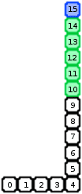

# Вступ {.intro}

Деякі варіанти Змійки існували майже на кожному персональному комп’ютері з кінця 1970-х років. Гра стала особливо популярною, коли вона з’явилася на мобільних телефонах Nokia у 1997 році, а останніми роками гра навіть була включена до колекції Музею сучасного мистецтва Нью-Йорка.

Сама гра передбачає просто керування змією по екрану, при цьому змія повинна уникати зіткнення з краєм екрана або з самою собою. Змія росте, поїдаючи яблука, які з’являються у випадкових місцях на екрані. Змію можна розвивати багатьма способами, або створюючи додаткові перешкоди на екрані, за допомогою різних видів бонусних яблук або, наприклад, за допомогою двох змій, які змагаються, щоб з’їсти яблука та замкнути одна одну.


# Огляд проєкту {.activity}

*Більшу частину кодування Snake ви зробите самостійно. У Snake ми використовуємо клонів трохи особливим і досить хитрим способом. Тому ми зосередимося на клонуванні на початку цього уроку.*

## План перевірки {.check}

- [ ] Змія рухається...чи це так?

- [ ] Керуйте змією, поки вона не розіб'ється!

- [ ] Яблука та інші закуски.

- [ ] Стіни, бонусні яблука, більше змій та інші випробування.


# Крок 1. Змія рухається... чи це так? {.activity}

*Змійка — це в основному проста гра. Але одна проблема полягає в тому, як рухати саму змійку. Спочатку може здатися, що вам потрібен якийсь список, який пам’ятає, де знаходиться кожна частина змійки, щоб ви могли її перемістити.*

Замість використання списків ми будемо використовувати клонування дещо особливим способом. Пам'ятайте, що під час клонування ми копіюємо як зовнішність, так і поведінку персонажа. Ми почнемо з простого блоку, який буде частиною тіла змії. Цей блок ми будемо переміщати, клонувати, переміщати, клонувати і так далі. Фокус, щоб створити враження, що змія рухається, полягає в тому, що старі клони через деякий час видаляються.

На малюнку синє поле — це голова змії, зелені — тіло змії, а білі — вказують, де була змія (але насправді це видалені клоновані поля).



Щоб знати, коли видаляти клони, ми використовуємо три змінні:
`довжина`{.blockdata} — це довжина змії, `кількість`{.blockdata} — простий лічильник, який підраховує, скільки кроків зробила змія з початку гри. Нарешті, `моїм ідентифікатором`{.blockdata} буде число, яке вказує, яким номером у рядку є даний клон. Зверху в кожному полі вказано `мій ідентифікатор`{.blockdata}, `кількість`{.blockdata} — 16, оскільки змія зробила 16 кроків, а `довжина`{.blockdata} — 6.

Трюк тепер досить простий. Кожен клон видаляється сам, якщо `мій ідентифікатор`{.blockdata} менший за `довжину`{.blockdata} - `лічильника`{.blockdata}. Давайте спробуємо це на практиці.

## Контрольний список {.check}

- [ ] Розпочніть новий проєкт.

- [ ] Зробіть форму блока. Намалюйте це самі. Ви повинні зробити його досить маленьким, щоб у вас було місце для довгої 
  змії на екрані. Також переконайтеся, що блок такий же широкий, як і високий. Десь між `10 х 10` і `20 х 20` є хорошим       розміром.

  

- [ ] Потім створіть три змінні: `довжина`{.blockdata} і `кількість`{.blockdata}
  мають застосовуватися до всіх фігур, тоді як `мій ідентифікатор`{.blockdata} має застосовуватися лише до цієї фігури,       оскільки він має бути різним для кожного клону.

- [ ] Тепер ми створимо основний цикл гри. Спочатку ми встановлюємо необхідні змінні, а потім використовуємо цикл для         постійного створення нових блоків змійки.

  ```blocks
  коли я отримую [Нова гра v]
  змінити [Рахунок v] на [0]
  змінити [Довжина v] на [5]
  повторити до <торкається [межа v] ?>
      змінити [Мій ідентифікатор v] на (Рахунок)
      надати [Рахунок v] значення (1)
      чекати (0.1) секунд
      створити клон з [мене v]
      перемістити на (10) кроків
  slutt
  ```

  Тут `10` у блоці `перемістити на 10 кроків`{.blockmotion} мають збігатися з розміром вашого блоку.

- [ ] Самим клонованим боксам тепер потрібно просто почекати, доки вони самі видаляться. Це досить просто.

  ```blocks
  коли я починаю як клон
  чекати поки <((Рахунок) - (Довжина)) > (Мій ідентифікатор)>
  вилучити цей клон
  ```

  Порівняйте ці сценарії з малюнком і поясненням вище. Ви розумієте, як вони працюють?

- [ ] Спробуйте свою гру. Було б добре створити сценарій на сцені, який видає повідомлення `Нова гра`, коли клацає зелений    прапорець. Ви повинні побачити змію, що рухається по екрану, звичайно, ви ще не можете керувати нею!


# Крок 2: Керуйте змією, доки вона не розіб’ється! {.activity}

*Тепер ми будемо керувати змією за допомогою клавіш зі стрілками.*

Керувати змією легко за допомогою клавіш зі стрілками. Оскільки він працює сам, нам потрібно лише змінити напрямок, коли натискаються клавіші зі стрілками.

## Контрольний список {.check}

- [ ] Створіть новий сценарій, який також запускатиметься з повідомлення `Нова гра`. Створіть 
  `цикл повторення назавжди`{.blockcontrol}, у якому ви перевіряєте, чи була натиснута кожна клавіша зі стрілкою, і           відповідно змінюєте напрямок, у якому вказує фігура.

- [ ] Спершу додайте в сценарій `перехід до x: y:`{.blockmotion} і блок `вказівка на напрямок`{.blockmotion}, щоб змійка      починала десь розумно на початку гри.

- [ ] Позначити голову змії можна, зробивши додатковий костюм. Наприклад, зробіть копію блока, який ви вже намалювали, і      змініть його колір. Назвіть один з костюмів `Голова`, а інший `Тіло`. Потім ви можете використовувати костюм
  `Голова` у головному циклі, де ви створюєте клон. У сценарії для кожного клону ви потім змінюєте костюм на `Тіло` перед     `блоком очікування`{.blockcontrol}.

- [ ] Також додайте перевірку, щоб побачити, чи не врізається змійка сама у себе. Ви можете зробити це, наприклад,            розгорнувши тест у `повторі до`{.blockcontrol} блоку за допомогою
  `або`{.blockoperators} та `торкнувшись кольору`{.blocksensing}.

- [ ] Спробуйте свою гру. Тепер ви зможете керувати своєю змією по екрану, доки не вріжетеся об край або в себе.

# Крок 3: Яблука та інші закуски {.activity}

*Тепер ми надамо змії міру і значення. Поїдаючи яблука, змія може вирости великою та сильною!*

Яблука досить легко зробити, оскільки нам потрібна лише фігурка, яка зникає, коли їх з’їдає змія. Щоб полегшити розширення за допомогою додаткових яблук і так далі, ми також використовуємо клони яблук.

## Контрольний список {.check}

- [ ] Створіть нову форму яблука. Він має бути приблизно такого ж розміру, як змійка. Наприклад, добре підійде червоне коло   розміром приблизно `10 x 10`.

- [ ] Створити сценарій, який запускається з нового повідомлення `Створити яблуко`. Цей скрипт перемістить яблуко у           випадкове   місце на екрані, а потім створить клон. Але ми будемо трохи обережні, щоб яблуко потрапило в ту саму «сітку»,   що і змія. Наприклад, якщо ваші бокси для змійки мають розміри `10 x 10`, ви можете використовувати щось на зразок цього:

  ```blocks
  перемістити в x: ((10) * (випадкове від (-23) до (23))) y: ((10) * (випадкове від (-16) до (16)))
  ```

  Пам’ятайте, що екран має координати від `-240` до `240` у X-напрямку і від `-180`
  до `180` у Y-напрямку. Переконайтеся, що ваші яблука добре потрапляють на екран, щоб змія могла їх з’їсти.

- [ ] Тепер нам потрібен сценарій, який надсилає такі повідомлення `Створи яблуко`Створіть сценарій, який запускається,       коли отримує повідомлення `Нова гра`. Цей скрипт має `приховати`{.blocklooks} яблуко, а потім надіслати повідомлення        `Створи яблуко`.

- [ ] Нарешті, ми створюємо поведінку для такого яблука-клону. Створіть новий сценарій, який починається з моменту `коли я    починаю як клон`{.blockcontrol}. Цей сценарій має `показати`{.blocklooks} яблуко, `дочекатися`{.blockcontrol}, поки воно    `торкнеться змії`{.blocksensing}, збільшити `довжину`{.blockdata} змії, потім `надіслати`{.blockevents} повідомлення        `Створи яблуко` і, нарешті, `видалити цей клон`{.blockcontrol}.

- [ ] Додайте прості звукові ефекти! Наприклад, звук `Chomp` досить добре підходить, коли їдять яблуко. Який звук             підходить, коли змія розбивається?


# Крок 4: Подальший розвиток ігор {.activity}

*Ви абсолютно вільні в тому, як ви хочете працювати над своєю грою, але ось кілька ідей, які можуть зробити гру ще цікавішою:*

## Ідеї для подальшого розвитку {.check}

- [ ] Додайте лічильник балів. Найпростіше просто використовувати
  `довжину`{.blockdata} як точку. Виведіть цю змінну на екран. Клацніть на ньому правою кнопкою миші та виберіть `великий`.

- [ ] Нехай швидкість у грі збільшується поступово. Зазвичай ми робимо це, змінюючи кількість кроків, які робить фігура. Ми   не можемо цього зробити тут, оскільки кожен блок в тілі змії має бути з’єднаний. Натомість ви можете змінити час            очікування між створенням кожного клону.

- [ ] Можливо, ви можете далі розвинути всю концепцію, щоб можна було збирати різні бонусні яблука по дорозі. Наприклад, ви   можете мати яблука, які збільшують довжину змії більш ніж на 1, яблука, які роблять більше яблук, дуже великі яблука або    щось зовсім інше.

- [ ] Це не обов’язково має бути лише одне яблуко за раз. Наприклад, якщо ви зробите три яблука на початку гри, пошук яблук   буде трохи меншим, і гра стане трохи веселішою. Ви можете зробити це за допомогою клонування, просто переконайтеся, що      клони не створюють нових клонів знову!

- [ ] Дайте яблукам ворухнутися, якщо мине певний проміжок часу, коли вони не будуть з’їдені. Щоб відстежувати час, ви        можете використовувати `часовий блок`{.blocksensing} `Sansning`{.blocksensing} у категорії.

- [ ] Замість того, щоб змія врізалася лише в себе або край, ви також можете створювати перешкоди на самій дошці. Ви          можете, наприклад, намалювати їх на фоні спеціальним кольором, а потім перевірити, чи змія `торкається                      кольору`{.blocksensing}. Ви навіть можете мати кілька лотків з дверцятами між ними.

- [ ] Як щодо створення версії для двох гравців? Кожен гравець керує змією, і, змагаючись, хто з’їсть яблука, вони            намагаються замкнути один одного.

- [ ] Ваша гра також заслуговує на першу сторінку та меню, яке може запускати гру. Тут ви також можете дозволити гравцям      вибирати рівень складності, змінюючи такі параметри, як довжина, швидкість, перешкоди на трасі тощо.

