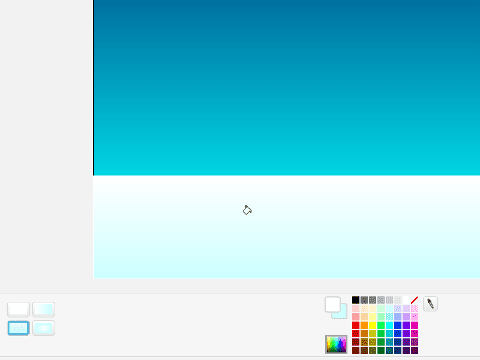

# Introduksjon {.intro}

I denne oppgaven vil vi lage et spill hvor det er om å gjøre å jage
bort de slemme guttene ved å kaste snøball på dem. Underveis vil vi
lære hvordan vi kan gjøre et spill mer utfordrende etterhvert ved at
figurene vi spiller mot blir raskere og vanskeligere å jage bort.


# Steg 1: En snøballkaster {.activity}

*Vi begynner med å lage oss en passelig bakgrunn, samt snøballkasteren
 som vi skal styre.*

## Sjekkliste {.check}

+ Start et nytt prosjekt. Slett kattefiguren.

+ La oss lage en bakgrunn. Til dette spillet trenger vi en ganske
  enkel bakgrunn med litt vinterfølelse. Den kan vi tegne selv:

  Velg  for å tegne en
  ny bakgrunn. Pass på at du bruker vektorgrafikk, og tegn en stor
  firkant som dekker hele bakgrunnen. Velg så en mørkeblå
  forgrunnsfarge og en lysere bakgrunnsfarge. Klikk på
  malingsspannet for å fylle firkanten med farge, og velg en
  overgang nederst til venstre. Klikk på bakgrunnen for å fylle den
  med farge.

  Velg nå hvit som forgrunnsfarge, og lag en litt mindre boks som
  dekker nedre del av bakgrunnen. Fyll også denne med passende farger.

  

  Kall bakgrunnen for `Spill`.

+ Legg følgende lille skript på scenen:

  ```blocks
  når grønt flagg klikkes
  send melding [start v]
  ```

  Du har kanskje sett dette trikset tidligere. Dette gjør det
  enklere for oss å senere komme tilbake og legge på en startmeny og
  lignende.

+ Neste steg er å finne en passende figur som vi kan styre rundt og
  kaste snøballer med. Vi har brukt snømannen, `Fantasi/Snowman`, men
  du kan bruke en figur du liker. Gi figuren navnet `Helten`.

+ Lag en ny variabel, `hastighet`{.blockdata}, som gjelder kun for
  denne figuren, og lag dette skriptet:

  ```blocks
  når grønt flagg klikkes
  sett størrelse til (75) %
  begrens rotasjon [vend sideveis v]
  sett [hastighet v] til [5]
  ```

  På det grønne flagget legger vi innstillinger som skal gjelde for
  __Helten__ gjennom hele spillet. Endre gjerne på størrelsen og
  hastigheten etterhvert som du tester spillet, slik at du finner
  innstillinger du liker.

+ Nå kan vi lage selve hovedløkken til __Helten__. Lag først en løkke
  som starter på meldingen `start`:

  ```blocks
  når jeg mottar [start v]
  gå til x: (0) y: (-75)
  for alltid
  slutt
  ```

+ Inne i løkken trenger vi to `hvis`{.blockcontrol}-klosser som flytter
__Helten__ `hastighet`{.blockdata} steg mot høyre eller venstre når
piltastene høyre og venstre er trykket. Lag disse selv.

+ Til slutt lager du en `hvis`{.blockcontrol}-kloss hvor du sender ut
  meldingen `kast` når mellomrom-tasten trykkes.

## Test prosjektet {.flag}

__Klikk på det grønne flagget.__

+ Beveger figuren din seg rundt på scenen når du trykker høyre og
  venstre piltast? Det skal foreløbig ikke skje noe når du trykker
  mellomrom, siden ingen figurer svarer på `kast`-meldingen.

+ Du må sannsynligvis endre litt på `y`-posisjonen figuren din starter
  på, slik at det ser naturlig ut i forhold til bakgrunnen.

+ Hvis du har en figur med flere drakter kan du også bruke
  `neste drakt`{.blocklooks}-klosser for å animere figuren din slik
  at den beveger seg mer naturlig.

# Steg 2: Mange snøballer {.activity}

*Det blir ingen snøballkrig uten snøballer. La oss lage kjempemange av
 dem! Med kram snø!*

## Sjekkliste {.check}

+ Tegn en ny figur. Bruk sirkelverkøyet til å tegne en liten hvit
  sirkel, fargelegg den deretter slik at den blir helt hvit. Trykk på
   og pass på at
  senterpunktet er satt midt på snøballen. Kall figuren `Snøball`.

+ På samme måte som for __Helten__ setter vi først opp noen
  standardinnstillinger for snøballen. Lag en variabel
  `hastighet`{.blockdata} som kun gjelder for denne figuren:

  ```blocks
  når grønt flagg klikkes
  skjul
  sett størrelse til (40) %
  sett [hastighet v] til [10]
  ```

+ Vi bruker `skjul`{.blocklooks} fordi vi vil lage kloner (kopier) av
  denne snøballen som vi kaster av gårde. Dette er et veldig nyttig
  triks i Scratch. Selve koden som reagerer på `kast`-meldingen er
  veldig enkel.

  ```blocks
  når jeg mottar [kast v]
  lag klon av [meg v]
  ```

+ Selve oppførselen til hver enkelt snøball programmerer vi så på en
  `når jeg starter som klon`{.blockcontrol}-kloss.

  ```blocks
  når jeg starter som klon
  gå til [Helten v]
  pek i retning ([retning v] av [Helten v])
  vis
  gjenta til <berører [kant v]>
      gå (hastighet) steg
  slutt
  slett denne klonen
  ```

## Test prosjektet {.flag}

__Klikk på det grønne flagget.__

+ Hva skjer når du trykker mellomrom-tasten? Kastes det snøballer i
  riktig retning?

+ Det ser kanskje ikke ut som om __Helten__ kaster snøballene med
  hendene? Du kan legge på noen `Bevegelse`{.blockmotion}-klosser rett
  før du `vis`{.blocklooks}er snøballen for at det skal se bedre ut.

+ Som en liten utfordring kan du også prøve å legge på litt effekt av
  tyngdekraften på snøballen ved å endre litt på `y` mens snøballen
  flyr.

+ Et lite problem er at __Helten__ vår er *for* flink til å kaste
  snøball! Hver gang vi trykker mellomrom blir det kastet mange
  snøballer. Dette kan vi løse ganske enkelt ved å vente til
  mellomrom-tasten er sluppet før vi kaster snøballen. Legg til

  ```blocks
  vent til <ikke <tast [mellomrom v] trykket?>>
  ```

  på __Helten__-figuren før `kast`-meldingen sendes.

# Steg 3: Slemme gutter {.activity}

*Nå skal vi se hvordan vi kan lage slemme gutter som prøver å ta
 oss. La oss jage dem bort med snøballer.*

## Sjekkliste {.check}

+ Lag en ny figur. Vi har brukt `Mennesker/Boy3 walking`, men du kan
  bruke den figuren du liker. Kanskje det er morsommere å ha
  snøballkrig mot et monster? Kall figuren `Skumling`.

+ På samme måte som for snøballene vil vi lage kloner av
  __Skumling__. Men først bestemmer vi hvordan han skal se ut. Lag
  igjen en variabel `hastighet`{.blockdata} som gjelder kun for denne
  figuren. Deretter,

  ```blocks
  når grønt flagg klikkes
  skjul
  gå til x: (0) y: (-70)
  begrens rotasjon [vend sideveis v]
  sett størrelse til (30) %
  sett [hastighet v] til [3]
  ```

+ Vi vil la klonene dukke opp med litt tilfeldig mellomrom, og fra
  begge sider av skjermen.

  ```blocks
  når jeg mottar [start v]
  for alltid
      hvis <(tilfeldig tall fra (0) til (1)) = [0]>
          pek i retning (90 v)
          sett x til (-250)
      ellers
          pek i retning (-90 v)
          sett x til (250)
      slutt
      lag klon av [meg v]
      vent (tilfeldig tall fra (2) til (4)) sekunder
  slutt
  ```

+ På samme måte som for snøballene må vi også bestemme oppførselen til
  hver enkelt __Skumling__.

  Lag først en `når jeg starter som klon`{.blockcontrol}-kloss hvor
  du først viser figuren, og deretter lager en
  `for alltid`{.blockcontrol}-løkke hvor figuren beveger seg
  `hastighet`{.blockdata} steg og deretter venter et lite øyeblikk,
  for eksempel 0.1 sekunder.

+ Deretter lager vi en *ny*
  `når jeg starter som klon`{.blockcontrol}-kloss hvor vi undersøker
  om vi treffer enten en __snøball__ eller __Helten__.

  ```blocks
  når jeg starter som klon
  for alltid
      hvis <berører [Helten v]?>
          send melding [slutt v]
          slett denne klonen
      slutt
      hvis <berører [Snøball v]?>
          slett denne klonen
      slutt
  slutt
  ```

  Grunnen til at disse må ligge i et eget skript er at det første
  skriptet venter litt mellom hver gang figuren tar et steg. Hadde
  vi lagt disse `hvis`{.blockcontrol}-klossene på det skriptet ville
  vi bare sjekket om __Skumlingen__ var truffet av en snøball
  innimellom ventingen. Ved å lage et eget skript sjekker vi dette
  hele tiden.

## Test prosjektet {.flag}

__Klikk på det grønne flagget.__

+ Dukker det opp skumlinger? Kommer de fra begge sider? Går de mot
  midten?

+ Hva skjer når en __Skumling__ blir truffet av en __Snøball__? Du kan
  kanskje legge på en passende lydeffekt og animasjon før klonen
  slettes? Vi ser også at snøballen flyr videre etter at den har
  truffet en __Skumling__. Prøv å endre i skriptet for __Snøball__
  slik at snøballen også blir borte.

+ Hva skjer når en __Skumling__ tar __Helten__?

# Steg 4: Telle poeng og avslutte spillet {.activity}

*Nå som vi nesten har et ferdig spill, vil vi også ha poeng!*

## Sjekkliste {.check}

+ Å telle poeng er ganske lett. Lag først en variabel som heter
  `Poeng`{.blockdata} og la den gjelde for alle figurer. La variabelen
  også vises på scenen, slik at vi ser hvor mange poeng vi har fått.

+ Pass på at `Poeng`{.blockdata} blir satt til 0 når meldingen
  `start` sendes, for eksempel med et skript på scenen.

+ Endre `Poeng`{.blockdata} med 1 når en __Skumling__ blir truffet
  av en snøball.

Vi har tidligere laget meldingen `slutt` som sendes ut når __Helten__
blir tatt av en __Skumling__. Nå vil vi bruke denne til å avslutte
spillet. Men først, la oss lage en meny og en bakgrunn som forteller
oss at vi tapte.

+ Klikk på `Scene` til venstre for `Figurer`, og velg
  `Bakgrunner`-fanen. Lag to kopier av bakgrunnen din og
  kall dem henholdsvis `Meny` og `Slutt`.

  På `Meny`-bakgrunnen kan du lage en fin tittel. Skriv også
  `Trykk 'S' for å starte`.

  På `Slutt`-bakgrunnen kan du skrive en passende melding for når
  spillet er slutt. Skriv også `Trykk 'S' for å spille igjen`.

+ Endre nå litt på skriptene på scenen. Først vil vi bare vise menyen
  når det grønne flagget klikkes:

  ```blocks
  når grønt flagg klikkes
  bytt bakgrunn til [Meny v]
  ```

  Deretter vil vi starte spillet når `S` trykkes:

  ```blocks
  når [s v] trykkes
  send melding [start v]
  ```

  Pass også på at du bytter til bakgrunnen `Spill` når meldingen
  `start` mottas, og til bakgrunnen `Slutt` når meldingen `slutt`
  mottas.

+ Til slutt må vi passe på at spillet faktisk avsluttes etter at
  `slutt`-meldingen er sendt. Legg på skript for å
  `slette denne klonen`{.blockcontrol} på __Snøball__ og __Skumling__,
  og skript for å skjule __Helten__ når `slutt` mottas.

## Test prosjektet {.flag}

__Klikk på det grønne flagget.__

+ Fungerer programflyten? Starter spillet når du trykker `S`?
  Avsluttes spillet når __Helten__ blir fanget? Vises de riktige
  bakgrunnene når de skal?

+ Legg gjerne på litt lydeffekter og enkle animasjoner der det passer.

# Steg 5: Store, slemme gutter {.activity}

*Til slutt skal vi gjøre spillet vanskeligere jo lengre vi spiller*

+ Vi innfører først en ny variabel `Nivå`{.blockdata} som skal gjelde
  for alle figurer. Denne styrer hvor vanskelig spillet skal være. La
  den gjerne være synlig.

+ Vi regner ut nivå basert på `Poeng`{.blockdata}. Utvid skriptet
  ditt som mottar `start`-meldingen på scenen med den følgende løkken:

  ```blocks
  for alltid
      sett [Nivå v] til ((1) + ([gulv v] av ((Poeng) / (5))))
  slutt
  ```

  Funksjonen `gulv`{.blockoperators} runder nedover. Dermed sier vi
  at `Nivå`{.blockdata} skal øke for hver femte __Skumling__ vi
  jager vekk.

+ Nå kan vi bruke `Nivå`{.blockdata} til å lage __Skumlingene__
  slemmere. For eksempel kan de bli større, gå raskere og kanskje
  trenge flere snøballer før de blir borte.

  Lag et par nye variabler som gjelder for denne figuren:
  `Slem`{.blockdata} og `Liv`{.blockdata}. `Slem`{.blockdata} vil si
  noe om hvor stor og slem den enkelte __Skumlingen__ er. Ved å la
  dette være et tall mellom 1 og `Nivå`{.blockdata} blir spillet
  vanskeligere etterhvert som `Nivå`{.blockdata} øker. For eksempel
  kan du legge til disse klossene på __Skumling__ sitt hovedskript:

  ```blocks
  når jeg starter som klon
  sett [Slem v] til (tilfeldig tall fra (1) til (Nivå))
  sett [Liv v] til (Slem)
  endre [hastighet v] med (Slem)
  endre [farge v] effekt med ((10) * (Slem))
  endre størrelse med ((5) * (Slem))
  vis
  for alltid
      gå (hastighet) steg
      vent (0.1) sekunder
  slutt
  ```

+ For at en __Skumling__ skal tåle flere snøballer må vi også endre
  litt på hva som skjer når han blir truffet. I stedet for å bare
  slette klonen vil vi endre `Liv`{.blockdata} med -1, og deretter
  gi poeng og slette klonen bare om `Liv`{.blockdata} er 0.

+ Vi bør kanskje gi flere poeng for å jage bort de slemme
  __Skumlingene__? Dette gjør du ved å endre `Poeng`{.blockdata} med
  `Slem`{.blockdata} når en __Skumling__ jages bort.

+ Om vi får mer enn ett poeng for hver __Skumling__ bør vi også endre
  på hvordan vi regner ut `Nivå`{.blockdata}. Hvis ikke vil spillet
  bli veldig fort vanskeligere etterhvert. Du kan for eksempel bruke
  denne utregningen:

  ```blocks
  for alltid
      sett [Nivå v] til ((1) + ([gulv v] av ([kvadratrot v] av ((Poeng) / (3)))))
  slutt
  ```

  Da vil vi fortsatt øke nivået for omtrent hver femte __Skumling__
  som jages bort.

## Test prosjektet {.flag}

__Klikk på det grønne flagget.__

+ Blir spillet vanskeligere etterhvert? Prøv å endre på de
  forskjellige variablene og innstilingene vi har laget slik at
  spillet blir passe vanskelig.

+ Har du flere ideer til hvordan spillet kan gjøres enda morsommere?
  Prøv dem ut!
