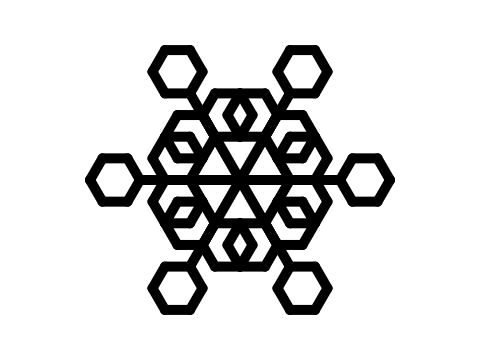
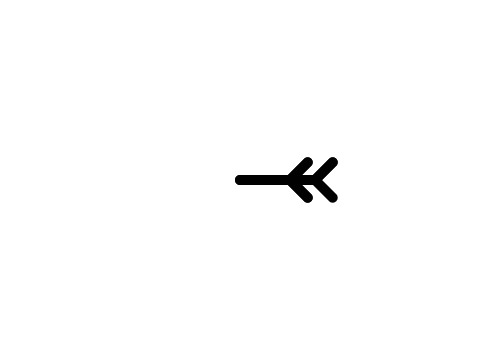
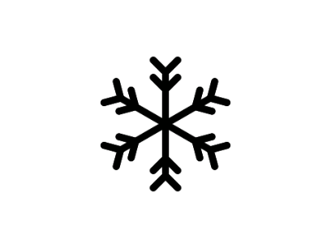
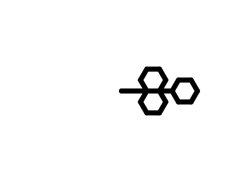

# Introduksjon {.intro}

I denne oppgaven skal du lage dine egne snøkrystaller! Disse krystallene kan så printes ut og lamineres, skjæres ut med en vinyl- eller laserkutter til vinduspynt, 3D-printes og henges i juletreet, eller brukes digitalt som bakgrunnsbilde på PC/nettbrett/mobil!




# Steg 1: Finn inspirasjon {.activity}

## Du trenger {.check}

- Tegneark

- Blyant

- Viskelær

- [ ] Hvordan ser en snøkrystall ut? Bruk gjerne nettet til å søke opp bilder av forskjellige snøkrystaller. Oppdager du noen mønster som går igjen i svært mange snøkrystaller?

- [ ] Vi kjenner jo uttrykket som sier at "ingen snøkrystaller er like" - men likevel følger de noen bestemte regler. De fleste snøkrystaller er *hexagoner*, eller sekskanter, og alle armene i snøfnugget er eksakt like. Derfor trenger vi egentlig bare å tegne én arm til snøkrystallen vår og gjenta den armen seks ganger.

- [ ] Tegn et forslag til en snøkrystall-arm. Det er lurt å begynne med en enkel figur første gang, og så forsøke å gjøre den mer avansert etterhvert. Her er noen forslag til armer du kan tegne:


# Steg 2: Analyser figuren din {.activity}

Når du nå har laget ditt første forslag til snøkrystall-arm, er det på tide å analysere det du har tegnet.
- [ ] Tenk deg at du skal tegne hele armen uten å løfte blyanten fra papiret en eneste gang.
- [ ] Tegningen starter ved den enden av armen som skal ligge i sentrum av snøkrystallen.
- [ ] Skriv ned *pseudokode* som forklarer hva du skal gjøre.

## {.tip}
Pseudokode betyr "liksomkode" og fungerer som en kladd før man begynner å kode på ekte. Pseudokoden trenger ikke å være presis eller følge bestemte regler, slik som ekte kode gjør. Den fungerer som et slags tankekart eller flytskjema for programmeringen. Når man har forsøkt å løse problemet som pseudokode først, går det raskere å skrive den ekte koden etterpå, og det blir lettere å feilsøke om man oppdager feil i koden.


**Eksempel på pseudokode:**
```Java
# Når vi skriver kode, må vi beskrive alt datamaskinen skal gjøre
sett blyanten på papiret. Det er vanlig å bruke #-tegnet for å skrive
forklaringer til koden underveis.

#Først må vi gi blyanten vår noen egenskaper og sette den ned på papiret
sett blyantfarge til svart
sett blyantstrek til kraftig
plasser blyantspissen på arket

# Dette er den første streken ut fra sentrum av snøkrystallen              
tegn en rett strek, 5 cm lang

# Etter 5 cm, ønsker vi å lage en liten gren.
sving 45 grader til venstre
tegn en rett strek, 2 cm lang

# Når streken er tegnet, må vi tilbake dit vi kom fra
gå tilbake, 2 cm

# Nå er vi tilbake ved hovedarmen, og vil tegne en gren ut på høyre side også.
snu 90 grader mot venstre
tegn en rett strek, 2 cm lang
gå tilbake, 2 cm

#Nå skal vi fortsette på hovedarmen
snu 135 grader mot høyre
tegn en rett strek, 2 cm lang

# For å avslutte armen på krystallen, tegner vi den samme greina en gang til:
snu 45 grader til venstre
tegn en rett strek, 2 cm lang
gå tilbake, 2 cm
snu 90 grader mot venstre
tegn en rett strek, 2 cm lang
gå tilbake, 2 cm

#For å få figuren til å peke i samme retning som da vi startet
snu 45 grader til venstre
```

## Geometri-utfordring {.challenge}
Skjønner du hvorfor vi må bruke gradtallene som vi gjør i pseudokoden? Se om du finner en forklaring på hvorfor vi må bruke akkurat de gradtallene når vi tegner denne figuren.


## Lage pseudokode {.check}

- [ ] Bryt ned hver eneste handling til enkeltvise instrukser.

- [ ] Skriv instruksene under hverandre, slik at det er lett å feilsøke dem.

- [ ] Du kan bruke piler eller symboler i stedet for ord når du skriver pseudokoden din.
- [ ] Skriv gjerne kommentarer til pseudokoden, for eksempel slik som i eksempelet over.

## Test hverandres pseudokode {.flag}

**Bytt ark med noen**

- [ ] Les gjennom den andres pseudokode. Forsøk å tegne figuren i hodet ditt mens du leser.

- [ ] Les pseudokoden igjen, og forsøk å tegne figuren på ark. Følg instruksjonene nøye.

- [ ] Ble tegningen slik den skulle? Fant dere feil i pseudokoden?
- [ ] Forsøk å rette opp feilene dere fant før dere fortsetter.

# Steg 3: Skriv koden! {.activity}
Når pseudokoden ser grei ut, er det på tide å skrive ekte kode. Logg inn i Scratch, og legg til pennverktøyet.

- [ ] Helt først skal vi lage en liten sekvens som skrur av pennen, sletter gamle streker og sentrerer pennen vår midt på scena. Til slutt ønsker vi å skjule figuren som tegner, slik at den ikke kommer i veien for snøkrystallen vår:

```blocks
Når grønt flagg klikkes
penn av
slett alt
gå til x: (0) y: (0)
pek i retning (90)
skjul
```

- [ ] Nå kan vi begynne å skrive algoritmen som skal tegne snøkrystallen vår. Bruk pseudokoden din fra steg 2. Scratch-versjonen av eksempelkoden i steg 2 ser slik ut:

```blocks
Når [mellomrom v] trykkes
penn på
sett pennens farge til (#000000)
sett pennbredde til (10)
gå (50) steg
snu @turnLeft (45) grader
gå (25) steg
gå (-25) steg
snu @turnRight (90) grader
gå (25) steg
gå (-25) steg
snu @turnLeft (45) grader
gå (25) steg
snu @turnLeft (45) grader
gå (25) steg
gå (-25) steg
snu @turnRight (90) grader
gå (25) steg
gå (-25) steg
```
## Tips til nettbrett uten tastatur {.protip}
Dersom man bruker nettbrett og ikke har tastatur, kan det være lurt å sette inn en ny figur som kan fungere som virtuell knapp. Bruk for eksempel figuren "Button1", og lag følgende kode til den:
```blocks
Når grønt flagg klikkes
gå til x: (195) y: (-135)

Når denne figuren klikkes
send melding [start v]
```
Da kan dere bytte ut blokken `Når [mellomrom] trykkes`{.blockevents} med blokken `Når jeg mottar [start]`{.blockevents} for å starte tegnekoden.

##
- [ ] Hvis vi nå kjører denne koden, skal vi få en arm som ser slik ut:



- [ ] Da gjenstår det bare å lage en løkke som lar oss tegne seks identiske armer. For at figuren skal bli et hexagon, må vi rotere armen 60 grader for hver gang, 6 ganger, fordi 60 * 6 = 360
## {.tip}
Det kan være lurt å skrive inn løkken(e) i pseudokoden du skrev tidligere.
##

- [ ] Legg merke til at vi bruker opp igjen den forrige koden, men vi gjør noen endringer i rekkefølgen.

```blocks
Når [mellomrom v] trykkes
sett pennens farge til (#000000)
sett pennbredde til (10)
gjenta (6) ganger
penn på
gå (50) steg
snu @turnLeft (45) grader
gå (25) steg
gå (-25) steg
snu @turnRight (90) grader
gå (25) steg
gå (-25) steg
snu @turnLeft (45) grader
gå (25) steg
snu @turnLeft (45) grader
gå (25) steg
gå (-25) steg
snu @turnRight (90) grader
gå (25) steg
gå (-25) steg
snu @turnLeft (45) grader
penn av
gå til x: (0) y: (0)
snu @turnRight (60) grader
end
```

- [ ] Denne koden gir oss denne snøkrystallen:




## Utfordring {.challenge}

- [ ] Nå er det opp til deg å skape noen fantastiske snøkrystaller! Tegn, skriv pseudokode og bruk geometrikunnskapen din til å skape din helt unike snøkrystall! Husk at det er lurt å samarbeide og utveksle ideer med andre.

- [ ] Vi anbefaler å eksperimentere med koden. Kan du bruke løkker til å effektivisere koden?

## Utfordring 2 - Snøkrystallgenerator{.challenge}

- [ ] Ved hjelp av `variabler`{.blockdata} og `tilfeldighet`{.blockoperators}, kan vi lage en snøkrystallgenerator som lager nye snøkrystaller hver gang.

- [ ] Det kan gjøres på denne måten:

```blocks
sett [arm v] til (tilfeldig tall fra (40) til (80)
sett [vinkel v] til (tilfeldig tall fra (20) til (55)
sett pennens farge til (#000000)
sett pennbredde til (10)
gjenta (6) ganger
penn på
gå (50) steg
snu @turnLeft (vinkel) grader
gå (arm) steg
gå ((-1)*(25)) steg
snu @turnRight ((2)*(vinkel)) grader
gå (25) steg
gå (-25) steg
snu @turnLeft (45) grader
gå (25) steg
snu @turnLeft (vinkel) grader
gå (arm) steg
gå ((-1)*(25)) steg
snu @turnRight ((2)*(vinkel)) grader
gå (arm) steg
gå ((-1)*(arm)) steg
snu @turnLeft (vinkel) grader
penn av
gå til x: (0) y: (0)
snu @turnRight (60) grader
end
```

## Utfordring 3 - Funksjoner {.challenge}
- [ ] Man kan øke kompleksiteten til snøkrystallene ved å gjøre mer ut av småarmene. Dette kan imidlertid gjøre koden veldig lang og tungvint å skrive. Da er det kjekt å bruke `funksjoner`{.blockmoreblocks}! (Disse kalles "`Mine blokker`{.blockmoreblocks}" i Scratch)

- [ ] Eksempelvis ønsker vi å tegne flere små sekskanter i stedet for enkle streker ut fra armen, sånn:



- [ ] Da må jeg tegne den samme sekskantformen tre ganger i løpet av en arm. I stedet for å skrive koden manuelt hver gang, lager jeg en `funksjon`{.blockmoreblocks} som gjør jobben for meg. Da trenger jeg bare å kalle på sekskant-funksjonen hver gang jeg skal lage en:

```blocks
definer sekskant
gjenta (6) ganger
gå (25) steg
snu @turnRight (60) grader
end


gå (50) steg
snu @turnLeft (120) grader
sekskant
snu @turnRight (120) grader
sekskant
Gå (50) steg
snu @turnLeft (60) grader
sekskant
```


#

## Eksportere og konvertere bildet  {.save}

- [ ] Når du har laget en snøkrystall du er fornøyd med, kan du lagre bildet.
- PC: Høyretrykk på scena og velg "lagre bilde som".
- Nettbrett: Ta skjermdump først, så beskjære bildet slik at man kun sitter igjen med snøkrystallen.

- [ ] Om bildet skal printes ut på papir og f. eks. lamineres, kan du gjøre det nå.

- [ ] Om bildet skal skjæres ut med vinylkutter eller laserkutter, eller 3D-printes, må bildet konverteres til vektorgrafikk (SVG) først. Til dette finnes det forskjellige onlinetjenester, eller du kan bruke Inkscape, Adobe Illustrator - eller programvaren som følger med vinylkutteren/laserkutteren. Nettsiden [convertio.co/png-svg](https://convertio.co/png-svg/){target=_blank} fungerer fint til dette formålet.

- [ ] Når du har konvertert bildet til SVG, kan du for eksempel laste det opp (Import) i TinkerCAD, gjøre nødvendige justeringer der, og 3D-printe din favorittsnøkrystall!

- [ ] Husk å gi Scratch-programmet ditt et navn. Når du er ferdig kan du klikke på "Legg
ut"-knappen. Da vil det bli lagt ut på Scratch-hjemmesiden din slik at du enkelt
kan dele det med familien og vennene dine.

# Lær mer om snøkrystaller {.try}
Om du synes snøkrystaller er spennende, og har lyst å lære mer, kan du lese mer om hvordan snøkrystaller egentlig dannes her: [mn.uio.no/kjemi/tjenester/kunnskap/snokrystaller](https://www.mn.uio.no/kjemi/tjenester/kunnskap/snokrystaller){target=_blank}
#
