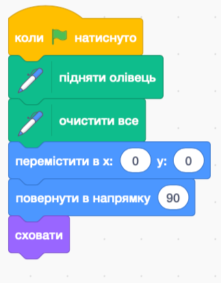
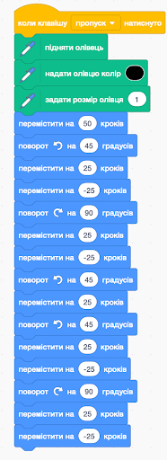
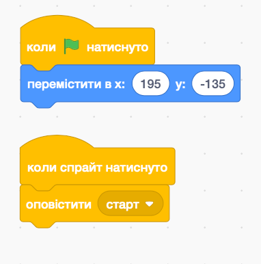

# Вступ {.intro}

У цьому завданні ви зробите власні сніжинки! Їх можна буде роздрукувати та заламінувати, 
вирізати вініловим або лазерним різаком для прикрашання вікон, 
надрукувати на 3D-принтері й повісити на ялинку, 
або використати в цифровому вигляді як шпалери на комп'ютері/планшеті/мобільному телефоні!


# Крок 1: Знайдіть натхнення {.activity}

## Вам знадобиться {.check}

- Креслярський папір

- Олівець

- Гумка

- [ ] Як виглядає сніжинка? Знайдіть в інтернеті зображення різних сніжинок.
       Чи помітили ви якісь візерунки, що повторюються у великій кількості сніжинок?

- [ ] Ми всі знаємо приказку про те, що «немає двох однакових сніжинок» - але вони все ж таки підпорядковуються певним правилам.
      Більшість сніжинок мають форму шестикутника, або шестигранника, і всі сторони сніжинки абсолютно однакові.
      Тому нам потрібно намалювати лише один рукав нашої сніжинки і повторити його шість разів.

- [ ] Намалюйте варіант для частини сніжинки. Краще почати з простої форми, а потім спробуйте зробити її більш складною,
      коли продовжете. Ось кілька варіантів, які ви можете намалювати:


# Крок 2: Проаналізуйте фігуру, яку ви отримали {.activity}

Тепер, коли ви створили свій перший проєкт частини сніжинки, настав час проаналізувати те, що ви намалювали.
- [ ] Уявіть, що ви малюєте цілу ланку сніжинки, не відриваючи олівця від паперу жодного разу.
- [ ] Малюнок починається з того кінця ланки, який буде знаходитися в центрі сніжинки.
- [ ] Напишіть *псевдокод*, який пояснює, що робити.


## {.tip}

Псевдокод означає «несправжній код» і діє як чернетка до того, як ви почнете кодувати по-справжньому.
Псевдокод не повинен бути точним або відповідати певним правилам, як справжній код. 
Він діє як своєрідна ментальна карта або блок-схема для програмування. 
Спробувавши спочатку вирішити проблему за допомогою псевдокоду, ви зможете швидше написати справжній код, 
і його буде легше налагоджувати, якщо ви виявите помилки в коді.

**Приклад псевдокоду:**
```Java
# Коли ми пишемо код, нам потрібно описати все, що повинен робити комп'ютер.
Зазвичай ми використовуємо знак #,
щоб писати пояснення до коду по ходу його написання.

# Спочатку ми повинні надати нашому олівцю деякі властивості і покласти його на папір
задайте олівцю чорний колір
встановіть жирність лінії олівця
покладіть кінчик олівця на аркуш

# Це перший рядок з центру сніжинки намалюйте пряму лінію, 5 см завдовжки

# Через 5 см ми плануємо зробити маленьку гілочку.
Поверніть на 45 градусів ліворуч
намалюйте пряму лінію, 2 см завдовжки

# Коли лінія підведена, ми повинні повернутися туди, звідки прийшли
крок назад, 2 см

# Тепер ми повертаємося до головної гілки, і намалюємо відгалуження з правого боку.
поверніть на 90 градусів ліворуч
намалюйте пряму лінію, 2 см завдовжки
крок назад, 2 см

#Продовжимо на головній гілці
поверніть на 135 градусів праворуч
намалюйте пряму лінію, 2 см завдовжки

#  Щоб завершити ланку кристала, малюємо таку саму гілку ще раз:
поверніть на 45 градусів ліворуч
намалюйте пряму лінію, 2 см завдовжки
крок назад, 2 см
поверніть на 90 градусів ліворуч
намалюйте пряму лінію, 2 см завдовжки
крок назад, 2 см


#Зробімо так, щоб фігура вказувала в тому ж напрямку, що й на початку
поверніть на 45 градусів ліворуч
```

## Завдання форми {.challenge}
Чи розумієте ви, чому в псевдокоді ми використовуємо саме такі степеневі числа? 
Спробуйте знайти пояснення, чому ми використовуємо саме ці числа степенів, коли малюємо цю фігуру.

## Створіть псевдокод {.check}

- [ ] Розбийте кожну дію на окремі інструкції.
- [ ] Пишіть інструкції одна під одною, щоб було легко усунути несправності.
- [ ] Ви можете використовувати стрілки або символи замість слів під час написання псевдокоду.
- [ ] Не соромтеся додавати коментарі до псевдокоду, як у прикладі вище.

## Тестуйте псевдокоди один одного {.flag}

**Поміняйтеся з кимось аркушем**

- [ ] Прочитайте псевдокод іншої людини. Спробуйте намалювати малюнок у себе в голові під час читання.
- [ ] Прочитайте псевдокод ще раз і спробуйте намалювати фігуру на папері. Уважно дотримуйтесь інструкцій.
- [ ] Чи вийшов малюнок таким, як задумано? Знайшли помилки в псевдокоді?
- [ ] Спробуйте виправити знайдені помилки, перш ніж продовжити.

# Крок 3: Пишіть код! {.activity}
Після того, як псевдокод виглядає зрозумілим, настав час писати справжній код. Увійдіть до Scratch та додайте інструмент «Перо».

- [ ] Перш за все, ми створимо невелику послідовність, яка вимикає олівець,
      стирає старі лінії і центрує наш олівець посередині сцени.
      Нарешті, ми повинні приховати малюнок фігури, щоб він не заважав нашій сніжинці:



- [ ] Тепер ми можемо почати писати алгоритм, який намалює нашу сніжинку. Використовуйте свій псевдокод з кроку 2.
      Скретч-версія прикладу коду з кроку 2 виглядає так:



## Підказки для планшетів без клавіатури {.protip}
Якщо ви користуєтеся планшетом і не маєте клавіатури, ви можете вставити новий символ,
який може діяти як віртуальна кнопка. Наприклад, використовуйте символ «Button1» і створіть для нього такий код:



Потім ви можете замінити блок `Коли натиснуто [пробіл]`{.blockevents} на блок `Коли я отримаю [старт]`{.blockevents}, щоб запустити код малювання.

##
- [ ] Якщо ми запустимо цей код, то отримаємо рукав, який виглядає ось так:


- [ ] Залишилося лише створити петлю, яка дозволить нам намалювати шість однакових рукавів.
      Для того, щоб фігура стала шестикутником,
      нам потрібно щоразу повертати рукав на 60 градусів, 6 разів, адже 60 * 6 = 360

## {.tip}
Можливо, ви захочете ввести цикл(и) у псевдокод, який ви ввели раніше.
##

- [ ] Зверніть увагу, що ми повторно використовуємо попередній код, але вносимо деякі зміни в послідовність.

```blocks
Коли [пропуск v] натиснуто  
встановити колір пера на (#000000)  
встановити ширину пера (10)  
повторити (6) разів  
опустити перо  
йти (50) кроків  
повернути @turnLeft (45) градусів  
йти (25) кроків  
йти (-25) кроків  
повернути @turnRight (90) градусів  
йти (25) кроків  
йти (-25) кроків  
повернути @turnLeft (45) градусів  
йти (25) кроків  
повернути @turnLeft (45) градусів  
йти (25) кроків  
йти (-25) кроків  
повернути @turnRight (90) градусів  
йти (25) кроків  
йти (-25) кроків  
повернути @turnLeft (45) градусів  
підняти перо  
перейти до x: (0) y: (0)  
повернути @turnRight (60) градусів  
кінець  
```

- [ ] Цей код дає нам сніжинку:


## Виклик {.challenge}

- [ ] Тепер твоя черга створювати дивовижні сніжинки! Малюйте,
      пишіть псевдокод і використовуйте свої знання геометрії,
      щоб створити свій власний унікальну сніжинку Пам'ятайте,
       що співпрацювати та обмінюватися ідеями з іншими не завадить.

- [ ] Ми рекомендуємо експериментувати з кодом.
      Чи можете ви використовувати цикли для вдосконалення вашого коду?

## Виклик 2 - Генератор сніжинок {.challenge}

- [ ] Використовуючи `Змінні`{.blockdata} та `Випадковість`{.blockoperators}, ми можемо створити генератор, який щоразу вироблятиме нові сніжинки.

- [ ] Це можна зробити таким чином:

```blocks
встановити [arm v] до (випадкове число від (40) до (80))  
встановити [кут v] до (випадкове число від (20) до (55))  
встановити колір пера на (#000000)  
встановити ширину пера (10)  
повторити (6) разів  
опустити перо  
йти (50) кроків  
повернути @turnLeft (кут) градусів  
йти (arm) кроків  
йти ((-1)*(25)) кроків  
повернути @turnRight ((2)*(кут)) градусів  
йти (25) кроків  
йти (-25) кроків  
повернути @turnLeft (45) градусів  
йти (25) кроків  
повернути @turnLeft (кут) градусів  
йти (arm) кроків  
йти ((-1)*(25)) кроків  
повернути @turnRight ((2)*(кут)) градусів  
йти (arm) кроків  
йти ((-1)*(arm)) кроків  
повернути @turnLeft (кут) градусів  
підняти перо  
перейти до x: (0) y: (0)  
повернути @turnRight (60) градусів  
кінець  
```

## Виклик 3 - Функції {.challenge}
- [ ] Ви можете збільшити складність снігових кристалів, зробивши більше стрілецької зброї.
      Однак це може зробити код дуже довгим і громіздким для написання. Ось чому добре використовувати функції
      (у Scratch вони називаються «Мої блоки»).

- [ ] Наприклад, ми хочемо намалювати більше маленьких шестикутників замість простих ліній від руки, ось так:


- [ ] Тоді мені доведеться малювати один і той самий шестикутник тричі в одній руці.
      Замість того, щоб щоразу писати код вручну, створімо `функцію`{.blockmoreblocks}, яка робить цю роботу за нас.
      Тоді потрібно лише викликати функцію шестикутника щоразу, коли нам знадобиться його намалювати:

```blocks
визначити шестикутник  
повторити (6) разів  
йти (25) кроків  
повернути @turnRight (60) градусів  
кінець  

йти (50) кроків  
повернути @turnLeft (120) градусів  
шестикутник  
повернути @turnRight (120) градусів  
шестикутник  
йти (50) кроків  
повернути @turnLeft (60) градусів  
шестикутник  
```


#

## Експортуйте та конвертуйте зображення  {.save}

- [ ] Після того, як ви створили сніговий кристал, який вас влаштовує, ви можете зберегти зображення.
      ПК: Клацніть правою кнопкою миші на сцені та виберіть «Зберегти зображення як».
      Планшет: Спочатку зробіть знімок екрана, а потім обріжте зображення так, щоб залишилася тільки сніжинка.


- [ ] Якщо ви хочете, наприклад, роздрукувати зображення на папері та заламінувати його, ви можете зробити це зараз.

- [ ] Якщо зображення потрібно вирізати за допомогою різака для вінілу або лазерного різака,
      або надрукувати на 3D-принтері, його потрібно спочатку перетворити у векторну графіку (SVG).
      Для цього існують різні онлайн-сервіси, або ви можете використовувати Inkscape, Adobe Illustrator – чи програмне забезпечення,
      яке постачається разом з різаком для вінілу/лазерним різаком. Для цього добре підходить сайт [convertio.co/png-svg](https://convertio.co/png-svg/){target=_blank}.

- [ ] Після перетворення зображення у формат SVG ви можете, наприклад, завантажити його (Імпорт) у TinkerCAD,
      внести необхідні корективи і надрукувати свою улюблену сніжинку!

- [ ] Не забудьте дати назву своїй програмі Scratch. Коли закінчите, натисніть кнопку «Опублікувати».
      Після цього програму буде опубліковано на вашому веб-сайті Scratch, і ви зможете легко поділитися нею з рідними та друзями.


# Дізнайтеся більше про сніжинки {.try}
Якщо вас цікавлять сніжинки і ви хочете дізнатися більше, ви можете прочитати більше про те, як вони насправді утворюються, тут: [mn.uio.no/kjemi/tjenester/kunnskap/snokrystaller](https://www.mn.uio.no/kjemi/tjenester/kunnskap/snokrystaller){target=_blank}
#
