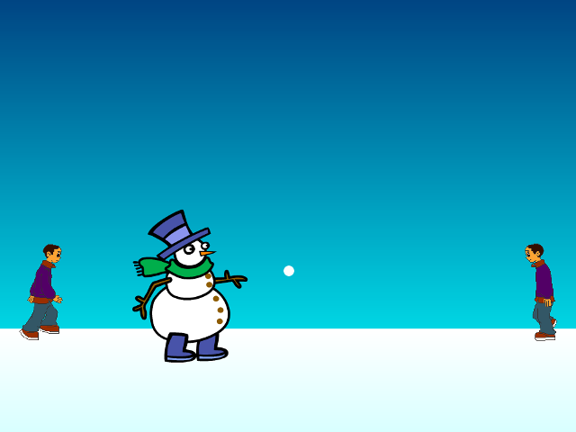

# Informasjon til veiledere

I dette spillet vil vi kontrollere snøballkaster som prøver å jage
bort slemme gutter ved å kaste snøball etter dem.



# Forberedelser

Snøballkrig bruker bare ressurser som er inkludert i
Scratch-platformen og krever som sådann ingen spesielle forberedelser.

Oppgaven er dog ganske utfordrende, og ikke all kode er gitt i detalj
i oppgaveteksten. Dermed er dette en oppgave for dem som har
programmert litt Scratch tidligere.

# Læringsmål

De viktigste læringsmålene i Snøballkrig er

1. hvordan __bruke kloner__ for lage mange kopier av en figur,
2. hvordan man kan gi forskjellige kloner forskjellige egenskaper, og
3. hvordan man setter opp en __bra struktur__ for et større program.

Mot slutten av oppgaven ser vi også på måter man kan gjøre spillet mer
utfordrende etterhvert som man spiller.

# Kodelisting: Scene

```blocks
  når grønt flagg klikkes
  bytt bakgrunn til [Meny v]

  når [s v] trykkes
  send melding [start v]

  når jeg mottar [start v]
  sett [Poeng v] til [0]
  bytt bakgrunn til [Spill v]
  for alltid
    sett [Nivå v] til ((1) + ([gulv v] av ([kvadratrot v] av ((Poeng) / (3)))))
  slutt

  når jeg mottar [slutt v]
  stopp [other scripts in stage v]
  bytt bakgrunn til [Slutt v]
```

# Kodelisting: Helten

```blocks
  når grønt flagg klikkes
  skjul
  sett størrelse til (75) %
  begrens rotasjon [vend sideveis v]
  sett [hastighet v] til [5]

  når jeg mottar [start v]
  gå til x: (0) y: (-75)
  vis
  for alltid
    hvis <tast [pil høyre v] trykket?>
      pek i retning (90 v)
      neste drakt
      gå (hastighet) steg
    slutt
    hvis <tast [pil venstre v] trykket?>
      pek i retning (-90 v)
      neste drakt
      gå (hastighet) steg
    slutt
    hvis <tast [mellomrom v] trykket?>
      vent til <ikke <tast [mellomrom v] trykket?>>
      send melding [kast v]
    slutt
  slutt

  når jeg mottar [slutt v]
  skjul
  stopp [andre skript i figuren v]
```

# Kodelisting: Snøball

```blocks
  når grønt flagg klikkes
  skjul
  sett størrelse til (40) %

  når jeg mottar [kast v]
  lag klon av [meg v]

  når jeg starter som klon
  gå til [Helten v]
  pek i retning ([retning v] av [Helten v])
  endre y med (15)
  gå (30) steg
  vis
  gjenta til <<berører [Skumling v]?> eller <berører [kant v]?>>
    gå (hastighet) steg
  slutt
  hvis <berører [Skumling v]?>
    vent (0.02) sekunder
  slutt
  slett denne klonen

  når jeg mottar [slutt v]
  slett denne klonen
```

# Kodelisting: Skumling

```blocks
  når grønt flagg klikkes
  skjul
  gå til x: (0) y: (-70)
  begrens rotasjon [vend sideveis v]
  sett størrelse til (30) %
  sett [hastighet v] til [3]

  når jeg mottar [start v]
  for alltid
    hvis <(tilfeldig tall fra (0) til (1)) = [0]>
      pek i retning (90 v)
      sett x til (-250)
    ellers
      pek i retning (-90 v)
      sett x til (250)
    slutt
    lag klon av [meg v]
    vent (tilfeldig tall fra (2) til (4)) sekunder
  slutt

  når jeg starter som klon
  sett [Slem v] til (tilfeldig tall fra (1) til (Nivå))
  sett [Liv v] til (Slem)
  endre [hastighet v] med (Slem)
  endre [farge v] effekt med ((10) * (Slem))
  endre størrelse med ((5) * (Slem))
  vis
  for alltid
    gå (hastighet) steg
    vent (0.1) sekunder
  slutt

  når jeg starter som klon
  for alltid
    hvis <berører [Helten v]?>
      send melding [slutt v]
    slutt
    hvis <berører [Snøball v]?>
      endre [Liv v] med (-1)
      hvis <(Liv) = [0]>
        endre [Poeng v] med (Slem)
        slett denne klonen
      slutt
    slutt
  slutt

  når jeg mottar [slutt v]
  slett denne klonen
```
