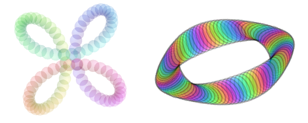

# Introduksjon {.intro}

Det er ganske enkelt å lage interessante animasjoner i Scratch. Her skal vi se
hvordan vi kan flytte og snurre på figurer for å skape spennende mønstre.


# Steg 1: En snurrig figur {.activity}

*La oss begynne enkelt. Vi vil først se hvordan vi kan flytte og snurre på en
figur.*

## Sjekkliste {.check}

- [ ] Start et nytt prosjekt, for eksempel ved å klikke `Programmering` i
  menyen. Hvis du allerede har startet et prosjekt kan du begynne på et nytt ved
  å velge `Fil` og deretter `Ny`.

- [ ] Slett kattefiguren.

- [ ] Vi vil starte med en enkel trekant-figur. Denne kan vi lage på
  forskjellige måter. Først tegner vi denne selv, men nedenfor vil vi også vise
  deg hvordan du kan lage en trekant fra en av de eksisterende figurene.

    Gå til  nede i høyre hjørne og klikk på
     for å tegne din egen figur. Bruk
    linjeverktøyet, , til å tegne en trekant.

    

- [ ] Nå skal vi få trekanten til å flytte seg! Skriv denne koden:

  ```blocks
  når [a v] trykkes
  gå til x: (0) y: (120)
  pek i retning (90 v)
  gjenta (90) ganger
      snu @turnRight (4) grader
      gå (8) steg
  slutt
  ```

## Test prosjektet {.flag}

__Trykk på A-tasten.__

- [ ] Flytter trekanten seg rundt på skjermen?

- [ ] Legg merke til at trekanten snurrer mens den flytter seg.

## Lagre prosjektet {.save}

Du har nå skrevet et lite program! Scratch lagrer alt du gjør med jevne
mellomrom. Det er likevel en god vane å lagre selv også innimellom.

- [ ] Over scenen er det et tekstfelt hvor du kan gi et navn til prosjektet
  ditt. Kall det for eksempel `Snurrige figurer`.

- [ ] I menyen `Fil` kan du velge `Lagre nå` for å lagre prosjektet.

## Endre en eksisterende figur {.challenge}

Selv om det ikke finnes en trekant i figurbiblioteket, kan vi gjøre om en av de
andre figurene til en trekant. Om du allerede har laget en trekant trenger du
ikke gjøre dette. Men det viser deg en morsom måte å leke med Scratchfigurene
på.

- [ ] Velg en ny figur og klikk på forstørrelsesglasset for å hente en
  eksisterende figur. Velg figuren `Party Hats` i Mote-kategorien.

- [ ] Gå til `Drakter`-fanen. Ser du at denne hatten består av en trekant sammen
  med forskjellige andre former?

- [ ] Klikk forskjellige steder på hatten. Du vil da se at blå firkanter merker
  forskjellige deler av hatten. Disse delene kalles grupper.

  

- [ ] Du kan slette grupper ved å trykke på `delete`-tasten på tastaturet. Slett
  gruppene som ikke er en del av trekanten.

- [ ] Trekanten består egentlig av en gruppe figurer den også. Den grønne
  trekanten i bakgrunnen, og flere sirkelfigurer i forskjellige farger. Om du
  vil endre på disse kan du bruke knappen `Del opp gruppe`.

  

- [ ] Du kan leke videre med trekant-figuren! Bruk gjerne `Fyll
  farge`-verktøyet,  for å endre
  farge på trekanten!


# Steg 2: Mange trekanter {.activity}

*Mye morsomt kan skje når vi lager mange trekanter!*

## Sjekkliste {.check}

- [ ] Vi skal nå lage mange trekanter. Dette gjør vi ved hjelp av noe som heter
  __kloning__. I Scratch er en __klon__ en kopi av en figur.

    Kopier koden du skrev tidligere ved å høyreklikke på den og velg `lag en
    kopi`. Endre tasten som starter skriptet til `b` og legg klossen `lag klon
    av [meg v]`{.b} nederst i `gjenta`{.blockcontrol}-løkken. Det nye skriptet
    skal da se slik ut:

    ```blocks
    når [b v] trykkes
    gå til x: (0) y: (120)
    pek i retning (90 v)
    gjenta (90) ganger
        snu @turnRight (4) grader
        gå (8) steg
        lag klon av [meg v]
    slutt
    ```

## Test prosjektet {.flag}

__Trykk på B-tasten.__

- [ ] Nå skal det tegnes mange trekanter på skjermen i en sirkel.

- [ ] Om du stopper skriptet (klikk på den røde knappen ved siden av det grønne
  flagget) blir trekantene borte! Dette er fordi trekantene var kopier som bare
  lever så lenge programmet kjører, de er ikke egne figurer.

## Sjekkliste {.check}

- [ ] Vi kan også få trekantene til å røre på seg. Skriv først denne enkle
      koden:

  ```blocks
  når jeg mottar [snurr v]
  gjenta for alltid
      snu @turnRight (4) grader
  slutt
  ```

- [ ] Legg til klossen `send melding [snurr v]`{.b} nederst i _B_-skriptet
  (etter `gjenta`{.blockcontrol}-løkken).

## Test prosjektet {.flag}

__Trykk på B-tasten.__

- [ ] Begynner trekantene å røre på seg etter at de er tegnet opp? Blir
      mønsteret levende?

- [ ] Prøv å endre på `4`-tallet i _snurr_-skriptet. Hva skjer? Alt dette skjer
  bare fordi mange trekanter snurrer sammen!

## Sjekkliste {.check}

- [ ] Vi kan også la trekantene flytte litt på seg. Skriv et nytt skript:

  ```blocks
  når jeg mottar [flytt og snurr v]
  gjenta for alltid
      gå (3) steg
      snu @turnRight (4) grader
  slutt
  ```

- [ ] Endre `send melding [ v]`{.b}-klossen nederst i _B_-skriptet slik at den
  starter dette nye _flytt og snurr_-skriptet.

## Test prosjektet {.flag}

__Trykk på B-tasten.__

- [ ] Hvordan endrer mønsteret seg?

- [ ] Prøv igjen å endre på tallene i det siste skriptet.


# Steg 3: Mer variasjon {.activity}

*Vi skal nå se hvordan vi kan lage mer variasjon blant de snurrende figurene,
 ved å endre på hvordan de starter.*

## Sjekkliste {.check}

- [ ] Lag en ny variabel, `retning :: variables`{.b}. Det er viktig at du merker
  av at variabelen gjelder kun __For denne figuren__. Dette gjør nemlig at hver
  klon kan ha sin egen verdi for `retning :: variables`{.b}.

- [ ] Lag en kopi av _B_-skriptet. Endre tasten som starter skriptet til `c`, og
  legg også til de to `retning :: stack variables`{.b}-klossene.

  ```blocks
  når [c v] trykkes
  sett [retning v] til (0)
  gå til x: (0) y: (120)
  pek i retning (90 v)
  gjenta (90) ganger
      snu @turnRight (4) grader
      gå (8) steg
      endre [retning v] med (-4)
      lag klon av [meg v]
  slutt
  send melding [flytt og snurr v]
  ```

- [ ] Nå skal vi sette retningen på hver klon i det den lages. Lag dette nye skriptet:

  ```blocks
  når jeg starter som klon
  pek i retning (retning :: variables)
  ```

## Test prosjektet {.flag}

__Trykk på C-tasten.__

- [ ] Ser du at trekantene peker i andre retninger. Dette forandrer mønsteret helt!

- [ ] Det ser ut som om en enkelt trekant svever rundt litt utenfor mønsteret! Hva
  skjer med denne trekanten?

## Sjekkliste {.check}

- [ ] Den ene trekanten som ikke passer helt inn i mønsteret er figuren vår.
  Alle de andre trekantene er kloner. Vi har ikke sett denne trekanten tidligere
  fordi den pekte i samme retning som klonene. Men nå snur vi jo på klonene!

    La oss skjule figuren så den ikke ødelegger mønsteret. Legg til en
    `skjul`{.b}-kloss øverst i _C_-skriptet.

- [ ] Siden klonene er kopier av figuren vil de også skjules. Det vil vi jo
  ikke. Vi må derfor passe på at klonene vises. Legg til en `vis`{.b}-kloss som
  dette:

  ```blocks
  når jeg starter som klon
  vis
  pek i retning (retning :: variables)
  ```

## Test prosjektet {.flag}

__Trykk på C-tasten.__

- [ ] Er den flytende trekanten som ikke passet inn i mønsteret borte?

- [ ] Lek med tallet `-4` i `endre [retning v] :: variables`{.b}-klossen.
  Hvilken effekt har det å endre dette tallet?

    Du oppdager kanskje at det fungerer best om tallet går opp i 4? Hvorfor
    henger ikke figuren sammen hvis tallet ikke går opp i 4? (Prøv for eksempel
    med `endre [retning v] med (1)`{.b}.)


# Steg 4: Andre figurer {.activity}

*Vi kan også lage mønstre av andre figurer enn trekanter.*



## Sjekkliste {.check}

- [ ] Klikk på `Drakter`-fanen. Velg en ny drakt fra biblioteket ved å klikke på
  . Du kan for
  eksempel søke opp hjertefiguren `Heart`.

- [ ] Start programmet igjen ved å trykke på __C__-tasten. Dannes det nå et
  mønster av hjerter? Prøv å hente inn andre drakter eller tegn dine egne.

- [ ] For å lage spennende mønstre er det også andre ting du kan endre på. Prøv
  å legg til klosser for gjennomsiktig effekt og fargeeffekt som følger:

  ```blocks
  når [c v] trykkes
  skjul
  sett [gjennomsiktig v] effekt til (70)
  sett [retning v] til (0)
  gå til x: (0) y: (120)
  pek i retning (90 v)
  gjenta (90) ganger
      snu @turnRight (4) grader
      gå (8) steg
      endre [retning v] med (-4)
      endre [farge v] effekt med (20)
      lag klon av [meg v]
  slutt
  send melding [flytt og snurr v]
  ```

### Flere ideer {.challenge}

Tenk på andre ting du kan gjøre for å lage interessante snurrige figurer. Her er
noen ideer:

- [ ] Endre størrelsen på de forskjellige klonene.

- [ ] Tegn en figur som består av tekst. Kanskje du kan få navnet ditt til å
  danse rundt på skjermen?

- [ ] Endre senterpunktet til drakten: Klikk `Drakter`-fanen og dra figuren litt
  vekk fra sentrum av tegneområdet.

- [ ] Bruk penn-verktøyet for å tegne mønster på bakgrunnen samtidig. Legg for
  eksempel til klossen `penn på`{.b} under `når jeg starter som klon`{.b}.

  For å finne penn-verktøyet må du først aktivere det. Dette gjør du ved å
  klikke `Hent tilleggsfunksjon` nederst til venstre på skjermen, og deretter på
  `Penn`.
