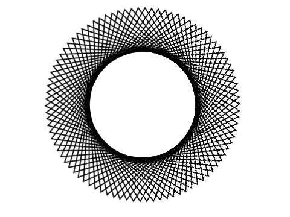

# Introduksjon {.intro}

Det er ganske enkelt å lage interessante animasjonar i Scratch. Her skal me sjå
korleis me kan flytte og snurre på figurar for å skape spanande mønster.




# Steg 1: Ein snurrig figur {.activity}

*La oss starte enkelt. Fyrst vil me sjå korleis me kan flytte og snurre på ein
 figur.*

## Sjekkliste {.check}

- [ ] Start eit nytt prosjekt, til dømes ved å klikke `Programmering` i menyen.
  Viss du allereie har starta eit prosjekt kan du starte eit nytt ved å velje
  `Fil` og så `Ny`.

- [ ] Slett kattefiguren.

- [ ] Me vil starte med ein enkel trekantfigur. Denne kan me lage på ulike
  måtar. Fyrst teiknar me den sjølv, men under viser me og korleis du kan bruke
  dei eksisterande figurane i Scratch til å lage ein trekant.

    Klikk på  for å teikne din eigen
    figur. Så trykkar du på `Bytt til vektorgrafikk` nede til høgre, og bruk
    linjeverktøyet, , til å teikne ein
    trekant.

    

- [ ] No skal me få trekanten til å flytte seg! Skriv denne koden:

  ```blocks
  når [a v] vert trykt
  gå til x: (0) y: (120)
  peik i retning (90 v)
  gjenta (90) gongar
      snu @turnRight (4) gradar
      gå (8) steg
  slutt
  ```

## Test prosjektet {.flag}

__Trykk på A-tasten.__

- [ ] Flyttar trekanten seg rundt på skjermen?

- [ ] Legg merke til at trekanten snurrar når den flyttar seg.

## Lagre prosjektet {.save}

No har du skrive eit lite program! Scratch lagrar alt du gjer med jamne
mellomrom. Likevel er det lurt å leggje til seg vanen med å lagre sjølv
innimellom.

- [ ] Over scena er det eit tekstfelt der du kan gi eit namn til prosjektet
  ditt. Til dømes kan du kalle det `Snurrige figurar`.

- [ ] I menyen `Fil` kan du velje `Lagre no` for å lagre prosjektet.

## Endre ein eksisterande figur {.challenge}

Sjølv om det ikkje finst ein trekant i figurbiblioteket, kan me gjere om ein av
dei andre figurane til ein trekant. Viss du allereie har laga ein trekant treng
du ikkje gjere det. Men det viser ein morosam måte å leike med Scratch-figurane
på.

- [ ] Klikk på 
  for å hente ein eksisterande figur. Vel figuren `ting/Star2`.

- [ ] Gå til `Drakter`-fana. Ser du at stjerna består av to trekantar som er
  lagt oppå kvarandre?

- [ ] Klikk på stjerna slik at den får ein firkant kring seg (blir merka). Då
  dukkar det opp ein ny knapp som heiter `Del opp gruppe` (sjå skjermbiletet
  under). Klikk på denne knappen.

  

- [ ] No har me delt opp stjerna i to trekantar. Du kan klikke på ein av dei, og
  så på `delete`-tasten på tastaturet for å slette den.

- [ ] No har du ein trekantfigur! Du kan gjerne bruke `Fyll farge`-verktøyet,
   for å endre farge på trekanten!


# Steg 2: Mange trekantar {.activity}

*Det kan skje mykje morosamt når me lagar mange trekantar!*

## Sjekkliste {.check}

- [ ] No skal me lage mange trekantar. Det gjer me ved hjelp av __kloning__. I
  Scratch er ein __klone__ ein kopi av ein figur.

    Kopier koden du skreiv før ved å høgreklikke på den og velje `lag ein kopip`.
    Endre tasten som startar skriptet til `b` og legg klossen `lag klon av [meg
    v]`{.b} nedst i `gjenta`{.blockcontrol}-løkka. Det nye skriptet skal sjå
    slik ut:

    ```blocks
    når [b v] vert trykt
    gå til x: (0) y: (120)
    peik i retning (90 v)
    gjenta (90) gongar
        snu @turnRight (4) gradar
        gå (8) steg
        lag klon av [meg v]
    slutt
    ```

## Test prosjektet {.flag}

__Trykk på B-tasten.__

- [ ] No skal det bli teikna mange trekantar på skjermen i ein sirkel.

- [ ] Viss du stoppar skriptet (klikk på den raude knappen ved sidan av det
  grøne flagget) blir trekantane borte! Det er fordi trekantane var kopiar som
  berre lever så lenge programmet køyrer, dei er ikkje eigne figurar.

## Sjekkliste {.check}

- [ ] Me kan få trekantane til å røre på seg. Start med denne enkle koden:

  ```blocks
  når eg får meldinga [snurr v]
  gjenta for alltid
      snu @turnRight (4) gradar
  slutt
  ```

- [ ] Legg til klossen `send meldinga [snurr v]`{.b} nedst i _B_-skriptet
  (etter `gjenta`{.blockcontrol}-løkka).

## Test prosjektet {.flag}

__Trykk på B-tasten.__

- [ ] Startar trekantane å røre på seg når dei er teikna? Blir mønsteret
  levande?

- [ ] Prøv å endre på `4`-talet i _snurr_-skriptet. Kva skjer? Alt dette skjer
  berre fordi mange trekantar snurrar saman!

## Sjekkliste {.check}

- [ ] Me kan få trekantane til å flytte på seg. Skriv eit nytt skript:

  ```blocks
  når eg får meldinga [flytt og snurr v]
  gjenta for alltid
      gå (3) steg
      snu @turnRight (4) gradar
  slutt
  ```

- [ ] Endre `send meldinga [ v]`{.b}-klossen nedst i _B_-skriptet slik at den
  startar dette nye _flytt og snurr_-skriptet.

## Test prosjektet {.flag}

__Trykk på B-tasten.__

- [ ] Korleis endrar mønsteret seg?

- [ ] Prøv å endre tala i det siste skriptet og sjå kva som skjer.


# Steg 3: Meir variasjon {.activity}

*No skal me sjå korleis me kan lage meir variasjon blant dei snurrande figurane,
 ved å endre på korleis dei startar.*

## Sjekkliste {.check}

- [ ] Lag ein ny variabel, `retning :: variables`{.b}. Det er viktig at du
  merkar av at variabelen berre gjeld __for denne figuren__. Det gjer nemleg at
  kvar klone kan ha sin eigen verdi for `retning :: variables`{.b}.

- [ ] Lag ein kopi av _B_-skriptet. Endre tasten som startar skriptet til `c`,
  og legg til dei to `retning :: stack variables`{.b}-klossane.

  ```blocks
  når [c v] vert trykt
  set [retning v] til (0)
  gå til x: (0) y: (120)
  peik i retning (90 v)
  gjenta (90) gongar
      snu @turnRight (4) gradar
      gå (8) steg
      endra [retning v] med (-4)
      lag klon av [meg v]
  slutt
  send meldinga [flytt og snurr v]
  ```

- [ ] No skal me setje retninga på kvar klone når den blir laga. Lag dette
  skriptet:

  ```blocks
  når eg startar som klon
  peik i retning (retning :: variables)
  ```

## Test prosjektet {.flag}

__Trykk på C-tasten.__

- [ ] Ser du at trekantane peikar i andre retningar. Dette forandrar mønsteret
  heilt!

- [ ] Det ser ut som om ein enkelt trekant svever rundt litt utanfor mønsteret!
  Kva skjer med denne trekanten?

## Sjekkliste {.check}

- [ ] Den eine trekanten som ikkje passar heilt inn i mønsteret er figuren vår.
  Alle dei andre trekantane er kloner. Me har ikkje sett denne trekanten før
  fordi den peika i same retning som klonene. Men no snur me jo på dei!

    La oss gøyme figuren så den ikkje øydelegg mønsteret. Legg til ein
    `gøym`{.b}-kloss øvst i _C_-skriptet.

- [ ] Sidan klonene er kopiar av figuren vår vil dei også bli gøymt. Det vil me
  jo ikkje. Så me må passe på at klonene visast ved å leggje til ein
  `vis`{.b}-kloss som dette:

  ```blocks
  når eg startar som klon
  vis
  peik i retning (retning :: variables)
  ```

## Test prosjektet {.flag}

__Trykk på C-tasten.__

- [ ] Er den flytande trekanten som ikkje passa inn i mønsteret borte?

- [ ] Leik med talet `-4` i `endra [retning v] :: variables`{.b}-klossen. Kva
  effekt har det å endre dette talet?

    Du oppdagar kanskje at det fungerer best viss talet er deleleg med 4? Kvifor
    heng ikkje figuren saman viss talet ikkje er deleleg med 4? (Prøv til dømes
    med `endra [retning v] med (1)`{.b}.)


# Steg 4: Andre figurar {.activity}

*Me kan lage mønster av andre figurar enn trekantar.*


## Sjekkliste {.check}

- [ ] Klikk på `Drakter`-fana. Vel ei ny drakt frå biblioteket ved å klikke på
  . Vel til dømes
  hjartet `ting/heart red`.

- [ ] Start programmet att ved å trykkje på _C_-tasten. Blir det danna eit
  mønster av hjarte? Prøv å hente inn andre draktar, eller teikn dine eigne.

- [ ] For å lage spanande mønster er det andre ting du kan endre på òg. Prøv til
  dømes å leggje til klossar for gjennomsiktig effekt og fargeeffekt slik som
  dette:

  ```blocks
  når [c v] vert trykt
  gøym
  set [gjennomsiktig v]-effekt til (70)
  set [retning v] til (0)
  gå til x: (0) y: (120)
  peik i retning (90 v)
  gjenta (90) gongar
      snu @turnRight (4) gradar
      gå (8) steg
      endra [retning v] med (-4)
      endra [farge v]-effekt med (20)
      lag klon av [meg v]
  slutt
  send meldinga [flytt og snurr v]
  ```

### Fleire idear {.challenge}

Tenk på andre ting du kan gjere for å lage interessante snurrige figurar. Her er
nokre idear:

- [ ] Endre storleiken på de ulike klonene.

- [ ] Teikn ein figur av tekst. Kanskje du kan få namnet ditt til å danse rundt
  på skjermen?

- [ ] Endre senterpunktet til drakta: Klikk `Drakter`-fana og klikk på  øvst til høgre.

- [ ] Bruk penn-verktøyet for å teikne mønster på bakgrunnen samstundes. Du kan
  til dømes leggje til klossen `penn på`{.b} under `når eg startar som
  klon`{.b}.
