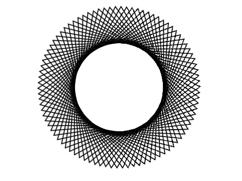
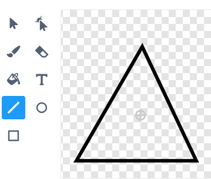
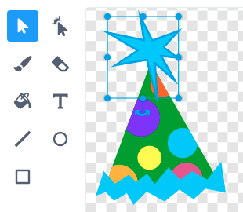
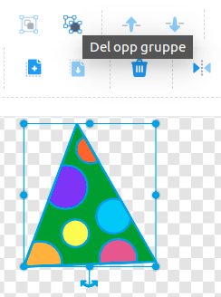

# Вступ {.intro}

Створювати цікаві анімації в Scratch досить просто. Тут ми подивимося, 
як ми можемо рухати та обертати фігури, створюючи захоплюючі візерунки.




# Крок 1: Чудернацькі фігури {.activity}

*Почнемо з простого. Спочатку ми подивимося як ми можемо переміщати та повертати фігуру.*

## Контрольний список {.check}

- [ ] Розпочніть новий проект, натиснувши наприклад на `Створити` в меню. 
  Якщо ви вже розпочали проект, ви можете почати новий, вибравши `Файл`, а потім `Новий`.

- [ ] Видаліть спрайт кота.

- [ ] Почнемо з простої трикутної форми. Ми можемо зробити її по-різному. 
      Спочатку ми намалюємо її самі, але потім ми також покажемо вам, 
	  як ви можете створити трикутник з однієї з існуючих фігур. 

    Перейдіть до  в нижньому правому куту та натисніть на
	 щоб намалювати власний спрайт. Використовуйте інструмент "Лінія", 
	, щоб намалювати трикутник.

    

- [ ] Тепер нам потрібно змусити трикутник рухатися! Напишіть наступний код:

  ```blocks
  коли клавішу [a v] натиснуто
  перемістити в x: (0) y: (120)
  повернути в напрямку (90 v)
  повторити (90) разів
      поворот на @turnRight (4) градусів
      перемістити на (8) кроків
  slutt
  ```

##  Тестування проєку {.flag}

__Натисніть на клавішу A.__

- [ ] Чи переміщується трикутник по экрану?

- [ ] Зверніть увагу на те, що трикутник обертається під час руху.

## Збереження проєкту {.save}

Ви написали невелику программу! Scratch періодично зберігає все, що ви робите. 
Візьміть за звичку регулярно зберігати проект вручну.

- [ ] Над сценою (насправді правильніше просто в верхній стрічці меню) є текстове поле, 
 де ви можете дати назву своєму проекту. Назвіть його, наприклад, `Чудернацькі фігури`.
 
- [ ]  У меню `Файл` ви можете вибрати `Зберегти негайно`, щоб зберегти проект.

## Зміна існуючу фігуру {.challenge}

Не дивлячись на те, що в бібліотеці спрайтів немає саме трикутника, ми все одно можемо переробити один з існуючих спрайтів на трикутник. 
Цього робити не потрібно якщо ви вже створили трикутник. Але тут ви все одно дізнаєтеся про цікавий спосіб погратися зі спрайтами.

- [ ] Натисніть на обрати новий спрайт та клацніть лупу, щоб вибрати існуючий спрайт. 
 Виберіть спрайт `Party Hats` у категорії «Мода». 
 
- [ ] Перейдіть на вкладку `Образи`. Зверніть увагу на те що цей капелюх складається 
  з трикутника поєднаного із різними іншими фігурами.
 
- [ ] Натисніть на різні місця на капелюсі. Ви побачите, що сині квадрати 
  позначають різні частини капелюха. Ці частини називаються групами.

  

- [ ] Ви можете видалити групи, натиснувши клавішу `delete` на клавіатурі. Видалити групи, які не входять до трикутника.
 
- [ ] Насправді, трикутник також складається з групи фігур - 
 з зеленого трикутника на задньому плані та кілька круглих фігур різних кольорів. 
 Якщо ви хочете їх змінити, ви можете скористатися кнопкою `Розгрупувати`. 
 
  

- [ ] Ви можете продовжити експерементувати з формою трикутника! Спробуйте скористатися інструментом `Заповнення`, 
 щоб змінити колір трикутника!
 
# Крок 2: Mange trekanterSteg 2: Багато трикутників {.activity}

*Дещо цікаве станеться коли ми створимо багато трикутників!*

## Контрольний список {.check}

- [ ] Зараз ми створимо багато трикутників. Ми робимо це за допомогою __клонування__. У Scratch __клон__ — це копія фігури.
 
    Скопіюйте код, який ви написали раніше, клацнувши на нього правою кнопкою миші та вибравши `Дублювати`. 
	Змініть клавішу, яка запускає сценарій, на `b` і помістіть блок `створити клон з [мене v]`{.b} та блок `повторити`{.blockcontrol}
    Новий скрипт матиме наступний вигляд:

    ```blocks
    коли клавішу [b v] натиснуто
    перемістити в x: (0) y: (120)
    повернути в напрямку (90 v)
    повторити (90)
        поворот @turnRight на (4) градусів
        перемістити на (8) кроків
        створити клон з [мене v]
    slutt
    ```

## Тестування проєкту {.flag}

__Натисніть на клавішу b.__

- [ ] Зараз по колу буде показуватись багато трикутників на екрані.

- [ ] Якщо зупинити скрипт (натиснувши на червону кнопку поруч із зеленою кнопкою), 
 трикутники зникнуть! Це тому, що трикутники були копіями, які існували лише під час виконання програми, 
 вони не є окремими спрайтами.

## Контрольний список {.check}

- [ ] Ми також можемо зробити так, щоб трикутники рухались. Спочатку напишіть цей простий код:

  ```blocks
  коли я отримую [поворот v]
  повторювати завжди
      поворот @turnRight на (4) градусів
  slutt
  ```

- [ ] Додайте блок `оповістити [поворот v]`{.b} внизу в скрипту який запускається клавішою _B_
  (одразу після блоку `повторити`{.blockcontrol}).

## Тестування проєкту {.flag}

__Натисніть клавішу B.__

- [ ] Чи починають трикутники рухатись після того, як вони намальовані? Чи стає візерунок живим?

- [ ] Спробуйте змінити число 4 на інше число в скрипті повороту. Що відбувається? 
  Це все відбувається тільки тому, що багато трикутників обертаються разом!

## Контрольний список {.check}

- [ ] Ми також можемо зробити так щоб трикутники трохи рухалися. Напишіть новий скрипт:

  ```blocks
  коли я отримую [переміщення і поворот v]
  завжди
      перемістити на (3) кроків
      поворот @turnRight на (4) градусів
  slutt
  ```

- [ ] Змініть блок `опопвістити [ v]`{.b} в скрипті _B_ так щоб він починав новий скрипт _переміщення і поворот_

## Тестування проєкту {.flag}

__Натисніть клавішу B.__

- [ ] Як змінюється візерунок??

- [ ] Спробуйте знову змінити числа в останньому скрипті.


# Крок 3: Більше різноманіття {.activity}

*Тепер ми подивимось, як можна створити більше різноманітності серед фігур, що обертаються,
змінивши спосіб їх запуску.*

## Контрольний список {.check}

- [ ] Створіть нову змінну, `напрям :: variables`{.b}. Дуже важливо щоб змінна була позначеня як __Тільки для цього спрайту__. 
  Таким чином кожен клон матиме власне значення для змінної `напрям :: variables`{.b}.

- [ ] Зробіть копію скрипту _B_. Замініть клавішу що починає скрипт на `c`, та додайте блок `напрям :: stack variables`{.b}.

  ```blocks
   коли клавішу [c v] натиснуто
    надати [напрям v] значення 0    
    перемістити в x: (0) y: (120)
    повернути в напрямку (90 v)
    повторити (90)
        поворот @turnRight на (4) градусів
        перемістити на (8) кроків
        створити клон з [мене v]
		оповістити [переміщення і поворот v]
    slutt
  ```

- [ ] Тепер ми встановимо напрямок кожного клону під час його створення. Створіть цей новий скрипт:

  ```blocks
  коли я починаю як клон
  повернути в напрямку (напрямок :: variables)
  ```

## Тестування проекту {.flag}

__Натисніть на клавішу C__

- [ ] Ви бачите, що трикутники спрямовані в різні боки? Це повністю змінює візерунок!

- [ ] Схоже, що один трикутник трохи плаває поза візерунком! Що
Що відбувається з цим трикутником?

## Контрольний список {.check}

- [ ] Єдиний трикутник, який не зовсім вписується у візерунок, це наша фігура. 
Всі інші трикутники є клонами. Ми раніше не бачили цього трикутника.
бо він знаходився у тому ж напрямку, що й клони. Але тепер перейдемо до клонів!

    Дайвайте приховаємо спрайт щоб він не псував форму візерунку. Додайте блок `сховати` {.b} в _c_ скрипті 
	
- [ ] Оскільки клони є копіями спрайту, вони також будуть приховані. Нам цього не потрібно.
 Тож нам потрібно зробити так щоб клони з'являлися. Додайте блок `показати`{.b} як це вказано в прикладі:

  ```blocks
  коли я починаю як клон
  показати`
  повернути в напрямку (напрям :: variables)
  ```

## Тестування проекту {.flag}

__Натисніть на клавішу C.__

- [ ] Чи зник плаваючий трикутник, який не вписувався у візерунок?

- [ ] Поексперементуйте з числом `-4`- в блоці `змінити [напрям v] :: variables`{.b}
  Який вплив має зміна цього числа?
    
Можливо, ви помітите, що найкраще програма працюватиме, якщо число відповідає 4? 
Чому фігура не підходить, якщо сума числа не дорівнює 4? (Наприклад, спробуйте блок `змінити [напрям v] на (1)`{.b}.)
  
# Крок 4: Інші спрайти {.activity}

*Ми також можемо створювати візерунки не лише за допомогою трикутників.*


## Контрольний список {.check}

- [ ] Натисніть на вкладку `Образи`. Оберіть інший образ з бібліотеки натиснувши на
  . Наприклад, ви можете шукати форму серця `Heart`.

- [ ] Запустіть програму ще раз натиснувши на клавішу __C__. Чи формується зараз візерунок із сердець?
 Спробуйте використати інші образи або власні малюнки.

- [ ] Щоб створити цікаві візерунки, є й інші зміни, які ви можете внести.
 Спробуйте додати блоки для прозорого та кольорового ефектів наступним чином:

  ```blocks
  коли клавішу [c v] натиснуто
  сховати`
  встановити ефект [привид v] в 70
    надати [напрям v] значення 0    
    перемістити в x: (0) y: (120)
    повернути в напрямку (90 v)
    повторити (90)
        поворот @turnRight на (4) градусів
        перемістити на (8) кроків
		змінити [напрям v] на (-4)
		змінити ефект [колір v] на (20)
        створити клон з [мене v]
    slutt
	оповістити [переміщення і поворот v]
  ```

### Більше ідей {.challenge}

Подумайте про інші речі, які ви можете зробити, щоб створити більше цікавих, незвичайних фігур. Наприклад:

- [ ] Змініть розмір різних клонів.

- [ ] Намалюйте фігуру, яка складається з тексту. Можливо, ви зможете змусити своє ім'я танцювати на екрані?

- [ ] Зміна центральної точки образу: Натисніть вкладку `Обази` та трохи перетягніть спрайт від центру області малювання.

- [ ] Використовуйте інструмент «Олівець», щоб одночасно малювати візерунки на фоні. 
       Наприклад, додайте блок `Опустити олівець`{.b} до `коли я починаю як клон`{.b}

  Щоб додати блок `Олівець` натисніть на `Додати розширення` у нижньому лівому куті екрану і обеіть "Олівець".
