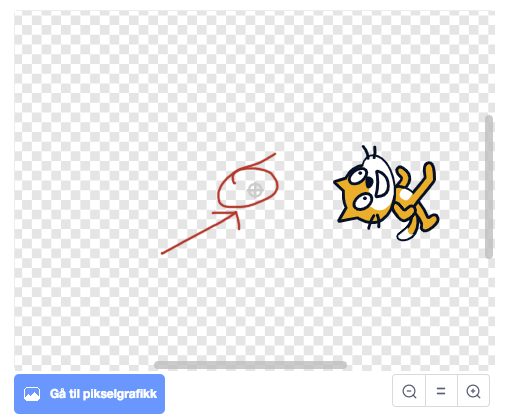

# Вступ {.intro}

Зараз ми навчимося створювати просту гру з м'ячем за допомогою Scratch.
У грі "Соло-м'яч" ти будеш керувати котом, щоб утримувати м'яч від потрапляння в сітку.


# Крок 1: Обертання кота {.activity}

*Ми почнемо з того, як зробити так, щоб фігурка кота оберталася.*

## Чекліст {.check}

- [ ] Запусти новий проєкт у Scratch. Ти побачиш фігурку кота посередині сцени.

- [ ] З'єднай наступні блоки в кодовій області посередині екрану.

  ```blocks
  коли @greenFlag натиснуто
  перейти до x: (0) y: (0)
  повторювати  завжди
      слідуй за [курсором миші v]
  кінець
  ```

 Це приклад маленької програми, або скрипта, як його називають у Scratch. 
 Цей скрипт змушує фігурку кота стояти посередині екрану і завжди вказувати або ж дивитися за курсором миші.


## Тестування проєкту {.flag}

__Натисніть на зелений прапорець__

- [ ] Натисни на зелений прапорець, щоб запустити програму, яку ти щойно зібрав.

- [ ] Чи починає кіт обертатися, завжди слідуючи за курсором миші?

- [ ] Щоб зупинити програму, натисни червоний стоп-знак біля зеленого прапорця.


# Steg 2: Кіт біжить по колу {.activity}

*Замість того, щоб кіт обертався, ми зробимо так, щоб він бігав по колу на екрані.*

## Чекліст {.check}

Ми зробимо маленький трюк, перемістивши кота від центру, щоб здавалося, що він біжить по колу, а не обертається.

- [ ] Спочатку назви свою фігурку кота `Кіт`. Це можна зробити, написавши `Кіт` у текстовому полі над фігуркою.

- [ ] Клацни на вкладку `Костюми` вгорі екрану. Ти побачиш дві фігурки кота.
Видали одну з них, натиснувши на маленький хрестик у кутку фігурки.


- [ ] Зменш кота, клацнувши на нього у великому зображенні і потягнувши за один із кутів.

  

- [ ] Оберни кота, потягнувши за маленький кружечок над котом.

  

- [ ] Потім перемісти фігурку кота, клацнувши на маленький кружечок по цунтру кота.
 Також перемісти його трохи вбік. Слідкуй, щоб не вивести його за межі екрана.


  

## Тестування проєкту {.flag}

__Натисни на зелений прапорець, щоб запустити програму знову.__

- [ ] Чи переміщується кіт по колу, коли ти рухаєш курсор миші?

- [ ] Чи рухається кіт належним чином? Чи має кіт нормальний рлзмір?
Пам'ятай, що ти можеш повернутися і змінити фігурку кота пізніше, якщо помітиш щось, що можна покращити.

## Що сталося? {.challenge}

Хоча ми не змінювали нашу програму, кіт поводиться інакше. Розумієш чому?
Коли ми кажемо, що кіт повинен слідувати за курсором миші, він має обертатися навколо точки.
Ця точка називається центром фігурки. Центр фігурки знаходиться посередині зображення кота. 
Коли ти натискаєш на іконку з "=" під зображенням, ти побачиш все зображення фігурки, і центр завжди буде посередині.



Коли кіт знаходиться поза центром, здається, що він біжить навколо цієї точки,
а не просто обертається, не рухаючись.

# Крок 3: М'яч! {.activity}

*Тепер ми створимо м'яч і змусимо його стрибати по екрану.*

## Чекліст: {.check}

- [ ] Клацни на вкладку `Код`, щоб побачити скрипт, який ти написав раніше.

- [ ] Клацни на
  
 поруч із `Нова фігурка`, щоб додати нову фігурку.

- [ ] У категорії `Спорт` ти побачиш кілька м'ячів. Вибери один із них.

- [ ] Тепер ми побачимо інший спосіб зменшення фігурок. Знайди поле `Розмір` над фігуркою м'яча.
 Замість 100 введи менше значення, щоб зменшити м'яч.
 Спробуй різні числа, поки м'яч не стане відповідного розміру відносно кота.

- [ ] Тепер створимо програму для м'яча. Ми хочемо, щоб м'яч починав з середини екрану.
Потім він входитиме в цикл, де трохи рухатиметься і повертатиметься, якщо кіт доторкнеться до нього.

  ```blocks
  Коли @greenFlag натиснуто 
  перейти до x: (0) y: (0)
  повторювати  завжди
     перейти на (3) кроки
     якщо <торкається [Кота]>?
         вказувати в напрямку ((180) + (напрямок))
     кінець
  кінець
    ```
Блок "напрямок" ти знайдеш в самому низу категорії "Рух".
Чи розумієш ти, чому 

  Блок `напрямок`{.blockmotion} ти знайдеш в самому низу категорії
  `Рух`{.blockmotion}.

- [ ] Чи розумієш ти, чому?

  ```blocks
  вказувати в напрямку ((180) + (напрямок))
  ```

  Змушує м'яч повертатися? Ми розглянемо це детальніше в Кроці 6.

## Тестування проєкту {.flag}

__Натисни на зелений прапорець.__

- [ ] Чи рухається м'яч? Чи повертається м'яч, коли кіт торкається його?

- [ ] Що трапляється, якщо м'яч пролітає повз кота?

- [ ] Чи починає м'яч знову з середини екрану, якщо натиснути зелене прапорець ще раз?

- [ ] Якщо м'яч занадто легко “потрапляє” до кота, спробуй зробити кота трохи меншим.
Ми знайдемо краще рішення цієї проблеми в розділі "Додатково 3".

# Крок 4: Сітка! {.activity}

*Тепер ми створимо сітку, яка ловитиме м'яч, якщо він пролетить повз кота.
*

## Чекліст: {.check}

- [ ] Ми створимо фігурку, яку намалюємо самостійно. Для цього наведи курсор миші на
  , і клацни на іконку `Малювати`

- [ ] Вибери інструмент "Лінія" зліва на екрані і натисни `Контур`, щоб вибрати колір.
      Вибери добре видимий колір, наприклад, червоний.

- [ ] Намалюй маленьку вертикальну лінію праворуч на фігурці.
Тримай `Shift`, щоб отримати пряму вертикальну лінію.
  
  

- [ ] Клацни на вкладку `Код`{.blocklightgrey}.

- [ ] Тепер ми будемо малювати сітку у формі кола, прикріплюючи цю фігурку на фоні багато разів по колу.
      Створи наступний скрипт:

  ```blocks
  Коли @greenFlag натиснуто
  перейти до x: (0) y: (0)
  повторювати (36) разів
      виконати @turnLeft (10) раз
      клонувати (мене)
  кінець
  ```

  `клонувати (мене)` створює копію фігурки в її поточному положенні,
перед тим як оригінальна фігурка переміститься далі.

## Тестування проєкту: {.flag}

__Натисни на зелений прапорець.__

- [ ] Чи малюється коло на фоні, коли починається гра?

- [ ] Можливо, тобі доведеться трохи перемістити фігурки кота та сітки, щоб вони відповідали один одному.
      Ми хочемо, щоб це виглядало приблизно так, як на зображенні на початку цього завдання.

- [ ] Чи відбувається щось, коли м'яч потрапляє в сітку?


# Крок 5: Сітка ловить м'яч {.activity}

*Ми хочемо, щоб м'яч зупинявся, коли він потрапляє в сітку.*

## Чекліст: {.check}

Поки що ми не створили жодного коду, який би повідомляв м'ячу, що він потрапив у сітку. 
Ми зробимо це зараз.

- [ ] Клацни на фігурку м'яча, щоб побачити скрипт, який ми створили раніше.

- [ ] Ми використаємо блок `доторкається до кольору`{.blocksensing}-klossen,
      щоб виявити, що м'яч потрапив у сітку.
   Додай нові блоки до свого скрипту, щоб він виглядав так:

  ```blocks
  Коли @greenFlag натиснуто
  перейти до x: (0) y: (0)
  повторювати завжди
      перейти на (3) кроки
      якщо <торкається [Кота v] ?>
          вказувати  ((180) + (напрямок))
      кінець
      якщо <торкається до кольору [#ff0000] ?>
          зупинити [все v] :: control
      кінець
  кінець
  ```

- [ ]  Щоб отримати правильний колір у блоці `доторкається до кольору`{.blocksensing}-klossen
  спочатку клацни на маленький квадрат із кольором.
У вікні, що з'явиться посередині екрана, натисни на іконку `піпетка`.
Потім наведи курсор миші на червоний колір сітки. Натисни на нього, щоб вибрати цей колір.

## Тестування проєкту: {.flag}

__Натисни на зелений прапорець.__

- [ ] Чи зупиняється м'яч, коли він потрапляє до сітки?

- [ ] Блок `зупинити все`{.blockcontrol} зупиняє всю гру, коли м'яч потрапляє в сітку.
       Щоб продовжити гру, потрібно натиснути зелений прапорець знову.

# Крок 6: Природніший відскок {.activity}

*Зараз м'яч просто рухається взад і вперед по одній лінії весь час. 
Ми хочемо, щоб він відскакував більш природньо, коли стикається з котом.
*

## Чекліст: {.check}

Хороша модель для того, як м'яч відскакує, це коли кут відскоку такий же, як кут підходу.


У грі є два напрямки, про які ми повинні думати: напрямок м'яча та напрямок, у якому стоїть фігурка кота.


Перш ніж робити щось ще, м'ячеві потрібно знати, у якому напрямку стоїть кіт.

- [ ] Вибери фігурку кота, натисни на категорію `Змінні` і створи нову змінну для кота,
      яку назвеш `напрямок кота` (і зроби її видимою для всіх фігурок).


- [ ] У скрипті кота налаштуй так, щоб він постійно оновлював цю змінну своїм напрямком:

 ```blocks
  коли @greenFlag натиснуто
  перейти до x: (0) y: (0)
  повторювати  завжди
      вказувати на [курсор миші v]
      встановити (напрямок кота) до (напрямку)
  кінець
  ```

Тепер м'яч може отримувати напрямок кота.
У фігурці вище і в наступному коді `напрямок`{.blockmotion}
означає напрямок м'яча, оскільки код належить фігурці м'яча. До цього моменту ми використовували

```blocks
вказувати в напрямку ((180 + (напрямок))
```

Щоб м'яч міг повернутися. На малюнку ми бачимо, що це означає, що м'яч відскакує туди, звідки прийшов.
Ми також повинні компенсувати напрямок `кота`. Це можна зробити, 
віднявши двічі (`напрямок`{.blockmotion} - `напрямок кота`{.blockdata}). 
Розумієш чому, дивлячись на малюнок? Тоді буде новий напрямок

```blocks
(((180) + (напрямок)) - ((2) * ((напрямок ) - (напрямок кота)))
```

Ми можемо це спростити до

```blocks
(((180) - (напрямок)) + ((2) * (напрямок кота)))
```

- [ ] Зміни в скрипті м'яча, щоб відскок став кращим, таким чином:

  ```blocks
  коли @greenFlag натиснуто
  перейти до x: (0) y: (0)
  повторювати  завжди
      перейти на (3) кроки
      якщо <торкається  [Кота v] ?>
          вказувати в напрямку (((180) - (напрямок)) + ((2) * (напрямок кота)))
      кінець
      якщо <торкається кольору [#ff0000] ?>
          зупинити [усе v] :: control
      кінець
  кінець
  ```

## Тестування проєкту: {.flag}

__Натисни на зелений прапорець.__

- [ ] Чи відскакує м'яч природніше тепер?
- [ ] Чи є у тебе ідеї, як зробити гру ще кращою? Спробуй їх!

## Збереження та публікація проєкту {.save}

Ми створили досить цікаву гру! Якщо хочеш, можеш продовжити з наступними кроками, щоб зробити гру ще цікавішою.

Щоб зберегти гру, вибери `Зберегти зараз` у меню `Файл`.
Гра буде збережена на твоєму обліковому записі Scratch. 
Якщо у тебе немає облікового запису, вибери `Завантажити на комп'ютер` 

Якщо збережеш гру на своєму обліковому записі, можеш також опублікувати її, щоб інші могли грати.
Для цього натисни `Опублікувати` у верхній частині екрана. 
Ти зможеш поділитися посиланням на свою гру з друзями та родиною.

# Додатково 1: Підрахунок очок {.activity}

*Усі ігри стають цікавішими, якщо в них можна отримувати очки!*

## Чекліст: {.check}

Для підрахунку очок ми використаємо змінну.
Змінна - це назва значення, яке може змінюватися.

- [ ] Натисни на категорію `Дані`-kategorien і потім на
  `Створити змінну`{.blocklightgrey}.

- [ ] Назви змінну `Очки`{.blockdata}, і зроби її доступною для всіх фігурок.
 Зверни увагу, що коли натискаєш `ОК`  на сцені з'являється поле `Очки`{.blockdata} på scenen,
 а також кілька нових блоків під `Створити змінну`{.blocklightgrey}.

Ми хочемо, щоб `Очки`{.blockdata} встановлювалися на  `0` коли гра починається.
Потім ми будемо отримувати по одному очку кожного разу, коли повертаємо м'яч.

- [ ] Додай два нових блоки в скрипт, який керує м'ячем:

  ```blocks
  коли @greenFlag натиснуто
  перейти до x: (0) y: (0)
  встановити [Очки v] на [0]
  повторювати  завжди
      перейти на (3) кроки
      якщо <торкається [Кота v] ?>
          вказувати в напрямку (((180) - (напрямок)) + ((2) * (напрямок кота)))
          змінити [Очки v] на (1)
      кінець
      якщо <доторкається до кольору [#ff0000] ?>
          зупинити [усе v] :: control
      кінець
  кінець
  ```


# Додатково 2: Збільшення швидкості {.activity}

*Ми зробимо гру складнішою з часом, збільшуючи швидкість руху м'яча.*

## Чекліст: {.check}

Швидкість м'яча зараз контролюється блоком

```blocks
перейти на  (3) кроки
```

Змінивши значення `3`, ми змінюємо швидкість м'яча. Спробуй це сам!


- [ ] Щоб змінювати швидкість під час гри, нам потрібна змінна. Створи нову змінну, яку назвеш
 `Швидкість`{.blockdata}. Можеш зробити її доступною лише для цієї фігурки.

- [ ] Швидкість не настільки цікаво показувати на сцені.
Ти можеш приховати поле на сцені, знявши галочку поруч із `Швидкість`{.blockdata}.
 
  

- [ ] Ми встановимо швидкість на `3` (можеш використати інше число, якщо хочеш), коли гра почнеться.
Потім ми будемо збільшувати її трохи кожного разу, коли кіт доторкається до м'яча.
Це робиться так само, як і підрахунок очок.

  ```blocks
  коли @greenFlag натиснуто
  перейти до x: (0) y: (0)
  встановити [Очки v] на [0]
  встановити [Швидкість v] на [3]
  повторювати  завжди
      перейти на (швидкість)
      якщо <торкається [Кота v] ?>
         вказувати в напрямку (((180) - (напрямок)) + ((2) * (напрямок кота)))
          зміти [Очки v] на (1)
          змінити [Швидкість v] на (0.1)
      кінець
      якщо <доторкається до кольору [#ff0000] ?>
          зупинити [все v] :: control
      кінець
  кінець
  ```

  Переконайся, що ти також змінив блок `перейти на кроки`{.blockmotion}-klossen.


# Додатково 3: Уникнення захоплення м'яча котом {.activity}

*Можливо, ти помітив, що іноді кіт "захоплює" м'яч. Ми виправимо це зараз.*

## Чекліст {.check}

Іноді здається, що кіт "захоплює" м'яч. Це трапляється тому, що м'яч не рухається досить далеко після повороту. 
Він продовжує торкатися кота і знову, і знову повертається.


- [ ] Ми створимо ще одну змінну. Ця змінна називатиметься
  `Рух`{.blockdata}, буде доступна лише для цієї фігурки і також не буде показуватися на сцені.

Ми використаємо змінну `Рух`{.blockdata} щоб рахувати, скільки рухів зробив м'яч з моменту останнього доторкання до кота. 
Потім ми скажемо, що м'яч повинен повертатися лише тоді, коли він зробив багато рухів з моменту останнього повороту.
Ми використаємо змінну "Рух", 

- [ ] Розшир свій скрипт, як показано нижче.
Зверни особливу увагу на те, що умова `якщо`{.blockcontrol} була розширена:.

  ```blocks
  Коли @greenFlag натиснуто
  перейти на x: (0) y: (0)
  встановити [Очки v] на [0]
  встановити [Швидкість v] на [3]
  повторювати  завжди
      перейти на (швидкість)
      змінити [Рух v] на (1)
      якщо <<торкається [Кота v] ?> та <(Рух) > [20]>>
          вказувати в напрямку (((180) - (напрямок)) + ((2) * (напрямок кота)))
          змінити [Очки v] на (1)
          змінити [Швидкість v] на (0.1)
          встановити [Рух v] до [0]
      кінець
      якщо <торкається кольору [#ff0000] ?>
          зупинити [все v] :: control
      кінець
  кінець
  ```

## Спробуй сам {.challenge}

У цих додаткових кроках ми розглянули деякі способи покращення та урізноманітнення гри. 
Ось ще кілька ідей:

- [ ] Ти можеш замінити фігурку кота на іншу. Це можна зробити, перейшовши на вкладку `Костюми` ,
так збережеться скрипт, який ти вже створив. 
 Тут ти можеш вибрати одну з готових фігурок або намалювати нову самостійно.

- [ ] Спробуй додати звуки, наприклад, коли кіт доторкається до м'яча або коли м'яч потрапляє в сітку.
Подивись на різні блоки в категорії  `Звуки`{.blocksound}-kategorien, та звуки, що є у вкладці  `Звуки`.

Існує багато інших речей, які можна спробувати. Вирішувати тобі!
