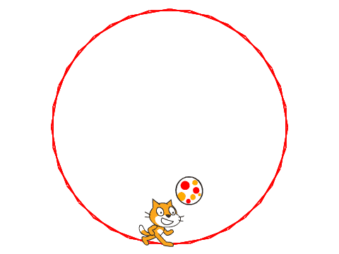
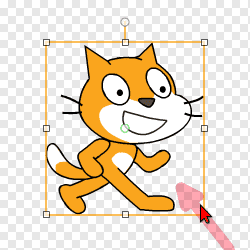
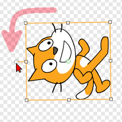
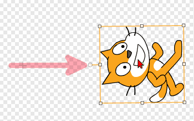
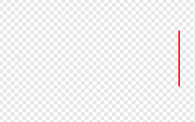
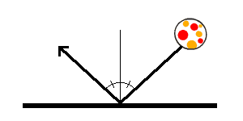
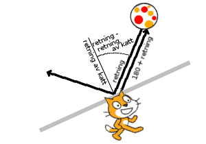
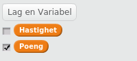

# Introduksjon {.intro}

Vi skal nå lære hvordan vi kan lage et enkelt ballspill med Scratch. I
soloball skal du styre katten som kontrollerer ballen, slik at ballen
ikke går i nettet.



# Steg 1: En roterende katt {.activity}

*Vi begynner med å se på hvordan vi kan få kattefiguren til å rotere.*

## Sjekkliste {.check}

+ Start et nytt Scratch-prosjekt. Du vil se en kattefigur midt på
  scenen.

+ Pusle sammen de følgende klossene i skriptområdet til høyre på
  skjermen.

  ```blocks
  når grønt flagg klikkes
  gå til x: (0) y: (0)
  for alltid
      pek mot [musepeker v]
  slutt
  ```

  Dette er et eksempel på et lite program, eller skript som det
  kalles i Scratch. Dette skriptet sier at kattefiguren skal stå
  midt på skjermen og alltid peke mot, eller se mot, musepekeren.

## Test prosjektet {.flag}

__Klikk på det grønne flagget.__

+ For å starte programmet du nettopp puslet sammen kan du klikke på
  det grønne flagget over scenen.

+ Begynner katten å rotere rundt slik at den alltid ser mot
  musepekeren?

+ For å stoppe programmet ditt kan du klikke på den røde åttekanten
  ved siden av det grønne flagget.

# Steg 2: Katten løper rundt {.activity}

*I stedet for at katten roterer vil vi at den skal kunne løpe rundt i
 sirkel på skjermen.*

## Sjekkliste {.check}

Vi skal nå gjøre et lite triks hvor vi flytter katten vekk fra sentrum
slik at det ser ut som om den løper i sirkel i stedet for å rotere.

+ Gi først kattefiguren din navnet `Katt`. Dette gjør du ved å først
  klikke på den lille `i`{.blockmotion}en på kattefiguren under
  scenen. Deretter kan du skrive `Katt` i tekstfeltet. Når du går
  tilbake, `<`{.blockmotion}, ser du at figuren har fått det riktige
  navnet.

+ Klikk på `Drakter`{.blocklightgrey}-fanen øverst på skjermen. Du vil
  nå se to kattefigurer. Slett en av dem ved å klikke på den lille
  x-en i hjørnet av figuren.

+ Gjør katten mindre ved å klikke på den i det store bildet, og
  deretter dra i et av hjørnene.

  

+ Roter deretter katten ved å dra i den lille rundingen over katten.

  

+ Til slutt kan du ta tak i kattefiguren ved å klikke på den lille
  rundingen midt på katten. Flytt den et stykke til siden. Følg med på
  scenen øverst til venstre at du ikke drar den av skjermen.

  

## Test prosjektet {.flag}

__Klikk på det grønne flagget.__

+ Start programmet ditt igjen. Flytter katten seg i sirkel når du
  beveger musepekeren?

+ Fungerer bevegelsen bra? Ser katten passe stor ut? Husk at du kan gå
  tilbake og endre på kattefiguren senere hvis du oppdager noe som
  kunne vært bedre.

## Hva skjedde? {.try}

Selv om ikke endret programmet vårt oppfører katten seg veldig
annerledes. Skjønner du hvorfor?

Når vi sier at katten skal `peke mot musepekeren`{.blockmotion} må den
rotere rundt et punkt. Dette punktet kalles senterpunktet til figuren,
og du kan se (og endre) senterpunktet til en figur ved å klikke på
 øverst til
høyre på skjermen.

Når vi flytter senterpunktet utenfor katten vil det se ut som om
katten løper rundt dette punktet i stedet for at den bare roterer uten
å flytte seg.

# Steg 3: En ball! {.activity}

*Nå skal vi lage en ball og få den til å sprette rundt på
 skjermen.*

## Sjekkliste {.check}

+ Klikk på `Skript`{.blocklightgrey}-fanen slik at du ser skriptet du
  skrev tidligere.

+ Klikk på
  
  ved siden av `Ny figur` under scenen for å hente en ny figur.

+ Hvis du klikker kategorien `Ting` til venstre på skjermen vil du se
  flere baller. Velg en av dem.

+ Vi skal nå se en annen måte å gjøre figurer mindre på. Klikk
   øverst på skjermen. Klikk deretter
  på ballfiguren noen ganger slik at den er passe stor i forhold til
  katten.

+ Nå lager vi et program for ballen. Vi vil at ballen skal starte midt
  på skjermen. Deretter går den inn i en løkke hvor den flytter seg
  litt, og snur om katten kommer borti den.

  ```blocks
  når grønt flagg klikkes
  gå til x: (0) y: (0)
  for alltid
      gå (3) steg
      hvis <berører [Katt v] ?>
          pek i retning ((180) + (retning))
      slutt
  slutt
  ```

  Klossen `retning`{.blockmotion} finner du helt nederst i
  `Bevegelse`{.blockmotion}-kategorien.

+ Skjønner du hvorfor

  ```blocks
  pek i retning ((180) + (retning))
  ```

  gjør at ballen snur? Vi vil se nærmere på dette i Steg 6.

## Test prosjektet {.flag}

__Klikk på det grønne flagget.__

+ Beveger ballen seg? Snur ballen når katten berører den?

+ Hva skjer om ballen flyr forbi katten?

+ Starter ballen midt på skjermen igjen hvis du trykker på det grønne
  flagget en gang til?

+ Hvis du synes ballen blir for lett "fanget" av katten kan du prøve å
  gjøre katten litt mindre. Vi vil finne en bedre løsning på dette
  problemet i Ekstra 3-delen.

# Steg 4: Et nett! {.activity}

*Vi skal nå lage et nett som kan fange ballen hvis den flyr forbi
 katten.*

## Sjekkliste {.check}

+ Vi skal nå lage en figur som vi tegner selv. For å gjøre dette
  klikker du  ved siden av
  `Ny figur` under scenen.

+ Klikk på `Bytt til vektorgrafikk` nederst til høyre på skjermen.

+ Velg en godt synlig farge, for eksempel rød, og klikk på
  linje-verktøyet på høyre side av skjermen.

+ Tegn en liten loddrett strek til høyre på figuren din. Hold gjerne
  inne `Skift`-knappen, da får du en helt loddrett strek.

  

+ Klikk på `Skript`{.blocklightgrey}-fanen.

+ Vi skal nå tegne et sirkelformet nett ved å stemple denne figuren på
  bakgrunnen. Lag det følgende skriptet:

  ```blocks
  når grønt flagg klikkes
  gå til x: (0) y: (0)
  gjenta (36) ganger
      vend venstre (10) grader
      stemple avtrykk
  slutt
  ```

  `stemple avtrykk`{.blockpen} stempler en figur på bakgrunnen
  slik at den blir der. Du kan fjerne slike avtrykk ved å bruke
  `slett`{.blockpen}-klossen.

## Test prosjektet {.flag}

__Klikk på det grønne flagget.__

+ Tegnes det en sirkel på bakgrunnen når spillet starter?

+ Det kan hende du må flytte litt på katt- og nett-figuren for at de
  skal passe sammen. Vi vil at det skal se ut omtrent som på bildet i
  begynnelsen av denne oppgaven.

+ Skjer det noe når ballen treffer nettet?

# Steg 5: Nettet fanger ballen {.activity}

*Vi vil at ballen skal stoppe når den treffer nettet.*

## Sjekkliste {.check}

Foreløpig har vi ikke laget noe kode som forteller ballen at den har
truffet nettet. Det skal vi gjøre nå.

+ Klikk på ball-figuren, slik at du ser skriptet vi tidligere lagde
  for denne.

+ Vi skal nå bruke `berører fargen`{.blocksensing}-klossen for å
  oppdage at ballen treffer nettet. Legg til nye klosser i skriptet
  ditt slik at det blir seende slik ut:

  ```blocks
  når grønt flagg klikkes
  gå til x: (0) y: (0)
  for alltid
      gå (3) steg
      hvis <berører [Katt v] ?>
          pek i retning ((180) + (retning))
      slutt
      hvis <berører fargen [#ff0000] ?>
          stopp [alle v] :: control
      slutt
  slutt
  ```

+ For å få riktig farge i `berører fargen`{.blocksensing}-klossen
  klikker du først på den lille firkanten hvor fargen vises. Deretter
  flytter du musepekeren slik at den peker på nettet. Da forandres
  fargen i den lille firkanten. Klikk igjen for å velge denne fargen.

## Test prosjektet {.flag}

__Klikk på det grønne flagget.__

+ Stopper ballen når den kommer til nettet?

+ Med `stopp alle`{.blockcontrol}-klossen stoppes hele spillet når
  ballen treffer nettet. For å spille videre må du klikke det grønne
  flagget igjen.

# Steg 6: Mer naturlig sprett {.activity}

*Nå spretter ballen bare fram og tilbake på samme linje hele tiden. Vi
 vil at den skal sprette litt mer naturlig når den treffer katten.*

## Sjekkliste {.check}

En bra modell for hvordan en ball spretter er at vinkelen ut er den
samme som vinkelen inn.



I spillet er det to retninger vi må tenke på, retningen til ballen og
retningen kattefiguren står i.



I figuren over og i koden videre betyr `retning`{.blockmotion} retningen
til ballen, siden koden tilhører ballfiguren.  Så langt har vi brukt

```blocks
pek i retning ((180) + (retning))
```

for at ballen skal snu. I figuren ser vi at dette betyr at ballen
spretter tilbake der den kom i fra.

Vi bør også kompensere for retningen til `Katt`. Dette kan vi gjøre
ved å trekke fra to ganger (`retning`{.blockmotion} - `retning av
katt`{.blocksensing}). Skjønner du hvorfor av figuren? Da blir den
nye retningen

```blocks
(((180) + (retning)) - ((2) * ((retning) - ([retning v] av [Katt v])))
```

Vi kan forenkle dette til

```blocks
(((180) - (retning)) + ((2) * ([retning v] av [Katt v])))
```

+ Endre i skriptet til ballen slik at spretten blir bedre,

  ```blocks
  når grønt flagg klikkes
  gå til x: (0) y: (0)
  for alltid
      gå (3) steg
      hvis <berører [Katt v] ?>
          pek i retning (((180) - (retning)) + ((2) * ([retning v] av [Katt v])))
      slutt
      hvis <berører fargen [#ff0000] ?>
          stopp [alle v] :: control
      slutt
  slutt
  ```

## Test prosjektet {.flag}

__Klikk på det grønne flagget.__

+ Ser du at ballen spretter litt mer naturlig nå?

+ Har du noen ideer til hvordan spillet kan bli enda bedre? Prøv dem
  ut!

## Lagre og legg ut prosjektet {.save}

Vi har nå laget et ganske morsomt spill! Hvis du vil kan du gå videre
med de neste stegene for å gjøre spillet enda litt mer spennende.

For å lagre spillet ditt kan du velge `Lagre nå` i `Fil`-menyen.
Spillet blir da lagret på brukerkontoen ditt hos Scratch. Om du ikke
har laget deg brukerkonto kan du velge `Last ned til datamaskinen` i
stedet.

Om du lagrer spillet på brukerkontoen din kan du også legge det ut
slik at andre kan spille det. For å gjøre dette klikker du `Legg ut`
øverst til høyre. Du kan deretter dele nettadressen til spillet ditt
med venner og familie.

# Ekstra 1: Tell poeng {.activity}

*Alle spill blir morsommere hvis man får poeng!*

## Sjekkliste {.check}

For å telle poeng skal vi bruke noe som kalles en variabel. En
variabel er et navn på en verdi som kan variere.

+ Klikk på `Data`-kategorien og deretter på
  `Lag en Variabel`{.blocklightgrey}.

+ Gi variabelen navnet `Poeng`{.blockdata}, og la den gjelde for
  alle figurer. Legg merke til at når du klikker `OK` dukker det opp
  en boks som heter `Poeng`{.blockdata} på scenen, og flere nye
  klosser under `Lag en Variabel`{.blocklightgrey}.

Vi vil nå at `Poeng`{.blockdata} skal settes til `0` når spillet
starter. Deretter skal vi få ett poeng hver gang vi returnerer ballen.

+ Legg på to nye klosser i skriptet som styrer ballen:

  ```blocks
  når grønt flagg klikkes
  gå til x: (0) y: (0)
  sett [Poeng v] til [0]
  for alltid
      gå (3) steg
      hvis <berører [Katt v] ?>
          pek i retning (((180) - (retning)) + ((2) * ([retning v] av [Katt v])))
          endre [Poeng v] med (1)
      slutt
      hvis <berører fargen [#ff0000] ?>
          stopp [alle v] :: control
      slutt
  slutt
  ```

# Ekstra 2: Øk hastigheten {.activity}

*Vi skal nå lage spillet vanskeligere etterhvert som tiden går, ved at
 ballen beveger seg stadig raskere.*

## Sjekkliste {.check}

Hastigheten på ballen styres nå av klossen

```blocks
gå (3) steg
```

Ved å endre på `3`-tallet endrer vi hastigheten på ballen. Prøv dette
selv!

+ For å endre hastigheten underveis i spillet trenger vi en variabel.
  Lag en ny variabel som du kaller `Hastighet`{.blockdata}. Du kan
  la denne gjelde kun for denne figuren.

+ Hastigheten er ikke så interessant å vise på scenen. Du kan skjule
  boksen på scenen ved å fjerne avhukingen ved siden av
  `Hastighet`{.blockdata}.

  

+ Vi vil nå sette hastigheten til `3` (du kan bruke et annet tall om
  du vil) når spillet starter. Deretter vil vi øke denne littegrann
  hver gang katten berører ballen. Dette gjør vi på samme måte som når
  vi teller poeng.

  ```blocks
  når grønt flagg klikkes
  gå til x: (0) y: (0)
  sett [Poeng v] til [0]
  sett [Hastighet v] til [3]
  for alltid
      gå (hastighet) steg
      hvis <berører [Katt v] ?>
          pek i retning (((180) - (retning)) + ((2) * ([retning v] av [Katt v])))
          endre [Poeng v] med (1)
          endre [Hastighet v] med (0.1)
      slutt
      hvis <berører fargen [#ff0000] ?>
          stopp [alle v] :: control
      slutt
  slutt
  ```

  Pass på at du også endrer `gå steg`{.blockmotion}-klossen.

# Ekstra 3: Unngå at katten fanger ballen {.activity}

*Du har sikkert opplevd at katten av og til "fanger" ballen. Vi skal
 nå fikse slik at den ikke gjør det.*

## Sjekkliste {.check}

Av og til virker det som om katten "fanger" ballen. Dette skjer fordi
ballen ikke flytter seg langt nok etter at den har snudd. Den
fortsetter å berøre katten og blir derfor snudd igjen ... og igjen
... og igjen.

+ Vi skal nå lage nok en variabel. Denne skal hete
  `Flytt`{.blockdata}, kun gjelde for denne figuren, og heller ikke
  vises på scenen.

`Flytt`{.blockdata}-variabelen vil vi bruke til å telle hvor mange
flytt ballen har gjort siden den sist berørte katten. Deretter kan vi
si at ballen skal snu kun hvis den har flyttet mange ganger siden den
sist snudde.

+ Utvid skriptet ditt som under. Legg spesielt merke til at
  `hvis`{.blockcontrol}-testen har blitt utvidet.

  ```blocks
  når grønt flagg klikkes
  gå til x: (0) y: (0)
  sett [Poeng v] til [0]
  sett [Hastighet v] til [3]
  for alltid
      gå (hastighet) steg
      endre [Flytt v] med (1)
      hvis <<berører [Katt v] ?> og <(Flytt) > [20]>>
          pek i retning (((180) - (retning)) + ((2) * ([retning v] av [Katt v])))
          endre [Poeng v] med (1)
          endre [Hastighet v] med (0.1)
          sett [Flytt v] til [0]
      slutt
      hvis <berører fargen [#ff0000] ?>
          stopp [alle v] :: control
      slutt
  slutt
  ```

## Prøv selv {.try}

I disse ekstrastegene har vi sett på noen måter vi kan gjøre spillet
bedre og mer spennende på. Her er enda flere ideer:

+ Du kan bytte kattefiguren med en annen figur. Dette gjør du enklest
  ved å gå til `Drakter`-fanen fordi da beholder du skriptet du
  allerede har laget på figuren. Her kan du velge en av de ferdige
  figurene eller tegne en ny figur selv.

+ Prøv å legg på lyder, for eksempel når katten berører ballen eller
  når ballen treffer nettet. Se på de forskjellige klossene i
  `Lyder`{.blocksound}-kategorien, og lydene som finnes under
  `Lyder`-fanen.

Det finnes mange andre ting å prøve også. Du bestemmer!
