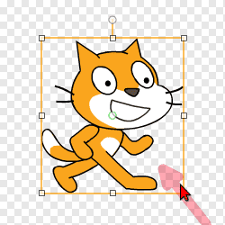
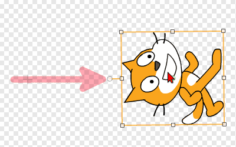
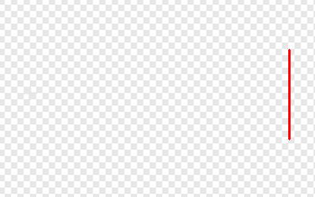

# Introduksjon {.intro}

No skal me lære korleis me lagar eit enkelt ballspel i Scratch. I Soloball skal
du styre katten som kontrollerer ballen slik at ballen ikkje går i nettet.


# Steg 1: Ein roterande katt {.activity}

*Me startar med å sjå på korleis me kan få kattefiguren til å rotere.*

## Sjekkliste {.check}

- [ ] Start eit nytt Scratch-prosjekt. Du vil sjå ein kattefigur midt på scena.

- [ ] Pusle samen dei følgjande klossane i skriptområdet til høgre på skjermen.

  ```blocks
  når @greenFlag vert trykt på
  gå til x: (0) y: (0)
  gjenta for alltid
      peik mot [musepeikar v]
  slutt
  ```

  Dette er eit døme på eit lite program, eller skript, som det kallast i
  Scratch. Dette skriptet seier at kattefiguren skal stå midt på skjermen og
  alltid peike mot, eller sjå mot, musepeikaren.

## Test prosjektet {.flag}

__Klikk på det grøne flagget.__

- [ ] For å starte programmet du akkurat pusla saman kan du klikke på det grøne
  flagget over scena.

- [ ] Startar katten å rotere slik at den alltid ser mot musepeikaren?

- [ ] For å stoppe programmet ditt kan du klikke på den raude åttekanten ved
  sidan av det grøne flagget.


# Steg 2: Katten spring rundt {.activity}

*I staden for at katten roterer vil me at den skal kunne springe rundt i sirkel
 på skjermen.*

## Sjekkliste {.check}

No skal me gjere eit lite triks der me flyttar katten vekk frå sentrum slik at
det ser ut som den spring i sirkel i staden for berre å rotere.

- [ ] Gi kattefiguren namnet `Katt`. Dette gjer du ved å fyrst klikke på detn
  vesle `i`{.blockmotion}-en på kattefiguren under scena. Så kan du skrive
  `Katt` i tekstfeltet. Når du går attende, `<`{.blockmotion}, ser du at figuren
  har fått det riktige namnet.

- [ ] Klikk på `Drakter`{.blocklightgrey}-fana øvst på skjermen. No vil du sjå
  to kattefigurar. Slett ein av dei ved å klikke på den vesle x-en i hjørnet av
  figuren.

- [ ] Gjer katten mindre ved å klikke på den i det store biletet, og så dra i
  eitt av hjørna.

  

- [ ] Roter katten ved å dra i den vesle rundingen over katten.

  

- [ ] Til slutt kan du ta tak i kattefiguren ved å klikke på den vesle rundingen
  midt på katten. Flytt den eit stykke til sida. Følg med på scena øvst til
  venstre slik at du ikkje dreg den ut av skjermen.

  

## Test prosjektet {.flag}

__Klikk på det grøne flagget.__

- [ ] Start programmet ditt att. Flyttar katten seg i sirkel når du beveger
  musepeikaren?

- [ ] Fungerer rørsla bra? Ser katten passe stor ut? Hugs at du kan gå attende
  og endre på kattefiguren seinare viss du oppdagar noko som kunne vore betre.

## Kva skjedde? {.challenge}

Sjølv om me ikkje endra programmet vårt oppfører katten seg veldig annleis.
Forstår du kvifor?

Når me seier at katten skal `peike mot musepeikaren`{.blockmotion} må den rotere
om eit punkt. Dette punktet kallast senterpunktet til figuren. Du kan sjå (og
endre) senterpunktet til ein figur ved å klikke på  øvst til høgre på skjermen.

Når me flyttar senterpunktet utanfor katten vil det sjå ut som om katten spring
rundt dette punktet i staden for at den berre roterer utan å flytte seg.


# Steg 3: Ein ball! {.activity}

*No skal me lage ein ball og få den til å sprette rundt på skjermen.*

## Sjekkliste {.check}

- [ ] Klikk på `Skript`{.blocklightgrey}-fana slik at du ser skriptet du skreiv
  tidlegare.

- [ ] Klikk på
  
  ved sidan av `Ny figur` under scena for å hente ein ny figur.

- [ ] Viss du klikkar på kategorien `Ting` til venstre på skjermen vil du sjå
  fleire ballar. Vel ein av dei.

- [ ] No skal me bruke ein annan måte for å gjere figurane mindre. Klikk
   øvst på skjermen. Så klikkar du på ballfiguren
  nokre gonger slik at den er passe stor i forhold til katten.

- [ ] No skal me lage eit skript for ballen. Me vil at ballen skal starte midt
  på skjermen. Så går den i ei løkke der den flyttar seg litt, og snur viss
  katten kjem borti den.

  ```blocks
  når @greenFlag vert trykt på
  gå til x: (0) y: (0)
  gjenta for alltid
      gå (3) steg
      viss <rører [Katt v] ?>
          peik i retning ((180) + (retning))
      slutt
  slutt
  ```

  Klossen `retning`{.blockmotion} finn du heilt nedst i
  `Rørsle`{.blockmotion}-kategorien.

- [ ] Forstår du kvifor

  ```blocks
  peik i retning ((180) + (retning))
  ```

  gjer at ballen snur? Me skal sjå nærare på dette i steg 6.

## Test prosjektet {.flag}

__Klikk på det grøne flagget.__

- [ ] Beveger ballen seg? Snur ballen når katten kjem borti den?

- [ ] Kva skjer viss ballen flyg forbi katten?

- [ ] Startar ballen midt på skjermen att viss du trykkar på det grøne flagget
  ein gong til?

- [ ] Viss du synest ballen er for lett å treffe, så kan du gjere katten litt
  mindre. Me vil finne ei betre løysing på dette problemet i utfordringane til
  slutt.


# Steg 4: Eit nett! {.activity}

*No skal me lage eit nett som kan fange ballen viss den flyr forbi katten.*

## Sjekkliste {.check}

- [ ] Me skal teikne ein figur sjølv. For å gjere det klikkar du på  ved sidan av `Ny figur` under scena.

- [ ] Klikk på `Bytt til vektorgrafikk` nedst til høgre på skjermen.

- [ ] Vel ei godt synleg farge, til dømes raud, og klikk på linje-verktøyet på
  høgre side av skjermen.

- [ ] Teikn ein liten loddret strek til høgre på figuren din. Du må gjerne halde
  inne `Skift`-knappen, då får du ein heilt loddrett strek.

  

- [ ] Klikk på `Skript`{.blocklightgrey}-fana.

- [ ] No skal me teikne eit sirkelforma nett ved å stemple denne figuren på
  bakgrunnen. Lag det følgjande skriptet:

  ```blocks
  når @greenFlag vert trykt på
  gå til x: (0) y: (0)
  gjenta (36) gongar
      snu @turnLeft (10) gradar
      lag avtrykk
  slutt
  ```

  Klossen `lag avtrykk`{.blockpen} stemplar ein figur på bakgrunnen slik at
  den blir der. Du kan fjerne slike avtrykk att ved å bruke
  `slett`{.blockpen}-klossen.

## Test prosjektet {.flag}

__Klikk på det grøne flagget.__

- [ ] Blir det teikna ein sirkel på bakgrunnen når spelet startar?

- [ ] Det kan vere at du må flytte litt på katt- og nett-figuren slik at dei
  passar saman. Me vil at det skal sjå ut omlag som på biletet i starten av
  oppgåva.

- [ ] Skjer det noko når ballen treff nettet?


# Steg 5: Nettet fangar ballen {.activity}

*Me vil at ballen skal stoppe når den treff nettet.*

## Sjekkliste {.check}

Til no har me ikkje laga noko kode som fortel ballen at den har treft nettet.
Det skal me gjere no.

- [ ] Klikk på ball-figuren, slik at du ser skriptet me laga for den tidlegare.

- [ ] No skal me bruke `rører fargen`{.blocksensing}-klossen for å oppdage at
  ballen treff nettet. Legg til nye klossar i skriptet ditt slik at det ser slik
  ut:

  ```blocks
  når @greenFlag vert trykt på
  gå til x: (0) y: (0)
  gjenta for alltid
      gå (3) steg
      viss <rører [Katt v] ?>
          peik i retning ((180) + (retning))
      slutt
      viss <rører fargen [#ff0000] ?>
          stopp [alle v] :: control
      slutt
  slutt
  ```

- [ ] For å få riktig farge i `rører fargen`{.blocksensing}-klossen klikkar du
  fyrst på den vesle firkanten der farga synest. Så flyttar du musepeikaren slik
  at den peikar på nettet. Då blir farga i den vesle firkanten forandra. Klikk
  ein gong til for å velje denne farga.

## Test prosjektet {.flag}

__Klikk på det grøne flagget.__

- [ ] Stoppar ballen når den kjem til nettet?

- [ ] Med `stopp alle`{.blockcontrol}-klossen stoppar du heile spelet når ballen
  treff nettet. For å spele vidare må du klikke det grøne flagget att.


# Steg 6: Meir naturleg sprett {.activity}

*No sprett ballen berre framm og attende på same linje heile tida. Me vil at den
 skal sprette meir naturleg når den treff katten.*

## Sjekkliste {.check}

Ein bra modell for korleis ein ball sprett er at vinkelen ut er den same som
vinkelen inn. Tenk på korleis ein ordentleg ball sprett viss du kastar den inn i
ein vegg frå ein skrå vinkel.


I spelet er det to retningar me må tenke på: retninga til ballen og retninga
kattefiguren står i.


I figuren over og i koden vidare tyder `retning`{.blockmotion} retninga til
ballen, sidan koden høyrer til ballfiguren. Til no har me brukt

```blocks
peik i retning ((180) + (retning))
```

for at ballen skal snu. I figuren ser me at dette tyder at ballen sprett tilbake
dit den kom frå.

Me bør òg kompensere for retninga til `Katt`. Dette kan me gjere ved å trekke
frå to gonger (`retning`{.blockmotion} - `retning av katt`{.blocksensing}).
Forstår du korleis når du ser på figuren? Då blir den nye retninga

```blocks
(((180) + (retning)) - ((2) * ((retning) - ([retning v] av [Katt v])))
```

Me kan forenkle dette til

```blocks
(((180) - (retning)) + ((2) * ([retning v] av [Katt v])))
```

- [ ] Endre i skriptet til ballen slik at spretten blir betre,

  ```blocks
  når @greenFlag vert trykt på
  gå til x: (0) y: (0)
  gjenta for alltid
      gå (3) steg
      viss <rører [Katt v] ?>
          peik i retning (((180) - (retning)) + ((2) * ([retning v] av [Katt v])))
      slutt
      viss <rører fargen [#ff0000] ?>
          stopp [alle v] :: control
      slutt
  slutt
  ```

## Test prosjektet {.flag}

__Klikk på det grøne flagget.__

- [ ] Ser du at ballen sprett litt meir naturleg no?

- [ ] Har du nokre idear til korleis spelet kan bli endå betre? Prøv dei ut!

## Lagre og legg ut prosjektet {.save}

No har me laga eit ganske morosamt spel! Viss du vil kan du gå vidare med dei
neste stega for å gjere spelet endå meir spanande.

For å lagre spelet ditt kan du velje `Lagre no` i `Fil`-menyen. Då blir spelet
lagra på brukarkontoen din hjå Scratch. Viss du ikkje har laga brukarkonto kan
du velje `Last ned til datamaskinen` i staden.

Viss du lagrar spelet på brukarkontoen din kan du òg velje å leggje det ut slik
at andre kan spele det. For å gjere det klikkar du på `Legg ut` øvst til høgre.
Så kan du dele nettadressa til spelet ditt med venene og familien din.


# Ekstra 1: Tell poeng {.activity}

*Alle spel blir meir morosame om ein får poeng!*

## Sjekkliste {.check}

For å telje poeng skal me bruke noko som kallast ein variabel. Ein variabel er
eit namn på ein verdi som kan variere.

- [ ] Klikk på `Data`-kategorien og så på
  `Lag ein variabel`{.blocklightgrey}.

- [ ] Gi variabelen namnet `Poeng`{.blockdata}, og la den gjelde for alle
  figurar. Legg merke til at når du klikkar `OK` dukkar det opp ein boks som
  heiter `Poeng`{.blockdata} på scena, og fleire nye klossar under `Lag ein
  variabel`{.blocklightgrey}.

No vil me at `Poeng`{.blockdata} skal setjast til `0` når spelet startar. Så
skal me få eitt poeng kvar gong me returnerer ballen.

- [ ] Legg på to nye klossar i skriptet som styrer ballen:

  ```blocks
  når @greenFlag vert trykt på
  gå til x: (0) y: (0)
  set [Poeng v] til [0]
  gjenta for alltid
      gå (3) steg
      viss <rører [Katt v] ?>
          peik i retning (((180) - (retning)) + ((2) * ([retning v] av [Katt v])))
          endra [Poeng v] med (1)
      slutt
      viss <rører fargen [#ff0000] ?>
          stopp [alle v] :: control
      slutt
  slutt
  ```


# Ekstra 2: Auk hastigheita {.activity}

*No skal me gjere spelet vanskelegare etter kvart som tida går, ved at ballen
 beveger seg stadig raskare.*

## Sjekkliste {.check}

Hastigheita på ballen blir no styrt av klossen

```blocks
gå (3) steg
```

Ved å endre på 3-talet endrar me hastigheita på ballen. Prøv å gjere det sjølv!

- [ ] For å endre hastigheita undervegs i spelet må me bruke ein variabel. Lag
  ein ny variabel som du kallar `Hastigheit`{.blockdata}. Du kan la denne gjelde
  kun for denne figuren.

- [ ] Hastigheita er ikkje så interessant å vise på scena. Du kan skjule boksen
  på scena ved å fjerne avhukinga ved sidan av `Hastigheit`{.blockdata}.

  

- [ ] No vil me setje hastigheita til `3` når spelet startar (du kan bruke eit
  anna tal om du vil). Så vil me auke denne litt kvar gong katten returnerer
  ballen. Dette gjer me på same måte som når me tel poeng.

  ```blocks
  når @greenFlag vert trykt på
  gå til x: (0) y: (0)
  set [Poeng v] til [0]
  set [Hastigheit v] til [3]
  gjenta for alltid
      gå (Hastigheit) steg
      viss <rører [Katt v] ?>
          peik i retning (((180) - (retning)) + ((2) * ([retning v] av [Katt v])))
          endra [Poeng v] med (1)
          endra [Hastigheit v] med (0.1)
      slutt
      viss <rører fargen [#ff0000] ?>
          stopp [alle v] :: control
      slutt
  slutt
  ```

  Pass på at du endrar `gå steg`{.blockmotion}-klossen òg.


# Ekstra 3: Unngå at katten fangar ballen {.activity}

*Du har sikkert opplevd at katten av og til "fangar" ballen. No skal me fikse
 dette.*

## Sjekkliste {.check}

Av og til virkar det som om katten "fangar" ballen. Det skjer fordi ballen ikkje
flyttar seg langt nok etter at den har snudd. Den er framleis borti katten, og
difor snur den att... Og igjen... Og igjen.

- [ ] No skal me lage endå ein variabel. Den skal heite `Flytt`{.blockdata},
  berre gjelde for denne figuren, og heller ikkje visast på scena.

Me skal bruke `Flytt`{.blockdata}-variabelen til å telje kor mange flytt ballen
har gjort sidan den var borti katten sist. Så kan me seie at ballen berre skal
snu viss den har flytta mange gonger sidan sist den snudde.

- [ ] Utvid skriptet ditt som vist under. Legg spesielt merke til at
  `viss`{.blockcontrol}-testen har blitt utvida.

  ```blocks
  når @greenFlag vert trykt på
  gå til x: (0) y: (0)
  set [Poeng v] til [0]
  set [Hastigheit v] til [3]
  gjenta for alltid
      gå (Hastigheit) steg
      endra [Flytt v] med (1)
      viss <<rører [Katt v] ?> og <(Flytt) > [20]>>
          peik i retning (((180) - (retning)) + ((2) * ([retning v] av [Katt v])))
          endra [Poeng v] med (1)
          endra [Hastigheit v] med (0.1)
          set [Flytt v] til [0]
      slutt
      viss <rører fargen [#ff0000] ?>
          stopp [alle v] :: control
      slutt
  slutt
  ```

## Prøv sjølv {.challenge}

I desse ekstrastega har me sett på nokre måtar me kan gjere spelet betre og meir
spanande. Her er endå fleire idear:

- [ ] Du kan bytte kattefiguren med ein annan figur. Den enklaste måten å gjere
  dette på er ved å gå til `Drakter`-fana, fordi då beheldt du skriptet du
  allereie har laga på figuren. Her kan du velje ein av dei ferdige figurane,
  eller teikne ein ny figur sjølv.

- [ ] Prøv å leggje på lydar, til dømes når katten er borti ballen eller når
  ballen treff nettet. Sjå på dei ulike klossane i
  `Lydar`{.blocksound}-kategorien, og dei lydane som finst under `Lydar`-fana.

Det er mange andre ting du kan prøve på. Du bestemmer!
