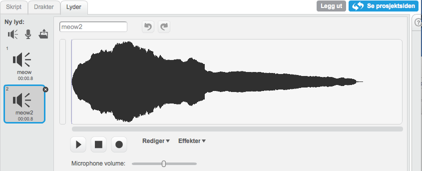

## Sjekkliste {.check}

+ Lag en ny figur og se om du klarer å få den til å se ut som den
  lyden du vil lage.

+ I fanen `Lyder`, lag et nytt opptak eller importer en lydfil.

  

+ Trykk på figuren og lag et skript som sender en melding til figuren
  når man trykker på den:

  ```blocks
  når denne figuren klikkes
  send melding [katt v]
  ```

+ Nå må vi spille lyden når den får den rette meldingen.

  ```blocks
  når jeg mottar [katt v]
  spill lyden [meow v]
  ```

+ Til slutt endrer vi utseende når lyden spilles.

  ```blocks
  når jeg mottar [katt v]
  spill lyden [moew v]
  sett størrelse til (110) %
  vent (0.1) sekunder
  sett størrelse til (100) %
  ```
