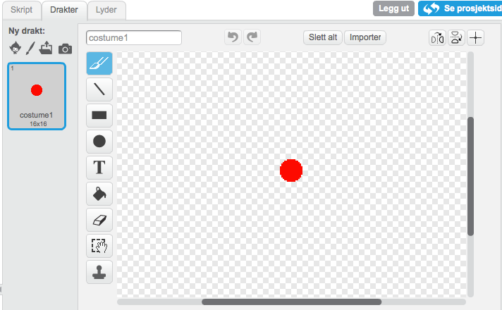

## Sjekkliste {.check}

+ Lag to nye lister (for alle figurer). Kall en av dem
  `instrument`{.blocklist} og den andre `timing`{.blocklist}.

+ Lag en ny variabel (for alle figurer) som heter `opptak`{.blockdata}

+ For hvert av instrumentene (tromme, piano, lyder etc.), må du legge
  til følgende i `når jeg mottar`{.blockevents} klossen.

  ```blocks
  hvis <(opptak) = [1]>
      legg (tid) til [timing v]
      legg (katt) til [instrument v]
  slutt
  ```

  Endre ordet `katt` i `legg katt til instrument`{.blocklist} slik
  at det stemmer med navnet til meldingen som brukes for å spille
  denne lyden.

  ```blocks
  når jeg mottar [drum v]
  trommeslag (48 v) som varer (0.2) takter
  hvis <(opptak) = [1]>
      legg (tid) til [timing v]
      legg (katt) til [instrument v]
  slutt
  sett størrelse til (110) %
  vent (0.1) sekunder
  sett størrelse til (100) %
  ```

+ Tegn en ny figur og gi den en rød sirkeldrakt. Gi denne figuren
  navnet `Opptak`.

  

+ Lag et skript som setter `opptak`{.blockdata} til 1 og sletter alle
  `instrument`{.blocklist} og `timing`{.blocklist} når man trykker på
  det.

## Test prosjektet {.flag}

Trykk på opptaksknappen. Hva skjer når du spiller på instrumentene?

## Sjekkliste {.check}

+ Lag en ny figur og lag en drakt som ser ut som en grønn pil.  Kall
  denne `Spill av`.

  

+ Lag en ny variabel som du kaller `index`{.blockdata}.

+ Nå må vi få avspillingen til å gjøre noe. Legg dette skriptet til
  `Spill av`.

  ```blocks
  når denne figuren klikkes
  sett [recording v] til [0]
  sett [index v] til [1]
  nullstill klokka
  for alltid
      hvis <(element (index) av [timing v]) < (timer)>
          send melding (element (index) av [instrument v])
          endre [index v] med (1)
          hvis <(index) > (lengden av [timing v])>
              stopp [dette skriptet] :: control
          slutt
      slutt
  slutt
  ```

## Test prosjektet {.flag}

+ Trykk på den grønne play knappen. Hva skjer?

+ Trykk på den røde knappen og spill på noen intrumenter. Etter at du
  er ferdig, trykk på den grønne play knappen igjen. Hva skjer?

+ Spill på flere instrumenter uten å trykke på record. Trykk så på den
  grønne play knappen igjen. Hva skjer?
