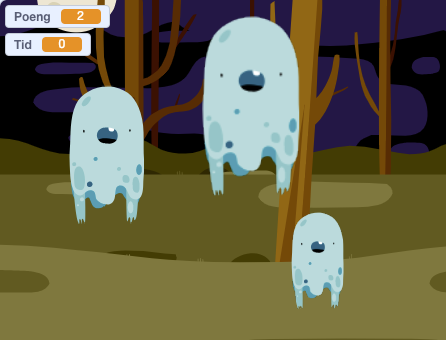

# Informasjon til veiledere

Spillet vi skal lage nå er inspirert av tivolispillet
__Whack-a-mole__, hvor man slår muldvarper ned igjen i hullene sine. I
vårt spill får man poeng for å trykke på spøkelser som dukker opp på
skjermen. Målet er å få så mange poeng som mulig på 30 sekunder.

Dette er et enkelt spill som gir en god introduksjon til Scratch.

# Forberedelser

Spøkelsesjakten bruker bakgrunn og drakter fra
Scratchbibliotektet. Ingen spesielle forberedelser er derfor
nødvendige.

Her er likevel noen generelle ting som kan være verdt å huske på:

+ Scratch er tilgjengelig på nettsiden <http://scratch.mit.edu/>. Velg
  `Programmering` eller `Prøv Det` for å begynne å programmere.
+ Alle elevene bør ha sin egen bruker i Scratch-nettverket. Uten en
  slik bruker er det mye vanskeligere å lagre spillene og programmene
  man lager. For å opprette en ny bruker, klikk `Bli Scratch-bruker`
  og følg instruksene på skjermen.
+ For å skifte språk til norsk:
  + På de vanlige nettsidene til Scratch finnes en nedtrekksmeny for
    å velge språk helt nederst på skjermen.
  + Inne i Scratch-editoren kan man trykke på jordkloden øverst til
    venstre for å endre språket som brukes.

# Læringsmål

Spøkelsesjakten viser eksempler på

1. hvordan man __skjuler__ og __viser__ figurer,
2. bruk av __løkker__ for å få noe til å skje flere ganger (eller for alltid),
3. bruk av __variable__ for å telle poeng,
4. hvordan man kan __telle ned tiden som går__.
