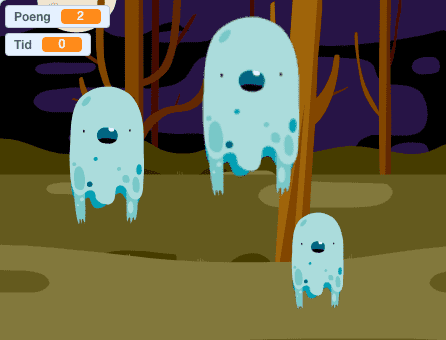

# Introduksjon {.intro}

Dette prosjektet er inspirert av tivolispillet __Whack-a-mole__, hvor
man slår muldvarper ned igjen i hullene sine. I vårt spill er det
spøkelsene som blir borte når vi klikker på dem. Målet er å klikke
bort flest mulig i løpet av 30 sekunder.



# Steg 1: Lag et flyvende spøkelse {.activity}

## Sjekkliste {.check}

+ Start et nytt Scratch-prosjekt.

+ Slett kattefiguren ved å høyreklikke på den og velge `slett`

+ Endre bakgrunnen til `Natur/woods`.

+ For å legge til et spøkelse klikker du på
  -knappen.
  Velg `Fantasi/Ghost1`-figuren.

+ Gi spøkelset navnet `spøkelse1`, ved å klikke på `i`{.blockmotion} på
  figuren.

Du skal nå __lage en variabel__ som styrer hvor fort spøkelset beveger
seg. Denne kan vi senere bruke til å endre hastigheten når spillet er
i gang.

+ Under `Skript`{.blocklightgrey}, trykk på `Data`{.blockdata} og så
  `Lag en variabel`. Kall variabelen `hastighet`. Huk av der det står
  `For denne figuren`.

+ På scenen skal variabelen hete `spøkelse1: hastighet`. Hvis den bare
  heter `hastighet`, så slett den og legg den til en gang til.

+ Fjern avhukingen ved siden av variabelen, slik at den ikke vises på
  scenen: 

+ Vi vil at spøkelset skal bevege seg når spillet starter. Det gjør vi
  ved å lage følgende skript:

  ```blocks
  når grønt flagg klikkes
  sett [hastighet v] til [5]
  for alltid
      gå (hastighet) steg
  slutt
  ```

## Test Prosjektet {.flag}

__Klikk på det grønne flagget.__

+ Flyr spøkelset over skjermen?

+ Hvorfor sitter spøkelset fast når det treffer kanten på skjermen?

## Sjekkliste {.check}

+ For å unngå at spøkelset sitter fast i kanten må vi få det til å snu
  når det treffer den. Dette gjøres ved å legge til klossen `sprett
  tilbake ved kanten`{.blockmotion}. Skriptet ser da slik ut:

  ```blocks
  når grønt flagg klikkes
  sett [hastighet v] til [5]
  for alltid
      gå (hastighet) steg
      sprett tilbake ved kanten
  slutt
  ```

+ For å hindre at spøkelset snur seg opp-ned, klikk på
  -knappen i
  spøkelsets infoboks, `i`{.blockmotion}.

## Test prosjektet {.flag}

__Klikk på det grønne flagget.__

+ Flyr spøkelset fram og tilbake?

+ Flyr spøkelset riktig vei?

## Ting å prøve {.try}

+ __Endre hastighetsvariabelen__, slik at spøkelset går raskere eller
  saktere.

+ Hvordan kan vi få spøkelset til å __fly fortere jo lenger det
  flyr?__ (Dette er nokså vanskelig, så ikke vær bekymret hvis du ikke
  skjønner hvordan. Du vil få flere hint underveis.)

# Steg 2: Få spøkelset til å dukke opp og forsvinne {.activity}

*For å gjøre spillet morsommere vil vi få spøkelset til å dukke opp og
 forsvinne.*

## Sjekkliste {.check}

+ Vi lager et nytt skript, som skal kjøre samtidig med skriptet som
  beveger på spøkelset. Det nye skriptet __viser spøkelset en
  tilfeldig periode__ og __gjemmer det deretter bort i en tilfeldig
  periode__. Dette skal skje om og om igjen, frem til spillet er
  slutt. Slik lager du skriptet:

  ```blocks
  når grønt flagg klikkes
  for alltid
      vis
      vent (tilfeldig tall fra (3) til (5)) sekunder
      skjul
      vent (tilfeldig tall fra (2) til (4)) sekunder
  slutt
  ```

## Test prosjektet {.flag}

__Klikk på det grønne flagget.__

+ Flytter spøkelset seg fra side til side?

+ Forsvinner det og dukker opp igjen helt tilfeldig?

## Ting å prøve {.try}

+ Prøv å __endre tallene i koden__ der det står `tilfeldig tall fra _
  til _`{.blockoperators}. Hva skjer hvis du velger veldig store
  eller små tall? (Dette gir deg kanskje et nytt hint for hvordan vi
  skal få spøkelset til å gå fortere jo lenger man spiller.)

# Steg 3: Tryll bort spøkelset med et klikk! {.activity}

*For å gjøre dette til et ordentlig spill må vi gi spilleren noe å
 gjøre - for eksempel å klikke bort spøkelset. Når det skjer vil vi
 også at det skal komme en stilig tryllelyd!*

## Sjekkliste {.check}

+ Hent lyden `Elektronisk/fairydust` fra
  `Lyder`{.blocklightgrey}-fanen.

+ Lag skriptet som får __spøkelset til å forsvinne__ når det blir
  klikket på:

  ```blocks
  når denne figuren klikkes
  skjul
  spill lyden [fairydust v]
  ```

## Test prosjektet {.flag}

__Klikk på det grønne flagget.__

+ Forsvinner spøkelset med en tryllelyd når du klikker på det?

## Ting å prøve {.try}

+ Spør de voksne om du kan ta opp en egen lyd. Denne kan du bruke i
  stedet for tryllelyden.

# Steg 4: Legg til tid og poeng {.activity}

*Vi har et spøkelse å trylle bort, så nå vil vi ha poeng for å gjøre
 det! Vi vil også ha en tidsfrist, slik at det er om å gjøre å få
 flest mulig poeng på denne tiden. Vi løser begge deler ved å bruke
 variabler.*

## Sjekkliste {.check}

+ Lag en ny variabel som heter `Poeng`{.blockdata}. Denne skal
  gjelde `For alle figurer`. Legg til en ny kloss som gjør at
  `Poeng`{.blockdata}-variabelen økes med 1 poeng for hver gang
  spilleren klikker på spøkelset.

  ```blocks
  når denne figuren klikkes
  skjul
  spill lyden [fairydust v]
  endre [Poeng v] med (1)
  ```

+ Klikk på `Scene` og lag en ny variabel som heter `Tid`. La variablen
  vises på skjermen.

+ Lag et nytt skript som setter `Tid`{.blockdata}-variabelen til
  __30__ og `Poeng`-variablen til __0__ når det grønne flagget
  klikkes.

+ Bruk så en `gjenta til`{.blockcontrol}-kloss for å vente i __1__
  sekund og deretter redusere tiden med 1 sekund. Denne skal kjøre
  fram til tiden er ute. Til slutt stopper du hele spillet med en
  `stopp alle`{.blockcontrol}-kloss.

  ```blocks
  Når grønt flagg klikkes
  sett [Tid v] til [30]
  sett [Poeng v] til [0]
  gjenta til <(tid) = [0]>
      vent (1) sekunder
      endre [Tid v] med (-1)
  slutt
  stopp [alle v] :: control
  ```

## Test prosjektet {.flag}

__Klikk på det grønne flagget.__

## Ting å prøve {.try}

+ Hvordan kan du få spøkelset til å gå fortere etter at spillet er i
  gang?

## Lagre prosjektet {.save}

+ __Bra jobba!__ Nå er du egentlig ferdig med spillet, men prøv deg
  gjerne på neste steg også.

## En ekstra utfordring: Flere spøkelser! {.challenge}

*Hvis ett spøkelse er bra, må vel flere være enda bedre! La oss ha tre
 spøkelser flyvende rundt!*

+ __Lag flere spøkelser__ ved å høyreklikke på det du allerede har, og
  så kopiere dette.

+ __La spøkelsene få ulik størrelse__. Dette gjør du ved å bruke én av
  knappene under. Den til venstre forstørrer figuren og den til høyre
  forminsker: 

+ Du kan også __endre spøkelsenes flyvefart__. Dette gjøres i
  `hastighet`{.blockdata}-variabelen i det øverste skriptet for hver
  enkelt figur.

+ Til slutt kan du __spre spøkelsene__ litt bedre ut på scenen. Dette
  gjør du ved å klikke og dra figurene rundt i selve skjermbildet.

## Test prosjektet {.flag}

__Klikk på det grønne flagget.__

+ Har du nå tre spøkelser som flyr fra side til side?

+ Som plutselig forsvinner og dukker opp igjen?

+ Forsvinner de når du klikker på dem?

Gratulerer! Da har du gjort alt riktig!

## Ting å prøve {.try}

+ Hvor mange spøkelser synes du spillet fungerer best med? __Legg til
  flere__ og prøv!

+ Klarer du å få spøkelsene til __å se forskjellige ut__? Klikk på
  `Drakter`{.blocklightgrey} og prøv deg frem. Du kan også velge noen
  av klossene under `Utseende`{.blocklooks}.

+ Kan du få spøkelsene til __å bli verdt forskjellige antall poeng?__
  Hva med å få den minste og raskeste til å gi 10 poeng?

## Lagre prosjektet {.save}

Bra jobba! Nå er du ferdig, og det er på tide med litt seriøs
spilling.  Husk også at du kan dele spillet med vennene dine. Det gjør
du ved å klikke på `Legg ut` i toppmenyen.
