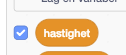

# Introduksjon {.intro}

Denne oppgåva er inspirert av tivolispelet __Whack-a-mole__, der ein slår
moldvarpar ned att i hola sine. I spelet vårt er det spøkelsa som skal bli borte
når me klikkar på dei. Målet er å klikke bort flest mogleg i løpet av 30 sekund.


# Steg 1: Lag eit flygande spøkelse {.activity}

## Sjekkliste {.check}

- [ ] Start eit nytt Scratch-prosjekt.

- [ ] Slett kattefiguren ved å høgreklikke på den og velje `slett`

- [ ] Endre bakgrunnen til `Natur/woods`.

- [ ] For å leggje til eit spøkelse klikkar du på
  -knappen.
  Vel `Fantasi/Ghost1`-figuren.

- [ ] Gi spøkelset namnet `spøkelse1`, ved å klikke på `i`{.blockmotion} på
  figuren.

No skal du __lage ein variabel__ som styrer kor fort spøkelset beveger seg.
Denne kan me bruke til å endre hastigheita undervegs i spelet seinare.

- [ ] Under `Skript`{.blocklightgrey}, trykk på `Data`{.blockdata} og så
  `Lag ein variabel`. Kall variabelen `hastigheit`. Huk av der det står
  `For denne figuren`.

- [ ] På scena skal variabelen heite `spøkelse1: hastigheit`. Viss den berre
  heiter `hastigheit`, prøv å slette den og leggje den til på nytt.

- [ ] Fjern avhukinga ved sidan av variabelen, slik at den ikkje synast på
  scena: 

- [ ] Me vil at spøkelset skal bevege seg når spelet startar. Det gjer me ved å
  lage følgjande skript:

  ```blocks
  når @greenFlag vert trykt på
  set [hastigheit v] til [5]
  gjenta for alltid
      gå (hastigheit) steg
  slutt
  ```

## Test prosjektet {.flag}

__Klikk på det grøne flagget.__

- [ ] Flyr spøkelset over skjermen?

- [ ] Kvifor sit spøkelset fast når det treff kanten på skjermen?

## Sjekkliste {.check}

- [ ] For å unngå at spøkelset sit fast i kanten må me får det til å snu når det
  treff den. Dette gjer me ved å leggje til klossen `viss ved kant,
  sprett`{.blockmotion}. Då ser skriptet slik ut:

  ```blocks
  når @greenFlag vert trykt på
  set [hastigheit v] til [5]
  gjenta for alltid
      gå (hastigheit) steg
      viss ved kant, sprett
  slutt
  ```

- [ ] For å hindre at spøkelset snur seg opp ned, må du klikke på
  -knappen i infoboksen til
  spøkelset, `i`{.blockmotion}.

## Test prosjektet {.flag}

__Klikk på det grøne flagget.__

- [ ] Flyr spøkelset fram og tilbake?

- [ ] Flyr spøkelset riktig vei?

## Ting å prøve {.challenge}

- [ ] Prøv å __endre hastigheitsvariabelen__ slik at spøkelset går raskare eller
  saktare.

- [ ] Korleis kan me få spøkelset til å __flyge fortare di lengre det flyr?__
  (Dette er litt vanskeleg, så ikkje vere bekymra om du ikkje forstår korleis.
  Du får fleire hint seinare.)


# Steg 2: Få spøkelset til å dukke opp og forsvinne {.activity}

*For å gjere spelet meir morosamt vil me få spøkelset til å dukke opp og
 forsvinne.*

## Sjekkliste {.check}

- [ ] Me lagar eit nytt skript som skal køyre samstundes som skriptet som bevege
  på spøkelset. Det nye skriptet __viser spøkelset ein tilfeldig periode__ og
  __gøymer det bort i ein tilfeldig periode__. Dette skal skje om att og om att,
  fram til spelet er over. Slik lagar du skriptet:

  ```blocks
  når @greenFlag vert trykt på
  gjenta for alltid
      vis
      vent (tilfeldig tal frå (3) til (5)) sekund
      gøym
      vent (tilfeldig tal frå (2) til (4)) sekund
  slutt
  ```

## Test prosjektet {.flag}

__Klikk på det grøne flagget.__

- [ ] Flyttar spøkelset seg frå side til side?

- [ ] Forsvinn det og dukkar opp att heilt tilfeldig?

## Ting å prøve {.challenge}

- [ ] Prøv å __endre tala i koden__ der det står `tilfeldig tal frå _ til
  _`{.blockoperators}. Kva skjer viss du vel store eller små tal? (Dette er
  kanskje eit nytt hint for korleis me får spøkelset til å gå fortare di lengre
  ein spelar.)


# Steg 3: Tryll bort spøkelset med eit klikk! {.activity}

*For å gjere dette til eit ordentleg spel må me gi spelaren noko å gjere - til
 dømes å klikke bort spøkelset. Når det skjer vil me òg at det skal kome ein
 stilig tryllelyd!*

## Sjekkliste {.check}

- [ ] Hent lyden `Elektronisk/fairydust` frå `Lyder`{.blocklightgrey}-fana.

- [ ] Lag skriptet som får __spøkelset til å forsvinne__ når det blir
  klikka på:

  ```blocks
  når denne figuren vert trykt på
  gøym
  start lyden [fairydust v]
  ```

## Test prosjektet {.flag}

__Klikk på det grøne flagget.__

- [ ] Forsvinn spøkelset med ein tryllelyd når du klikkar på det?

## Ting å prøve {.challenge}

- [ ] Prøv å ta opp ein eigen lyd. Spør ein vaksen om hjelp viss du ikkje veit
  korleis du gjer det. Denne kan du bruke i staden for tryllelyden.


# Steg 4: Legg til tid og poeng {.activity}

*Me har eit spøkelse å trylle bort, så no vil me ha poeng for å gjere det! Me
 vil dessutan ha ein tidsfrist, slik at det er om å gjere å få flest mogleg
 poeng på denne tida. Me løyser begge delar ved å bruke variablar.*

## Sjekkliste {.check}

- [ ] Lag ein ny variabel som heiter `Poeng`{.blockdata}. Denne skal gjelde `for
  alle figurar`. Legg til ein ny kloss som gjer at
  `Poeng`{.blockdata}-variabelen aukar med `1` poeng for kvar gong spelaren
  klikkar på spøkelset.

  ```blocks
  når denne figuren vert trykt på
  gøym
  start lyden [fairydust v]
  endra [Poeng v] med (1)
  ```

- [ ] Klikk på `Scene` og lag ein ny variabel som heiter `Tid`. La variablen
  synast på skjermen.

- [ ] Lag eit nytt skript som set `Tid`{.blockdata}-variabelen til `30` og
  `Poeng`-variablen til `0` når det grøne flagget blir klikka på.

- [ ] Bruk ein `gjenta til`{.blockcontrol}-kloss for å vente i `1` sekund, og så
  redusere `Tid`{.blockdata} med `1`. Denne skal køyre fram til tida er ute. Til
  slutt stoppar du heile spelet med ein  `stopp alle`{.blockcontrol}-kloss.

  ```blocks
  når @greenFlag vert trykt på
  set [Tid v] til [30]
  set [Poeng v] til [0]
  gjenta til <(Tid) = [0]>
      vent (1) sekund
      endra [Tid v] med (-1)
  slutt
  stopp [alle v] :: control
  ```

## Test prosjektet {.flag}

__Klikk på det grøne flagget.__

- [ ] Får du poeng når du klikkar på eit spøkelse?

- [ ] Tel tida ned frå 30 med riktig tempo?

- [ ] Stoppar spelet når tida er ute?

## Ting å prøve {.challenge}

- [ ] Korleis kan du få spøkelset til å gå fortare etter at spelet har starta?

## Lagre prosjektet {.save}

- [ ] __Bra jobba!__ No er du eigentleg ferdig med spelet, men du kan alltid
  vidareutvikle det du har laga.

## Ei ekstra utfordring: Fleire spøkelse! {.challenge}

*Viss eitt spøkelse er bra, så må vel fleire vere endå betre! La oss ha tre
 spøkelse som flyr rundt!*

- [ ] __Lag fleire spøkelse__ ved å høgreklikke på det du allereie har og
  kopiere det.

- [ ] __La spøkelsane få ulik storleik__. Dette gjer du ved å bruke ein av
  knappane under. Den til venstre forstørrar figuren, og den til høgre
  forminskar: 

- [ ] Du kan __endre hastigheita for spøkelsa__. Dette gjer du i
  `hastigheit`{.blockdata}-variabelen i det øvste skriptet for kvar enkelt
  figur.

- [ ] Til slutt kan du __spreie spøkelsa__ betre ut over scena. Dette gjer du
  ved å klikke og dra figurane rundt i sjølve skjermbiletet.

## Test prosjektet {.flag}

__Klikk på det grøne flagget.__

- [ ] Har du tre spøkelse som flyr frå side til side?

- [ ] Forsvinn dei plutseleg, og dukkar dei opp att?

- [ ] Forsvinn dei når du klikkar på dei?

Gratulerer! Då har du gjort alt riktig!

## Ting å prøve {.challenge}

- [ ] Kor mange spøkelse synest du spelet fungerer best med? __Legg til
  fleire__ og prøv!

- [ ] Klarar du å få spøkelsa til __å sjå ulike ut__? Klikk på
  `Drakter`{.blocklightgrey} og prøv deg frem. Du kan òg prøv med nokon av
  klossane under `Utsjånad`{.blocklooks}.

- [ ] Kan du få spøkelsa til __å bli verdt ulike antal poeng__? Kva med å få den
  minste og raskaste til å gi `10` poeng?

## Lagre prosjektet {.save}

Bra jobba! No er du ferdig, og det er på tide med litt seriøst speling. Hugs at
du kan dele spelet med venene dine. Det gjer du ved å klikke på `Legg ut` i
toppmenyen.
