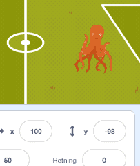

# Introduksjon {.intro}

Me skal lage eit enkelt fotballspel der du skal prøve å score på så mange
straffespark som mogleg.


# Steg 1: Katten og fotballbanen {.activity}

*Me startar med å lage ein katt som kan bevege seg på ein fotballbane.*

## Sjekkliste {.check}

- [ ] Start eit nytt prosjekt, til dømes ved å klikke `Programmering` i menyen.
  Viss du allereie har starta eit prosjekt kan du starte eit nytt ved å velje
  `Fil` og så `Ny`.

- [ ] Klikk på `i`{.blockmotion} i hjørnet av kattefiguren, og gi katten
  namnet `Leo`.

- [ ] Klikk på  nedst til venstre
  på skjermen for å hente inn ein ny bakgrunn. Vel bakgrunnen `Utendørs/goal1`
  eller `Utendørs/goal2`.

- [ ] No skal me skrive eit lite program som flyttar katten `Leo` når me klikkar
  på han. Merk `Leo` i figurvindauget nedst på skjermen, og klikk `Skript`-fana
  slik at du ser dei ulike kommandoklossane att. Pusle saman dei følgjande
  klossane i skriptvindauget til høgre:

  ```blocks
  når denne figuren vert trykt på
  gå (10) steg
  ```

## Test prosjektet {.flag}

__Klikk på det grøne flagget.__

- [ ] Flyttar `Leo` på seg når du klikkar på han?

- [ ] Kva skjer viss du klikkar mange gonger på `Leo` slik at han når bort til
  kanten av scena?

## Sjekkliste {.check}

- [ ] Du kan flytte `Leo` tilbake på skjermen att ved å trykke på han og dra han
  dit du vil.

- [ ] Me vil likevel programmere ein enklare måte å få `Leo` tilbake på banen
  att. Lag eit __nytt__ skript, __ved sidan av__ det du allereie har laga, som
  ser slik ut:

  ```blocks
  når @greenFlag vert trykt på
  gå til x: (-180) y: (-30)
  ```

- [ ] No vil `Leo` kome tilbake på banen kvar gong du klikkar på det grøne
  flagget rett over scenen.

## Lagre prosjektet {.save}

No har du skrive eit lite program! Scratch lagrar alt du gjer med jamne
mellomrom. Det er likevel lurt å leggje seg til den gode vanen å lagre sjølv
innimellom.

- [ ] Over scena er det eit tekstfelt der du kan gi namn til spelet ditt. Du kan
  til dømes kalle dette for `Straffespark`.

- [ ] I menyen `Fil` kan du velje `Lagre nå` for å lagre prosjektet.


# Steg 2: Me sparkar ballen {.activity}

*Det neste me treng i spelet vårt er ein ball!*

## Sjekkliste {.check}

- [ ] No skal me leggje til ein ball-figur i spelet vårt. Klikk på  og vel fotballen
  `Ting/Soccer Ball`.

- [ ] Gi fotballen namnet `Ball`.

- [ ] Lag ballen mindre ved fyrst å trykkje på 
- øvst mot midten av vindauget. Så kan du trykke på ballen seks gonger.

- [ ] No skal me skrive eit litt lengre program. I dette programmet legg me
  fyrst fotballen på plass framfor katten. Etter at ballen rører `Leo` (det
  vil seie at `Leo` sparkar ballen) startar ballen å bevege seg. Sjå om du ser
  kor i programmet dei ulike tinga skjer:

  ```blocks
  når @greenFlag vert trykt på
  gå til x: (-125) y: (-60)
  vent til <rører [Leo v]?>
  gjenta for alltid
      gå (6) steg
  slutt
  ```

## Test prosjektet {.flag}

__Klikk på det grøne flagget.__

- [ ] Sparkar `Leo` ballen når du klikkar på han?

- [ ] Kan `Leo` sparke ballen ein gong til viss du trykkar på det grøne flagget
  att?

- [ ] Viss `Leo` sparkar ballen før du klikkar på han (med ein gong du trykkar
  det grøne flagget), så må du endre litt på tala i `gå til x: () y:
  ()`{.b}-klossen slik at ballen ligg i ro framfor `Leo`.

- [ ] Nokre gonger flyttar ballen seg attende *før* `Leo` er på plass, og difor
  kjem ballen borti `Leo` att og startar å bevege seg. Då hjelper det om me legg
  til ein `vent (1) sekund`{.b}-kloss før `vent til <rører [Leo
  v]?>`{.b}-klossen.


# Steg 3: Me treng ein målmann! {.activity}

*Me skal gjere spelet litt vanskelegare ved å programmere ein målmann.*

## Sjekkliste {.check}

- [ ] Legg til ein figur til som kan vere målmann. Me har brukt `Dyr/Octopus`,
  men du kan bruke ein annan figur viss du vil.

- [ ] Flytt figuren inn i målet. Viss det ser ut som om figuren står med ryggen
  til ballen kan du snu den slik: klikk på `Drakter`-fana, og så på snu-knappen
  som er merka med raudt i figuren under.

  

- [ ] Gi figuren namnet `Målmann`.

- [ ] Lag det følgjande programmet for målmannen:

  ```blocks
  når @greenFlag vert trykt på
  gå til x: (100) y: (-50)
  peik i retning (0 v)
  gjenta for alltid
      gå (15) steg
      viss ved kant, sprett
  slutt
  ```

  Det er eit par nye klossar i dette skriptet. Les programmet nøye. Kva trur du
  dei klossane gjer?

## Test prosjektet {.flag}

__Klikk på det grøne flagget.__

- [ ] Startar målmannen i målet?

- [ ] Beveger `Målmann` seg opp og ned på skjermen?

## Sjekkliste {.check}

- [ ] Ein ting som ser litt rart ut er at `Målmann` ikkje ser på ballen. Me
  fiksar dette ved å leggje til ein `bruk roteringstypen [vend sidevegs
  v]`{.b}-kloss heilt i starten av skriptet vårt.

- [ ] Du synest kanskje at målmannen er litt stor? Tidlegare brukte me
   for å gjere ein figur mindre. Ein annan måte å
  endre storleiken på er ved å bruke klossar frå
  `Utseende`{.blocklooks}-kategorien.

  Legg inn klossen `set storleik til (100)%`{.b} i `gjenta for
  alltid`{.blockcontrol}-løkka. No kan du eksperimentere med å endre `100%` til
  eit anna tal til du får ein passe stor målmann. Viss du har brukt blekkspruten
  som `Målmann` passar `50%` ganske bra. Prøv deg fram!

## Test prosjektet {.flag}

__Klikk på det grøne flagget.__

- [ ] Ser målmannen mot `Leo` og ballen?

- [ ] Kva skjer når `Leo` skyt ballen mot mål? Kan målmannen redde ballen?


# Steg 4: Målmannen reddar! {.activity}

*No er det på tide at målmannen reddar ballen!*

No skal me lage nokre testar som seier frå når målmannen reddar ballen, eller
når ballen går i mål.

## Sjekkliste {.check}

- [ ] Me startar med å finne ut når målmannen reddar ballen. Klikk på `Ball`.
  Legg til ein `viss elles`{.blockcontrol}-kloss i skriptet slik:

  ```blocks
  når @greenFlag vert trykt på
  gå til x: (-125) y: (-60)
  vent til <rører [Leo v]?>
  gjenta for alltid
      gå (6) steg
      viss <rører [Målmann v]?>
          send meldinga [Redning v]
      elles
      slutt
  slutt
  ```

  I klossen `send meldinga [message1 v]`{.b} må du velje `Ny melding` og så
  skrive inn `Redning` som meldingsnamn.

Meldingar er beskjedar som figurane i spelet sender til kvarandre utan at du kan
sjå det. Desse gjer det lett for fleire figurar å reagere på ting som skjer.

- [ ] Me vil at både ballen og målmannen skal slutte å bevege seg viss ballen
- blir redda. Legg til dette som eit nytt skript på både `Ball` og `Målmann`:

  ```blocks
  når eg får meldinga [Redning v]
  stopp [andre skript i figuren v] :: control
  ```

  Eit triks er å fyrst skrive koden for `Ball`. Så kan du kopiere den til
  `Målmann` ved å dra koden til `Målmann`-figuren i figurvindauget nedst på
  skjermen.

## Test prosjektet {.flag}

__Klikk på det grøne flagget.__

- [ ] Sluttar både ballen og målmannen å bevege seg viss målmannen reddar?

## Sjekkliste {.check}

No skal me også sjekke om ballen har gått i mål. Det gjer me ved å undersøke kor
langt til høgre på skjermen ballen har gått. Posisjonen til ein figur i Scratch
er beskrive ved hjelp av koordinatar: `(x-posisjon)`{.b} seier kor ein figur er
sidelengs på skjermen, medan `(y-posisjon)`{.b} seier kor langt opp eller ned på
skjermen ein figur er. Rett under scena kan du sjå to tal merka `x` og `y`.
Desse viser koordinatane til musepeikaren.



- [ ] Me seier at det har blitt mål viss ballen går langt nok til høgre utan at
  den har blitt redda. Viss du prøver å peike på målstanga med musepeikaren ser
  du at den står omlag ved `x` lik 160. Utvid skritet på ballen vidare slik at
  det ser slik ut:

  ```blocks
  når @greenFlag vert trykt på
  gå til x: (-125) y: (-60)
  vent til <rører [Leo v]?>
  gjenta for alltid
      gå (6) steg
      viss <rører [Målmann v]?>
          send meldinga [Redning v]
      elles
          viss <(x-posisjon) > [160]>
              send meldinga [Mål v]
          slutt
      slutt
  slutt
  ```

- [ ] På same måte som for redning kan me avslutte rørsla til `Ball` og
  `Målmann` ved å lage dette skriptet på begge figurane:

  ```blocks
  når eg får meldinga [Mål v]
  stopp [andre skript i figuren v] :: control
  ```

- [ ] Me kan la `Leo` juble litt når han scorar mål. Klikk på kattefiguren og gi
  han det følgjande skriptet:

  ```blocks
  når eg får meldinga [Mål v]
  sei [Ja, det vart mål!!] i (2) sekund
  ```

- [ ] Lag eit tilsvarande skript der `Leo` seier noko om at han er lei seg viss
  det blir `Redning`. Prøv å gjere det på eiga hand!

## Test prosjektet {.flag}

__Klikk på det grøne flagget.__

- [ ] Klarar du å score mål?

- [ ] Klarar målmannen å redde nokre skot?

## Endre farta {.protip}

Du kan gjere spelet enklare eller vanskelegare ved å endre farta på ballen og
kor fort målmannen beveger seg. Begge desse er bestemt av talet som står i `gå
() steg`{.b}-klossane til høvesvis `Ball` og `Målmann`.

Prøv ulike tal for både fotballen og målmannen til du finn den kombinasjonen du
likar best. Pass på at det blir litt vanskeleg, men ikkje umogleg.


# Steg 5: Fyrstemann til 10! {.activity}

*Til slutt skal me sjå på korleis me kan telje kor mange mål som blir scora.*

## Sjekkliste {.check}

For å telje kor mange mål du har scora, og kor mange redningar `Målmann` har
gjort, skal me bruke *variablar*.

- [ ] Klikk på scena til venstre for figurlista.

- [ ] Klikk på `Data`{.blockdata}-kategorien og lag ein ny variabel. Gi den nye
  variabelen namnet `Mål`. Legg merke til at det dukka opp ein ny boks på scena
  som er merka `Mål`, og som viser talet `0`{.blockdata}.

- [ ] No vil me telje måla. Lag eit nytt skript som endrar `(Mål)`{.b} kvar gong
  meldinga `Mål` blir sendt. Det gjer du ved å lage dette skriptet på scena:

  ```blocks
  når eg får meldinga [Mål v]
  endra [Mål v] med (1)
  ```

- [ ] Me kan gjere tilsvarande for å telje kor mange redningar som har blitt
  gjort. Lag ein ny variabel som heiter `(Redningar)`{.b}.

- [ ] Så lagar du eit nytt skript for å telje redningane:

  ```blocks
  når eg får meldinga [Redning v]
  endra [Redningar v] med (1)
  ```

## Test prosjektet {.flag}

__Klikk på det grøne flagget.__

- [ ] Tel spelet kvar gong du scorar mål?

- [ ] Blir det telt kor mange redningar målmannen gjer?

## Sjekkliste {.check}

Til slutt vil me leggje inn ein test på om `Leo` klarar å score 10 mål eller
`Målmann` klarar å redde 10 gonger. Dette er litt omfattande.

- [ ] Fyrst lagar me to ny bakgrunnar. Ein for om spelaren vinn (katten scorar
  10 gonger) og ein me brukar om spelaren tapar (målmannen reddar 10 gonger).
  Klikk på `Bakgrunner`-fana. Høgreklikk på den vesle versjonen av bakgrunnen
  din midt på skjermen og vel `Lag en kopi`.

- [ ] Vel ei passande farge, og klikk på tekstverktøyet. Vel skrifttypen
  `Marker` nederst på skjermen. Skriv ein tekst som liknar på `Gratulerer, du
  vann!` litt høgt på kopien av bakgrunnen. Gi denne bakgrunnen namnet `Siger`.

- [ ] Lag så ein ny kopi av den originale bakgrunnen. Kall denne for `Tap` og
  skriv ein passande tekst.

- [ ] Lag eit skript på bakgrunnen som set variablane dine til 0 i starten av
  spelet.

  ```blocks
  når @greenFlag vert trykt på
  set [Mål v] til [0]
  set [Redningar v] til [0]
  byt bakgrunn til [goal1]
  send meldinga [Nytt spark v]
  ```

- [ ] No vil me spele utan å måtte klikke på det grøne flagget kvar gong me skal
  skyte eit straffespark. Til det brukar me meldinga `Nytt spark`. Me må bytte
  ut

  ```blocks
  når @greenFlag vert trykt på
  ```

  med

  ```blocks
  når eg får meldinga [Nytt spark v]
  ```

  på både `Leo`, `Ball` og `Målmann`. Til dømes blir skriptet på `Leo` sjåande
  slik ut:

  ```blocks
  når eg får meldinga [Nytt spark v]
  gå til x: (-180) y: (-30)
  ```

- [ ] Til slutt legg me på testen om me har scora 10 mål eller om målmannen har
  redda 10 gonger. Endre `Mål`-skriptet på scena slik at det ser slik ut:

  ```blocks
  når eg får meldinga [Mål v]
  endra [Mål v] med (1)
  vent (2) sekund
  viss <(Mål) < [10]>
      send meldinga [Nytt spark v]
  elles
      byt bakgrunn til [Siger v]
      stopp [alle v] :: control
  slutt
  ```

- [ ] På samme måte endrar du `Redning`-skriptet på scena:

  ```blocks
  når eg får meldinga [Redning v]
  endra [Redningar v] med (1)
  vent (2) sekund
  viss <(Redningar) < [10]>
      send meldinga [Nytt spark v]
  elles
      byt bakgrunn til [Tap v]
      stopp [alle v] :: control
  slutt
  ```

## Test prosjektet {.flag}

__Klikk på det grøne flagget.__

- [ ] Får du skyte fleire straffespark utan å måtte trykke på det grøne flagget
  mellom kvar gong?

- [ ] Byttar spelet til riktig bakgrunn viss du scorar 10 mål?

- [ ] Byttar spelet til riktig bakgrunn viss målmannen reddar 10 gonger?

- [ ] Blir måla og redningane nullstilt når du klikkar på det grøne flagget?

## Lydeffektar {.protip}

Du kan leggje til lydeffektar i spelet ditt ved å bruke klossane under
`Lyd`{.blocksound}-kategorien. Prøv til dømes å leggje på lydar når ballen blir
sparka, når målmannen reddar, eller når det blir mål.

For å finne fleire lydar å bruke i spelet ditt kan du velje `Lyder`-fana. Her
kan du hente fleire lydar frå Scratch-biblioteket, eller til og med ta opp eigne
lydar! Eksperimenter og prøv deg fram!

## Lagre spelet {.save}

Då er me ferdige med Straffespark! Viss du har idear til korleis du kan gjere
spelet endå meir morosamt er det berre å prøve sjølv!

Viss du klikkar `Legg ut` vil prosjektet ditt bli lagt ut på Scratch-heimesida
slik at andre kan spele det!
