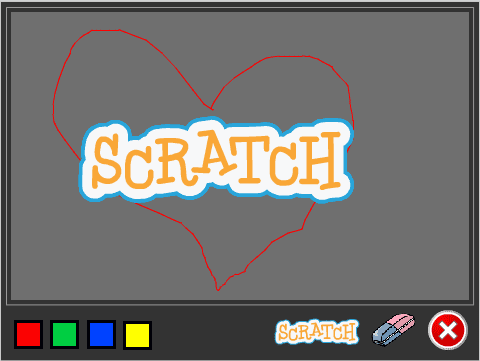

# Om oppgåva {.activity}

I denne oppgåva skal elevane lage eit teikneprogram slik at dei etterpå kan lage
sin eigen kunst.

## Oppgåva passar til: {.check}

__Fag__: Kunst og handverk, matematikk, programmering.

__Anbefalte trinn__: 3.-10. trinn.

__Tema__: Teikning, koordinatsystem, brukarinteraksjon.

__Tidsbruk__: Dobbelttime eller meir.

## Kompetansemål {.challenge}

- [ ] __Kunst og håndtverk, 2. trinn__: eksperimentere med form, farge, rytme og
      kontrast

- [ ] __Kunst og håndtverk, 4. trinn__: gjennomføre kunst- og designprosessar
      ved å søka inspirasjon, utforske moglegheiter, gjere val og lage eigne
      produkt

- [ ] __Kunst og håndtverk, 7. trinn__: bruke programmering til å skapa
      interaktivitet og visuelle uttrykk

- [ ] __Matematikk, 3. trinn__: eksperimentere med og forklare plasseringar i
      koordinatsystemet

- [ ] __Matematikk, 5. trinn__: lage og programmere algoritmar med bruk av  
      variablar, vilkår og løkker

- [ ] __Programmering, 10. trinn__: bruke grunnleggande prinsipp i
      programmering, slik som variablar, løkker, vilkår og funksjonar, og
      reflektere over bruken av desse

## Forslag til læringsmål {.challenge}

- [ ] Elevane kan lage og bruke enkle funksjonar for bildehandsaming.

- [ ] Elevane kan bruke kode til å lese av posisjonen til musepeikaren i eit
  koordinatsystem, og bruke denne informasjonen vidare.

- [ ] Elevane kan bruke eit koordinatsystem til å avgrense arbeidsområdet på
  skjermen.

- [ ] Elevane kan bruke kode til å endre funksjonar og verktøy etter
  brukarinteraksjon.

## Forslag til vurderingskriterium {.challenge}

- [ ] Eleven syner middels måloppnåing ved å fullføre oppgåva.

- [ ] Eleven syner høg måloppnåing ved å vidareutvikle eigen kode basert på
  oppgåva, til dømes ved å gjere ein eller fleire av variasjonane under.

## Føresetnader og utstyr {.challenge}

- [ ] __Føresetnader__: Elevane må ha god kunnskap i Scratch. Dei bør ha gjort
  fleire prosjekt på introduksjons- og nybyrjarnivå før dei startar med denne
  oppgåva.

- [ ] __Utstyr__: Datamaskiner med Scratch installert. Eventuelt kan elevane
  bruke Scratch i nettlesaren viss dei har ein brukar (eller registrerer seg) på
  [scratch.mit.edu/](https://scratch.mit.edu/). Elevane kan gjerne jobbe to og
  to saman. Merk at Teikneprogram brukar ressursar som ikkje er tilgjengelege i
  Scratch-biblioteket, men som blir lasta ned utanom. Det er beskrive i oppgåva.
  Eventuelt finn du ressursane i katalogen `ressurser` på
  [GitHub](https://github.com/kodeklubben/oppgaver/tree/master/src/scratch/)
  eller i ei zip-fil kalla `Materials` eller `Tegneprogram_bildefiler.zip`
  tilgjengeleg saman med desse instruksane. Elevane kan med fordel ha lasta ned
  zip-fila på førehand, elles bør du setje av tid til det i starten av timen.

## Framgangsmåte

Her finn du tips, erfaringar og utfordringar til dei ulike stega i oppgåva.
[Klikk her for å sjå
oppgåveteksten.](../tegneprogram/tegneprogram_nn.html){target=_blank}

# Steg 1: Dra og teikn! {.activity}

Nokre brukarar har hatt problem med å få blyanten til å teikne. Det ser ut til å
skje inne i Scratch-utviklingsmiljøet (altså ikkje når programmet køyrer i
fullskjerm), fordi Scratch merkar at du klikkar på blyanten og trur at du vil
flytte på blyantfiguren. Problemet har to løysingar:

- [ ] Prøv å bruke fullskjermmodus.

- [ ] Flytt senterpunktet rett *utanfor* sjølve blyanten. Då trur ikkje Scratch
  at du vil flytte på blyanten.

## Variasjonar {.challenge}

- [ ] Elevane kan lage ein blyant som endrar farge av seg sjølv.

- [ ] Elevane kan lage tastatursnarvegar for å endre farge utan å måtte klikke.

- [ ] Elevane kan lage eit verktøy som endrar storleiken på blyantstreken.

## Eksterne ressursar {.challenge}

- [ ] Førebels ingen eksterne ressursar...
