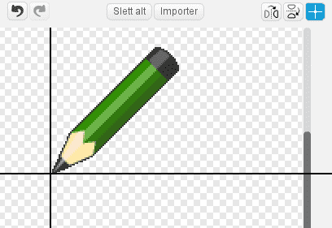

# Introduksjon {.intro}

I dette prosjektet lagar me eit teikneprogram slik at du seinare kan lage din
eigen kunst. Du kan teikne med ulike fargar, bruke viskelær, lage stempel og
mykje meir!


# Førebuingar: Last ned biletefiler {.activity}

Den fyrste delen kan du gjerne få hjelp av ein voksen til å gjere!

## Sjekkliste {.check}

- [ ] Last ned zip-fila
  [tegneprogram_bildefiler.zip](tegneprogram_bildefiler.zip) og legg den på
  skrivebordet på datamaskina di eller ein annan plass du finn att.

- [ ] Pakk ut zip-fila ved å høgreklikke på den og velje `Extract All`, `Pakk
  ut filer` eller noko liknande.


# Steg 1: Dra og teikn! {.activity}

*Me startar med å lage ein blyant som teiknar når du dreg den rundt på scena.*

## Sjekkliste {.check}

- [ ] Start eit nytt Scratch-prosjekt. Slett katten ved å høgreklikke på den og
  velje `slett`.

- [ ] Klikk på `Scene` og så på `Bakgrunnar`-fana. Klikk  for å laste opp bakgrunnen som heiter
  `frame.png` i katalogen du henta under førebuingane.

- [ ] Klikk  ved sidan av `Ny
  figur`-teksten. Vel fila `green-pencil.png` som ligger i den nedlasta
  katalogen. Kall den nye figuren `Blyant`.

- [ ] Bytt til `Drakter`-fana og vel senterpunkt for figuren ved hjelp av
  . Flytt korset slik at det
  markerer blyantspissen. Då vil spissen teikne og ikkje midten av blyanten.

  

- [ ] Få blyanten til å følgje musepeikaren rundt på scena ved å bruke `gjenta
  for alltid`{.blockcontrol}- og `gå til musepeikar`{.blockmotion}-klossane.

  ```blocks
  når @greenFlag vert trykt på
  gjenta for alltid
      gå til [musepeikar v]
  slutt
  ```

No vil me bruke denne blyantfiguren som ein ordentleg blyant. Viss du ser under
`Penn`{.blockpen}-kategorien kan du sjå mange ulike teiknefunksjonar. Dei me er
interesserte i no er `penn ned`{.blockpen} og `penn opp`{.blockpen}.

- [ ] Me vil bruke museknappen til å kontrollere blyanten - når museknappen er
  nede skal blyanten teikne, og når museknappen er oppe teiknar den ikkje. Me
  kan gjere det ved å bruke ein `viss elles`{.blockcontrol}- og ein
  `museknappen er trykt?`{.blocksensing}-kloss. Utvid skriptet som dette:

  ```blocks
  når @greenFlag vert trykt på
  gjenta for alltid
      gå til [musepeikar v]
      viss <museknappen er trykt?>
          penn ned
      elles
          penn opp
      slutt
  slutt
  ```

## Test prosjektet ditt {.flag}

__Klikk på det grøne flagget.__

- [ ] Følgjer blyanten museipeikaren rundt?

- [ ] Kva skjer viss du heldt museknappen nede og flyttar på musa? Ikkje bry deg
  om farga endå.

## Sjekkliste {.check}

- [ ] Etter kvart blir skjermen ganske full av rabbel. Me kan bruke
  `slett`{.blockpen}-klossen til å fjerne det.

  ```blocks
  når @greenFlag vert trykt på
  slett
  gjenta for alltid
      gå til [musepeikar v]
      viss <museknappen er trykt?>
          penn ned
      elles
          penn opp
      slutt
  slutt
  ```

## Test prosjektet ditt {.flag}

__Klikk på det grøne flagget.__

- [ ] Forsvinn teikningane dine når du klikkar på det grøne flagget?


# Steg 2: Rydde opp {.activity}

*I staden for å måtte starte og stoppe prosjektet for å tømme tavla kan me lage
 ein knapp som slettar alt i staden.*

Me kan framleis bruke `slett`{.blockpen}-klossen.

## Sjekkliste {.check}

- [ ] Lag ein ny figur frå ressurskatalogen du lasta ned i starten av
  prosjektet. Vel `cancel-button.png`.

- [ ] Bytt namn på figuren til `Slett`.

- [ ] Flytt figuren til nede i høgre hjørne av scena.

- [ ] Gi slette-figuren dette skriptet:

  ```blocks
  når denne figuren vert trykt på
  slett
  ```

## Test prosjektet ditt {.flag}

__Klikk på det grøne flagget.__

- [ ] Fjernar sletteknappen alle teikningane dine?


# Steg 3: Bytte farge {.activity}

*Til no har me berre kunne laga blå strekar. Me kan bruke andre fargar òg!*

Me legg til nokre figurar på botnen av skjermen. Figurane skal sjå ut som farga
knappar. Når me klikkar på ein knapp endrar me blyantfarga til den farga knappen
har. For å vise at me har bytta farge skal me gjere det slik at blyanten skiftar
farge med strekfarga.

## Sjekkliste {.check}

- [ ] Lag ein ny figur ved å laste opp `red-selector.gif`.

- [ ] Gi figuren namnet `Raud` og flytt den ned i venstre hjørne på skjermen.

- [ ] Gi den eit skript som sender meldinga `Raud`.

  ```blocks
  når denne figuren vert trykt på
  send meldinga [Raud v]
  ```

  Det er alt denne figuren skal gjere. Det vanskelege arbeidet er blyanten sin
  jobb.

- [ ] Klikk på blyanten, og så på `Drakter`{.blocklightgrey}-fana. Importer
  drakta `red-pencil.png`. Set senterpunktet til blyantspissen for denne drakta
  òg.

- [ ] Legg til eit nytt skript. Når blyanten får meldinga `Raud` skal den
  forandre drakt til `red-pencil`. Så skal den sjølvsagt starte å teikne raudt.
  Bygg skriptet slik:

  ```blocks
  når eg får meldinga [Raud v]
  byt drakt til [red-pencil v]
  bruk pennefargen [#FF0000]
  ```

  For å velje farga i `bruk pennefargen`{.blockpen}-klossen kan du fyrst klikke i
  fargeruta på klossen, og så på den raude knappen du laga på scena tidlegare.

## Test prosjektet ditt {.flag}

__Klikk på det grøne flagget.__

- [ ] Start å teikne ein strek.

- [ ] Bytt til raudt, og sjå om farga endrar seg.

- [ ] Kjem streken frå blyantspissen?

## Sjekkliste {.check}

- [ ] Gjenta punkta over for å lage blå, gule og grøne knappar og blyantar.

## Test prosjektet ditt {.flag}

__Klikk på det grøne flagget.__

- [ ] Fungerer alle knappane?

- [ ] Skiftar dei til ei anna farge på blyanten?

- [ ] Teiknar dei med riktig farge?

- [ ] Teiknar alle figurane frå tuppen av blyanten?


# Steg 4: Berre teikne på tavla {.activity}

*Du har kanskje lagt merke til at du kan teikne over heile scena, og det blir jo
 litt rotete. Viss me skal avgrense skriblinga til berre den lysegrå tavla, så
 må me setje grenser for kor blyanten kan gå.*

Du hugsar kanskje at Scratch definerer punkt på scena ved hjelp av `x`- og
`y`-koordinatar. Når du flyttar musepeikaren rundt omkring ser du desse verdiane
under høgre hjørne på scena.

For å finne ut kor grensene går for tavla kan me starte nede i venstre hjørne.
Då står det `x`: *-230* og `y`: *120*. Flyttar me peikaren rett bort til det
høgre hjørnet ser me at `y` er uforandra, men `x` har blitt til *230*. Då veit
me at `x`-koordinatane går frå *-230* til *230*. Me finn `y`-koordinatene ved å
flytte peikaren til toppen av tavla. Då kan me lese at `y`-koordinatane går frå
*-120* til *170*.

Desse verdiane kan me bruke inne i ein `viss`{.blockcontrol}-kloss, og seie at
når musepeikaren er utanfor tavla sine `x`- og `y`-koordinatar, så virkar ikkje
blyanten.

## Sjekkliste {.check}

- [ ] Legg til testane som seier at blyanten berre får følgje musepeikaren viss
  `y` er større enn *-120* og mindre enn *170* og `x` er større enn *-230* og
  mindre enn *230*. For å få plass til alle testane må du fyrst leggje inn ein
  `_ og _`{.blockoperators}-kloss, og så leggje til to nye `_ og
  _`{.blockoperators}-klossar inni den fyrste.

  ```blocks
  når @greenFlag vert trykt på
  slett
  gjenta for alltid
      viss <<<(mus x) > [-230]> og <(mus x) < [230]>> og <<(mus y) > [-120]> og <(mus y) < [170]>>>
          gå til [musepeikar v]
          viss <museknappen er trykt?>
              penn ned
          elles
              penn opp
          slutt
      slutt
  slutt
  ```

- [ ] Sidan me ikkje kan teikne utanfor tavla er det like greitt at blyanten
  berre blir borte når musepeikaren går utanfor tavla. For å gjere det må me
  erstatte `viss`{.blockcontrol}-klossen over med ein `viss -
  elles`{.blockcontrol}-kloss. Reglane blir no: __Viss__ musepeikaren er
  innanfor tavla sine `x`- og `y`-koordinatar følgjer blyanten peikaren,
  __elles__ skal blyanten gøymast.

  ```blocks
  når @greenFlag vert trykt på
  slett
  gjenta for alltid
      viss <<<(mus x) > [-230]> og <(mus x) < [230]>> og <<(mus y) > [-120]> og <(mus y) < [170]>>>
          gå til [musepeikar v]
          vis
          viss <museknappen er trykt?>
              penn ned
          elles
              penn opp
          slutt
      elles
          gøym
          penn opp
      slutt
  slutt
  ```

  Fordi blyanten gøymast når peikaren går utanfor tavla, så må me få den til å
  visast att når peikaren kjem innanfor. Pass på at du legg inn ein
  `vis`{.blocklooks}-kommando innanfor `viss`{.blockcontrol}-klossen.

  Me har lagt på ein `penn opp`{.blockpen}-kloss når blyanten er utanfor tavla
  slik at den ikkje skal teikne ein strek akkurat i det den kjem tilbake inn på
  tavla.

## Test prosjektet ditt {.flag}

__Klikk på det grøne flagget.__

- [ ] Kan du framleis teikne på tavla?

- [ ] Kan du teikne utanfor tavla?

- [ ] Kva skjer med blyanten når musepeikaren går ut og inn av tavla?


# Steg 5: Viskelær {.activity}

*No kan me teikne det me vil. Men kva om me treng eit viskelær?*

Me kan berre få blyanten til å teikne med same farge som tavla! Og gi blyanten
ei viskelærdrakt!

## Sjekkliste {.check}

- [ ] Last opp ein figur frå fil. Vel fila `eraser.png` frå katalogen du lasta
  ned i starten. Kall figuren `Viskelær`.

- [ ] Gjer figuren litt mindre med krympeknappen, ,
  og så dreg du den ned i høgre hjørne, ved sidan av slett-knappen.

- [ ] Gi viskelær-figuren eit skript som sender meldinga `Visk`.

  ```blocks
  når denne figuren vert trykt på
  send meldinga [Visk v]
  ```

- [ ] For å få blyanten til å viske må du leggje til viskelæret som ei drakt på
  denne. Klikk blyantfiguren. Gå til `Drakter`-fana og importer `eraser.png`
  att. Hugs å setje senterpunktet til viskelæret framme på tuppen.

- [ ] Blyanten svarar på `Visk`-meldinga ved å byte pennefarge til grå (bruk
  fargeveljaren for å velje bakgrunnsfarga til tavla).

  ```blocks
  når eg får meldinga [Visk v]
  byt drakt til [eraser v]
  bruk pennefargen [#606060]
  ```

## Test prosjektet ditt {.flag}

__Klikk på det grøne flagget.__

- [ ] Klarar viskelæret å viske?

- [ ] Fungerer det heilt ut til kantane på tavla?

- [ ] Går det greitt å veksle mellom blyant og viskelær?


# Steg 6: Stempel {.activity}

*No skal me lage eit stempel som kan lage små avtrykk på tavla.*

## Sjekkliste {.check}

- [ ] Legg til ein ny figur du vel sjølv og kall den `Stempel`. Me har valt
  Scratch-logoen frå `Ting`-mappa i biblioteket. Krymp figuren og plasser den
  nedst på skjermen ved sidan av dei andre verktøya. Når figuren blir klikka på
  skal den sende meldinga `Stempel`.

  ```blocks
  når denne figuren vert trykt på
  send meldinga [Stempel v]
  ```

- [ ] Legg til ei ny drakt for blyantfiguren. Det skal vere den same drakta du
  akkurat ga stempelet.

- [ ] Vel blyanten og lag ein variabel. Kall variabelen
  `stempelmodus`{.blockdata} og la den gjelde `For denne figuren`. Fjern
  avhukinga framfor variabelen slik at den ikkje synast på scena. Oppgåva til
  denne variabelen er å halde styr på om me skal teikne eller stemple.

- [ ] Legg til eit skript for blyanten som responderer på `Stempel`-meldinga.
  Skriptet skal skifte drakt til den same drakta du valte for stempelet. Så skal
  det setje verdien til `stempelmodus`{.blockdata} lik `på`.

  ```blocks
  når eg får meldinga [Stempel v]
  byt drakt til [scratchlogo v]
  set [stempelmodus v] til [på]
  ```

- [ ] Endre dei andre skripta knytta til fargeveljarane og viskelæret slik at
  dei set `stempelmodus`{.blockdata} lik `av`. Til dømes blir viskelærskriptet
  slik:

  ```blocks
  når eg får meldinga [Visk v]
  byt drakt til [eraser v]
  bruk pennefargen [#606060]
  set [stempelmodus v] til [av]
  ```

- [ ] Til slutt må me sjekke variabelen inne i `viss`{.blockcontrol}`museknappen
  er trykt?`{.blocksensing} for å vite om me skal teikne eller stemple. Viss
  `stempelmodus`{.blockdata} er sett til `på` skal me stemple, viss ikkje skal
  me bruke den eksisterande `penn ned`{.blockpen}-klossen.

  ```blocks
  når @greenFlag vert trykt på
  slett
  gjenta for alltid
      viss <<<(mus x) > [-230]> og <(mus x) < [230]>> og <<(mus y) > [-120]> og <(mus y) < [170]>>>
          gå til [musepeikar v]
          vis
          viss <museknappen er trykt?>
              viss <(stempelmodus) = [på]>
                  lag avtrykk
              elles
                  penn ned
              slutt
          elles
              penn opp
          slutt
      elles
          gøym
          penn opp
      slutt
  slutt
  ```

## Test prosjektet ditt {.flag}

__Klikk på det grøne flagget.__

- [ ] Klarar du å lag avtrykk?

- [ ] Kva skjer når du skiftar tilbake til ein av blyantane?

## Lagre prosjektet {.save}

__Veldig bra jobba! No er du ferdig med programmet.__

Du kan prøve på desse utfordringane!

## Utfordring 1: Regnbogeblyant {.challenge}

I denne utfordringa skal du leggje til ein blyant som forandrar farge medan du
teiknar. Kult, ikkje sant?

Fyrst må du leggje til regnboge-knappen og regnboge-drakta:

- [ ] Legg til regnboge-knappen som figur. Du finn den i katalogen du lasta ned
  i starten. Den heiter `rainbow-selector.gif`. Kall den `Regnboge` og set den
  ved sidan av dei andre knappane nede til venstre. Figuren skal sende meldinga
  `Regnboge` når du klikkar på den.

- [ ] Legg til regnboge-blyanten frå fila `rainbow-pencil.png` som ei ny drakt
  til blyanten. Hugs å justere senterpunktet.

- [ ] No må du lage eit skript som får pennefarga til å skifte mange gonger i
  sekundet. Me fann ut at å endre farga med 5 kvart 0,05 sekund fungerer fint,
  men du bør prøve eigne verdiar òg.

__Hint:__ Du har sikkert fått ting til å forandre seg med jamne mellomrom i
tidlegare prosjekt, til dømes tid eller poeng. I dette tilfellet gjer du nesten
det same, men denne gongen er det pennefarga som skal endre seg.

Klossen som endrar pennefarga må leggjast inn i ei løkke. Men du må òg ha noko å
kontrollere løkka med, slik at den berre endrar farge når regnbogeblyanten er
valt.

__Hint:__ Du kan gjere det på ein måte som liknar på korleis
`stempelmodus`{.blockdata} styrer når stempelet er av og på. Prøv å lage ein
variabel som du kallar `regnbogemodus`{.blockdata}. La denne bli skrudd på når
du klikkar på regnbogeblyanten, og av når du vel ein av dei andre fargane.

## Test prosjektet ditt {.flag}

__Klikk på det grøne flagget.__

- [ ] Virkar regnbogeblyanten?

- [ ] Kva skjer når du skiftar tilbake til ein av dei andre blyantane?

## Utfordring 2: Snarvegar {.challenge}

No skal du prøve deg på å lage snarvegar på tastaturet. Det tyder at i staden
for å klikke på knappane på skjermen, så kan du bruke tastane for å byte farge,
stemple og viske ut.

Du kan bruke `viss`{.blockcontrol}`tasten _ er trykt?`{.blocksensing} for å
bruke tastaturet. For kvar tast du legg til treng du ein ny
`viss`{.blockcontrol}`tasten _ er trykt?`{.blocksensing}-kloss som sender dei
same meldingane som verktøy-vala gjer når dei blir klikka på. Legg til skripta
på scena.

Me har brukt desse snarvegane:

Raud blyant - `r`, Grøn blyant - `g`, Blå blyant - `b`, Gul blyant - `y`,
Regnbogeblyant - `w`, Stempel - `s`, Viskelær - `v`, Slett alt - `a`

## Test prosjektet ditt {.flag}

__Klikk på det grøne flagget.__

- [ ] Virkar alle snarvegane?

- [ ] Virkar knappane på skjermen framleis?

## Utfordring 3: Større og mindre {.challenge}

Ein annan vanleg funksjon i teikneprogram er å kunne forandre på storleiken til
blyantstreken. Prøv om du får det til.

Det er ein ting som gjer dette vanskeleg. Nokre gonger må me endre storleiken på
blyantstreken, og nokre gonger må me forandre storleiken på drakta. Det er
avhengig av om du brukar blyanten eller stempelet.

- [ ] Lag to nye figurar ved å importere `bigger-selector.gif` og
  `smaller-selctor.gif` frå katalogen med ressursar. Kall figurane `Større` og
  `Mindre`.

- [ ] La figurane sende ut meldingane `Større` og `Mindre`.

- [ ] Blyanten kan svare på meldinga ved å anten `endra pennebreidd`{.blockpen}
  med 1 eller `endra storleik`{.blocklooks} med 10, avhengig av verdien på
  `stempelmodus`.

  __Hint:__ Du kan bruke nokre av `endra`-klossane under `Penn`{.blockpen} eller
  `Utsjånad`{.blocklooks}. For å forminske set du eit minusteikn framfor talet.

  __Hint:__ For å halde styr på om det er blyantstreken eller stempelet som skal
  endrast må du bruke ein `viss - elles`{.blockcontrol}-kloss.

- [ ] Ikkje gløym å lage snarvegar for desse funksjonane òg. Til dømes `pil opp`
  for større og `pil ned` for mindre.

- [ ] Har du lagt merke til at blyantfiguren òg blir større når du forstørrar
  stempelet? For å unngå det kan me setje storleiken til `100 %` kvar gong me
  klikkar på ei farge.

- [ ] For å gjere det endå meir avansert kan du få stempelet til å hugse
  storleiken sin frå gong til gong. Den enklaste måten å gjere det på er å
  opprette ein ny variabel du kallar `stempelstorleik`{.blockdata}. Denne må
  oppdaterast kvar gong storleiken på stempelet blir endra. Når ein skiftar frå
  blyant til stempel blir storleiken sett frå denne variabelen.

## Test prosjektet ditt {.flag}

__Klikk på det grøne flagget.__

- [ ] Fungerer forstørringsknappen?

- [ ] Fungerer forminskingsknappen?

- [ ] Kva skjer viss du byttar til stempelet, endrar storleiken og så forandrar
  tilbake til blyanten?

## Lagre prosjektet {.save}

__Veldig, veldig bra! No kan du teikne akkurat det du vil!__

Ikkje gløym å dele spelet ditt med venene og familien din ved å trykkje på `Legg
ut` i menyen!
