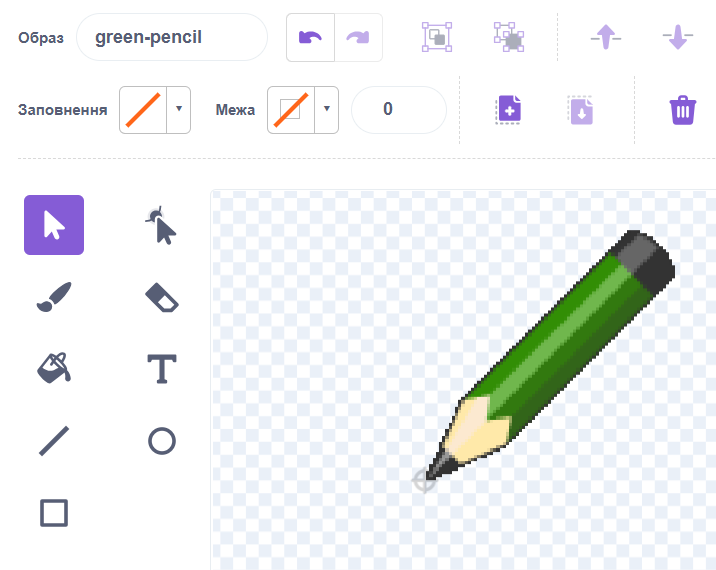

# Вступ {.intro}

У цьому проекті ми створюємо програму для малювання, щоб потім ви могли створювати власні роботи. Ви можете малювати різними кольорами, використовувати гумки, робити штампи та багато іншого!


# Підготовка: завантажте файли зображень {.activity}

З цією першою частиною тобі може допомогти дорослий!

## Контрольний список {.check}

- [ ] Завантажте zip-файл cartoon_image_files.zip і помістіть його на робочий стіл комп'ютера або в інше місце, яке ви зможете знайти знову.

- [ ] Розпакуйте zip-файл, клацнувши на ньому правою кнопкою миші і вибравши «Витягти все», «Витягти файли» або щось подібне.

# Крок 1: Перетягніть і намалюйте! {.activity}

*Ми починаємо з того, що робимо олівець, який малює, коли ви перетягуєте його по сцені.*

## Контрольний список {.check}

- [ ] Створіть новий проєкт у Скретч. Видаліть кота.

- [ ] Клацніть на `Сцена` і перейдіть на вкладку `Тло`. Натисніть кнопку `Вивантажити тло`, щоб завантажити тло з назвою 
  `frame.png` з каталогу, який ви завантажили під час підготовки.

- [ ] Натисніть кнопку `Вивантажити спрайт` в `Обрати спрайт`. Виберіть файл `green-pencil.png` , розташований у завантаженому каталозі. Назвіть нову фігуру `Олівець`.
  
- [ ] Перейдіть на вкладку `Образи` і виберіть центральну точку. Перемістіть хрестик так, щоб він позначив кінчик олівця. Тоді малюватиметься кінчик, а не центр олівця.

  

- [ ] Змусьте олівець слідувати за вказівником миші по сцені, використовуючи цикл `завжди`{.blockcontrol}, і  до блоку `перейти до вказівник`{.blockmotion}.

  ```blocks
  коли grønt flagg натиснуто
  завжди
      перейти до [вказівник v]
  slutt
  ```

Тепер ми хочемо використати цю фігуру олівця як справжній олівець. Якщо ви подивитеся на категорію 
`Олівець`{.blockpen}, то побачите багато різних функцій для малювання. Нас зараз цікавлять такі, як `опустити олівець`{.blockpen} та `підняти олівець`{.blockpen}.

- [ ] Ми хочемо використовувати кнопку миші для керування олівцем - коли кнопка миші натиснута, олівець малює, а коли кнопка миші піднята, він не малює. Ми можемо зробити це за допомогою блоку `якщо інакше`{.blockcontrol} та блока `мишку натиснуто?`{.blocksensing}. Розширте скрипт наступним чином.

  ```blocks
  коли grønt flagg натиснуто
  завжди
      перейти до [вказівник v]
      якщо <мишку натиснуто?> то
          опустити олівець
      інакше
          підняти олівець
      slutt
  slutt
  ```

## Перевірте свій проєкт {.flag}

__Натисніть на зелений прапорець.__

- [ ] Чи слідує олівець за мишею?

- [ ] Що станеться, якщо утримувати кнопку миші та рухати мишею? Поки що не хвилюйся про колір.

## Контрольний список {.check}

- [ ] Зрештою, екран стане досить захаращеним. Ми можемо скористатися блоком
  `очистити все`{.blockpen}, щоб вилучити його.

  ```blocks
  коли grønt flagg натиснуто
  очистити все
  завжди
      перейти до [вказівник v]
      якщо <мишку натиснуто?> то
          опустити олівець
      інакше
          підняти олівець
      slutt
  slutt
  ```

## Перевірте свій проект {.flag}

__Натисніть на зелений прапорець.__

- [ ] Чи зникають ваші малюнки, коли ви натискаєте на зелений прапорець?


# Крок 2: Прибираємо {.activity}

*Замість того, щоб запускати і зупиняти проєкт, щоб стерти дошку, ми можемо створити кнопку, яка стирає все.*

Ми все ще можемо використовувати блок `очистити все`{.blockpen}.

## Контрольний список {.check}

- [ ] Створіть новий спрайт з каталогу ресурсів, який ви завантажили на початку проєкту. Виберіть файл `cancel-button.png`.

- [ ] Змініть ім'я персонажа на `Видалити`.

- [ ] Перемістіть персонажа у правий нижній кут сцени.

- [ ] Дайте видаленому персонажу цей сценарій:

  ```blocks
  коли спрайт натиснуто
  очистити все
  ```

## Перевірте свій проєкт {.flag}

__Натисніть на зелений прапорець.__

- [ ] Кнопка видалення видаляє всі ваші малюнки?


# Крок 3: Змініть колір {.activity}

*Досі ми могли малювати лише сині лінії. Ми можемо використовувати й інші кольори!*

Додамо кілька фігур у нижній частині екрана. Фігури виглядатимуть як кольорові кнопки. Коли ми натискаємо на кнопку, колір олівця змінюється на колір кнопки. Щоб показати, що ми змінили колір, ми зробимо так, щоб олівець також змінив колір.

## Контрольний список {.check}

- [ ] Створіть нову форму, завантаживши `red-selector.gif`.

- [ ] Назвіть фігуру `Червоний` і перемістіть її вниз до лівого кута екрана.
  
- [ ] Дайте йому скрипт, який надсилає повідомлення `Червоний`.

  ```blocks
  коли спрайт натиснуто
  оповістити [Червоний v]
  ```

  Це все, що робить ця фігура. Важку роботу виконує олівець.

- [ ] Натисніть на олівець і перейдіть на вкладку `Образи`{.blocklightgrey}.
  Імпортуйте файл `red-pencil.png`. Встановіть центральну точку кінчика олівця для цього костюма.

- [ ] Додати новий скрипт. Коли олівець отримує повідомлення `Червоний`, він повинен змінити свій образ на `червоний олівець`. І тоді, звичайно, воно також почне малювати червоним. Як створити скрипт:

  ```blocks
  коли я отримую [червоний v]
  змінити образ на [red-pencil v]
  надати олівцю колір [#FF0000]
  ```

  Щоб вибрати колір у блоці `надати олівцю колір`{.blockpen}, ви можете спочатку натиснути на поле кольору на блоці, а потім на червону кнопку, яку ви зробили на сцені раніше.

## Перевірте свій проєкт {.flag}

__Натисніть на зелений прапорець.__

- [ ] Почніть малювати лінію.

- [ ] Переключіться на червоний і подивіться, чи змінився колір.

- [ ] Чи лінія тепер також виходить від кінчика олівця?

## Контрольний список {.check}

- [ ] Повторіть наведені вище кроки, щоб зробити сині, жовті та зелені кнопки і олівці.

## Перевірте свій проєкт {.flag}

__Натисніть на зелений прапорець.__

- [ ] Чи всі кнопки працюють?

- [ ] Чи змінюють вони колір олівця на інший?

- [ ] Чи малюють вони правильним кольором?

- [ ] Чи всі фігури малюються з кінчика олівця?


# Крок 4: Просто малюйте на дошці {.activity}

*Ви, напевно, помічали, що ви можете малювати по всій сцені, і це стає трохи безладним. Якщо ми збираємося обмежити наші каракулі лише світло-сірою дошкою, нам потрібно встановити межі, куди може потрапити олівець.*

Ви, мабуть, пам'ятаєте, що Скретч визначає точки на сцені за допомогою координат `x` та
`y` Переміщуючи вказівник миші, ви побачите ці значення під правим кутом сцени.

Щоб дізнатися, де знаходяться межі дошки, ми можемо почати з лівого нижнього кута. Тут написано `x`: *-230* та `y`: *120*. Якщо ми перемістимо вказівник у правий кут, то побачимо, що `y` не змінилося, а `x` стало *230*. Отже, ми знаємо, що координати `x` змінюються від *-230* до *230*. Ми знаходимо координати `y` перемістивши вказівник у верхню частину дошки. Ми бачимо, що координати `y` змінюються від -120 до 170.

Ми можемо використовувати ці значення всередині блоку `якщо`{.blockcontrol}, і сказати, що коли вказівник миші знаходиться за межами координат `x` і `y` дошки, олівець не буде працювати.

## Контрольний список {.check}

- [ ] Додайте тести, які стверджують, що олівець може слідувати за вказівником миші, тільки якщо `y`
  більше -120 і менше 170, а `x` більше -230 і менше 230. Щоб вписати всі тести, потрібно спочатку додати блок `_ і
  _`{.blockoperators}, а потім додати два нових блоки `_ і
  _`{.blockoperators} всередині нього.

  ```blocks
  коли grønt flagg натиснуто
  очистити все
  завжди
      якщо <<<(мишка x) > [-230]> і <(мишка x) < [230]>> і <<(мишка y) > [-120]> і <(мишка y) < [170]>>> то
          перейти до [вказівник v]
          якщо <мишку натиснуто?> то
              опустити олівець
          інакше
              підняти олівець
          slutt
      slutt
  slutt
  ```

- [ ] Оскільки ми не можемо малювати за межами дошки, добре, що олівець зникає лише тоді, коли вказівник миші виходить за межі дошки. Для цього нам потрібно замінити блок
  `якщо`{.blockcontrol} вище на блок `якщо -
  інакше`{.blockcontrol}. Тепер правила такі: __якщо__ вказівник миші знаходиться в межах координат `x` та `y`дошки, олівець слідує за вказівником, __інакше__ олівець ховається.


  ```blocks
  коли grønt flagg натиснуто
  очистити все
  завжди
      якщо <<<(мишка x) > [-230]> і <(мишка x) < [230]>> і <<(мишка y) > [-120]> і <(мишка y) < [170]>>>
          перейти до [вказівник v]
          показати
          якщо <мишку натиснуто?> то
              опустити олівець
          інакше
              підняти олівець
          slutt
      інакше
          сховати
          підняти олівець
      slutt
  slutt
  ```

  Оскільки олівець буде прихований, коли вказівник вийде за межі дошки, нам потрібно зробити так, щоб він знову з'явився, коли він повернеться всередину. Тому переконайтеся, що ви помістили команду
  `показати`{.blocklooks} всередину блоку `якщо`{.blockcontrol}.

  Ми також додали функцію `підняти олівець`{.blockpen}, коли олівець відривається від дошки, щоб він не малював лінію, коли повертається на дошку.


## Перевірте свій проєкт {.flag}

__Перевірте свій проєкт__

- [ ] Натисніть на зелений прапорець.

- [ ] Ти все ще можеш малювати на дошці?

- [ ] Що відбувається з олівцем, коли вказівник миші входить і виходить з дошки?


# Крок 5: Гумка {.activity}

*Тепер ми можемо малювати все, що завгодно. Але що, якщо нам знадобиться гумка?*

Хм... ми могли б просто змусити олівець малювати тим же кольором, що і дошка! А потім ми дамо олівцю образ гумки!

## Контрольний список {.check}

- [ ] Завантажте малюнок з файлу. Виберіть файл `eraser.png` з каталогу, який ви завантажили на початку. Назвіть персонажа  `Гумка`.

- [ ] Зробіть фігуру трохи меншою, стисніть її, а потім перетягніть до правого кута, поруч з кнопкою видалення.

- [ ] Створіть скрипт, який надсилатиме повідомлення `Стерти`.

  ```blocks
  коли спрайт натиснуто
  оповістити [Стерти v]
  ```

- [ ] Щоб олівець стирався, вам потрібно додати гумку як образ і на спрайт. Клацніть спрайт олівця. Перейдіть на вкладку `Образи` і знову імпортуйте `eraser.png` Не забудьте встановити центральну точку гумки спереду. 

- [ ] Олівець реагує на повідомлення `Стерти`, змінюючи колір пера на сірий (скористайтеся палітрою кольорів, щоб вибрати колір фону дошки). 

  ```blocks
  коли я отримую [Стерти v]
  змінити образ на [eraser v]
  надайти олівцю колір [#606060]
  ```

## Перевірте свій проєкт {.flag}

__Натисніть на зелений прапорець.__

- [ ] Чи може гумка стирати?

- [ ] Чи працює вона до самого краю дошки?

- [ ] Чи легко перемикатися між олівцем і гумкою?


# Крок 6: Штамп {.activity}

*Тепер ми зробимо штамп, яким можна робити невеликі відбитки на дошці.*

## Контрольний список {.check}

- [ ] Додайте нову фігуру з необов'язковим зовнішнім виглядом і назвіть її `Штамп`. Ми вибрали логотип Scratch  у бібліотеці. Зменшіть розмір фігури і розмістіть її внизу екрана поруч з іншими інструментами. Коли ви натиснете на фігуру, вона має надіслати повідомлення `Штамп`.

  ```blocks
  коли спрайт натиснуто
  оповістити [Штамп v]
  ```

- [ ] Додайте новий образ для фігурки олівця. Це має бути той самий костюм, який ви щойно надали штампу.

- [ ] Виберіть олівець і створіть змінну. Переведіть змінну в
  `режим штамп`{.blockdata} та застосуйте її `Тільки для цього спрайту`. Зніміть позначку навпроти змінної, щоб вона не відображалася на робочій області. Завдання цієї змінної — відстежувати, чи нам слід малювати, чи штампувати.


- [ ] Додайте сценарій для олівця, який реагує на повідомлення `Штамп`.
  Скрипт повинен змінювати образ на той самий, який ви вибрали для штампа. Після цього він має встановити значення 
  `режиму штампа`{.blockdata} на `увімкнено`.

  ```blocks
  коли я отримую [Штамп v]
  змінити образ на [scratch logo v]
  надати [режим штамп v] значення [увімкнено]
  ```

- [ ] Змініть інші скрипти, пов’язані з палітрами кольорів та гумкою, щоб вимкнути `режим штампа`{.blockdata} Наприклад, скрипт гумки стає таким:

  ```blocks
  коли я отримую [Стерти v]
  змінити образ на [eraser v]
  надати олівцю колір [#606060]
  надати [режим штамп v] значення [вимкнено]
  ```

- [ ] Нарешті, нам потрібно перевірити змінну всередині `якщо`{.blockcontrol}`мишку натиснуто?`{.blocksensing} щоб побачити, чи нам слід малювати, чи штампувати. Якщо
  `режим штампа`{.blockdata} ввімкнено, ми будемо штампувати, якщо ні, то використовуватимемо блок.
 `опустити олівець`{.blockpen}.

  ```blocks
  коли grønt flagg натиснуто
  сховати
  очистити все
  завжди
      hvis <<<(мишка x) > [-230]> і <(мишка x) < [230]>> і <<(мишка y) > [-120]> і <(мишка y) < [170]>>> то
          перейти до [вказівник v]
          показати
          якщо <мишку натиснуто?> то
              якщо <(режим штамп) = [увімкнено]> то
                  штамп
              інакше
                  опустити олівець
              slutt
          інакше
              підняти олівець
          slutt
      інакше
          сховати
          підняти олівець
      slutt
  slutt
  ```

## Перевірте свій проєкт {.flag}

__Натисніть на зелений прапор.__

- [ ] Чи вмієте ви робити відбитки штампів?

- [ ] Що станеться, якщо ви знову перейдете до одного з олівців?

## Зберегти проєкт {.save}

__Чудова робота! Ви закінчили програму.__

Ви також можете спробувати ці виклики!

## Utfordring 1: Regnbueblyant {.challenge}

I denne utfordringen skal du legge til en blyant som kan forandrer farge mens du
tegner. Kult, ikke sant?

Først må du legge til regnbue-knappen og regnbue-drakten:

- [ ] Legg til regnbue-knappen som figur. Du finner den i katalogen du lastet
  ned i starten. Den heter `rainbow-selector.gif`. Kall den `Regnbue` og sett
  den ved siden av de andre knappene nederst til venstre. Figuren skal sende
  meldingen `Regnbue` når den klikkes.

- [ ] Legg til regnbue-blyanten fra filen `rainbow-pencil.png` som en ny drakt
  til blyanten. Husk å justere senterpunktet.

- [ ] Nå må du lage et skript som får pennfargen til å skifte mange ganger i
  sekundet. Vi fant ut at å endre fargen med 5 hvert 0.05 sekunder fungerer
  fint, men du bør prøve ut egne verdier også.

__Hint:__ Du har sikkert fått ting til å forandre seg med jevne mellomrom i
tidligere prosjekter, for eksempel tid eller poeng. I dette tilfellet kan du
gjøre nesten det samme, men passe på at det er pennfarge som endrer seg.

Klossen som endrer pennfargen må legges inn i en løkke. Men du trenger også noe
å kontrollere løkken med, slik at den bare endrer farge når regnbueblyanten er
valgt.

__Hint:__ Du kan gjøre dette på en måte som ligner på hvordan
`stempelmodus`{.blockdata} styrer når stempelet skal skrues av og på. Prøv å
lage en variabel som du kaller `regnbuemodus`{.blockdata}. La denne skrues på
når regnbueblyanten klikkes, og av når de andre fargene velges.

## Test prosjektet ditt {.flag}

__Klikk på det grønne flagget.__

- [ ] Virker regnbueblyanten?

- [ ] Hva skjer når du skifter tilbake til en av de andre blyantene?

## Utfordring 2: Snarveier {.challenge}

Nå skal du prøve deg på å lage snarveier på tastaturet. Det betyr at man i
stedet for å klikke på knappene på skjermen kan bruke tastene for å bytte farge,
stemple og viske ut.

Du kan bruke `hvis`{.blockcontrol}`tast _ trykket?`{.blocksensing} for å benytte
tastaturet. For hver tast du legger til trenger du en ny
`hvis`{.blockcontrol}`tast _ trykket?`{.blocksensing}-kloss som sender de samme
meldingene som verktøy-valgene gjør når de klikkes. Legg til skriptene på
scenen.

Vi har brukt disse snarveiene:

Rød blyant - `r`, Grønn blyant - `g`, Blå blyant - `b`, Gul blyant - `y`,
Regnbue blyant - `w`, Stempel - `s`, Visk - `v`, Slett alt - `a`

## Test prosjektet ditt {.flag}

__Klikk på det grønne flagget.__

- [ ] Virker alle snarveiene?

- [ ] Virker knappene på skjermen fremdeles også?

## Utfordring 3: Større og mindre {.challenge}

En annen funksjon som tegneprogrammer gjerne har er å forandre størrelsen på
blyantstreken. Prøv å se om du får til dette.

Det er en ting som gjør dette vanskelig. Noen ganger trenger vi å endre
størrelsen på blyantstreken og noen ganger trenger vi å forandre størrelsen på
drakten. Det er avhengig av om du bruker blyanten eller stemplet.

- [ ] Lag to nye figurer ved å importere `bigger-selector.gif` og
  `smaller-selctor.gif` fra katalogen med ressurser. Kall figurene `Større` og
  `Mindre`.

- [ ] La figurene sende ut meldingene `Større` og `Mindre`.

- [ ] Blyanten kan svare på meldingen ved å enten `endre pennebredde`{.blockpen}
  med 1 eller `endre størrelse`{.blocklooks} med 10, avhengig av verdien på
  `stempelmodus`.

  __Hint:__ Du kan bruke noen av `endre`-klossene under `Penn`{.blockpen} eller
  `Utseende`{.blocklooks}. For å forminske setter du bare et minustegn foran
  tallet.

  __Hint:__ For å holde styr på om det er blyantstreken eller stempelet som skal
  endres må du bruke en `hvis - ellers`{.blockcontrol}-kloss.

- [ ] Glem ikke å lage snarveier for disse funksjonene også. For eksempel `pil
  opp` for større og `pil ned` for mindre.

- [ ] Har du lagt merke til at også blyantfiguren blir større når du forstørrer
  stempelet? For å unngå dette kan vi sette størrelsen til 100% hver gang en ny
  farge klikkes.

- [ ] For å gjøre det enda mer avansert kan du få stempelet til å huske
  størrelsen sin fra gang til gang. Den enkleste måten å gjøre dette på er å
  opprette en ny variabel som du kaller `stempelstørrelse`{.blockdata}. Denne må
  oppdateres hver gang størrelsen på stempelet endres. Når man skifter fra
  blyant til stempel settes så størrelsen fra denne variabelen.

## Test prosjektet ditt {.flag}

__Klikk på det grønne flagget.__

- [ ] Fungerer forstørrelsesknappen?

- [ ] Fungerer forminskingsknappen?

- [ ] Hva skjer om du bytter til stempelet, endrer størrelsen og så forandrer
  tilbake til blyanten?

## Lagre prosjektet {.save}

__Veldig, veldig bra! Nå kan du tegne akkurat det du vil!__

Ikke glem å del spillet ditt med venner og familie ved å trykke på `Legg ut` i
menyen!

