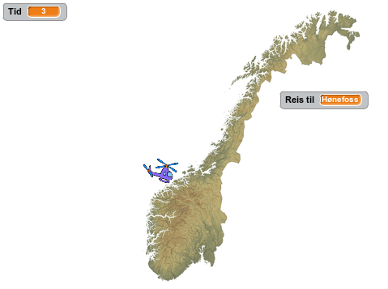
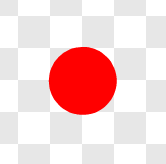
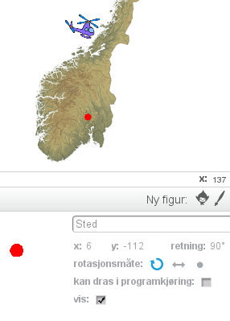

# Introduksjon {.intro}

Bli med på en rundreise i Norge! Vi skal lage et spill hvor du styrer
et helikopter rundt omkring et kart over Norge, mens du prøver å
raskest mulig finne steder og byer du blir bedt om å besøke.



# Steg 1: Et norgeskart {.activity}

*Vi legger først inn et norgeskart som en bakgrunn. Dette vil vi
 senere bruke helikopteret til å besøke.*

## Sjekkliste {.check}

+ Vi må først laste ned filen som inneholder kartet fra nettet. Hvis
  du allerede har fått denne filen på datamaskinen din kan du hoppe
  over det neste punktet.

+ Høyreklikk på lenken [norgeskart.png](norgeskart.png) og velg at den
  skal åpnes i en ny fane.  Klikk på den nye fanen som blir
  åpnet. Dette vil vise et bilde av et norgeskart. Høyreklikk på
  bildet, og velg `Lagre bildet som` eller noe som ligner. Lagre
  bildet et sted du finner det igjen, for eksempel på Skrivebordet.

+ Start et nytt Scratch-prosjekt. Slett kattefiguren, for eksempel ved
  å høyreklikke på den og velge `slett`.

+ Legg inn norgeskartet som bakgrunn ved å velge
   under
  `Ny bakgrunn` helt til venstre på skjermen. Velg filen
  `norgeskart.png` du lastet ned tidligere.

### Norgeskart {.protip}

Det finnes mengder av kart på internett. Det kartet vi bruker i denne
oppgaven er laget av Kartverket og delt slik at alle kan bruke det til
hva de ønsker. Bakerst i denne oppgaven beskrives hvordan du kan bruke
andre kart.

# Steg 2: Styr helikopteret {.activity}

*Vi skal nå lage et helikopter som vi kan styre rundt over kartet. Vi
 begynner med å programmere et skript som lar oss kontrollere
 helikopteret med piltastene.*

## Sjekkliste {.check}

+ Legg til en ny figur ved å klikke
  
  under `Figurer`. Vi har brukt `Transport/Helicopter`, men du kan
  eventuelt bruke en annen figur du vil reise rundt med.

+ Klikk `i`{.blockmotion} og skift navn på figuren til
  `Helikopter`. Sett også rotasjonsmåten til
   for å unngå at
  helikopteret flyr opp-ned.

+ Vi begynner med å gjøre helikopteret mindre, samt sikre oss at det
  alltid starter på samme sted. Lag dette skriptet:

  ```blocks
  når grønt flagg klikkes
  sett størrelse til (25) %
  gå til x: (0) y: (0)
  ```

+ Vi skal nå programmere at helikopteret kontrolleres med
  piltastene. Vi gjør dette ved å starte en løkke som vi gjentar for
  alltid. Inne i denne evige løkken tester vi om piltastene er trykket
  og i så fall flytter vi helikopteret. Først lager vi koden som
  flytter helikopteret oppover:

  ```blocks
  når grønt flagg klikkes
  sett størrelse til (25) %
  gå til x: (0) y: (0)
  for alltid
      hvis <tast [pil opp v] trykket?>
          pek i retning (0 v)
          gå (2) steg
      slutt
  slutt
  ```

## Test prosjektet {.flag}

__Klikk på det grønne flagget.__

+ Starter en liten utgave av helikopteret omtrent midt på skjermen
  (litt nordvest for Trondheim)?

+ Flytter helikopteret seg oppover når du trykker pil opp-tasten?

+ Skjer det noe når du trykker de andre piltastene?

## Sjekkliste {.check}

Vi skal nå programmere de andre piltastene også.

+ Koden for å flytte helikopteret med de andre piltastene er veldig
  lik koden som flytter helikopteret oppover. Vi kan derfor kopiere
  denne! Høyreklikk på klossen `hvis `{.blockcontrol}`tast pil opp
  trykket?`{.blocksensing}, og velg `lag en kopi`. Slipp disse
  klossene inn i `for alltid`{.blockcontrol}-løkken. Gjenta til du har
  fire `hvis`{.blockcontrol}-klosser. Endre på skriptet ditt slik at
  det ser ut som følger:

  ```blocks
  når grønt flagg klikkes
  sett størrelse til (25) %
  gå til x: (0) y: (0)
  for alltid
      hvis <tast [pil opp v] trykket?>
          pek i retning (0 v)
          gå (2) steg
      slutt
      hvis <tast [pil høyre v] trykket?>
          pek i retning (90 v)
          gå (2) steg
      slutt
      hvis <tast [pil ned v] trykket?>
          pek i retning (180 v)
          gå (2) steg
      slutt
      hvis <tast [pil venstre v] trykket?>
          pek i retning (-90 v)
          gå (2) steg
      slutt
  slutt
  ```

## Test prosjektet {.flag}

__Klikk på det grønne flagget.__

+ Kan du bruke alle fire piltastene til å flytte helikopteret?

+ Hva er det som bestemmer hvor fort helikopteret beveger seg? Prøv å
  forandre på skriptet ditt slik at helikopteret flyr raskere eller
  saktere.

## Utfordring: Hastighetsvariabel {.challenge}

Hvis du ser i skriptet så har vi gjentatt tallet `2` hele fire
ganger. Dette gjør det vanskeligere for oss om vil endre hvor fort
helikopteret beveger seg.

Hvis du vil kan du prøve å lage en ny variabel som heter
`hastighet`{.blockdata}. Deretter kan du sette denne variabelen lik
2 etter at det grønne flagget klikkes. Til slutt kan du bytte ut `gå 2
steg`{.blockmotion}-klossene med `gå
`{.blockmotion}`hastighet`{.blockdata}` steg`{.blockmotion}-klosser.

# Steg 3: Legg til et reisemål {.activity}

*Nå som helikopteret kan fly rundt omkring i Norge kan vi gi spilleren
 et mål med reisen.*

## Sjekkliste {.check}

+ Vi skal nå tegne vår egen figur som vi vil bruke til å markere et
  sted på kartet. Klikk 
  under `Figurer`.

+ Vi trenger bare en ganske liten sirkel. Velg en passende farge, for
  eksempel vil rød synes ganske godt på kartet. Velg deretter
  sirkelverktøyet, og marker den fyllte sirkelen (ellipsen) til
  venstre under tegnevinduet.

+ Før vi begynner å tegne kan du forstørre tegningen din ved å trykke
  på forstørrelsesglasset nederst til høyre. For eksempel vil 800%
  forstørrelse passe bra. Hold inne `skift`-knappen mens du drar ut en
  sirkel som er omtrent fire ruter stor. `skift`-knappen hjelper deg
  til å lage en helt rund sirkel.

  

+ Klikk på `i`{.blockmotion} og gi denne nye figuren navnet `Sted`.

+ Dra denne nye sted-figuren til et sted på kartet du vil at skal være
  første reisemål. Vi har brukt `Hønefoss` som første reisemål, men du
  kan velge et annet sted om du vil.

+ Vi trenger nå posisjonen til reisemålet vårt. Denne finner vi ved se
  på figurinformasjonen etter tallene som står bak `x` og `y`. Disse
  tallene kalles koordinater. I eksempelet under er koordinatene `x:
  6` og `y: -112`. Disse forteller hvor på kartet vi har lagt
  reisemålet.

  

+ Klikk på `Skript`{.blocklightgrey}-fanen. Vi skal nå lage koden som
  legger `Sted`-figuren på riktig sted, og senere oppdager om
  helikopteret reiser dit.

  ```blocks
  når grønt flagg klikkes
  send melding [Sted: Hønefoss v]

  når jeg mottar [Sted: Hønefoss v]
  gå til x: (6) y: (-112)
  vent til <berører [Helikopter v]?>
  si [Fant Hønefoss!] i (2) sekunder
  ```

  Legg merke til at i `gå til`{.blockmotion}-klossen bruker vi samme
  koordinater som de vi fant ovenfor. Det betyr at om du bruker ditt
  eget reisemål må du bytte disse tallene med de du fant.

## Test prosjektet {.flag}

__Klikk på det grønne flagget.__

+ Er `Sted`-figuren der den skal være på kartet?

+ Sier den `Fant Hønefoss!` (eller ditt reisemål) når helikopteret
  flyr til reisemålet?

# Steg 4: Et nytt reisemål {.activity}

*La oss legge til et nytt reisemål vi kan reise til etter å ha besøkt
 det første!*

## Sjekkliste {.check}

+ Flytt `Sted`-figuren til et nytt sted på kartet. Vi bruker
  `Tromsø`. Finn koordinatene til dette nye stedet på samme måte som
  sist.

+ Legg til en melding nederst i `Hønefoss`-skriptet som kaller et nytt
  reisemål. Lag deretter et nytt skript for det nye stedet. Dette nye
  skriptet er veldig likt det første, så du bør høyreklikke på `når
  jeg mottar Sted: Hønefoss`{.blockevents}-klossen og velge `lag en
  kopi`.

  ```blocks
  når jeg mottar [Sted: Hønefoss v]
  gå til x: (6) y: (-112)
  vent til <berører [Helikopter v]?>
  si [Fant Hønefoss!] i (2) sekunder
  send melding [Sted: Tromsø v]

  når jeg mottar [Sted: Tromsø v]
  gå til x: (103) y: (121)
  vent til <berører [Helikopter v]?>
  si [Fant Tromsø!] i (2) sekunder
  ```

  Bruk dine egne koordinater (og navn) også for det andre
  reisemålet.

## Test prosjektet {.flag}

__Klikk på det grønne flagget.__

+ Flytter reisemålet seg etter at du har funnet det første?

+ Oppdager også det andre reisemålet at du finner det?

# Steg 5: Skjul reisemålene {.activity}

*Foreløpig er ikke spillet veldig vanskelig: Alt du behøver å gjøre er
 å styre helikopteret til den røde sirkelen. For å lage et skikkelig
 spill vil vi skjule den røde sirkelen, og heller bare fortelle
 spilleren til hvilket sted hun skal fly!*

## Sjekkliste {.check}

Vi vil først fortelle spilleren hvor han skal fly.

+ Lag en ny variabel, ved å klikke på `Data`{.blockdata} og deretter
  `Lag en variabel`. Kall variabelen `Reis til`{.blockdata} og velg at
  den skal gjelde `For alle figurer`.

+ Legg merke til at det dukket opp en boks på kartet, `Reis til
  `{.blocklightgrey}` 0 `{.blockdata}. Flytt denne boksen til et
  passende sted slik at den er lett å lese.

+ Nå kan vi oppdatere koden til `Sted` slik at den setter denne `Reis
  til`{.blockdata}-variabelen. Endre først `Hønefoss`-skriptet som
  følger:

  ```blocks
  når jeg mottar [Sted: Hønefoss v]
  gå til x: (6) y: (-112)
  sett [Reis til v] til [Hønefoss]
  vent til <berører [Helikopter v]?>
  si [Fant Hønefoss!] i (2) sekunder
  send melding [Sted: Tromsø v]
  ```

+ Endre også det andre reisemål-skriptet på samme måte:

  ```blocks
  når jeg mottar [Sted: Tromsø v]
  gå til x: (103) y: (121)
  sett [Reis til v] til [Tromsø]
  vent til <berører [Helikopter v]?>
  si [Fant Tromsø!] i (2) sekunder
  ```

## Test prosjektet {.flag}

__Klikk på det grønne flagget.__

+ Fungerer fortsatt spillet som tidligere?

+ Oppdaterer `Reis til`{.blockdata}-variabelen seg slik du forventet?

## Sjekkliste {.check}

Vi er nå klare til å skjule den røde sirkelen. Vi prøver først det
enkleste og mest opplagte:

+ Legg til en `skjul`{.blocklooks}-kloss i oppstartskriptet på
  `Sted`-figuren.

  ```blocks
  når grønt flagg klikkes
  skjul
  send melding [Sted: Hønefoss v]
  ```

## Test prosjektet {.flag}

__Klikk på det grønne flagget.__

+ Blir den røde sirkelen borte?

+ Hva skjer om du reiser til Hønefoss?

Hmm ... spillet oppdager ikke lengre at vi reiser til Hønefoss.
Problemet er at siden vi skjuler sirkelen vil den ikke lengre berøre
`Helikopter`-figuren. Vi må finne en annen måte å gjøre sirkelen
usynlig på!

## Sjekkliste {.check}

+ I stedet for å skjule sirkelen helt vil vi heller gjøre den
  gjennomsiktig! Bytt ut `skjul`{.blocklooks}-klossen med en `sett
  effekt`{.blocklooks}-kloss.

  ```blocks
  når grønt flagg klikkes
  vis
  sett [gjennomsiktig v] effekt til (100)
  send melding [Sted: Hønefoss v]
  ```

  Vi har også lagt til en `vis`{.blocklooks}-kloss for å være på
  den sikre siden (vi har jo oppdaget at spillet ikke virker om
  `Sted`-figuren er skjult).

## Test prosjektet {.flag}

__Klikk på det grønne flagget.__

+ Er fortsatt den røde sirkelen usynlig?

+ Hva skjer nå om du reiser til Hønefoss?

# Steg 6: Vis reisemålet etter at det blir funnet {.activity}

*Det vil være kult å vise spilleren hvor reisemålet faktisk er etter
 at hun har funnet det!*

## Sjekkliste {.check}

+ La oss lage en ny melding, `Fant sted`, som vi kan sende hver gang
  spilleren finner et reisemål. Denne meldingen kan vi så bruke til å
  kjøre et skript hver gang vi finner et reisemål. Endre
  `Sted`-skriptene som følger:

  ```blocks
  når jeg mottar [Sted: Hønefoss v]
  gå til x: (6) y: (-112)
  sett [Reis til v] til [Hønefoss]
  vent til <berører [Helikopter v]?>
  send melding [Fant sted v] og vent
  send melding [Sted: Tromsø v]

  når jeg mottar [Sted: Tromsø v]
  gå til x: (103) y: (121)
  sett [Reis til v] til [Tromsø]
  vent til <berører [Helikopter v]?>
  send melding [Fant sted v] og vent
  ```

+ Når vi mottar `Fant sted`-meldingen vil vi vise hvor reisemålet
  faktisk ligger. Siden sirkelen snart flyttes videre kan vi ikke bare
  gjøre figuren synlig, vi må også `stemple avtrykk`{.blockpen} av
  figuren på bakgrunnen. Legg til dette skriptet:

  ```blocks
  når jeg mottar [Fant sted v]
  sett [gjennomsiktig v] effekt til (0)
  stemple avtrykk
  sett [gjennomsiktig v] effekt til (100)
  ```

## Test prosjektet {.flag}

__Klikk på det grønne flagget.__

+ Dukker den røde sirkelen opp etterhvert som du finner reisemålene?

+ Hva skjer om du starter spillet på nytt etter å ha funnet
  reisemålene?

## Sjekkliste {.check}

+ For å være sikker på at avtrykkene (de røde sirklene) blir borte når
  vi starter spillet på nytt kan vi bruke
  `slett`{.blockpen}-klossen. Legg til en kloss på oppstart-skripet:

  ```blocks
  når grønt flagg klikkes
  slett
  vis
  sett [gjennomsiktig v] effekt til (100)
  send melding [Sted: Hønefoss v]
  ```

+ La oss også legge på en enkel lydeffekt når spilleren finner et
  reisemål. Siden vi har meldingen `Fant sted` er dette enkelt. Klikk
  først på `Lyder`{.blocklightgrey}-fanen og velg en ny lyd fra
  biblioteket. Vi bruker `Effekter/rattle`, men du kan gjerne bruke en
  annen lyd.

+ Spill lyden når et sted blir funnet. Klikk
  `Skript`{.blocklightgrey}-fanen og legg til en `spill
  lyden`{.blocksound}-kloss.

  ```blocks
  når jeg mottar [Fant sted v]
  spill lyden [rattle v]
  sett [gjennomsiktig v] effekt til (0)
  stemple avtrykk
  sett [gjennomsiktig v] effekt til (100)
  ```

## Test prosjektet {.flag}

__Klikk på det grønne flagget.__

+ Blir de røde sirklene slettet når du starter spillet på nytt?

+ Spilles det av en liten lyd når du finner et reisemål?

# Steg 7: Tiden går {.activity}

*Vi skal nå gjøre spillet enda mere utfordrende ved å legge på en
 tidsbegrensning.*

## Sjekkliste {.check}

+ Klikk på `Scene` til venstre for figurene. Skript som skal gjelde
  for hele spillet, og ikke en spesiell figur kan man legge på
  scenen. I dette tilfellet vil vi ha en variabel som teller ned hvor
  mye tid spilleren har til å reise rundt. Denne er et bra eksempel på
  noe som tilhører hele spillet.

+ Velg `Data`{.blockdata} og `Lag en variabel`{.blocklightgrey}.  Kall
  variabelen `Tid`{.blockdata}. Legg merke til at siden vi lager
  variabelen på scenen må den gjelde for alle figurer.

+ Når spillet starter vil vi gi spilleren litt tid. Dette gjør vi ved
  å sette `Tid`{.blockdata} til for eksempel `30`, du kan selvsagt
  eksperimentere med andre tall. Deretter starter vi en løkke som
  teller ned hvert sekund.

  ```blocks
  når grønt flagg klikkes
  sett [Tid v] til [30]
  gjenta til <(Tid) = [0]>
      vent (1) sekunder
      endre [Tid v] med (-1)
  slutt
  send melding [Avslutt v]
  ```

  Legg merke til at vi også sender ut en ny melding `Avslutt` når
  tiden er ute. Denne bruker vi til å avslutte spillet.

+ Lag et nytt skript på scenen som avslutter spillet.

  ```blocks
  når jeg mottar [Avslutt v]
  stopp [alle v] :: control
  ```

## Test prosjektet {.flag}

__Klikk på det grønne flagget.__

+ Starter tiden på 30 når spillet begynner?

+ Telles tiden ned etterhvert?

+ Avsluttes spillet (helikopteret kan ikke fly rundt lengre) når tiden
  løper ut?

## Sjekkliste {.check}

Som en bonus kan vi også gi spilleren litt ekstra tid hver gang han
finner et reisemål.

+ Lag et nytt skript på scenen som reagerer på meldingen `Fant sted`.

  ```blocks
  når jeg mottar [Fant sted v]
  endre [Tid v] med (10)
  ```

# Steg 8: Flere steder å besøke {.activity}

*Til sist vil vi legge til litt flere steder å besøke for å gjøre
 spillet mer spennende!*

## Sjekkliste {.check}

For å legge til nye steder må vi bare gjøre det samme som vi gjorde
tidligere i oppgaven (under Steg 3 og 4). Det enkleste er å kopiere
kodeklossene vi allerede har lagd, og deretter endre på dem.

+ Velg figuren `Sted`.

+ Vi har gjort `Sted`-figuren helt gjennomsiktig. For å gjøre den
  synlig igjen, kan du bare klikke på (du trenger ikke legge den til i
  noe skript) klossen `ta bort grafiske effekter`{.blocklooks} i
  `Utseende`{.blocklooks}-kategorien. Det kan også være nyttig å
  klikke på `slett`{.blockpen}-klossen i
  `Penn`{.blockpen}-kategorien.

+ Flytt den røde sirkelen til et nytt sted. Noter deg koordinatene ved
  å se på figurinformasjonen, `i`{.blockmotion}.

+ Høyreklikk på skriptet som begynner `når jeg mottar Sted:
  Hønefoss`{.blockevents} og velg `lag en kopi`. Oppdater denne kopien
  med navnet og koordinatene du fant ovenfor.

+ Nedenfor har vi lagt til tre nye steder (samt lagt til en melding
  for å reise videre fra Tromsø). Dine skript bør ligne på disse, men
  kan gjerne inneholde andre navn og koordinater.

  ```blocks
  når jeg mottar [Sted: Hønefoss v]
  gå til x: (6) y: (-112)
  sett [Reis til v] til [Hønefoss]
  vent til <berører [Helikopter v]?>
  send melding [Fant sted v] og vent
  send melding [Sted: Tromsø v]

  når jeg mottar [Sted: Tromsø v]
  gå til x: (103) y: (121)
  sett [Reis til v] til [Tromsø]
  vent til <berører [Helikopter v]?>
  send melding [Fant sted v] og vent
  send melding [Sted: Lillehammer v]

  når jeg mottar [Sted: Lillehammer v]
  gå til x: (14) y: (-94)
  sett [Reis til v] til [Lillehammer]
  vent til <berører [Helikopter v]?>
  send melding [Fant sted v] og vent
  send melding [Sted: Bergen v]

  når jeg mottar [Sted: Bergen v]
  gå til x: (-52) y: (-107)
  sett [Reis til v] til [Bergen]
  vent til <berører [Helikopter v]?>
  send melding [Fant sted v] og vent
  send melding [Sted: Narvik v]

  når jeg mottar [Sted: Narvik v]
  gå til x: (91) y: (90)
  sett [Reis til v] til [Narvik]
  vent til <berører [Helikopter v]?>
  send melding [Fant sted v] og vent
  send melding [Avslutt v]
  ```

## Test prosjektet {.flag}

__Klikk på det grønne flagget.__

+ Kan du reise innom alle stedene?

+ Virker stedene å være riktig plassert på kartet?

## Lagre prosjektet {.save}

*Da er norgesturen vår ferdig!*

Du kan nå utfordre venner og familie til å reise rundt omkring i Norge
sammen med deg! Hvis du vil dele spillet på internett kan du trykke
`Legg ut` øverst til høyre på skjermen.

# Flere utfordringer {.activity}

*Det er alltid muligheter til å utvide spill, nedenfor har vi noen
 forslag som du kan prøve deg på!*

## Utfordring: Enda flere reisemål {.challenge}

Det er ingen begrensning på hvor mange reisemål du kan legge til i
spillet. Har du reisemål fra alle deler av landet? Kanskje du kan
besøke et sted i hvert fylke i Norge?

## Utfordring: En skikkelig avslutning {.challenge}

Slik spillet er nå bare slutter helikopteret å fly enten når tiden er
ute eller når spilleren har funnet alle reisemålene. Kan du legge til
en skikkelig avslutning? Denne bør gi spilleren tilbakemelding på om
hun vant ved å finne alle reisemålene eller tapte fordi tiden var ute.

En måte å gjøre dette på vil være å lage to nye meldinger `Vant` og
`Tapte` som sendes i stedet for `Avslutt` henholdsvis etter at siste
reisemål er funnet, og etter at tiden er ute. Du kan så lage to nye
bakgrunner ved å kopiere norgeskartet, og deretter skrive en passende
tekst på de nye bakgrunnene. Disse kan så vises etter at spillet er
enten vunnet eller tapt.

## Utfordring: Reisemål i tilfeldig rekkefølge {.challenge}

Dette er en skikkelig utfordring! Slik det er nå kommer reisemålene
alltid i samme rekkefølge, kan du gjøre det slik at rekkefølgen blir
tilfeldig?

Det finnes ingen måte å sende ut tilfeldige meldinger i Scratch. Det
vi i stedet kan gjøre er å tilfeldig bestemme om vi skal be spilleren
reise til et reisemål, eller bare gå videre til neste reisemål uten å
spørre.

+ Nedenfor er noen hint om hvordan dette kan gjøres. Vær oppmerksom på
  at skriptene bruker noen variable du selv må lage.

  ```blocks
  definer sjekk sted
  hvis <<(tilfeldig tall fra (1) til (Antall steder totalt)) > [1]> eller <berører fargen [#ff0000]?>>
      sett [bruk sted v] til [nei]
  ellers
      sett [bruk sted v] til [ja]
  slutt

  når jeg mottar [Sted: Hønefoss v]
  gå til x: (6) y: (-112)
  sjekk sted
  hvis <(bruk sted) = [ja]>
      sett [Reis til v] til [Hønefoss]
      vent til <berører [Helikopter v]?>
      send melding [Fant sted v] og vent
  slutt
  send melding [Sted: Tromsø v]
  ```

  Klossen `berører fargen`{.blocksensing} brukes for å sjekke om
  vi allerede har besøkt et reisemål. I såfall vil vi jo ha stemplet
  rødfarge på kartet.

+ Siden dette vil hoppe over reisemål, er det viktig at det siste
  reisemålet sender melding om at vi skal besøke det første reisemålet
  igjen, i stedet for at spillet avsluttes etter det siste reisemålet.

+ Det blir også vanskeligere å vite når spilleren har funnet alle
  (eller mange nok) reisemål. En måte å gjøre dette på er å bruke en
  ny variabel, for eksempel `Antall steder funnet`{.blockdata}, som
  teller hvor mange steder som er funnet. Når mange nok steder er
  funnet kan det sendes ut en `Avslutt`- (eller `Vant`-) melding.

# Hvordan lage egne kart {.activity}

*Til sist vil vi se på hvordan du kan reise rundt i egne kart eller
 andre kart som du finner på internett.*

## Sjekkliste {.check}

+ Åpne nettleseren din og finn en søkemotor som for eksempel Google,
  Bing eller DuckDuckGo.

+ Søk etter et kart du er interessert i, for eksempel `Europakart`.
  Velg å bare se bilderesultatene.

+ Når du finner et kart du synes ser bra ut, klikk på det slik at du
  kommer til originalbildet. Deretter kan du prøve å høyreklikke på
  kartet, og velge Lagre bilde eller noe som ligner.

+ Før du bruker kartet i et prosjekt du deler med andre, må du
  undersøke om du har rettigheter til å bruke kartet. Noen ganger vil
  det stå på nettsiden du fant kartet på at du kan bruke det (et
  eksempel på dette kan du se på
  <http://no.wikipedia.org/wiki/Fil:EUR_location_NOR.PNG>). Andre
  ganger må du ta kontakt med de som eier nettsiden (for eksempel ved
  å sende en e-post) for å undersøke om du kan bruke kartet. Se mer
  informasjon om opphavsrett nedenfor.

+ Bakgrunner i Scratch skal helst ha oppløsningen 480 x 360
  bildepunkter. Som regel vil ikke kartene du finner på nettet ha
  denne oppløsningen. Det gjør som regel ingenting, fordi Scratch vil
  gjøre bildene mindre om de er for store. Om bildet er mindre enn 480
  x 360 vil Scratch fylle resten av bakgrunnen automatisk. Om du vil
  ha mer kontroll over denne konverteringen kan du endre oppløsningen
  selv i et bildebehandlingsprogram som for eksempel Paint, Gimp eller
  Photoshop (Elements).

+ Les inn det nye kartet i Scratchprosjektet ditt på samme måte som du
  leste inn det opprinnelige norgeskartet i Steg 1, ved å velge
   under
  `Ny bakgrunn` helt til venstre på skjermen.

+ Lag reisemål basert på det nye kartet!

## Opphavsrett {.protip}

Noen har laget de kartene du finner på internett, og som regel vil de
ha opphavsretten til disse kartene. I praksis betyr det at de eier
kartene. Det betyr at dersom du vil bruke kartene i et spill du gjør
tilgjengelig for andre (bruker `Legg ut`-knappen i Scratch), må du
undersøke om dette er greit for de som har laget kartene.

Mye materiell på internett, inkludert kartet vi har brukt i denne
oppgaven, er lagt ut med en såkalt lisens som kan si at du kan bruke
materiellet så lenge du referer til dem som opprinnelig lagde
materiellet. Dette er lett å gjøre i Scratch. Klikk på `Se
prosjektsiden` øverst til høyre. Du kommer da til en side hvor du kan
beskrive prosjektet. En av boksene heter `Merknader og
bidragsytere`. Her kan du nevne dem som opprinnelig har laget for
eksempel kartet du bruker.
