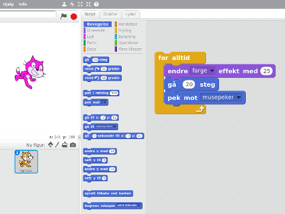
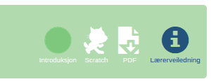
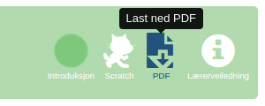
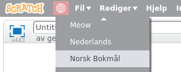

# Kom i gang med Scratch {.intro}

Scratch er eit grafisk programmeringsspråk som er  laga for at born og unge
enkelt skal lære seg programmering. Denne rettleiinga syner korleis du kan halde
eit kodekurs eller ein skuletime der elevane møter Scratch for fyrste gong.




# Før kurset {.activity}

Scratch krev ikkje at du har mykje programmeringserfaring sjølv for å kunne
rettleie. Miljøet er laga for at det skal vere raskt og enkelt for borna å kome
i gang, og [introduksjonsoppgåvene](../) hjelper dei å lære sjølvstendig. Under
er ei sjekkliste med førebuingar det likevel er nyttig å gå gjennom før
kodekurset.

## Sjekkliste {.check}

- [ ] Vel ei oppgåve blant [Scratchoppgåvene](../) på
  [kodeklubben.github.io](../../). Alle oppgåvene i lista

  <span class="level-1"><strong>Introduksjon</strong></span>

  passar til eit fyrste møte med Scratch. Du kan velje ei oppgåve etter
  interessene til borna eller basert på temaet i oppgåva.

- [ ] Jobb gjennom oppgåva sjølv. [Lag deg ein brukar](#opprett-brukarar) på
  [Scratch-heimesida](http://scratch.mit.edu/) viss du ikkje allereie har det.
  Så følgjer du oppgåva og programmerer denne sjølv. Det gir deg nyttig erfaring
  når det gjeld dei utfordringane borna møter.

- Nokre oppgåver har ei tilhøyrande lærarrettleiing. Denne er tilgjengeleg når
  du er i lærarmodus (sjå oppe til høgre).

  

  Les gjennom denne, og merk deg spesielt om det er tips til å løyse typiske
  utfordringar borna kan møte. Det kan vere nyttig å ha desse tilgjengeleg på ei
  utskrift under kurset.

- Skriv ut oppgåva på papir til elevane. Det er mogleg å jobbe med oppgåvene
  utan å skrive dei ut ved at borna har oppgåveteksten åpen i ei eiga fane i
  nettlesaren. Men det skapar ekstra utfordringar ved at dei stadig må byte
  fane, hugse det dei les og så bortetter. Me anbefalar at du skriv ut
  oppgåvene, i alle fall dei fyrste gongene, til borna blir meir erfarne med å
  bruke Scratch.

  For best mogleg utskrift bør du laste ned PDF-versjonen av oppgåva. Denne er
  tilgjengeleg øvst i oppgåva. Pass på at du skriv ut i fargar, sidan farga på
  koden er viktig for å finne att dei riktige kodeklossane.

  

- Alle oppgåvene passar for at borna jobbar i par viss du vil det. Det gir dei
  nyttig erfaring med samarbeid, og gjer det ofte enklare for deg som rettleiar,
  sidan du får færre datamaskiner å følge opp. Dessutan hjelper borna kvarandre
  meir heilt naturleg.

- For dei yngste borna er det også ei utfordring å lese oppgåva. Viss du har
  kodeklubb på kveldstid kan det vere kjekt om du oppfordrar foreldra (i alle
  fall for borna under 10 år) til å vere med og hjelpe borna sine med oppgåvene.

- Scratch køyrer i nettlesaren og er i utgangspunktet avhengig av at alle har
  nettilgang. Viss du ikkje er 100 % trygg på at alle borna kjem seg på nett bør
  du ha [Scratch offline](https://scratch.mit.edu/scratch2download/)
  tilgjengeleg. Dette er ein versjon av Scratch som ein installerer som eit
  vanleg program der ein kan programmere utan nettilgang.

  Du bør ha ein minnepenn der du på førehand har lasta ned Adobe Air og Scratch
  offline for dei ulike operativsystema.


# Opprett brukarar {.activity}

Det fyrste du bør gjere på sjølve kodekurset er å la alle borna opprette
brukarar. Det er strengt tatt ikkje nødvendig å ha ein scratchbrukar for å
programmere i Scratch, men brukaren gir ein del fordelar. Til dømes blir det
enklare å lagre prosjektet sitt, og prosjektet blir tilgjengeleg på alle
datamaskiner.

## Sjekkliste {.check}

- [ ] La alle borna kople seg opp på nett. Viss nokon brukar [Scratch
  offline](https://scratch.mit.edu/scratch2download/) treng dei ikkje opprette
  scratchbrukar.

- [ ] Be borna gå til heimesida til Scratch på
  [scratch.mit.edu](https://scratch.mit.edu/).

- [ ] Viss sida er på engelsk kan de endre til norsk språk i nedtrekksmenyen
  nedst på sida.

- [ ] Be borna klikke `Bli Scratch-brukar` øvst til høgre på sida og fylle ut
  skjemaet.

- [ ] Undervegs må borna oppgi ei e-postadresse. Denne blir brukt for å bekrefte
  kontoen, og gir tilgang til ein del ekstra funksjonalitet. Det er *ikkje*
  nøvendig å bekrefte denne med ein gong.

  Viss borna ikkje har ei eiga e-postadresse kan dei bruke ein av foreldra sine si adresse. Viss dei ikkje hugsar den kan du bruke di eiga adresse (helst opprett ei eiga adresse til dette føremålet). Klikk i så fall gjennom e-postane du får i etterkant av kurset, og bekreft kontoane.

## Gmail-triks {.protip}

Viss du brukar Gmail kan du endre på adressa di for å enkelt filtrere dei ut i
innboksen din. Viss adressa di er `brukar@gmail.com` får du også e-postar sendt
til `brukar+eittelleranna@gmail.com`. Etter `+` kan du skrive akkurat kva du
vil.


# Introduser Scratchmiljøet {.activity}

Etter at alle borna har oppretta brukarane sine bør du introdusere
Scratch-miljøet gjennom ein kort presentasjon i fellesskap. Denne treng ikkje ta
meir enn rundt 5 minutt, slik at borna får mest mogleg tid til å prøve på eiga
hand.

Under er eit døme på ein presentasjon som introduserer dei viktigaste elementa i
Scratch-miljøet, og er meir enn nok til at borna kjem i gang på eiga hand.
Alternativt kan du jobbe gjennom fyrste steg i oppgåva saman med borna.

## Presentasjon {.check}

- [ ] Det kan vere lurt å be borna senke skjermane sine før du startar, slik at
  dei i størst mogleg grad følgjer med på det du gjer. Start gjerne med å spørje
  "Kva er programmering?". Gjer eit poeng av at *programmering er ein måte me å
  beskrive korleis noko skal gjerast*

- [ ] Klikk `Programmering` øvst til venstre på
  [Scratch-heimesida](https://scratch.mit.edu/). Dette åpnar Scratch-miljøet der
  all programmeringa skjer.

  Viss sida ikkje er på norsk kan du endre språk ved å klikke på jordkloden øvst
  til venstre.

  

- [ ] Peik raskt på dei tre delane av Scratch-miljøet:

  - __Scena__ øvst til venstre er der ting vil skje. Snart skal me fortelje
    katten at den skal flytte på seg!

  - __Figurlista__ under scena syner figurane i programmet vårt. Etter kvart vil
    me ha fleire figurar enn katten.

  - __Kodevindauget__ til høgre, inkludert lista over klossar i midten, er der
    sjølve programmeringa skjer.

- [ ] Peik på den øvste blå klossen, `gå (10) steg`{.b}. Fortel at når me klikkar på den fortel me katten at den skal gå. Klikk på klossen fleire gonger medan du påpeikar at katten startar å flytte seg over skjermen. _Me programmerer katten!_

- [ ] Fortel at det er mange ulike kommandoar me kan gi til katten. Klikk på den
  neste klossen, `vend høyre (15) grader`{.b}, og vis korleis katten startar å
  snu seg. Be barna leggje merke til at katten snur seg utan å flytte seg over
  skjermen.

- [ ] Nå skal me sjå at me kan kombinere kommandoar. Dra `gå (10)
  steg`{.b}-klossen over til kodevindauget på høgre side. Du må gjerne trykkje
  på forstørrelsesglaset nedst til høgre slik at det blir enklare for borna å
  lese klossane. Dra `vend høyre (15) grader`{.b}-klossen til høgre, og fest den
  under den fyrste klossen slik:

  ```blocks
  gå (10) steg
  vend høyre (15) grader
  ```

  Klikk på kodeblokka og vis korleis katten både flyttar seg og roterer. _Me har
  laga eit skript som gir to kommandoar til katten!_

  I Scratch kallar me ei slik samling kodeklossar som utførast saman for eit
  _skript_. Alle skripta i eit prosjekt utgjer til saman eit _program_.

- [ ] Endre talet `10` i `gå (10) steg`{.b}-klossen til `20`. Katten tek lengre
  steg, og det blir enklare å sjå at den både _går_ og _vender_.

- [ ] Klikk på nokre av dei andre kategoriane, `Utseende`{.blocklooks},
  `Lyd`{.blocksound}, osb. Vis korleis kvar kategori inneheldt fleire
  kommandoar.

  Gå til `Utseende`{.blocklooks}-kategorien, og klikk på klossen `endre [farge
  v] effekt med (25)`{.b}. Vis korleis katten endrar farge. Legg denne klossen
  øvst i skriptet ditt, slik at det ser ut som dette:

  ```blocks
  endre [farge v] effekt med (25)
  gå (20) steg
  vend høyre (15) grader
  ```

- [ ] Vis at me kan ta klossar ut av skript ved å dra `vend høyre (15)
  grader`{.b} tilbake til venstre og sleppe den over klosselista. No er klossen
  sletta. Vis at katten beveger seg rett fram medan den skiftar farge.

- [ ] Legg til klossen `pek mot [ v]`{.b} nedst i skriptet. Trykk på
- nedtrekksmenyen og vel `musepeker`. Skriptet ser no slik ut:

  ```blocks
  endre [farge v] effekt med (25)
  gå (20) steg
  pek mot [musepeker v]
  ```

  Vis borna korleis katten ser mot musepeikaren når du klikkar på skriptet.

- [ ] No kjem det meste morosame! Fortel borna at datamaskiner er veldig flinke
  til å gjere ting mange gonger. Dette programmerer me ved hjelp av noko som
  heiter løkker.

  Klikk på `Styring`{.blockcontrol}-kategorien, og dra ut ein `gjenta for
  alltid`{.b}-kloss slik at den legg seg rundt skriptet ditt.

  ```blocks
  gjenta for alltid
      endre [farge v] effekt med (25)
      gå (20) steg
      pek mot [musepeker v]
  slutt
  ```

  Før du klikkar på skriptet, spør borna kva de trur vil skje!

- [ ] Klikk på skriptet. Katten startar å jage musepeikaren rundt omkring. Flytt
  musepeikaren til scena, og la katten jage den rundt ei lita stund. _Me har
  laga eit lite spel!_

- [ ] Klikk på det raude stoppsymbolet over scena for å avslutte spelet.

Ofte er dette ein passande stad å avslutte presentasjonen. Borna er som regel
veldig engasjerte og klare til å prøve på eiga hand.

La borna åpne datamaskinene sine. Minn dei på at dei skal klikke `Programmering`
for å prøve sjølv. Ofte vil dei teste ut noko av det du viste dei i
presentasjonen. La dei gjerne gjere dette eit par minutt før du minner dei på
oppgåva og ber dei starte å jobbe med den.


# Etter kurset {.activity}

Det er etter kvart mange born, kodeklubbar og skular som brukar oppgåvene og
rettleiingane her på [kodeklubben.github.io](../../). Viss du oppdagar feil
eller har forslag til forbetringar på nokre av sidene er det veldig nyttig om du
melder frå om dette.

På alle sider - oppgåver og rettleiingar - er det ein `Rapporter et
problem`-knapp nedst som du kan trykkje for å sende oss ei tilbakemelding. Bruk
den! Me er veldig takksame for alle forslag som kan gjere sidene endå betre!
