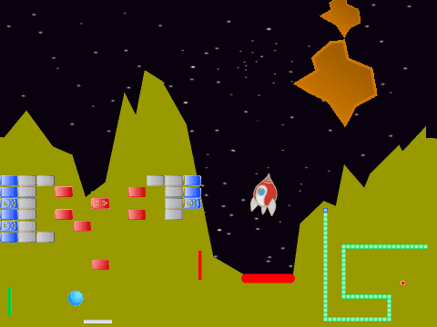

# Avansert Scratch - Klassikere {.intro}

Kurset __Avansert Scratch - Klassikere__ er ment for de som allerede har en del
erfaring i å programmere Scratch. Oppgavene tar for seg flere avanserte
konsepter, og er friere med mindre gitt kode enn de fleste andre
Scratch-oppgavene.

# Bakgrunn {.activity}

Dette kurset ble opprinnelig utviklet til en kodeklubb på Røa bibliotek i Oslo,
våren 2015. Tanken var å gi barna og ungdommene som allerede hadde sett en del
Scratch en ekstra utfordring, samtidig som vi fikk muligheten til å snakke om
noen av de mer avanserte programmeringskonseptene som Scratch tilbyr.

Dataspill har endret seg voldsomt siden de første dukket opp på begynnelsen av
1970-tallet. Dels på grunn av tekniske begrensninger var de første spillene
stort sett basert rundt en enkel ide, med et begrenset antall figurer. Dette
betyr at disse spillene stort sett er enkle å reimplementere i Scratch og det er
store muligheter for å lage sine egne variasjoner rundt spillideen. Et viktig
tema i kurset er å lære barna kreativitet gjennom å gi dem et enkelt rammeverk
og deretter gi dem ideer og frihet til videreutvikling av dette rammeverket.

# Oppgavene {.activity}

Oppgavene i Avansert Scratch - Klassikere er selvstendige prosjekter, men noen
av konseptene bygger på tidligere oppgaver, slik at det anbefales at de gjøres i
rekkefølgen de står i oppgavesamlingen.

I steg 1 i hver oppgave gis det litt kode som danner grunnlaget for resten av
oppgaven. Steg 1 kan gjerne jobbes gjennom i fellesskap, mens veilederen
forteller om teorien beskrevet i dette steget for å sikre at alle får det med
seg. Steg 2 og steg 3 i hver oppgave beskriver hvordan spillet kan utvikles
videre til et enkelt, men fullstendig spill. Mens steg 4 gir mange forslag til
hvordan spillet kan varieres og videreutvikles. La elevene jobbe mer selvstendig
med steg 2 og 3, og oppfordre dem til å være kreative når de kommer til steg 4.
Om noen har ideer som går utover det som er foreslått i steg 4 er det veldig
spennende. La dem prøve seg!

Nedenfor beskrives hvordan hver oppgave kan introduseres i felleskap:

+ [__Pong__](../pong/pong.html) er en slags introduksjon til kurset. Den felles
  gjennomgangen bør her vektlegge at når man lager et spill bør man tenke
  gjennom hva er kjernen av spillet. I Pong er det en ball som spretter rundt på
  skjermen. Deretter bør man lage en enkel versjon av dette, slik at man kan
  begynne å teste at ting oppfører seg som tenkt så raskt som mulig.

+ [__Breakout__](../breakout/breakout.html) introduserer kloning. Kloning er et
  av de viktigste, avanserte konseptene i Scratch, og Breakout viser enkel bruk
  av dette. I begynnelsen av kurskvelden passer det å snakke litt om hvordan
  alle boksene i utgangspunktet skal oppføre seg helt likt, og hvordan kloning
  gjør oss i stand til å lage mange kopier av samme figur gjennom programmering,
  i stedet for at vi manuelt må lage kopiene.

+ [__Snake__](../snake/snake.html) viser hvordan man kan bruke kloning på en mer
  utradisjonell måte. Spør elevene først om de har forslag til hvordan man kan
  lage en slange-figur siden denne endrer form (og til og med lengde) hele
  tiden? Løsningen som presenteres her er å bygge opp slangen av mange mindre
  bokser som gir mye fleksibilitet i forhold til formen på slangen. I tillegg er
  det verdt å legge vekt på at vi faktisk aldri flytter noen av kloneboksene. I
  stedet tegner vi en ny boks foran slangen og sletter en boks i halen. Dette
  ser da ut som om slangen flytter på seg.

  Dette prosjektet er også en god anledning for å diskutere forskjellen på
  variable som gjelder alle figurer og variable som gjelder kun for en figur. I
  mange Scratchprosjekter er ikke forskjellen viktig, men her er det viktig at
  `(min id)`{.b} er unik for hver klon, mens `(lengde)`{.b} og `(teller)`{.b} er
  lik for alle boksene. Hvis man har problemer med å få slangen til å flytte seg
  riktig er det som regel egenskapene til variablene som har blitt feil.

+ [__Lunar Lander__](../lunar_lander/lunar_lander.html) handler om å fly et
  romskip og hovedpoenget med oppgaven er å introdusere litt enkel fysisk
  modellering. Teorien handler her om hvordan man kan tenke på en skrå-bevegelse
  som satt sammen av en vannrett- og en loddrett-bevegelse, og hvordan de
  matematiske funksjonene `sinus` og `cosinus` brukes til dette. Her toucher man
  ganske avanserte ideer som elevene typisk ikke har sett før. I den felles
  gjennomgangen er det derfor nyttigst å bare prøve å gi barna et intuitivt
  bilde av hva som skjer, uten å gå veldig dypt i den teoretiske bakgrunnen.

+ [__Asteroids__](../asteroids/asteroids.html) er et litt mer avansert
  romskip-spill, og poenget med prosjektet er dels å vise hvordan man kan jobbe
  effektivt ved å gjenbruke kode man har skrevet tidligere - både i andre
  prosjekter og i dette prosjektet - og hvordan man tilpasser koden. I tillegg
  viser Asteroids hvordan man kombinerer romskipet fra Lunar Lander med
  klonekonseptene fra tidligere i kurset.

+ [__Donkey Kong__](../donkey_kong/donkey_kong.html) er et enkelt, men
  fullstendig plattformspill. Denne er også en oppgave i kurset [Avansert
  Scratch - Plattform](../veiledning_kurs_avansert_plattform/kurs_avansert_scratch_plattform.html)
  og om denne faller
  i smak, kan barna lære mye mer om plattformspill i det kurset. Den felles
  gjennomgangen bør her vektlegge hvordan man simulerer enkel gravitasjon ved
  hjelp av et par enkle variabler.

