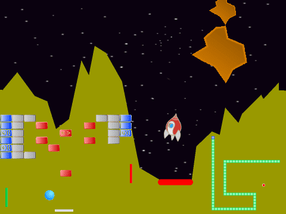

# Avansert Scratch - Klassikarar {.intro}

Kurset __Avansert Scratch - Klassikarar__ er meint for dei som allereie har ein
del erfaring med å programmere i Scratch. Oppgåvene tek for seg fleire avanserte
konsept, og er friare med mindre gitt kode enn dei fleste andre
Scratch-oppgåvene.

# Bakgrunn {.activity}

Dette kurset vart opphavleg utvikla til ein kodeklubb våren 2015 på Røa
bibliotek i Oslo. Tanken var å gi borna og ungdommane som allereie hadde sett
ein del Scratch ei ekstra utfordring, samstundes som me fekk moglegheita til å
prate om nokre av dei meir avanserte programmeringskonsepta som Scratch kan
tilby.

Dataspel har endra seg voldsomt sidan dei fyrste dukka opp på starten av
1970-talet. Dels på grunn av tekniske avgrensingar var dei fyrste spela stort
sett basert på ein enkel ide, med eit avgrensa antal figurar. Dette tyder at
desse spela stort sett er enkle å rekonstruere i Scratch, og det er store
moglegheiter for å lage sine eigne variasjonar av spela. Eit viktig tema i
kurset er å lære borna kreativitet gjennom å gi dei eit enkelt rammeverk, og så
gi dei idear og fridom til vidareutvikling av dette rammeverket.

# Oppgåvene {.activity}

Oppgåvene i __Avansert Scratch - Klassikere__ er sjølvstendige prosjekt, men
nokre av konsepta byggjer på tidlegare oppgåver, slik at me anbefalar at dei
blir gjort i den rekkefølgja dei står i oppgåvesamlinga.

I steg 1 i kvar oppgåve gir me litt kode som dannar grunnlaget for reisten av
oppgåva. Steg 1 kan gjerne bli gjort i fellesskap, medan rettleiaren fortel om
teorien som er beskrive i steget for å sikre at alle får det med seg. I steg 2
og 3 i kvar oppgåve beskriv me korleis spelet kan utviklast vidare til eit
enkelt, men fullstendig, spel. I steg 4 er det mange forslag til variasjonar og
vidareutvikling av spelet. La elevane jobbe meir sjølvstendig med steg 2 og 3,
og oppfordre dei til å vere kreative når dei kjem til steg 4. Om nokon har idear
som går utover det som er foreslått i steg 4 er det veldig spanande. La dei
prøve seg!

Under beskriv me korleis kvar oppgåve kan introduserast i fellesskap:

- [__Pong__](../pong/pong_nn.html) er ein slags introduksjon til kurset. Den felles
gjennomgangen bør leggje vekt på at når ein lagar eit spel bør ein tenke gjennom
kva som er kjerna av spelet. I Pong er det ein ball som sprett rundt på
skjermen. Så bør ein lage ein enkel versjon av dette, slik at ein kan starte å
teste at ting oppfører seg som tenkt så raskt som mogleg.

- [__Breakout__](../breakout/breakout_nn.html) introduserer kloning. Kloning er
  eitt av dei viktigaste, avanserte konsepta i Scratch, og Breakout viser enkel
  bruk av dette. I starten av kurskvelden passar det å prate litt om korleis
  alle boksane i utgangspunktet skal oppføre seg heilt likt, og korleis kloning
  gjer oss i stand til å lage mange kopiar av same figur gjennom programmering,
  i staden for at me manuelt må lage kopiane.

- [__Snake__](../snake/snake_nn.html) viser korleis ein kan bruke kloning på ein
  meir utradisjonell måte. Spør elevane fyrst om dei har forslag til korleis ein
  kan lage ein slange-figur, sidan denne endrar form (og til og med lengde)
  heile tida. Løysinga som presenterast her er å byggje opp slangen av mange
  mindre boksar som gir mykje fleksibilitet kring forma på slangen. I tillegg er
  det verdt å leggje vekt på at me faktisk aldri flyttar nokon av kloneboksane.
  I staden teiknar me ein ny boks framfor slangen, og slettar ein boks i halen.
  Det vil då sjå ut som om slangen flyttar på seg.

  Dette prosjektet er òg ein god anledning for å diskutere skilnaden på
  variablar som gjeld alle figurar og variablar som gjeld berre for ein figur. I
  mange Scratchprosjekt er ikkje skilnaden viktig, men her er det viktig at
  `(min id)`{.b} er unik for kvar klone, medan `(lengde)`{.b} og `(teljar)`{.b}
  er lik for alle boksane. Viss ein har problem med å få slangen til å flytte
  seg riktig er det som regel eigenskapane til variablane som har blitt feil.

- [__Lunar Lander__](../lunar_lander/lunar_lander_nn.html) handlar om å fly eit
  romskip, og hovudpoenget med oppgåva er å introdusere litt enkel fysisk
  modellering. Teorien handlar her om korleis ein kan tenke på ei skrå-rørsle
  som er sett saman av ei vassrett og ei loddrett rørsle, og korleis dei
  matematiske funksjonane `sinus` og `cosinus` brukast til dette. Her kjem ein
  borti ganske avanserte idear som elevane typsik ikkje har sett før. I den
  felles gjennomgangen er det difor mest nyttig å berre prøve å gi borna eit
  intuitivt bilete av kva som skjer, utan å gå veldig djupt inn i den teoretiske
  bakgrunnen.

- [__Asteroids__](../asteroids/asteroids_nn.html) er eit litt meir avansert
  romskip-spel, og poenget med prosjektet er dels å vise korleis ein kan jobbe
  effektivt ved å gjenbruke kode ein har skrive før - både i andre prosjekt og i
  dette prosjektet - og korleis ein tilpassar koden. I tillegg viser Asteroids
  korleis ein kombinerer romskipet frå Lunar Lander med klonekonsepta frå
  tidlegare i kurset.

- [__Donkey Kong__](../donkey_kong/donkey_kong_nn.html) er eit enkelt, men
  fullstendig plattformspel. Dette er òg ei oppgåve i kurset [Avansert Scratch -
  Plattform](../veiledning_kurs_avansert_plattform/kurs_avansert_scratch_plattform_nn.html),
  og viss denne fell i smak
  kan borna lære mykje meir om plattformspel i det kurset. Den felles
  gjennomgangen bør leggje vekt på korleis ein simulerer enkel gravitasjon ved
  hjelp av eit par enkle variablar.
