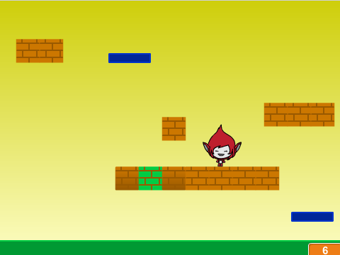

# Avansert Scratch - Plattform {.intro}

Kurset __Avansert Scratch - Plattform__ er ment for de som allerede har en del
erfaring i å programmere Scratch. Oppgavene tar for seg flere avanserte
konsepter, og er friere med mindre gitt kode enn de fleste andre
Scratch-oppgavene.

# Bakgrunn {.activity}

Dette kurset ble opprinnelig utviklet til en kodeklubb på Blindern i Oslo,
våren 2016. Flere barn hadde i tidligere kodeklubber spurt om hvordan man kan
lage plattformspill i Scratch. Tanken var å gi barna og ungdommene som allerede
hadde sett en del Scratch en ekstra utfordring, samtidig som vi fikk muligheten
til å snakke om noen av de mer avanserte programmeringskonseptene som Scratch
tilbyr.

Plattformspill har utviklet seg mye siden Donkey Kong og Super Mario (den gang
Jumpman) ble introdusert i 1981. Likevel er dette figurer også barn blir kjent
med i dag. I dette kurset lager vi et ganske avansert plattformspill. Tanken er
at spillet utvikles gradvis over flere kurskvelder, med fokus på et konsept hver
kveld. Etterhvert jobber vi frem et plattformspill (som vi kaller __Jumpman__)
som er veldig inspirert av Super Mario-spillene, men hvor det er store
muligheter for å implementere sine egne variasjoner underveis. Et viktig tema i
kurset er å lære barna kreativitet gjennom å gi dem et enkelt rammeverk og
deretter gi dem ideer og frihet til videreutvikling av dette rammeverket.

# Oppgavene {.activity}

Oppgavene i __Avansert Scratch - Plattform__ bygger til en viss grad på
hverandre, slik at anbefales at de gjøres i rekkefølgen de står i
oppgavesamlingen. Det er likevel selvstendige konsepter som tas opp i hver
oppgave slik at det er mulig å hoppe over oppgaver. For eksempel, om man ikke
gjør oppgaven med bakgrunnsskrolling ender man med et fullverdig spill, men uten
bakgrunnsskrolling.

I steg 1 i hver oppgave gis det litt kode som danner grunnlaget for resten av
oppgaven. Steg 1 kan gjerne jobbes gjennom i fellesskap, mens veilederen
forteller om teorien beskrevet i dette steget for å sikre at alle får det med
seg. Steg 2 og steg 3 i hver oppgave beskriver hvordan spillet kan utvikles
videre til et enkelt, men fullstendig spill. Mens steg 4 gir mange forslag til
hvordan spillet kan varieres og videreutvikles. La elevene jobbe mer selvstendig
med steg 2 og 3, og oppfordre dem til å være kreative når de kommer til steg 4.
Om noen har ideer som går utover det som er foreslått i steg 4 er det veldig
spennende. La dem prøve seg!

Nedenfor beskrives hvordan hver oppgave kan introduseres i felleskap:

+ [__Donkey Kong__](../donkey_kong/donkey_kong.html) er en slags introduksjon
  til kurset hvor vi lager et enkelt, men fullstendig plattformspill. Denne er
  også en oppgave i kurset [Avansert Scratch -
  Klassikere](../veiledning_kurs_avansert_klassikere/kurs_avansert_scratch_klassikere.html)
  slik at noen har kanskje
  vært borti denne tidligere (oppfordre dem i såfall til å videreutvikle spillet
  sitt). Den felles gjennomgangen bør her vektlegge hvordan man simulerer enkel
  gravitasjon ved hjelp av et par enkle variabler.

+ __Jumpman - Animasjon__ er første del av Jumpman-spillet vårt. Fokus her er på
  hvordan vi enkelt kan animere en figur forskjellig avhengig av om figuren står
  i ro, løper eller hopper.

+ __Jumpman - Kollisjon__ er andre del av Jumpman-spillet. Her er hovedpoenget
  avansert kollisjonsdeteksjon. Spesielt vil vi se hvordan vi kan se forskjell
  på om Jumpman skaller en murstein nedenfra eller står på toppen av mursteinen.

+ __Jumpman - Bakgrunnsskrolling__ er tredje del av Jumpman-spillet. Her skal vi
  se hvordan vi kan lage verdenen større ved å skrolle de forskjellige
  bakgrunnselementene (plattformer, fiender) rundt på skjermen.

+ __Jumpman - Brettdesign__ er fjerde og siste del av Jumpman. I denne oppgaven
  er fokus på hvordan man kan implementere flere nivåer i spillet. Samtidig ser
  vi hvordan vi kan inkludere elementer som smarte fiender og bevegelige
  plattformer.
