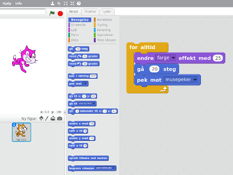
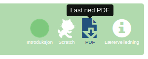
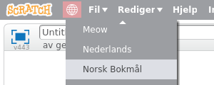

# Kom i gang med Scratch {.intro}

Scratch er et grafisk programmeringsspråk utviklet spesielt for at
barn og unge enkelt skal lære seg programmering. Denne veiledningen
viser hvordan du kan holde et kodekurs eller en skoletime hvor elevene
møter Scratch for første gang.



# Før kurset {.activity}

Scratch krever ikke at du har mye programmeringserfaring selv for å
veilede. Miljøet er laget for at det skal være raskt og enkelt for
barna å komme i gang, og [introduksjonsoppgavene](../) hjelper barna å
lære selvstendig. Nedenfor er en sjekkliste med forberedelser det
likevel er nyttig å gå gjennom før kodekurset.

## Sjekkliste {.check}

+ Velg en oppgave blant [Scratchoppgavene](../) på
  [kodeklubben.github.io](../../). Alle oppgavene i listen

  <span class="level-1"><strong>Introduksjon</strong></span>

  passer til en førstegangsintroduksjon til Scratch. Du kan plukke en
  litt etter interesser til barna eller basert på temaet i oppgaven.

+ Jobb gjennom oppgaven selv. [Lag deg en bruker](#opprett-brukere) på
  [Scratch-hjemmesiden](http://scratch.mit.edu/) (se
  [nedenfor](#opprett-brukere)) om du ikke allerede har det. Følg
  deretter oppgaven og programmer denne selv. Dette gir deg nyttig
  erfaring i forhold til hvilke utfordringer barna blir stilt ovenfor.

+ Noen oppgaver har en tilhørende lærerveiledning. Denne vil være
  tilgjengelig øverst i tittelen på oppgaven.

  

  Les gjennom denne, og merk deg spesielt om det er tips til å løse
  typiske utfordringer barna kan komme borti. Det kan være nyttig å ha
  disse tilgjengelig på en utskrift under kurset.

+ Skriv ut oppgaven på papir til elevene. Det er mulig å jobbe med
  oppgavene uten å skrive dem ut ved at barna har oppgaveteksten åpen
  i en egen fane i nettleseren. Men dette skaper ekstra komplikasjoner
  ved at de stadig må bytte faner, huske det de leser osv. Vi
  anbefaler derfor at du skriver ut oppgavene, ihvertfall de første
  gangene til barna blir mer erfarne med å bruke Scratch.

  For best mulig utskrift bør du laste ned PDF-versjonen av oppgaven,
  også denne tilgjengelig øverst i tittellinjen. Pass på at du skriver
  ut i farger, da fargene på koden er viktig for å finne igjen de
  riktige kodeklossene.

  

+ Alle oppgavene passer for at barna jobber i par om du vil det. Dette
  vil gjerne gi dem en nyttig erfaring i samarbeid, og vil ofte gjøre
  det enklere for deg som veileder, siden du vil ha færre
  _datamaskiner_ å følge opp og barna vil naturlig hjelpe hverandre
  mer.

+ For de yngste barna er også det å lese oppgaven en utfordring. Om du
  skal holde en kodeklubb på kveldstid så oppfordre foreldrene
  (ihvertfall til barna fra rundt 10 år og yngre) til å være med og
  hjelpe sine barn med oppgavene.

+ Scratch kjøres i nettleseren og er derfor i utgangspunktet avhengig
  av at alle har nettilgang. Dersom du ikke er 100% trygg på at alle
  barna vil komme seg på nett bør du ha
  [Scratch offline](https://scratch.mit.edu/scratch2download/)
  tilgjengelig. Dette er en versjon av Scratch som man installerer som
  et vanlig program, og hvor man kan programmere også uten
  nettforbindelse.

  Du bør forberede en minnepenn hvor du på forhånd har lastet ned
  Adobe Air og Scratch offline for de forskjellige operativsystemene.

# Opprett brukere {.activity}

Det første du bør gjøre på selve kodekurset er å la alle barna
opprette brukere. Det er strengt tatt ikke nødvendig å ha en
scratchbruker for å programmere Scratch, men brukeren åpner en del
fordeler som at det blir enklere å lagre prosjektet sitt, prosjektet
blir tilgjengelig på alle datamaskiner osv.

## Sjekkliste {.check}

+ La alle barna koble seg opp på nett. Om noen bruker
  [Scratch offline](https://scratch.mit.edu/scratch2download/) trenger
  de ikke opprette scratchbruker.

+ Be barna gå til hjemmesiden til Scratch på
  [scratch.mit.edu](https://scratch.mit.edu/).

+ Om siden er på engelsk kan dere endre til norsk språk i
  nedtrekksmenyen nederst på siden.

+ Be barna klikke `Bli Scratch-bruker` øverst til høyre på siden, og
  fylle ut skjemaet.

+ Underveis blir barna bedt om å oppgi en e-postadresse. Denne vil
  brukes for å bekrefte kontoen som gir tilgang til en del ekstra
  funksjonalitet. Det er _ikke_ nødvendig at denne bekreftes med en
  gang.

  Om barna ikke har sin egen e-postadresse kan de gjerne bruke
  foreldrenes e-postadresse. Dersom de ikke husker den kan du være
  behjelpelig med å la de bruke din e-postadresse (aller helst
  oppretter du en egen adresse til dette formålet). Klikk i såfall
  gjennom e-postene du får i etterkant av kurset, og bekreft kontoene.

# Introduser Scratchmiljøet {.activity}

Etter at alle barna har opprettet sine brukere bør du introdusere
Scratchmiljøet gjennom en kort presentasjon i fellesskap. Denne
trenger ikke ta mer enn rundt 5 minutter, slik at barna får mest mulig
tid til å prøve på egenhånd.

Under er et eksempel på en presentasjon som introduserer de viktigste
elementene i Scratchmiljøet, og er mer enn nok til at barna kommer i
gang på egenhånd. Alternativt, kan du også jobbe gjennom første steg i
oppgaven sammen med barna.

## Presentasjon {.check}

+ Det kan være nyttig å be barna senke skjermene før du begynner, slik
  at de i størst mulig grad følger med på det dere gjør sammen. Start
  gjerne med å spørre: __Hva er programmering?__ Gjør et poeng av at
  _programmering er en måte vi beskriver hvordan noe skal gjøres_.

+ Klikk `Programmering` øverst til venstre på
  [Scratch-hjemmesiden](https://scratch.mit.edu/). Dette åpner
  scratchmiljøet hvor all programmeringen skjer.

  Dersom denne siden ikke er på norsk kan du endre språk ved å klikke
  på jordkloden øverst til venstre.

  

+ Pek raskt på de tre delene av scratchmiljøet:

  + __Scenen__ øverst til venstre er der ting vil skje. Snart skal vi
    fortelle katten at den skal flytte på seg!

  + __Figurlisten__ under scenen viser figurene i programmet
    vårt. Etterhvert vil vi ha flere figurer enn katten.

  + __Kodevinduet__ til høyre, inkludert listen over klosser i midten,
    er der selve programmeringen skjer.

+ Pek på den øverste blå klossen, `gå (10) steg`{.b}. Fortell at når
  vi klikker på den forteller vi katten at den skal gå. Klikk på
  klossen flere ganger mens du påpeker at katten begynner å flytte seg
  over skjermen. _Vi programmerer katten!_

+ Fortell at det er mange forskjellige kommandoer vi kan gi til
  katten. Klikk på den neste klossen, `vend høyre (15) grader`{.b}, og
  vis hvordan katten nå begynner å snu seg. Be barna legge merke til
  at katten snur seg uten å flytte seg over skjermen.

+ Nå skal vi se at vi kan kombinere kommandoer. Dra `gå (10)
  steg`{.b}-klossen over til kodevinduet på høyre side. Trykk gjerne
  noen ganger på forstørrelsesglasset nederst til høyre slik at det
  blir enklere for barna å lese klossene. Dra deretter også `vend
  høyre (15) grader`{.b}-klossen til høyre, og fest den under den
  første klossen slik:

  ```blocks
  gå (10) steg
  vend høyre (15) grader
  ```

  Klikk på kodeblokken og vis hvordan katten både flytter seg og
  roterer. _Vi har laget et skript som gir to kommandoer til katten!_

  I Scratch kaller vi en slik samling kodeklosser som utføres sammen
  for et _skript_. Alle skriptene i et prosjekt utgjør tilsammen et
  _program_.

+ Endre tallet `10` i `gå (10) steg`{.b}-klossen til `20`. Katten tar
  nå lengre steg, og det blir enklere å se at den både _går_ og
  _vender_.

+ Klikk på noen av de andre kategoriene, `Utseende`{.blocklooks},
  `Lyd`{.blocksound}, osv. Vis hvordan hver kategori inneholder flere
  kommandoer.

  Gå til `Utseende`{.blocklooks}-kategorien, og klikk på klossen
  `endre [farge v] effekt med (25)`{.b}. Vis hvordan katten endrer
  farge. Legg denne klossen øverst i skriptet ditt, slik at det ser ut
  som følger:

  ```blocks
  endre [farge v] effekt med (25)
  gå (20) steg
  vend høyre (15) grader
  ```

+ Vis at vi også kan ta klosser ut av skript, ved å dra `vend høyre
  (15) grader`{.b} tilbake til venstre og slippe den over
  klosselisten. Klossen er nå slettet. Vis at katten nå beveger seg
  rett frem mens den skifter farge.

+ Legg til klossen `pek mot [ v]`{.b} nederst i skriptet. Trykk på
  nedtrekksmenyen og velg `musepeker`. Skriptet ser nå slik ut:

  ```blocks
  endre [farge v] effekt med (25)
  gå (20) steg
  pek mot [musepeker v]
  ```

  Vis barna hvordan katten nå vil se mot musepekeren når du klikker på
  skriptet.

+ Nå kommer det morsomste! Fortell barna hvordan datamaskiner er
  veldig flinke til å gjøre ting mange ganger. Dette programmerer vi
  ved hjelp av noe som heter løkker.

  Klikk på `Styring`{.blockcontrol}-kategorien, og dra ut en `for
  alltid`{.b}-kloss slik at den legger seg rundt skriptet ditt.

  ```blocks
  for alltid
      endre [farge v] effekt med (25)
      gå (20) steg
      pek mot [musepeker v]
  slutt
  ```

  Før du klikker på skriptet, spør barna hva de tror vil skje!

+ Klikk på skriptet. Katten begynner å jage musepekeren rundt omkring!
  Flytt musepekeren til scenen, og la katten jage den rundt en liten
  stund. _Vi har laget et lite spill!_

+ Klikk på det røde stoppsymbolet over scenen for å avslutte spillet.

Ofte er dette et passende sted å avslutte presentasjonen. Barna er som
regel veldig engasjerte og klare til å prøve på egenhånd.

La barna åpne datamaskinene sine. Minn dem på at de skal klikke
`Programmering` for å prøve selv. Ofte vil de teste ut noe av det du
viste dem i presentasjonen. La dem gjerne gjøre dette et par minutter
før du minner dem på oppgaven, og ber dem begynne å jobbe med den.

# Etter kurset {.activity}

Det er etterhvert mange barn, kodeklubber og skoler som bruker
oppgavene og veiledningene her på
[kodeklubben.github.io](../../). Dersom du oppdager feil eller har
forslag til forbedringer på noen av sidene er det derfor veldig nyttig
om du melder fra om dette.

På alle sider - oppgaver og veiledninger - er det en `Rapporter et
problem`-knapp nederst som du kan trykke for å sende oss en
tilbakemelding. Bruk denne! Vi er veldig takknemlige for alle
forslag som kan gjøre disse sidene enda nyttigere!

