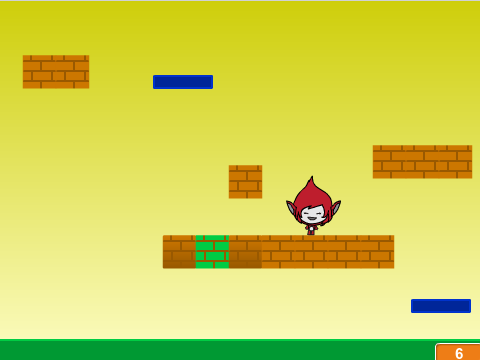

# Avansert Scratch - Plattform {.intro}

Kurset __Avansert Scratch - Plattform__ er ment for de som allerede
har en del erfaring i å programmere Scratch. Oppgavene tar for seg
flere avanserte konsepter, og er friere med mindre gitt kode enn de
fleste andre Scratch-oppgavene.

# Bakgrunn {.activity}

Dette kurset ble opprinnelig utviklet til en kodeklubb på Røa
bibliotek i Oslo, våren 2015. Tanken var å gi barna og ungdommene som
allerede hadde sett en del Scratch en ekstra utfordring, samtidig som
vi fikk muligheten til å snakke om noen av de mer avanserte
programmeringskonseptene som Scratch tilbyr.

Dataspill har endret seg voldsomt siden de første dukket opp på
begynnelsen av 1970-tallet. Dels på grunn av tekniske begrensninger
var de første spillene stort sett basert rundt en enkel ide, med et
begrenset antall figurer. Dette betyr at disse spillene stort sett er
enkle å reimplementere i Scratch og det er store muligheter for å lage
sine egne variasjoner rundt spillideen. Et viktig tema i kurset er å
lære barna kreativitet gjennom å gi dem et enkelt rammeverk og
deretter gi dem ideer og frihet til videreutvikling av dette
rammeverket.

# Oppgavene {.activity}

Oppgavene i Avansert Scratch - Klassikere er selvstendige prosjekter,
men noen av konseptene bygger på tidligere oppgaver, slik at det
anbefales at de gjøres i rekkefølgen de står i oppgavesamlingen.

I steg 1 i hver oppgave gis det litt kode som danner grunnlaget for
resten av oppgaven. Steg 1 kan gjerne jobbes gjennom i fellesskap,
mens veilederen forteller om teorien beskrevet i dette steget for å
sikre at alle får det med seg. Steg 2 og steg 3 i hver oppgave
beskriver hvordan spillet kan utvikles videre til et enkelt, men
fullstendig spill. Mens steg 4 gir mange forslag til hvordan spillet
kan varieres og videreutvikles. La elevene jobbe mer selvstendig med
steg 2 og 3, og oppfordre dem til å være kreative når de kommer til
steg 4. Om noen har ideer som går utover det som er foreslått i steg 4
er det veldig spennende. La dem prøve seg!

Nedenfor beskrives hvordan hver oppgave kan introduseres i felleskap:

+ [__Donkey Kong__](../donkey_kong/donkey_kong.html) er en slags
  introduksjon til kurset.  Den felles gjennomgangen bør her vektlegge
  at når man lager et spill bør man tenke gjennom hva er kjernen av
  spillet. 

