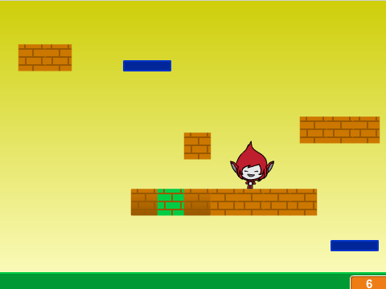

# Avansert Scratch - Plattform {.intro}

Kurset __Avansert Scratch - Plattform__ er meint for dei som allereie har ein
del erfaring med å programmere i Scratch. Oppgåvene tek for seg fleire avanserte
konsept, og er friare med mindre gitt kode enn dei fleste andre
Scratch-oppgåvene.

# Bakgrunn {.activity}

Dette kurset vart opprinneleg utvikla til ein kodeklubb våren 2016 på Blindern i
Oslo. Fleire born hadde i tidlegare kodeklubbar spurt om korleis ein kan lage
plattformspel i Scratch. Tanken var å gi borna og ungdommane som allereie hadde
sett ein del Scratch ei ekstra utfordring, samstundes som me fekk moglegheita
til å prate om nokre av dei meir avanserte programmeringskonsepta Scratch kan
tilby.

Plattformspel har utvikla seg mykje sidan Donkey Kong og Super Mario (den gong
Jumpman) vart introdusert i 1981. Likevel er desse to figurar born blir kjent
med i dag. I dette kurset lagar me eit ganske avansert plattformspel. Tanken er
at spelet kan utviklast gradvis over fleire kurskveldar, med fokus på eitt
konsept kvar kveld. Etter kvart jobbar me fram eit plattformspel me kallar
Jumpman, som er veldig inspirert av Super Mario-spela, men der det er store
moglegheiter for å implementere eigne variasjonar undervegs. Eit viktig tema i
kurset er å lære borna kreativitet gjennom å gi dei eit enkelt rammeverk og så
gi dei idear og fridom til vidareutvikling av dette rammeverket.

# Oppgåvene {.activity}

Oppgåvene i __Avansert Scratch - Plattform__ byggjer til ei viss grad på
kvarandre, slik at me anbefalar at dei blir gjort i den rekkefølgja dei står i
oppgåvesamlinga. Det er likevel sjølvstendige konsept me tek opp i kvar oppgåve
slik at det er mogleg å hoppe over oppgåver. Til dømes kan ein droppe å gjere
oppgåva med bakgrunnsrulling for å ende med eit fullverdig spel utan
bakgrunnsrulling.

I steg 1 i kvar oppgåve gir me litt kode som dannar grunnlaget for reisten av
oppgåva. Steg 1 kan gjerne bli gjort i fellesskap, medan rettleiaren fortel om
teorien som er beskrive i steget for å sikre at alle får det med seg. I steg 2
og 3 i kvar oppgåve beskriv me korleis spelet kan utviklast vidare til eit
enkelt, men fullstendig, spel. I steg 4 er det mange forslag til variasjonar og
vidareutvikling av spelet. La elevane jobbe meir sjølvstendig med steg 2 og 3,
og oppfordre dei til å vere kreative når dei kjem til steg 4. Om nokon har idear
som går utover det som er foreslått i steg 4 er det veldig spanande. La dei
prøve seg!

Under beskriv me korleis kvar oppgåve kan introduserast i fellesskap:

- [__Donkey Kong__](../donkey_kong/donkey_kong_nn.html) er ein slags
  introduksjon til kurset der me lagar eit enkelt, men fullstendig,
  plattformspel. Denne er ei oppgåve i kurset [Avansert Scratch -
  Klassikarar](kurs_avansert_scratch_klassikere_nn.html) slik at nokon har
  kanskje sett denne før (i så fall kan du oppfordre dei til å vidareutvikle
  spelet sitt). Den felles gjennomgangen bør leggje vekt på korleis ein
  simulerer enkel gravitasjon ved hjelp av ei par enkle variablar.

- __Jumpman - Animasjon__ er fyrste del av Jumpman-spelet vårt. Fokus her er på
  å enkelt animere ein figur avhengig av om figuren står i ro, spring eller
  hoppar.

- __Jumpman - Kollisjon__ er andre del av Jumpman-spelet. Her er poenget
  avansert kollisjonsdeteksjon. Spesielt skal me sjå korleis me ser forskjell på
  om Jumpman skallar ein murstein nedanfrå eller står på toppen av mursteinen.

- __Jumpman - Bakgrunnsrulling__ er tredje del av Jumpman-spelet. Her skal me
  sjå korleis me kan lage verda større ved å rulle dei ulike bakgrunnselementa
  (plattformar, fiendar), rundt på skjermen.

- __Jumpman - Brettdesign__ er fjerde og siste del av Jumpman. I denne oppgåva
  ser me på korleis me kan implementere fleire nivå i spelet. Samstundes ser me
  korleis me kan inkludere element som smarte fiendar og bevegelege plattformar.
