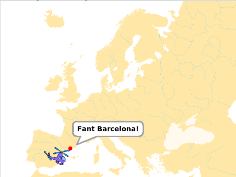
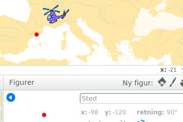

# Introduksjon {.intro}

Hvor i All Verden? er et reise- og geografispill hvor man raskest
mulig skal fly innom reisemål spredt rundt i Europa. I denne første
leksjonen vil vi se på hvordan vi styrer figurer rundt omkring på
skjermen, og hvordan vi får forskjellige figurer til å reagere på
hverandre.

I senere leksjoner vil vi utvide kartet vi flyr over ved å lage en
bakgrunn som flytter seg. Vi vil også se på hvordan vi kan lage lister
som holder oversikt over alle stedene vi kan besøke.



# Steg 1: Styr et helikopter {.activity}

*Vi begynner med å lage et lite program som gjør at vi kan styre et
 helikopter med piltastene.*

## Sjekkliste {.check}

+ Start et nytt Scratch-prosjekt. Slett kattefiguren, for eksempel ved
  å høyreklikke på den og velge `slett`.

+ Legg til en ny figur ved å klikke
  
  under `Figurer`. Vi har brukt `Transport/Helicopter`, men du kan
  gjerne bruke en annen figur å reise rundt med.

+ Klikk `i`{.blockmotion} og skift navn på figuren til
  `Helikopter`.

+ Klikk på scenen til venstre for figurene, og lag det følgende
  skriptet:

  ```blocks
  når grønt flagg klikkes
  send melding [Nytt spill v]
  ```

  Vi skal diskutere hvorfor vi gjør dette i mer detalj senere. Kort
  sagt gir det oss mer fleksibilitet i forhold til hvordan vi
  starter og avslutter spillet.

+ Klikk på helikopteret igjen. Klikk deretter `Data`{.blockdata} og
  lag en variabel som heter `hastighet`{.blockdata} og som gjelder for
  denne figuren.

+ Deretter bygger vi noen klosser hvor vi bestemmer egenskaper ved
  helikopteret som ikke forandrer seg i løpet av spillet, for eksempel
  størrelsen og hastigheten.

  ```blocks
  når grønt flagg klikkes
  skjul
  begrens rotasjon [vend sideveis v]
  sett størrelse til (30) %
  sett [hastighet v] til [5]
  ```

  Eksperimenter gjerne med andre verdier for disse klossene, slik at
  du finner de verdiene du mener er best for ditt spill!

+ Nå skal vi lage en av de viktigste delene av spillet, nemlig hvordan
  helikopteret flytter seg rundt. Dette legger vi inn i en løkke som
  alltid kjører.

  ```blocks
  når jeg mottar [Nytt spill v]
  gå til x: (0) y: (0)
  vis
  for alltid
      hvis <tast [pil høyre v] trykket?>
          pek i retning (90 v)
          gå (hastighet) steg
      slutt
      hvis <tast [pil venstre v] trykket?>
          pek i retning (-90 v)
          gå (hastighet) steg
      slutt
  slutt
  ```

## Test prosjektet {.flag}

__Klikk på det grønne flagget.__

+ Kan du bruke piltastene til å styre helikopteret rundt omkring? Vi
  har bare bestemt hva som skal skje når `pil høyre` og `pil venstre`
  trykkes. Prøv selv å legge inn kode for hva som skal skje når `pil
  opp` og `pil ned` trykkes.

+ Hva gjør klossen `begrens rotasjon vend sideveis`{.blockmotion}? Prøv
  å endre verdiene i nedtrekksmenyen for å se hva som skjer.

# Steg 2: Et enkelt kart {.activity}

*Vi legger nå inn et kart som en bakgrunn. Dette vil vi i denne
 leksjonen bruke til å fly over. I senere leksjoner vil vi også lære
 hvordan vi kan få dette bakgrunnskartet til å bevege seg.*

## Sjekkliste {.check}

+ Vi vil først laste ned kartet fra nettet. Åpne lenken
  [europakart.png](europakart.png) i en ny fane i nettleseren din.
  Dette vil åpne et bilde av et europakart. Høyreklikk på bildet, og
  velg `Lagre bildet som` eller noe som ligner. Lagre bildet et sted
  du finner det igjen.

+ Velg 
  under `Ny bakgrunn` helt til venstre på skjermen. Velg filen
  `europakart.png` du nettopp lastet ned.

## Test prosjektet {.flag}

__Klikk på det grønne flagget.__

+ Ser det ut som om helikopteret flyr rundt i Europa? Prøv gjerne å
  eksperimentere mer med egenskapene til helikopteret: størrelse,
  hastighet og så videre.

# Steg 3: Legg til et reisemål {.activity}

*Vi skal nå gi helikopteret et mål det kan fly til.*

## Sjekkliste {.check}

+ Vi begynner med å tegne en liten figur som kan markere reisemålet i
  kartet. Velg  under
  `Figurer`.

+ Velg en passende farge. For eksempel vil rød synes ganske godt på
  kartet. Velg deretter sirkeverktøyet, og marker den fyllte sirkelen
  (ellipsen) til venstre under tegnevinduet.

+ Før du begynner å tegne kan du forstørre tegningen din ved å trykke
  på forstørrelsesglasset nederst til høyre. For eksempel vil 800%
  forstørrelse passe bra. Hold inne `skift`-knappen mens du drar ut en
  sirkel som er omtrent fire ruter stor. `skift`-knappen hjelper deg
  til å lage en helt rund sirkel.

  

+ Gi denne nye figuren navnet `Sted`.

+ Dra denne nye sted-figuren til et sted på kartet du vil at skal være
  reisemålet. Vi har brukt `Barcelona` her, men du kan velge et annet
  sted om du vil.

+ Vi trenger nå posisjonen til sted-figuren vår. Denne finner vi
  enklest ved å se på figurinformasjonen etter tallene som står bak
  `x` og `y`. Disse tallene kalles koordinater. I eksempelet under er
  koordinatene `x: -98` og `y: -120`. Koordinatene forteller hvor på
  kartet vi har lagt reisemålet vårt.

  

+ Vi lager nå litt kode som passer på at reisemålet ligger riktig
  plassert på kartet, og som sier i fra hvis vi finner veien til
  Barcelona.

  ```blocks
  når jeg mottar [Nytt spill v]
  send melding [Nytt sted v]

  når jeg mottar [Nytt sted v]
  gå til x: (-98) y: (-120)
  vent til <berører [Helikopter v]?>
  si [Fant Barcelona!] i (2) sekunder
  ```

## Test prosjektet {.flag}

__Klikk på det grønne flagget.__

+ Ligger den røde sirkelen der den skal være?

+ Hva skjer om du styrer helikopteret til den røde sirkelen?

# Steg 4: Skjul reisemålet {.activity}

*Dette er så langt et veldig enkelt spill, siden spilleren bare
 trenger å fly til den røde sirkelen. For å gjøre det litt
 vanskeligere vil vi nå skjule sirkelen, og heller bare fortelle
 spilleren hvilken by hun skal fly til!*

## Sjekkliste {.check}

+ En måte å gi beskjed til spilleren på, er ved å bruke variabler. Lag
  en ny variabel som du kaller `Reis til`{.blockdata}. La denne
  variabelen gjelde *for alle figurer*.

+ Legg merke til at det dukket opp en boks på kartet,
  `Reis til`{.blocklightgrey}` 0 `{.blockdata}. Flytt denne boksen
  til et passende sted slik at den er lett å lese.

+ Oppdater skriptet til __Sted__ slik at
  `Reis til`{.blockdata}-variabelen blir satt til `Barcelona` rett
  etter `gå til`{.blockmotion}-klossen.

Vi vil nå skjule den røde sirkelen. La oss først prøve det enkleste og
mest opplagte:

+ Legg til en `skjul`{.blocklooks}-kloss etter
  `når jeg mottar Nytt spill`{.blockevents}.

## Test prosjektet {.flag}

__Klikk på det grønne flagget.__

+ Blir den røde sirkelen borte?

+ Hva skjer om du reiser til Barcelona?

Hmm ... spillet oppdager ikke lengre at vi reiser til
Barcelona. Problemet er at siden vi skjuler sirkelen vil den ikke
lengre berøre __Helikopter__. Vi må finne en annen måte å gjøre
sirkelen usynlig på!

## Sjekkliste {.check}

+ I stedet for å skjule sirkelen helt vil vi heller gjøre den
  gjennomsiktig. Bytt ut `skjul`{.blocklooks}-klossen med en `sett
  effekt`{.blocklooks}-kloss:

  ```blocks
  når jeg mottar [Nytt spill v]
  vis
  sett [gjennomsiktig v] effekt til (100)
  send melding [Nytt sted v]
  ```

## Test prosjektet {.flag}

__Klikk på det grønne flagget.__

+ Er den røde sirkelen fortsatt borte?

+ Hva skjer nå om du flyr til Barcelona?

# Steg 5: Vis reisemålet igjen {.activity}

*Det vil være kult å faktisk vise hvor reisemålet er etter at det er
 funnet.*

## Sjekkliste {.check}

+ La oss lage en liten animasjon når spilleren flyr til
  Barcelona. Først må vi vise den røde sirkelen igjen. Det gjør vi ved
  å sette gjennomsiktig effekt til 0 etter at sirkelen berører
  __Helikopter__.

+ Animasjonen kan vi for eksempel lage med den følgende koden:

  ```blocks
  gjenta (5) ganger
      gjenta (10) ganger
          endre størrelse med (10)
      slutt
      gjenta (10) ganger
          endre størrelse med (-10)
      slutt
  slutt
  ```

  Hvor må du legge denne koden for at du skal se animasjonen?

## Test prosjektet {.flag}

__Klikk på det grønne flagget.__

+ Vises den røde sirkelen etter at du har flydd til Barcelona?

+ Animeres sirkelen etter at den er funnet?

+ Hva skjer med snakkeboblen `Fant Barcelona!`?

## Sjekkliste {.check}

Det vil kanskje se bedre ut om sirkelen sier `Fant Barcelona!`
samtidig som vi animerer? For å få til dette må vi bruke
`si`{.blocklooks}-klossen i stedet for `si i 2
sekunder`{.blocklooks}, fordi den sistnevnte lar hele skriptet vente
i 2 sekunder.

+ Legg til klossen

  ```blocks
  si [Fant Barcelona!]
  ```

  rett før den ytre `gjenta`{.blockcontrol}-løkken.

+ For at sirkelen skal slutte å si `Fant Barcelona!` etter at
  animasjonen er slutt må du legge klossen

  ```blocks
  si [ ]
  ```

  til slutt i skriptet ditt.

# Neste gang {.activity}

Vi har nå kommet i gang med en enkel utgave av spillet vårt. Neste
gang skal vi se på hvordan vi kan lage et større kart ved å få
bakgrunnen til å flytte på seg. Vi skal også gjøre spillet
vanskeligere ved å legge til flere reisemål.

## Prøv selv {.try}

+ Tenk over hvordan du kan legge til flere reisemål! Prøv å lage kode
  som gjør dette!

+ For å gjøre spillet litt mer spennende kan vi følge med på hvor lang
  tid spilleren bruker på å fly til reisemålet. Se om du klarer å lage
  et skript som gjør dette! Et hint er at du kan lage en ny variabel,
  f.eks. `Tid`{.blockdata}, og et skript som går i løkke og endrer
  `Tid`{.blockdata} med 1 for deretter å vente 1 sekund.
