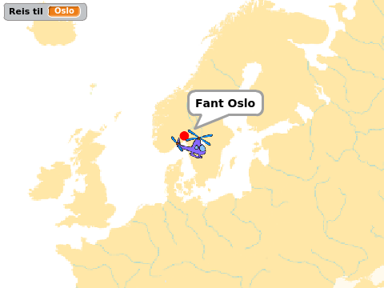
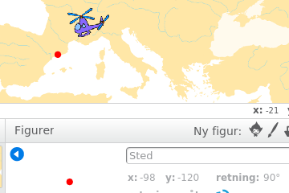
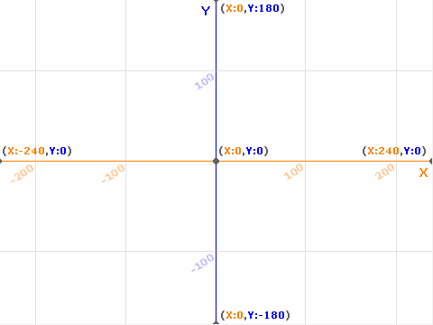
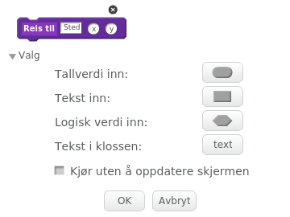

# Introduksjon {.intro}

Hvor i All Verden? er et reise- og geografispill hvor man raskest
mulig skal fly innom reisemål spredt rundt i Europa. Dette er den
andre leksjonen av tre. Her skal vi spesielt se på hvordan vi kan
gjøre kartet større enn skjermen, ved å la kartet rulle i
bakgrunnen. Underveis vil vi se litt nærmere på hva et koordinatsystem
er.

I den siste leksjonen vil lage lister som gjør det enklere å legge til
mange reisemål. Vi vil også lage en skikkelig intro til spillet.



# Steg 0: Forrige gang {.activity}

*Vi vil nå fortsette med det programmet vi laget i del 1.*

## Sjekkliste {.check}

Siden vi skal forandre og videreutvikle flere ting trenger ikke
spillet du laget i del 1 være helt perfekt. Sjekk likevel at

+ du har et helikopter som du kan styre rundt på skjermen med
  piltastene, og

+ du har en stedfigur som kan bli funnet av helikopteret.

Hvis ikke disse tingene fungerer så gå tilbake til del 1 og gjør dem
ferdige.

# Steg 1: Bakgrunnen som figur {.activity}

*Vi vil nå at bakgrunnen skal bli flyttbar. Vanlige bakgrunner i
 Scratch kan ikke flyttes. Vi må derfor "jukse litt", og la bakgrunnen
 være en figur.*

## Sjekkliste {.check}

+ Slett `Europakart`-bakgrunnen din. En helt hvit bakgrunn vil passe
  bra nå.

+ Lag en ny figur ved å klikke
   ved siden
  av `Ny figur`.  Velg filen `europakart.png` som du lastet ned
  forrige gang. Hvis du ikke har denne lett tilgjengelig kan du laste
  den ned på nytt fra [europakart.png](europakart.png).

+ Gi denne nye kartfiguren navnet `Kart`.

+ For å være sikre på at denne figuren ligger bakerst som en bakgrunn
  kan vi starte med følgende kode:

  ```blocks
  når grønt flagg klikkes
  flytt bakover (50) lag
  ```

+ Vi vil nå lage denne figuren så stor som mulig. Dessverre har
  Scratch en begrensning på hvor store figurer kan være. Du kan se
  dette om du først krysser av for at `størrelse`{.blocklooks} skal
  vises på kart-figuren. Deretter kan du endre størrelsen med

  ```blocks
  sett størrelse til (9999) %
  ```

  Du vil se at størrelsen ikke blir satt til `9999`, men til et
  mindre tall. Legg på en kloss som setter så stor størrelse som
  mulig på kartet når det grønne flagget klikkes.

+ Til bruk senere, når vi skal lage en intro til spillet, er det greit
  å `skjule`{.blocklooks} kartfiguren når det grønne flagget klikkes.

# Koordinatsystemer {.activity}

I del 1 så vi såvidt hvordan vi bruker koordinater for å beskrive hvor
helikopteret og reisemålet er på skjermen (og på kartet). Om du
trykker `i`{.blockmotion} på en figur vil du alltid se koordinatene til
figuren, som to tall `x` og `y`.



Midt på skjermen har koordinatene `x: 0` og `y: 0`. Ellers beskriver
`x` hvor et punkt er sideveis. Dersom `x` er mindre enn null er
punktet til venstre for midten, mens om `x` er positivt er punktet til
høyre for midten. På samme måte sier `y` hvor høyt på skjermen et
punkt er. `y` større enn null betyr at punktet er over midten, mens et
punkt med negativ `y` vil være nedenfor midten av skjermen.



Vanligvis passer Scratch på disse koordinatene for oss, slik at vi
ikke trenger å tenke så mye på dem.

Men nå skal vi gjøre noe litt spesielt. Vi vil skape en illusjon hvor
det ser ut som om helikopteret flytter på seg, mens det egentlig er
bakgrunnen som flytter seg. For å gjøre dette må vi lage våre egne
`X`- og `Y`-variabler som vi bruker til å koble helikopteret, stedet
og bakgrunnen.

# Steg 2: Nye kontroller for helikopteret {.activity}

*Vi vil først endre hva som skjer når vi trykker på piltastene.*

## Sjekkliste {.check}

+ Lag to nye variabler som gjelder for alle figurer. Disse skal hete
  `X` og `Y`, og vil beskrive hvor helikopteret er i forhold til
  kartet.

+ Vi skal nå endre hva som skjer når du trykker på piltastene. I
  stedet for at helikopteret skal

  ```blocks
  gå (hastighet) steg
  ```

  vil vi endre `X`{.blockdata} eller `Y`{.blockdata} med
  `hastighet`{.blockdata} eller med

  ```blocks
  ((0) - (hastighet))
  ```

  Oppdater alle fire hvis-løkkene på helikopteret.

## Test prosjektet {.flag}

__Klikk på det grønne flagget.__

+ Helikopteret skal nå __ikke__ flytte seg når du trykker på
  piltastene. Hvis helikopteret flytter seg må du slette
  `gå`{.blockmotion}-klossene.

+ Helikopteret skal fortsatt snu seg til høyre eller venstre når du
  trykker på piltastene.

# Steg 3: Flytt kartet {.activity}

*Vi kan nå flytte kartet når helikopteret flyr rundt omkring.*

## Sjekkliste {.check}

Dette steget er egentlig ganske lett. Det eneste vi må passe er at vi
skal flytte kartet __motsatt__ vei av hva helikopteret skal fly. For
eksempel, om vi vil at det skal se ut som om helikopteret flytter seg
oppover må vi flytte kartet nedover.

+ Legg til denne koden på kartet:

  ```blocks
  når jeg mottar [Nytt spill v]
  vis
  for alltid
      gå til x: ((0) - (X)) y: ((0) - (Y))
  slutt
  ```

## Test prosjektet {.flag}

__Klikk på det grønne flagget.__

+ Ser det ut som om helikopteret flytter på seg når du trykker på
  piltastene?

+ Se nøye etter. Ser du at helikopteret faktisk står på samme sted
  hele tiden?

+ Hva skjer om du flyr ut av kartet?

## Utfordring {.challenge}

Hvordan kan du begrense hvor helikopteret flyr? Kan du legge på kode
slik at helikopteret ikke kan fly ut av kartet?

# Steg 4: La stedet følge med {.activity}

*Vi må nå la reisemålet også flytte seg med kartet.*

## Sjekkliste {.check}

+ Det er litt vanskelig å teste når vi har gjort reisemålet
  usynlig. Endre derfor på gjennomsiktigheten til sted-figuren. For
  eksempel kan du sette

  ```blocks
  sett [gjennomsiktig v] effekt til (50)
  ```

+ For at det skal se ut som om stedet ligger i ro på kartet må faktisk
  sted-figuren flytte seg sammen med kartet. Vi behøver da to
  variabler som holder rede på hvor stedet skal ligge i forhold til
  kartet. Lag to variabler som heter `stedX` og `stedY`. Begge disse
  skal gjelde kun for sted-figuren.

+ Bytt ut

  ```blocks
  gå til x: (-98) y: (-120)
  ```

  med kode som setter variablene i stedet:

  ```blocks
  sett [stedX v] til [-98]
  sett [stedY v] til [-120]
  ```

+ Vi kan nå lage en helt ny blokk som flytter stedet rundt på
  skjermen.

  ```blocks
  når jeg mottar [Nytt spill v]
  for alltid
      gå til x: ((stedX) - (X)) y: ((stedY) - (Y))
  slutt
  ```

  Prøv spillet. Flytter den røde prikken seg rundt på kartet?

+ Du ser kanskje at den røde prikken ikke lenger ligger ved Barcelona?
  Det er fordi vi har laget et større kart. Da stemmer ikke lengre de
  gamle koordinatene.

  Endre verdiene for `X` og `Y` til det ser ut som om reisemålet
  ligger omtrent på riktig sted igjen.

# Steg 5: Flere steder {.activity}

*Vi skal nå se på hvordan vi relativt enkelt kan legge til flere
 reisemål i spillet vårt.*

## Sjekkliste {.check}

Om du bare ser på koden vi har lagt på sted-figuren kan det se ut som
om det er mye arbeid å legge til et nytt reisemål. Men om vi ser litt
nøyere oppdager vi at om vi vil ha et nytt sted å reise til kan vi
bruke mye av den samme koden. Vi må bare endre navnet
(`Reis til`{.blockdata}) og koordinatene (`X`{.blockdata} og
`Y`{.blockdata}).

Dette er et bra eksempel på når det kan lønne seg å bruke funksjoner,
eller lage egne klosser som man gjør i Scratch.

+ Klikk på `Flere klosser`{.blockmoreblocks} og lag en kloss som ser
  slik ut:

  

  hvor `sted` er tekst, mens `x` og `y` er tallverdier:

+ Etter at du klikker `OK` dukker det opp en ny kloss på skjermen:

  ```blocks
  definer Reis til (sted) (x) (y)
  ```

  Under denne klossen kan vi definere hva funksjonen vår skal gjøre.

+ Flytt skriptet ditt fra `Nytt sted`{.blockevents}-blokken til den nye
  funksjonen, og endre litt - spesielt i variablene - slik at
  funksjonen din ser slik ut:

  ```blocks
  definer Reis til (sted) (x) (y)
  sett [gjennomsiktig v] effekt til (100)
  sett [stedX v] til (x)
  sett [stedY v] til (y)
  sett [Reis til v] til (sted)
  vent til <berører [Helikopter v]?>
  sett [gjennomsiktig v] effekt til (0)
  si (sett sammen [Fant ] (sted))
  gjenta (5) ganger
      gjenta (10) ganger
          endre størrelse med (10)
      slutt
      gjenta (10) ganger
          endre størrelse med (-10)
      slutt
  slutt
  si []
  ```

+ Til slutt kan vi endre på `Nytt spill`{.blockevents}-blokken slik at
  vi bruker den nye funksjonen. For eksempel

  ```blocks
  når jeg mottar [Nytt spill v]
  vis
  Reis til [London] (-135) (-30) :: custom
  Reis til [Oslo] (-30) (75) :: custom
  Reis til [Barcelona] (-135) (-175) :: custom
  ```

+ Om du prøver spillet nå vil du kanskje oppdage et lite
  problem. Dersom du ikke flytter deg etter å ha funnet det første
  reisemålet, vil det neste reisemålet bli funnet automatisk. Det er
  fordi vi ikke rekker å flytte sirkelen før vi tester om den berører
  helikopteret.

  Den enkleste måten å løse dette på er å legge på klossen

  ```blocks
  vent til <ikke <berører [Helikopter v]?>>
  ```

  rett før vi venter til helikopteret berøres inne i funksjonen vår.

## Test prosjektet {.flag}

__Klikk på det grønne flagget.__

+ Flyr helikopteret rundt på kartet på en naturlig måte?

+ Fungerer reisemålene slik de skal? Ligger de omtrent der de skal
  ligge?

+ Kan du reise til flere reisemål på rad?

# Neste gang {.activity}

Spillet vårt har blitt ganske mye kulere nå! Neste gang skal vi gjøre
spillet ferdig ved å lage lister som gjør det enklere å lage en
tilfeldig reiserute. Vi skal også se hvordan vi kan lage en intro til
spillet, samt legge på en tidsbegrensning og poengsum.

## Prøv selv {.try}

+ Kan du legge til flere reisemål på egen hånd? Husk at det er lurt å
  gjøre reisemålet synlig mens du tester. Da blir det enklere å finne
  koordinatene til reisemålet!

+ Spillet blir morsommere hvis ikke reisemålene kommer i samme
  rekkefølge hver gang du spiller. Hvordan kan du få reisemålene til å
  komme i tilfeldig rekkefølge? Prøv å lage kode som gjør dette!

+ Fortsatt er ikke kartet så veldig stort. En måte å komme seg rundt
  begrensningen på figurstørrelse i Scratch er å la bakgrunnen bestå
  av flere deler. Filen [europakart.zip](europakart.zip)
  inneholder 9 kartfliser du kan prøve å pusle sammen. Du må da laste
  inn hver av dem som en egen figur. Hver av dem trenger omtrent samme
  kode som kartet vi har brukt så langt. Du må bare endre litt i `gå
  til`{.blockmotion}-klossene.
