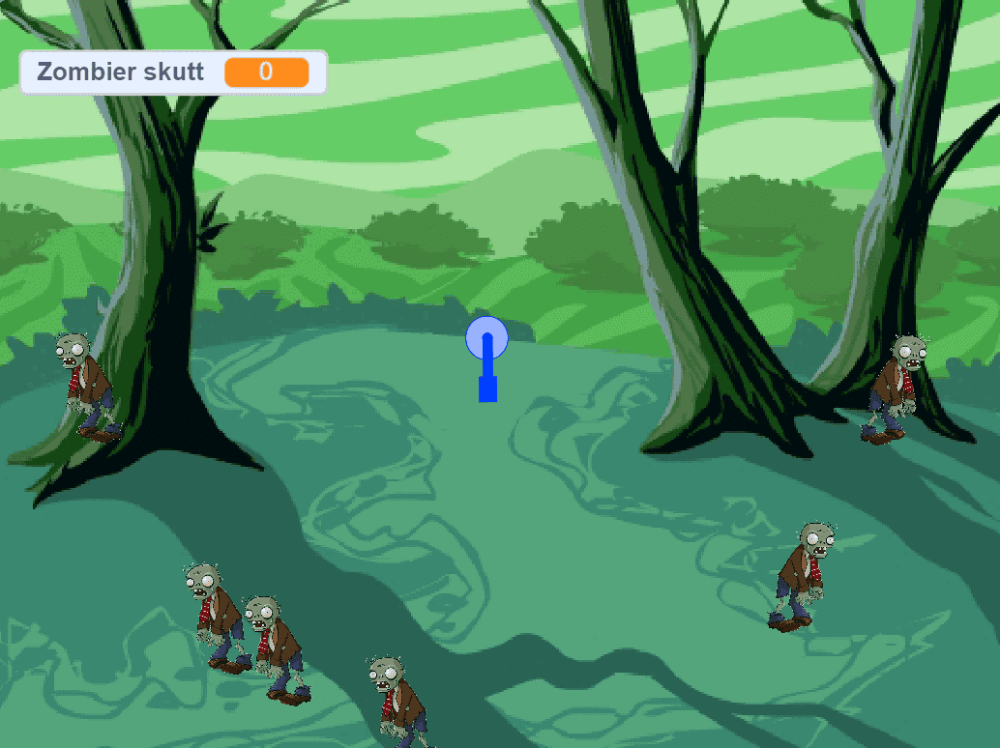

# Вступ {.intro}

Ми збираємось створити гру, мета якої – перестріляти всіх зомбі до того, як вони дістануться до нас.

# Крок 1: Зробіть ремікс на Зомбі-м'ясорубку {.activity}

*Ми починаємо з уже створеного проєкту.*

## Перевірте контрольний список {.check}

- [ ] Перейдіть за посиланням
  [https://scratch.mit.edu/projects/266969817](https://scratch.mit.edu/projects/266969817){target=_blank}.

- [ ] Подивіться всередину проєкту і натисніть кнопку реміксу.

Тепер ви отримаєте копію проєкту.

# Крок 2: Надайте можливість керувати гарматою {.activity}

*Створіть код, який дозволить вам керувати гарматою за допомогою клавіш зі стрілками.*

Begynn å legge inn kode under klossen `Når pil høyre trykkes`{.blockevents}.
Etterpå gjør du tilsvarende for pil venstre.

## Sjekkliste {.check}

- [ ] Hva må skje når pil høyre trykkes?

- [ ] Prøv å justere hvor raskt kanonen snus.

## Tips {.tip}

I Scratch er retning 0 grader rett opp, og videre følger rotasjonen klokka. Det
betyr at 90 grader er rett til høyre, 180 grader nedover, 270 grader rett til
venstre, og 360 er hele runden og retning rett opp igjen. Du finner blokker med
`Snu`{.blockmotion} og en pil mot høyre eller mot venstre. Disse vil henholdsvis
legge til og trekke fra grader på retningen.

# Steg 3: Få kanonen til å skyte automatisk {.activity}

*Lag kode som gjør at kanonen skyter zombiene automatisk.*

## Sjekkliste {.check}

- [ ] Hvordan kan kanonen vite hvor zombiene er?

## Test prosjektet {.flag}

__Klikk på det grønne flagget.__

- [ ]  Fungerer koden?

## Lagre prosjektet {.save}

Veldig bra! Nå er du ferdig og kan kose deg med spillet du har laget!

