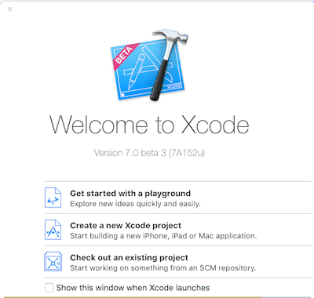
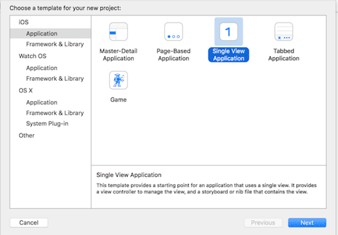

# Introduksjon {.intro}

Swift er etterfølgeren til gamle Objective-C, og lar deg lage apper for iOS og OSX. For å gjennomføre dette kurset trenger du en Mac, og helst en iPhone/iPad/iPod å teste ut appen på :) 

I dag skal vi lage vår første app, nemlig hei verden app! Det er en kjent og kjær tradisjon at det første
programmet man skriver "Hei Verden!" til skjermen. 

# Steg 1: Sette opp Xcode {.activity}

Last ned nyeste versjon Xcode fra Mac App Store, og sørg for at du har en Apple ID bruker (merk. dette programmet er gratis). Vi skal starte med å sette opp et nytt prosjekt. 

## Xcode 7 Beta vs Xcode 6 {.protip}
Denne øvelsen bruker Xcode 7 beta, men det skal fungere helt likt på Xcode 6

## Sjekkliste {.check}

+ Åpne Xcode ved å holde `cmd + mellomrom` og søk etter Xcode. Alternativt kan man søke etter Xcode med forstørrelsesglass-ikonet øverst i høyre hjørne.  

+ Du blir møtt med et vindu som lar deg gjøre en rekke ting. Du kan enten starte et nytt prosjekt, leke deg rundt i `Playground` eller se og endre på et eksisterende prosjekt. 

	

+ Trykk på `Create a New Xcode project`

	
+ En ny skjerm skal vises som lar deg velge et rammeverk for appen. Vi skal velge `Single View Application`, som gir oss et bra utgangspunkt for vår egen hei verden app!

	

+ Trykker du på `Next` blir du tatt til en skjerm hvor man må fylle inn litt informasjon. I `Product Name` kan dere navngi appen deres som dere vil (vi skal kalle vår `Hei Verden!`). `Organization Name` og `Organization Identifier` er det ikke så viktig med nå, dere kan bare la den være som den er :) `Language`skal settes til Swift, mens `Devices` skal settes til iPhone.

	

+ Lagre applikasjonen ved å trykke `next`, og deretter `create` (hvor du velger hvor prosjektet lagres)

# Steg 2: Tekst på skjermen ved bruk av en tekst etikett {.activity}

Vi skal nå legge til en tekst etikett for å så endre teksten i `Main.storyboard`.

## Sjekkliste {.check}

+ Trykk på `Main.storyboard`på venstre side av skjermen.

	

+ Zoom ut til du tydelig ser en firkantet skjerm. Dette representerer skjermen til enheten. Helt nederst i høyre hjørne av Xcode skal det være en boks, med fire kanpper på øverste rad. Vi skal velge det tredje ikonet, som ligner en hjem knapp. Helt nederst på boksen vil det være et søkefelt. Der skal vi søke etter `Label`.

+ Dra en `Label` til `Main.storyboard`, til helt øverst i venstre hjørne av det store kvadratet. Dobbeltklikk på `Label`, da dette lar oss endre teksten. Som sagt, tradisjons tro skriver vi Hei verden!, men det er helt opp til deg hva du vil skrive! :)

    

+ Nå skal vi kjøre appen, og vi gjør dette ved å trykke på den svarte pilen øverst i venstre hjørne. Alternativt kan du trykke `cmd + r` for å simulere appen!

+ Det skal nå kjøres en simulator, og en tekst hvor det står Hei verden! skal komme opp. 

# Steg 3: Få en knapp til å skrive noe til skjermen {.activity}

Vi skal nå sørge for at ved å trykke på en knapp, vil `Label` endre seg. For å kunne følge med på denne delen av kurset er det anbefalt med noe tidligere kunnskap om grunnleggende programmering

## Sjekkliste {.check}

+ For ryddighetens skyld skal vi nå starte et nytt Xcode prosjekt. Se på `Steg 1` hvis du er usikker på hvordan dette gjøres

+ Repeter stegene i `Steg 2`, og skjekk at alt fungerer som det skal 

+ I tillegg til å dra inn en `label` i `Main.Storyboard`, skal vi legge til en `button`. En `button` kan vi trykke på, og kjøre kode knyttet til den knappen. Du legger til en `button`på samme måte som du gjorde med `Label`

+ Ha `Main.Storyboard`i Xcode vinduet valgt, og trykk på de to sirklene øverst i høyre hjørnet i Xcode. Vinduet som dukker opp til venstre kalles en ViewController, og det er der hvor selve kodingen foregår

+ Venstreklikk på `Button` i `Main.Storyboard` og venstreklikk mens du holder `ctrl` nede. Dra linjen til over der hvor det står `override func didReceiveMemoryWarning()`. Det eneste du skal endre er `Connection` til å være en `Action`, mens navnet kan du velge selv.

+ Venstreklikk på `Label` i `Main.Storyboard` og venstreklikk mens du holder `ctrl` nede. Dra linjen til over `override func viewDidLoad()`, men under `class ViewController: UIViewController {`. `Connection` lar du være `Outlet`, mens navn kan du velge selv.

    

## Slippe linjen på riktig sted i koden {.protip}
Det er vikitg å slippe linjene eksakt som det står i de to stegene over!

##  Skjekkliste {.check}

+ Vi skal nå begynne å kode litt! Det er anbefalt med noe tidligere porgrammeringserfaring her.

+ Vi har nå laget to såkalte `Connections`. Den ene er `@IBOutlet weak var label: UILabel!`, som refererer til `Label` i `Main.Storyboard`. Den andre er `@IBAction func knapp(sender: AnyObject) { }`

+ Tanken nå er at når vi trykker på knappen, skal vi endre teksten til `Label`. Slik dette fungerer er at vi skal skrive `navnPåLabel.text = "Hei Verden!"` mellom `{` og `}` der du slapp knappen i koden. 

+ Kjør appen som du lærte i `Steg 2` ved å enten trykke på den svarte pilen øverst i hjørnet, eller trykk `cmd + r`

+ Trykk på knappen og observer hva som skjer! Endret `Label` seg til teksten du skrev i `navnPåLabel.text = "Hei Verden!"`?

    

## Utfordring - Variabler {.try}
Prøv å definer en variabel under `@IBOutlet weak var label: UILabel!`, og sett den til å være ditt navn. Klarer du å få `Label` til å vise verdien av variabelen, ved å endre `navnPåLabel.text = "Hei Verden!"`?

# Steg 4: Få input fra tekstfelt {.activity}

Nå skal vi legge inn et tekstfelt i appen, så vi kan ta det brukeren skriver i tekstfeltet og vise det i `Label`

## Skjekkliste {.check}

+ I dette steget kan du godt fortsette på appen vi jobbet med i `Steg 2`. Prosessen å implementere tekstfelt funksjonalitet er veldig lik som i steget over, bare litt forskjellig kode. 

+ Begynn med å søke etter `Text Field` på samme sted hvor du har søkt etter `Label`og `Button`. Dra så `Text Field` inn i `Main.Storyboard`

+ Lag en `Connection` som du gjorde i `Steg 2` og opprett den rett under `@IBOutlet weak var label: UILabel!`. Det eneste du skal endre er navnet på tekstfeltet. 

+ I `@IBAction func knapp(sender: AnyObject) { }` kan du bytte ut `navnPåLabel.text = "Hei Verden!"` med `label.text = tekstfelt.text`. Det brukeren skriver i inn i tekstfeltet vil bli lagret, og vi henter ut denne informasjonen når vi trykker på knappen. 

    

## Utfordring - Kan du lage din egen versjon? {.try}
Nå som du har lært det grunnleggende, hvorfor ikke lage en app som har flere knapper og tekstfelt? Vis gjerne appen til bekjente og be om tilbakemeldinger! 

## Noen spørsmål? {.protip}
Har du noen spørsmål angående Xcode, Swift eller ris/ros for dette kurset, send meg gjerne en mail til andreas.amundsen123@gmail.com!

Jeg tar gjerne i mot tips til ideer til fremtidige kurs også!

