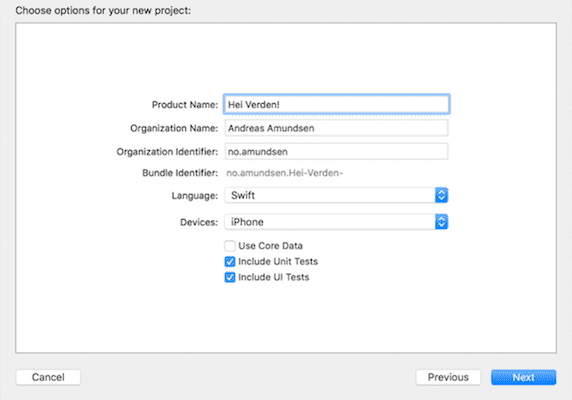
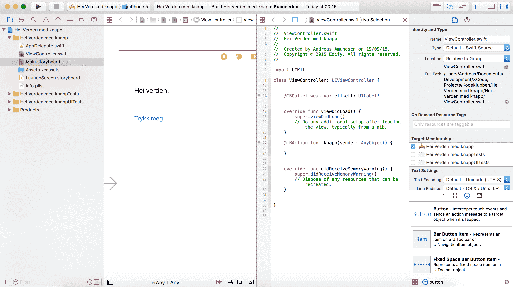

# Introduksjon {.intro}

Swift er et programmeringsspråk laget av Apple og er etterfølgeren til Objective-C. Med Swift kan du lage apper for iOS og OSX. For å gjennomføre dette kurset trenger du en Mac, og helst en iPhone/iPad/iPod å teste ut appen på :)

I dag skal vi lage vår første app, nemlig en Hei Verden-app! Det er en kjent og kjær tradisjon at det første programmet man skriver i et nytt programmeringsspråk skriver "Hei Verden!" til skjermen.


# Steg 1: Sette opp Xcode {.activity}

Xcode er Apples utviklingsverktøy, og vi skal bruke det til å skrive appen. Last ned nyeste versjon Xcode fra Mac App Store, og sørg for at du har en Apple-ID (merk. dette programmet er gratis). Vi skal starte med å sette opp et nytt prosjekt.

## Xcode 7 Beta vs Xcode 6 {.protip}
I denne øvelsen er skjermbildene og instruksjonene for Xcode 7 beta, men det skal fungere helt likt på Xcode 6.

## Sjekkliste {.check}

+ Åpne Xcode ved å holde `cmd + mellomrom` og søk etter **Xcode**. Alternativt kan du søke etter Xcode med forstørrelsesglass-ikonet øverst i høyre hjørne.

+ Du blir møtt med et vindu som lar deg gjøre en rekke ting. Du kan enten starte et nytt prosjekt, leke deg rundt i **Playground** eller se på og endre et eksisterende prosjekt.

  

+ Trykk på **Create a New Xcode project**.

+ En ny skjerm skal vises som lar deg velge et rammeverk for appen. Vi skal velge **Single View Application**, som gir oss et bra utgangspunkt for vår egen Hei Verden-app siden denne trenger bare ett skjermbilde.

  

+ Trykker du på **Next** blir du tatt til en skjerm hvor du må fylle inn litt informasjon. I **Product Name** kan du navngi appen din (vi skal kalle vår *Hei Verden!*). **Organization Name** og **Organization Identifier** er det ikke så viktig med nå, du kan bare la den være som den er :) **Language** skal settes til Swift, mens **Devices** skal settes til iPhone.

  

+ Lagre applikasjonen ved å trykke **next**, og deretter **create** (hvor du velger hvor prosjektet lagres).

# Steg 2: Tekst på skjermen ved bruk av en tekstetikett {.activity}

Vi skal nå legge til en tekstetikett for å så endre teksten i `Main.storyboard`.

## Sjekkliste {.check}

+ Trykk på `Main.storyboard` på venstre side av skjermen.

+ Zoom ut til du ser en firkantet skjerm. Dette representerer skjermen til enheten. Nederst i høyre hjørne av Xcode skal det være en boks, med fire kanpper på øverste rad. Vi skal velge det tredje ikonet, som ligner en hjemknapp. Nede i boksen vil det være et søkefelt. Der skal vi søke etter `Label`.

+ Dra en `Label` til `Main.storyboard`, og legg den helt øverst i venstre hjørne av det store kvadratet. Du må muligens dobbeltklikke på `Main.storyboard` før du får lov til å dra `Label` dit. Dobbeltklikk på `Label`, da dette lar oss endre teksten. Som tradisjonsrike skriver vi *Hei verden!*, men det er helt opp til deg hva du vil skrive! :)

  

+ Nå skal vi kjøre appen for å teste at alt fungerer. Vi gjør dette ved å trykke på den svarte pilen (playknappen) øverst i venstre hjørne. Alternativt kan du trykke `cmd + r`.

+ Det skal nå kjøres en simulator, og teksten *Hei verden!* skal dukke opp.

# Steg 3: Få en knapp til å skrive noe til skjermen {.activity}

Vi skal nå sørge for at ved å trykke på en knapp, vil `Label` endre seg. For å kunne følge med på denne delen av kurset er det anbefalt med noe tidligere kunnskap om grunnleggende programmering.

## Sjekkliste {.check}

+ Om du vil spare på den første appen du lagde kan du gjerne lage et nytt Xcode-prosjekt før du går videre. Gjenta i såfall stegene 1 og 2 og sjekk at alt fungerer som det skal.

+ I tillegg til å dra inn en `Label` i `Main.Storyboard`, skal vi legge til en `Button`. En `Button` kan vi trykke på og kjøre kode knyttet til knappen. Du legger til en `Button` på samme måte som du gjorde med `Label`.

+ Ha `Main.Storyboard` i Xcode vinduet valgt, og trykk på de to sirklene øverst i høyre hjørne i Xcode. Vinduet som dukker opp til venstre viser koden knyttet til en `ViewController`, som er den som kontrollerer hvordan app-skjermen oppfører seg. Det er her selve kodingen foregår.

+ Venstreklikk på `Button` i `Main.Storyboard`. Hold **ctrl** nede mens du venstreklikker og dra mot høyre. Dra streken til linjen over der det står `override func didReceiveMemoryWarning()`. Endre `Connection` til å være en `Action`, og gi den navnet `knapp`.

+ Venstreklikk på `Label` i `Main.Storyboard`. Hold **ctrl** nede, venstreklikk og dra streken til mellom `override func viewDidLoad()` og `class ViewController: UIViewController {`. `Connection` lar du være `Outlet`, og sett navn til `etikett`.

  

## Slippe streken på riktig sted i koden {.protip}

Det er viktig å slippe strekene eksakt som det står i de to stegene over! Disse kobler elementene i `Main.storyboard` til koden din.

##  Sjekkliste {.check}

+ Vi skal nå begynne å kode litt! Det er anbefalt med noe tidligere programmeringserfaring her.

+ Vi har nå laget to såkalte `Connections`. Den ene er `@IBOutlet weak var etikett: UILabel!`, som refererer til `Label` i `Main.Storyboard`. Den andre er `@IBAction func knapp(sender: AnyObject) { }`

+ Tanken er at et klikk på knappen skal endre teksten til `Label`. Variabelen `etikett` er koblet til `Label`. Vi kan derfor få teksten til å endre seg ved å skrive

  ```
  etikett.text = "Knappen sier: Hei!"
  ```

  mellom `{` og `}` der du slapp knappen i koden (`func knapp`).

+ Kjør appen som du lærte i Steg 2 ved å enten klikke på den svarte pilen øverst i hjørnet eller trykke `cmd + r`.

+ Klikk på knappen og observer hva som skjer! Endret `Label` seg til teksten du skrev i `etikett.text = "Knappen sier: Hei!"`? Hvis etiketten ikke viser hele `Knappen sier: Hei!"`, må du endre størrelsen på `Label`. Klarer du å gjøre det selv?

  

## Utfordring - Variabler {.try}
Prøv å definer en variabel nedenfor `@IBOutlet weak var etikett: UILabel!`, og sett den til å være ditt navn. Klarer du å få `Label` til å vise verdien av variabelen ved å endre `etikett.text`?

# Steg 4: Få input fra tekstfelt {.activity}

Nå skal vi legge inn et tekstfelt i appen, så vi kan ta det brukeren skriver i tekstfeltet og vise det i `Label`.

## Sjekkliste {.check}

+ I dette steget kan du godt fortsette på appen vi jobbet med i Steg 3. Å implementere tekstfeltfunksjonalitet er veldig likt som i steget over.

+ Begynn med å søke etter `Text Field` på samme sted hvor du har søkt etter `Label`og `Button`. Dra så `Text Field` inn i `Main.Storyboard`.

+ Lag en `Connection` som du gjorde i Steg 3 og opprett den på linjen under `@IBOutlet weak var etikett: UILabel!`. Det eneste du skal endre er navnet på tekstfeltet. Bruk `tekstfelt`.

+ I `@IBAction func knapp(sender: AnyObject) { }` kan du bytte ut `etikett.text = "Knappen sier: Hei!"` med `etikett.text = tekstfelt.text`. Det brukeren skriver i inn i tekstfeltet er tilgjengelig i `text`-egenskapen til tekstfeltet, og vi henter ut denne informasjonen når vi trykker på knappen.

  

## Utfordring - Kan du lage din egen versjon? {.try}
Nå som du har lært det grunnleggende, hvorfor ikke lage en app som har flere knapper og tekstfelt? Kanskje du kan få den til å fortelle en morsom historie basert på ord brukeren skriver inn? Vis gjerne appen til bekjente og be om tilbakemeldinger!

## Noen spørsmål? {.protip}
Har du noen spørsmål angående Xcode, Swift eller ris/ros for dette kurset, send meg gjerne en mail til andreas.amundsen123@gmail.com!

Jeg tar gjerne i mot tips til ideer til fremtidige kurs!
