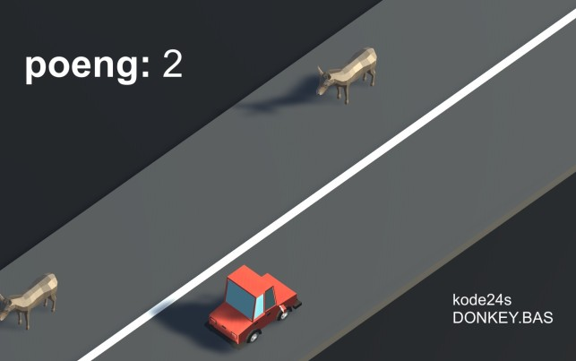
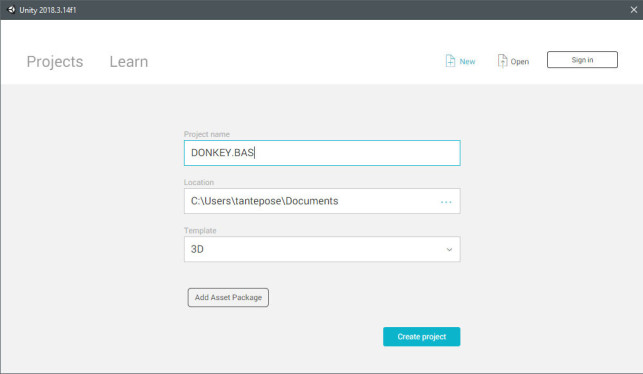
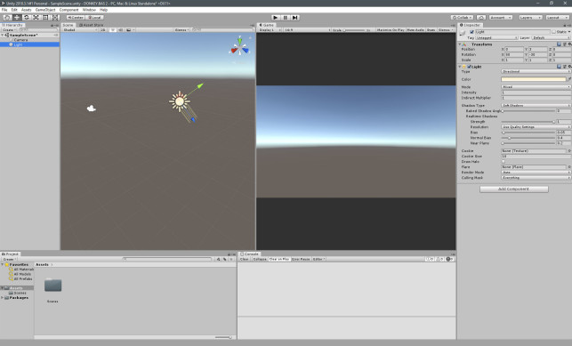
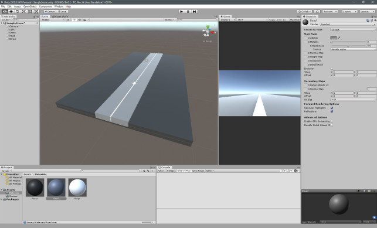
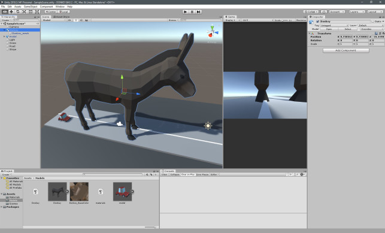
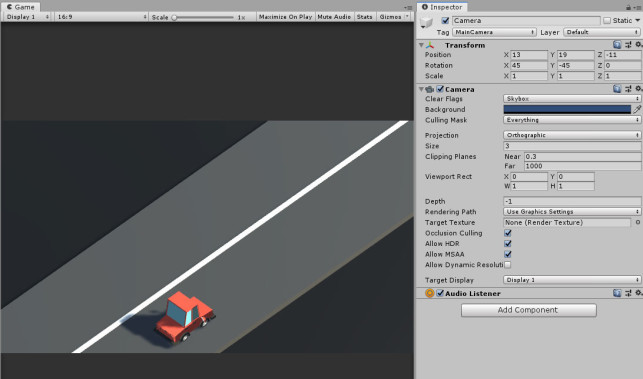
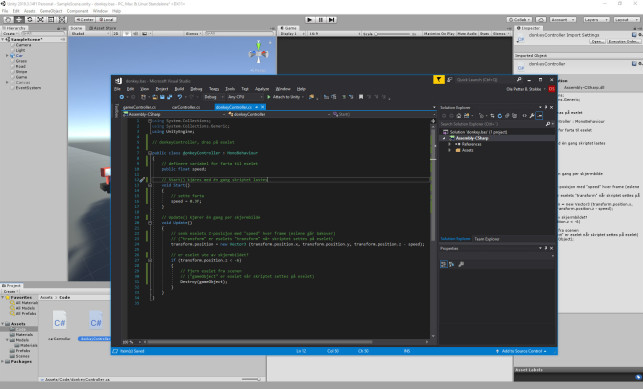
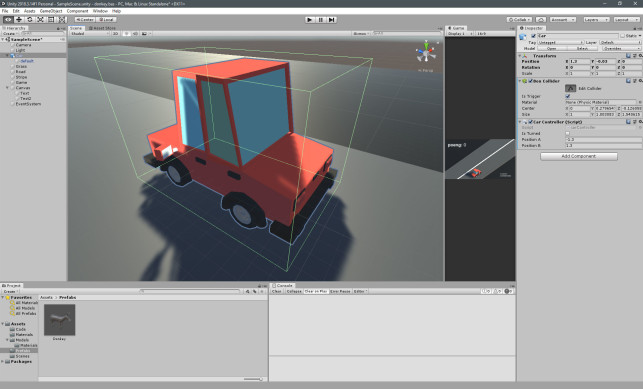
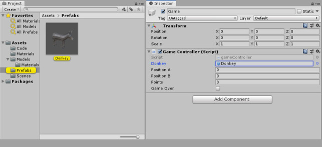

# Intro {.intro}

Du trenger ikke være proff spillmaker for å ha glede av Unity. Å lage spill med unity er helt gratis, og supergøy. 

Jeg er ingen Unity-ekspert. Og kansje du som leser dette kan langt mer om C#, som man skriver Unity-spill i. Men jeg kan litt, og forhåpentligvis nok til å skrive en nybegynner-guide som i alle fall kan få deg i gang.

Slik lager du en klone av Bill Gates (han som startet Microsoft) sitt klassiske DOS-spill DONKEY.BAS på noen timer, uten å kunne noe som helst om Unity fra før.


# 1: Starte et nytt Unity-prosjekt {.activity}
- [ ] Gå til https://store.unity.com/download?ref=personal for å laste ned Unity Hub. 
- [ ] Installer Unity. 
- [ ] Under installasjonen lager du en Unity-bruker. For ja; du trenger en Unity-bruker, men det er helt gratis.
- [ ] Etter at du har laget en bruker får du spørsmål om å lage et prosjekt. Velg et tomt 3D prosjekt og kall det DONKEY.BAS f.eks.
Hvis Unity allerede er installert får du spørsmål om pålogging eller registrering av bruker når du starter Unity. Du kan lage et nytt prosjekt, da velger du "File", "New Project", kaller det "DONKEY.BAS", for eksempel, og passer på at "3D" er den valgte template-en. Trykk på "Create Project", og vi er i gang med et nytt, tomt prosjekt.




<small><center>Lag et nytt Unity-prosjekt</small></center>


# 2: Grunnleggende bruk av Unity-editoren {.activity}
Alt i Unity tar utgangspunkt i en håndfast verden; scenen som Unity kaller det. 
Scenen har objekter du enten manuelt drar inn eller setter inn via kode, som du finner til venstre. 
Objektene har igjen komponenter, som du finner til høyre, for eksempel en "transform", som har egenskaper, for eksempel posisjonen, som har verdier, for eksempel hvor på Z-aksen objektet befinner seg.




<small><center>Slik ser editoren ut i Unity, etter at vi har dratt Game-fanen til høyre</small></center>


Prosjektet har noen standardelementer allerede, som du ser i "Hierarchy"-lista til venstre: Et kamera og en lyskilde. Alt du drar inn i spillet ditt dukker opp her. 

- [ ] Trykk sakte to ganger på de som allerede er der, og kall dem for "Camera" og "Light". Nå vet du hvordan du endrer navn på objekter.

Til høyre for lista har vi 3D-visningen av verdenen vår; "Scene". Venstreklikk for å velge objekter, trykk og hold med høyre museknapp for å snurre rundt, snurr på musehjulet for å gå inn og ut og trykk og hold med musehjulet for å bevege deg rundt. Dette kommer du til å gjøre endel, så prøv deg fram.
- [ ] Dra "Game"-fanen (ved siden av "Scene") til høyre, for å få det kameraet ser til høyre for scenen din. 

Det er dette spilleren faktisk vil se i spillet ditt. Velg "16:9" i stedet for "Free Aspect" for å låse kameraet til ett aspekt.
Helt til høyre har vi "Inspector". 
- [ ] Velg kameraet eller lyset for å se at den viser fram alle komponentene til objektene du velger, og egenskapene til disse komponentene. 

Alt kan endres i inspektoren, men også gjennom kode, og mye av det vi skal programmere er bare endringer av disse verdiene.
Nederst ser du "Project"-fanen med alle mappene og byggesteinene våre. Ikke stort foreløpig, dog. Dra "Console"-fanen til høyre for denne for å alltid kunne se feilmeldinger og loggbeskjeder.


# 3: Lag veien {.activity}
Nå trenger vi litt innhold, og det enkleste kan vi lage selv, rett i Unity. 
La oss først lage en vei, som består av grass på hver side, asfalt og en midtstripe:

- [ ] Velg "GameObject" i menyen øverst, "3D Object" og "Cube". Det dukker nå opp en kube i scenen din.
I inspektoren til høyre kan du sette posisjon og størrelser manuelt når objektet er valgt; dette er ofte enklere enn å gjøre det i 3D-visningen. 
- [ ] Sett posisjonen til 0, 0, 0 og størrelsen til 20, 1, 40. Dette er da verdier i et 3D-rom, altså X-, Y- og Z-verdien.
- [ ] Endre navnet på objektet til "Grass".
- [ ] Lag en "Cube" til for å lage asfalt, i posisjonen 0, 0, 0 og for eksempel 5, 1, 40 stor, kalt "Road". 
- [ ] Lag enda en "Cube" for å lage midtstripe, også i posisjonen 0, 0, 0 og for eksempel 0.13, 1, 40 stor, kalt "Stripe"). 
- [ ] Flytt veien litt over grasset, og stripa litt over veien, for at alt skal synes. For eksempel ved å bare endre Y-verdiene litt i "Position" på objektene.


<small><center>Med tre bokser i ulike størrelser kan vi lage noe som ser ut som en vei. Foreløpig i samme hvite og grå farger</small></center>


# 4: Lag materialene {.activity}
Nå er alt grått. Og vi vil kanskje ha det grått, men i våre gråfarger.
Vi trenger materialer, som blir våre enkle teksturer for 3D-objektene.

- [ ] Lag en ny mappe i prosjektet vårt ved å høyreklikke i Assets-mappa og velge "Create" og "Folder". Kall den "Materials".
- [ ] Høyreklikk i den nye mappa og velg "Create" og "Material".
- [ ] Kall materialet for "Grass", og trykk på fargen ved siden av "Albedo" i inspektoren. Her kan du velge hva du vil for grasset, for eksempel grønt, eller for å gjøre det mer stilistisk; sort.
- [ ] Dra materialet fra mappevisningen over grasset; enten i 3D-visningen i "Scene" eller til objektet "Grass" i lista til venstre. Og hepp; så blir det så.
- [ ] Gjenta dette for å lage materialer til veien og stripa, også, for eksempel i to andre gråtoner. Så drar du dem over på samme måte. 
Endrer du fargene på materialene nå, vil du se endringene i scenen vår øyeblikkelig, så her er det bare å leke seg fram til noe du liker.




<small><center>Med materialer ser det nå faktisk ut som en vei</small></center>


# 5: Få inn andres modeller {.activity}
Nå har vi en vei, men ingen bil eller esel. Heldigvis finnes det mange der ute som er langt bedre enn oss til å lage 3D-modeller, for eksempel på Googles Poly-tjeneste.

- [ ] Lag en ny mappe i prosjektet ditt kalt "Models".
- [ ] Gå til poly.google.com og finn en bil du liker, for eksempel den her [https://poly.google.com/view/dv8Isf3WRlE](https://poly.google.com/view/7h-gfgCLPVO). 
- [ ] Last den ned i "OBJ"-formatet, og pakk ut filene til "Models"-mappa vi nettopp lagde. 

Vet du ikke hvor denne mappa faktisk er på PC-en din, kan du høyreklikke på den i Unity og velge "Show in Explorer".
- [ ] I Unity kan du nå dra bilen inn fra "Models"-mappa til veien i scenen din.
- [ ] Nå må du kanskje skalere, rotere og flytte den, for å få den til et fornuftig sted. 

Dette kan du gjerne gjøre i inspektoren, eller i 3D-visningen, ved å velge objektet først og velge de ulike verktøyene øverst.
Disse er litt vanskelige å forklare, men bare prøv deg fram og trykk CTRL-Z når ting går galt.

- [ ] Når du er fornøyd med bilen, kan du laste ned et esel f.eks. [https://poly.google.com/view/dv8Isf3WRlE](https://poly.google.com/view/dv8Isf3WRlE) og plassere det inn på samme måte.




<small><center>Når du drar inn andres modeller i Unity kan størrelser og slikt fort være feil. Dette eselet må først forminskes, så roteres andre vei, og så plasseres på riktig sted.</small></center>


# 6: Sette kamera og lys {.activity}
Nå ser forhåpentligvis scenen din grei ut; vel og merke i scene-visningen, ikke gjennom kameraet. Så la oss sette kameraet slik vi vil ha det. 
Dette er ærlig talt litt knotete, så juks gjerne og kopier mine innstillinger:

- [ ] Sett kameraets posisjon til 13, 11, -11. Sett rotasjonen til 45, -45 og 0. Ikke tenk på skaleringen, så la den stå på 1, 1, 1.
- [ ] Vi går for en isometrisk stil, som delvis kommer av vinklene vi allerede har satt, men også ved å velge "Orthographic" under "Perspective".
- [ ] Sett "Size" til 3.

Nå ser det forhåpentligvis allright ut. Er objektene dine nå i feil posisjon, er det trolig enklere å flytte dem enn kameraet.




<small><center>Her ser du innstillingene til kameraet</small></center>


Siste hånd på verket er å sette opp lyset:

I denne scenen har vi allerede et såkalt "directional"(retningsbestemt) lys. Det betyr at det er samme hvor lyskilden er i scenen, mens rotasjonen er det som avgjør. Tenk på det som en leselampe som lyser den veien den peker, bare at lampens posisjon ikke spiller noen rolle.
- [ ] Lek deg med rotasjonen av lyset til du finner noe du liker, ved å velge lyset og endre verdiene i inspektoren til høyre.
- [ ] Prøv deg fram med "intensity" og "color" for å finne noe du liker. For eksempel kan du velge en litt oransje farge og ikke for mye intensitet for gi en solnedgang-aktig atmosfære.
Da er vi snaaart klare for å faktisk programmere litt.


# 7: Planen bak et Unity-spill {.activity}
Aller først bør vi selvfølgelig tenke litt på hva vi vil.

Konseptet bak DONKEY.BAS er en bil som prøver å unngå esler på veien. Bilen kjøre liksom langs en uendelig lang vei, men det er enklere å programere det slik at eslene komme mot bilen mens bilen står stille. 
Bilen skal kunne svinge fra høyre til venstre og motsatt, ved å trykke på én knapp. Den kan bare ha to mulige posisjoner, som vi veksler mellom.
Spilleren skal få ett poeng per esel hun klarer å unngå. Men enda enklere for oss er det være å gi ett poeng per esel som er satt ut i spillet.
Spillet er ferdig når spilleren har truffet et esel, så vi må finne en måte å oppdage dette på.
Kodingen i Unity gjør vi i språket C#. Vi skriver ett og ett skript til de ulike objektene vi skal styre. Skriptet blir da en komponent på objektet, på samme måte som alt annet i Unity. Vi trenger ett skript for eslene, ett for bilen og ett for selve spillet.




<small><center>Visual Studio Community følger med Unity</small></center>


# 8: Kode eselet {.activity}
- [ ] Lag en ny mappe i prosjektet ditt kalt "Code", og så skal vi endelig kode litt. 

All koden vi skal skrive finner du også på kode24.no sin [Github](https://github.com/kode24-kode/donkey.bas).

Vi skal plassere ut eslene tilfeldig etterhvert som spillet spilles. Men foreløpig kan vi ta utgangspunkt i det ene eselet vi har i scenen vår; det er dette vi senere skal klone. Og det eneste eselet trenger å gjøre er å bevege seg mot bilen.

- [ ] Høyreklikk i code-mappa og velg "New Script". Kall det "donkeyController". 
- [ ] Dra fila til eselet ditt, så vil all koden og alle referanser i koden bare gjelde eselets objekt. 
- [ ] Dobbeltrykk på fila for å åpne Visual Studio Community, som er editoren som gratis følger med Unity.

Du ser at det allerede finnes kode her inne; funksjonen `Start()` kjører når skriptet lastes i scenen, og `Update()` kjøres kontinuerlig under spilling. 
For å få noe til å bevege seg kan vi bruke denne funksjonen, men eslene vil da bevege seg raskere på raskere maskiner. Så i slike tilfeller bør vi heller bruke funksjonen `FixedUpdate()`, som skal kjøre like ofte på alle maskiner.
Mye av kodingen i Unity endrer bare verdier i komponentene til objektene våre, på samme måte som vi kan i inspektoren vår. For å få noe til å bevege seg, trenger vi derfor bare å endre X, Y eller Z-verdiene til "position"-egenskapen i komponenten "transform" i `FixedUpdate()`-funksjonen.
Vi trenger en variabel for farta eslene skal bevege seg i. Denne definerer vi rett etter at klassen starter, og setter verdien i `Start()`-funksjonen. Slike verdier kan også settes i inspektoren i editoren.
Til slutt trenger vi å fjerne eselet når det er ute av skjermbildet, så ikke spillet vårt får massevis av meningsløse esler i det store intet. Derfor skal vi sjekke Z-posisjonen til eselet og fjerne det om det overstiger en viss verdi. Slike verdier kan du finne ved å bare bevege eselet i scene-visningen og lese av posisjonsverdiene i inspektoren.
Dermed ender vi opp med koden under, med overdrevent mange kommentarer. Når koden er dratt på eselet, og du trykker på play-knappen øverst i editoren, vil du forhåpentligvis se at eselet løper mot bilen, og forsvinner.

```csharp
using System.Collections;
using System.Collections.Generic;
using UnityEngine;
 
// donkeyController, dras på eselet
public class donkeyController : MonoBehaviour
{
    // definere variabel for farta til eselet
    public float speed;
 
    // kjøres med én gang skriptet lastes
    void Start()
    {
        // sette farta
        speed = 0.3F; 
    }
 
    // vil fyres av kontinuerlig under spilling
    void FixedUpdate()
    {
        // senk eselets Z-posisjon med "speed" hver frame (eslene går bakover)
        // ("transform" er eselets "transform" når skriptet settes på eselet)
        // (vi må lage en "new Vector3" for å skrive inn X, Y og Z-verdier)
        transform.position = new Vector3 (transform.position.x, transform.position.y, transform.position.z - speed);
 
        // er eselet ute av skjermbildet?
        if (transform.position.z < -6)
        {
            // fjern eselet fra scenen
            // ("gameObject" er eselet når skriptet settes på eselet)
            Destroy(gameObject);
        }
    }
}
```


# 9: Kode bilen {.activity}
Så var det bilen, den må kunne svinge for å unngå eslene, og oppdage at den har krasjet med ett av dem. La oss ta det første først:
For å oppdage at spilleren har trykket på en knapp, kan vi bruke `Input.GetKeyDown()` inne i `Update()`-funksjonen (ikke `FixedUpdate()` som i stad, da vi vil oppdage tastetrykk så raskt det lar seg gjøre). Vil vi la spilleren trykke på space, trenger vi bare ha en if-setning med `if (Input.GetKeyDown("space"))`.
Hvis space trykkes ned, skal altså bilen snus. Vi lager først en boolean-variabel kalt `isTurned` som vi enkelt kan skru av og på.
For at bilen faktisk skal flytte seg må vi bare ha en if-setning i `Update()`-funksjonen som sjekker hvilken tilstand `isTurned` har, og flytter bilens X-posisjon til enten `positionA` eller `positionB`. Hva disse to skal være finner man igjen ut ved å bare flytte bilen i editoren og se hva som funker.

Unity har systemer som oppdager kollisjoner for oss; altså når et objekt treffer et annet. Dette kan være litt knotete, da Unity gjerne vil at du bruker hele fysikkopplegget deres, mens vi bare vil oppdage kollisjonene. Men dette må vi gjøre før vi begynner å kode:

- [ ] Velg eselet ditt, trykk på "Add Component" nederst i inspektoren, skriv inn for eksempel "box" og velg "Box Collider".
- [ ] Zoom deg inn på eselet i scenen og trykk på "Edit Collider" i inspektoren. 
- [ ] Juster boksen ved å dra i prikkene og snu deg rundt med kameraet, så boksen dekker hele eselet ditt og ingenting mer. Det er nemlig denne boksen, ikke 3D-modellen, kollisjonene tar utgangspunkt i.
- [ ] Trykk på "Add Component" igjen og skriv inn og velg "Rigidbody". Huk av "Is Kinematic", så den ikke begynner å sprette rundt i scenen vår.
- [ ] Velg bilen og legg til "Box Collider" på samme måte her. Huk av "Is Trigger" og sjekk at denne boksen også dekker hele bilen og ingenting mer som i punktet over. Bilen trenger ingen rigidbody, så det hopper vi over.




<small><center>Den grønne boksen du ser rundt bilen er kollisjonsboksen. Den må være like stor som bilen for at kollisjonene skal bli så riktige som mulig.</small></center>


Da kan vi endelig kode hva som skal skje om et esel treffer bilen vår, i samme "carController.cs" som i stad.

Når bilen kolliderer med et annet objekt som har en Rigidbody og en Box Collider, vil funksjonen OnTriggerEnter()-funksjonen fyre av. Altså fordi vi har en Box Collider også på bilen, hvor "Is Trigger" er satt på. Inntil videre kan vi bare legge inn en loggbeskjed når dette skjer, med `Debug.Log()`-funksjonen.
Da står vi igjen med koden under, og du kan teste kollisjonen ved å plassere eselet så det vil kræsje med bilen og lese av beskjeden i konsollen:
```csharp
using System.Collections;
using System.Collections.Generic;
using UnityEngine;
 
// carController, dras på bilen
public class carController : MonoBehaviour
{
    // variablene for bilstyring
    public bool isTurned;
    public float positionA;
    public float positionB;
 
    void Update()
    {
        // trykkes space ned?
        if (Input.GetKeyDown("space"))
        {
            // snu bilen i teorien
            isTurned = !isTurned;
 
            // snu bilen i praksis
            if (isTurned)
            {
                // sett X-posisjon til positionA, uten å endre Y- og Z-posisjoner
                transform.position = new Vector3(positionA, transform.position.y, transform.position.z);
            }
 
            else
            {
                // sett X-posisjon til positionB, uten å endre Y- og Z-posisjoner
                transform.position = new Vector3(positionB, transform.position.y, transform.position.z);
            }
        }
    }
 
    // kjører når bilen kolliderer med esel
    private void OnTriggerEnter()
    {
        Debug.Log("kræsj");
    }
}
```


# 10: Kode spillets logikk {.activity}
Det mangler fortsatt endel; spesielt det å få flere tilfeldige esler inn i spillet vårt. Vi trenger da å se på eselet vårt som en "prefab", som vi kan klone inn i scenen vår fra kode - hvor og når vi vil. Vi trenger også en spillkontroller i scenen vår, som skal holde oversikt over alt som foregår.

Først må vi lage en prefab av eselet vårt og et nytt, tomt objekt for spillets hovedkontroller:
- [ ] Lag en ny mappe i prosjektet kalt "Prefabs". 
- [ ] Dra eselet ditt fra scenen og inn i denne mappa for å gjøre eselet til, nettopp, en prefab.
- [ ] Lag et nytt, tomt objekt i scenen din, ved for eksempel å høyreklikke i listevisningen til venstre og velge "Create Empty". Kall objektet "Game". 
- [ ] Lag et nytt skript kalt "gameController" i Scripts-mappa, og dra dette skriptet til Game-objektet.
- [ ] Dobbeltrykk på gameController.cs og lag en ny variabel kalt `Donkey` av datatypen `GameObject`. Denne skal inneholde esel-prefaben din. 
- [ ] Gå tilbake til editoren, velg det nye Game-objektet ditt, og `Donkey`-variabelen skal dukke opp i inspektoren din. 
- [ ] Dra Donkey-prefaben fra Prefabs-mappa til variabelen.




<small><center>Ved å dra esel-prefaben til Donkey-variabelen i Game-objektet blir det teoretiske eselet et faktisk esel vi kan plassere ut.</small></center>


Så kan vi begynne å kode litt mer:

Posisjonene hvor eslene kan havne skal være de samme som posisjonene bilen kan stå på. Da kan vi kopiere dem fra bil-skriptet, ved å først finne bil-objektet, velge skript-komponenten og så hente ut den aktuelle variabelen.
For å få tilfeldige esler jevnt fordelt kan vi bruke en Unity-funksjon kalt `InvokeRepeating()`. Denne kjører en annen funksjon etter en gitt tid, og så igjen og igjen som en puls.
Funksjonen for å plassere eslene trenger bare å plukke én av to posisjoner, for eksempel ved å trekke 0 eller 1 tilfeldig, og plassere eselet på en av de to posisjonene med `Instantiate()`-funksjonen. Denne plasserer en prefab ut i scenen på et gitt punkt, med en gitt rotasjon.
Til sist skal vi gi poeng per esel som er plassert ut, og ha en `gameOver`-boolean - som vi senere skal bruke for å definere om spillet er over eller ikke.
Og da sitter vi igjen med noe slikt:

```csharp
using System.Collections;
using System.Collections.Generic;
using UnityEngine;
 
// gameController, dras på "Game" 
public class gameController : MonoBehaviour
{
    // alle variablene vi trenger
    public GameObject Donkey;
    public float positionA;
    public float positionB;
    public int points;
    public bool gameOver;
 
    // kjører med en gang spillet lastes
    void Start()
    {
        // få posisjonene vi trenger til eslene fra bilens skript
        positionA = GameObject.Find("Car").GetComponent<carController>().positionA;
        positionB = GameObject.Find("Car").GetComponent<carController>().positionB;
 
        // kjør PlaceDonkey() hvert halvte sekund
        InvokeRepeating("PlaceDonkey", 0.5f, 0.5f);
    }
 
    // plassere esler tilfeldig på veien
    void PlaceDonkey()
    {
        // er spillet fortsatt i gang?
        if (!gameOver)
        {
            // få tallet 1 eller 0
            int oneOrZero = Random.Range(0, 2);
 
            // plassere esel på posisjon A eller B om 1 eller 0
            if (oneOrZero == 0)
            {
                Instantiate(Donkey, new Vector3(positionA, -0.3f, 9), Quaternion.Euler(0, -180, 0));
            }
 
            else
            {
                Instantiate(Donkey, new Vector3(positionB, -0.3f, 9), Quaternion.Euler(0, -180, 0));
            }
 
            // gi poeng per esel som er satt ut
            points++;
        }
    }
}
```


# 11: Kode grensesnittet {.activity}
For å vise spilleren hvor mange poeng hun har, og klarte å få før hun døde, trenger vi noe tekst på skjermen. Unity har systemene klare - først trenger vi et nytt objekt i scenen vår:

- [ ] Lag et nytt objekt i scene-lista; "Text" under "UI"-kategorien. Du vil da få tre nye objekter; et "Canvas"-objekt, med "Text"-objektet under seg, og en "EventSystem". "EventSystem" kan du bare slette.
- [ ] Velg "Canvas"-objektet og sett "Render Mode" til "Screen Space - Camera", sett "Plane Distance" til 10, og sett "UI Scale Mode" til "Scale with screen size".
- [ ] Velg "Text"-objektet og sett Y-posisjonen til 0. Så er det bare å skrive inn noe tekst og eksperimentere deg fram med fontstørrelser, plassering og slikt til du finner noe du liker. Knoting er løsningen på mye i Unity.


Da kan vi faktisk skrive noe til dette fra koden vår, i "gameController.cs". Aller først må du få inn et nytt bibliotek, for å manipulere grensesnittet, så etter de `using`-setningene som allerede er i skriptet vårt putter vi inn `using UnityEngine.UI;`.

Under `points++;` kan vi nå først finne "Text"-objektet, og så endre "text"-egenskapen i "Text"-komponenten til det vi vil:

```csharp
GameObject.Find("Text").GetComponent<Text>().text = "<b>poeng:</b> " + points;
Og etter "if (!gameOver);" kan vi legge til noe som skjer om det faktisk blir game over:

else
{
    GameObject.Find("Text").GetComponent<Text>().text = "Game over! Du fikk " + points + " poeng.";
}
```

Men når skal det bli game over? Jo; når bilen krasjer med et esel. Så vi kan gå tilbake til "carController.cs" og bytte ut konsoll-beskjeden vår. Her finner vi altså "Game"-objektet, velger komponenten som er skriptet vårt, og setter `gameOver`-variabelen i den til true:

```csharp
// kjører når bilen kolliderer med esel
private void OnTriggerEnter()
{
    GameObject.Find("Game").GetComponent<gameController>().gameOver = true;
}
```

Puh; da skal alt være klart. Trykk på play, og se hva som ikke funker. For noe er det garantert. Som nevnt finner du all koden til de tre skriptene våre samla på kode24s [Github](https://github.com/kode24-kode/donkey.bas).


<small><center>Her er spillet i all sin prakt, kjørt i fullskjerm fra en .exe-versjon i Windows.</small></center>


## Utfordring 1: Veien videre {.challenge}
Spillet vårt blir ikke sommerens store farsott; variasjonen er minimal, du må stoppe og starte spillet på nytt mellom hver game over, det er ingen lyd, og i det hele tatt.

Men det kan du jo fikse nå! Eller bare fikle litt på de små ting som kan få stort utslag. Kanskje du vil ha eslene tettere? Da bare senker du tiden mellom hver gang PlaceDonkey() kjøres. Kanskje du vil ha raskere esler? Da bare øker du bare "speed"-variabelen.

## Utfordring 2: Bygg spillet slik at du kan dele det med vennene dine {.challenge}

Akkurat nå er det jo kun du som kan spille spillet ditt.  Se om du klarer å bygge det slik at du kan dele det med vennene dine!

Med Unity kan du bygge spillet ditt for blant annet Windows, Linux, Mac og web, i tillegg til Android, iOS og spillkonsoller.
Og vil du dele spillet ditt med andre, er det bare å trykke på "File", "Build Settings", "Add Open Scene" og velge hvordan du vil bygge spillet ditt. Det er faktisk så enkelt som det.

Denne guiden ble altfor lang, men kunne vært enda lenger. For det er sikkert ting og tang jeg gjør her som burde forklares bedre, og det er sikkert ting jeg gjør som ikke gjøres på beste måe i hverken C#-programmering eller Unity-bruk. Men jeg håper du har lært noe om Unity, og har lært deg noen teknikker som lar deg lage langt mer interessante spill enn dette.


Denne guiden ble først publisert på [Kode24.no](https://www.kode24.no/guider/nybegynner-guide-til-a-lage-spill-i-unity/71243018)