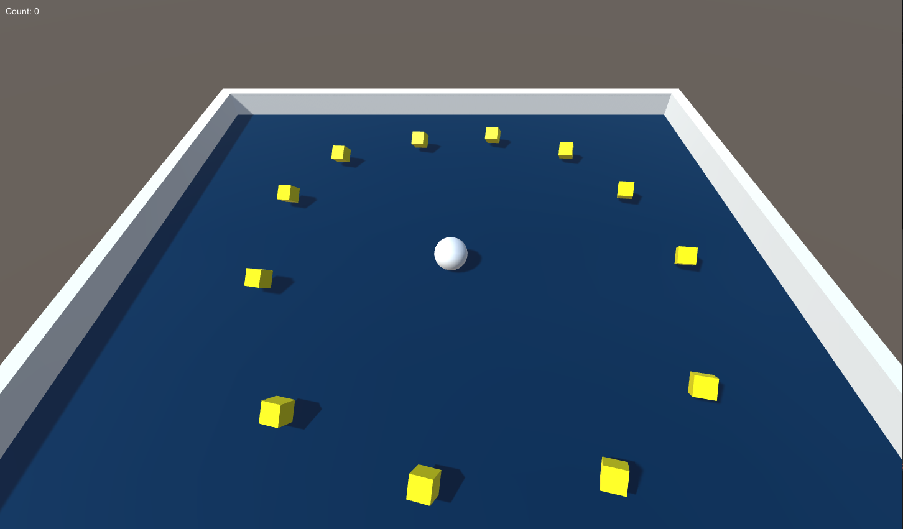

# Rull-en-ball {.intro}
Denne uka skal vi lage vårt første spill! Spillet går ut på å være en ball og
samle inn kuber for å få poeng. Spillet er over når man har samlet inn alle
kubene.

Denne oppgaven tar utgangspunkt i [Roll-a-Ball på Unity sine sider](http://unity3d.com/learn/tutorials/projects/roll-ball-tutorial).
Titlene i denne oppgaven er lenket direkte til videoene på Unity sine sider
der det er aktuelt. Du finner også lenker til alle videoene på [unity3d.com/learn/tutorials/projects/roll-ball-tutorial](http://unity3d.com/learn/tutorials/projects/roll-ball-tutorial).

# Steg 1: Omgivelser og spilleren {.activity}

## [Introduksjon](http://unity3d.com/learn/tutorials/projects/roll-a-ball/introduction?playlist=17141)


Bildet nedenfor viser hvordan spillet ser ut når man er ferdig! I
denne oppgaven lærer vi litt enkel fysikk, hvordan vi kan flytte
spillobjekter med tastaturet, og kollisjon mellom objekter.



## [Oppsett av spillet](http://unity3d.com/learn/tutorials/projects/roll-a-ball/set-up?playlist=17141) {.check}
- Start med å lage et nytt 3D-prosjekt.
- Lagre Scenen, __File > Save Scene__, legg den i en ny mappe `Assets/_Scenes` og
  kall den `Minigame`.
- Lag brettet vi skal spille på. Dette er et 3D-plan. Du finner den i hierarkiet under __Create > 3D Objekt > Plane__. Kall dette objektet `Ground`.
- Flytt brettet til origo, `(0, 0, 0)`, ved å trykke på tannhjulet i
  Transform-komponenten og velge __Reset__.
- Skru av Grid-lines på Scenen. Dette finner du under __Gizmos > Show Grid__.
- Lag bakken litt større. Dette kan du gjøre med å dra på pilene eller skrive
  det manuelt inn på høyresida. Vi setter Scale til `2` på `x`, `1` på `y` og
  `2` på `z`.
- Lag en spiller! Fra hierarkiet __Create > 3D Object > Sphere__ og gi den
  navnet `Player`. Tilbakestill posisjonen på samme måte som vi gjorde med planet.
- Flytt ballen opp `0.5` enhet slik at vi får den til å ligge på planet. Husk at
  ballen er 1 høy og 1 bred. Husk at det er y-posisjonen vi endrer med `0.5`.
- La oss bytte farge på brettet. Vi lager en ny mappe i Assets-mappa vår og gir
  den navnet `Materials`. Velg denne mappa og lag et nytt material og kall den
  `Background`. Endre farge ved å trykke på den hvite boksen til høyre for
  `Albedo`-feltet og velg en fin blåfarge. Du kan bruke RGB-verdien `(0, 32, 64)`.
- Lag brettet blått ved å dra `Background`-materialet til brettet i Scenen.
- For å få bedre lys i spillet kan vi endre rotasjonen på lyset i
  hierarkiet vårt. Endre rotasjon på y-aksen til `60`.


## [Bevege spilleren](http://unity3d.com/learn/tutorials/projects/roll-a-ball/moving-the-player?playlist=17141) {.check}
- Siden vi vil at ballen skal rulle rundt på brettet, kollidere i vegger og treffe
  forskjellige objekter for å samle poeng trenger vi litt fysikk. Dette får vi
  ved å legge til en Rigidbody-komponent på `Player`-objektet. Trykk på __Add
  Component__ når du har valgt spilleren og velg __Physics > Rigidbody__.
- Lag en ny mappe `Assets/Scripts` og et nytt C#-script som vi kaller
  `PlayerController`. Koden vi skal legge inn der er det best å skrive selv.

  Siden noen av dere jobber hjemmefra legger vi inn hele kodesnutten under. Ikke
  kopier den, men skriv inn alle linjene!

  __PlayerController.cs__
  ```csharp
  using UnityEngine;
  using System.Collections;

  public class PlayerController : MonoBehaviour {

      public float speed = 10.0f;

      private Rigidbody rb;

      void Start ()
      {
          rb = GetComponent<Rigidbody>();
      }

      void FixedUpdate ()
      {
          float moveHorizontal = Input.GetAxis ("Horizontal");
          float moveVertical = Input.GetAxis ("Vertical");

          Vector3 movement = new Vector3 (moveHorizontal, 0.0f, moveVertical);

          rb.AddForce (movement * speed);
      }
  }

  ```

- Siden vi vil at scriptet skal styre ballen må vi dra det inn på `Player`-objektet.

## Test spillet {.flag}
__Klikk på Play-knappen øverst i Unity-editoren.__

- Trykk på piltastene, flytter ballen seg?
- Hva skjer hvis du prøver å styre med tastene WASD?


# Steg 2: Kamera og spilleområde {.activity}

## [ Flytte kameraet](http://unity3d.com/learn/tutorials/projects/roll-a-ball/moving-the-camera?playlist=17141) {.check}
- Flytt først kameraet opp 10 enheter (på y-aksen) og vipp det ned med 45
  grader (x-aksen).
- Flytt kameraet til et *barn* av `Player`-objektet, dette vil gjøre at kameraet
  følger etter spilleren. Et *barn* er et programmeringsbegrep som betyr at noe
  er *under* noe annet, f.eks. en undermappe. Du gjør kameraet til et *barn* av
  `Player`-objektet ved å dra det og slippe det på `Player`-objektet i hierarkiet.
  Se at kameraet (nesten) flytter seg med spilleren.
- Test spillet og se hva som skjer.
- Siden ikke alt gikk etter planen må vi lage et script for å flytte kameraet.
  Flytt kameraet tilbake ut av `Player`-objektet slik at det ikke snurrer rundt
  lengre.
- Lag et nytt C#-script som du kaller `CameraController` og legg til koden:

  __CameraController.cs__
  ```csharp
  using UnityEngine;
  using System.Collections;

  public class CameraController : MonoBehaviour {

      public GameObject player;

      private Vector3 offset;

      void Start ()
      {
          offset = transform.position - player.transform.position;
      }

      void LateUpdate ()
      {
          transform.position = player.transform.position + offset;
      }
  }

  ```

- Dra scriptet over til kameraet og med kameraet valgt dra `Player`-objektet til
  Player-referansen på høyresida.

## Test spillet {.flag}

__Klikk på Play-knappen øverst i Unity-editoren.__

- Flytt ballen og se at kameraet følger etter den.


## [Sette opp spilleområdet](http://unity3d.com/learn/tutorials/projects/roll-a-ball/setting-up-the-play-area?playlist=17141) {.check}

- La oss lage noen vegger! Lag et nytt tomt objekt som du kaller `Walls`.
  __Create > Create Empty__. Dette blir en mappe for alle veggene. Tilbakestill
  posisjonen til Walls til `(0, 0, 0)`.
- Lag første vegg. __Create > 3D Object > Cube__ og tilbakestill posisjonen til
  denne. Sjekk at ballen havner oppi denne kuben. Legg denne som et barn av
  Walls og kall den `West Wall`.
- Lag veggen lang og tynn. Under Scale setter vi `0.5`, `2` og `20.5`.
- Flytt veggen til siden ved å sette `x` til `-10`.
- Dupliser veggen vi har og kall den `East Wall`. Endre x-posisjon til `10` og
  se at den kommer på plass.
- Dupliser `East Wall` og kall den `North Wall`. Tilbakestill posisjonen og sett
  scale til `20.5`, `2`, `0.5`. Sett posisjon på z-aksen til `10` for å se at
  den kommer på riktig plass.
- Dipliser `North Wall` og kall den `South Wall`. Sett posisjon på z-aksen til
  `-10`.

## Test spillet {.flag}

__Klikk på Play-knappen øverst i Unity-editoren.__

- Prøv spillet og se at veggene er på plass.


# Steg 3: Samle objekter og poeng {.activity}

## [Lag objekter vi kan samle inn](http://unity3d.com/learn/tutorials/projects/roll-a-ball/creating-collectables?playlist=17141) {.check}
- Lag en kube vi kan samle inn. __Create > 3D Object > Cube__ og kall den
  `Pick Up`.  Tilbakestill posisjonen og se at ballen havner inni denne kuben.
- Deaktiver `Player`-objektet.
- Flytt opp kuben med 0.5 enheter og sett scale til 0.5 i alle aksene. La oss
  tippe den litt over. Endre rotasjon til 45 på alle aksene.
- La oss få kuben til å snurre litt for å tiltrekke oppmerksomhet.
- Lag et nytt C#-script og kall det `Rotator`. Legg til koden:

  __Rotator.cs__
  ```csharp

  using UnityEngine;
  using System.Collections;

  public class Rotator : MonoBehaviour {

      void Update ()
      {
          transform.Rotate (new Vector3 (15, 30, 45) * Time.deltaTime);
      }
  }

  ```

- Start spillet og se at kuben snurrer rundt. Husk å legge til scriptet i
  `Pick Up`-objektet.
- Siden vi trenger mange kuber må vi gjøre `Pick Up`-objektet om til en *Prefab*.
  En Prefab er en slags skisse for hvordan et spillobjekt skal se ut og oppføre
  seg.
- Lag en ny mappe og kall den `Prefabs`. Dra `Pick Up`-objektet inn i denne mappa.
- Lag en nytt tomt objekt for å organisere objektene våre. Kall dette `Pick Ups`
  og legg `Pick Up` til her.
- Endre synsvinkel til rett over spillebrettet og lag 10 nye kuber ved å
  duplisere `Pick Up`-objektet vi har. Legg kubene rundt omkring på brettet.
- Start spillet og se at alle kubene snurrer.
- La oss endre fargen på kubene! Dupliser `Background`-materialet og kall det
  `Pick Up`. velg en fin gulfarge under Albedo og dra den ned på `Pick Up`-prefaben.

## Test spillet {.flag}

__Klikk på Play-knappen øverst i Unity-editoren.__

- Start spillet og se at alle kubene er gule og snurrer rundt!

## [Samle inn objekter](http://unity3d.com/learn/tutorials/projects/roll-a-ball/collecting-pick-up-objects?playlist=17141) {.check}
- Vis spilleren igjen.
- Legg merke til at `Player`-objektet har en Sphere Collider-komponent. Denne skal vi bruke
  til å sjekke kollisjon mot `Pick Up`-objektene.
- Åpne `PlayerController`-scriptet igjen og legg til funksjonen under i
  PlayerController-klassen:

  ```csharp
  void OnTriggerEnter(Collider other)
  {
      if (other.gameObject.CompareTag ("Pick Up"))
      {
          other.gameObject.SetActive (false);
      }
  }
  ```

- Velg `Pick Up`-prefaben og legg til en ny **Tag** vi kaller `Pick Up`. Det er
  veldig viktig at den heter `Pick Up`. __Husk store bokstaver på P og U!__
- Prøv spillet og se hva som skjer.
- For å hindre at Unity lager en kollisjon mellom ballen og kubene må vi krysse
  for __Is trigger?__ på `Box Collider`-komponenten til `Pick Up`-prefaben.
  Dette gjør at Unity registrerer at de to objektene har kollidert, men den
  flytter ikke på noen av objektene.
- Test spillet og se at alt er som det skal!
- (BONUS) For å gjøre en liten optimisering kan vi legge til en Rigidbody-komponent
  til kubene. Prøv å spille spillet nå. Se at alle kubene faller gjennom gulvet.
  Dette er fordi vi har satt en `Trigger-collider` til kubene. Sett __Is Kinematic__
  for å fikse dette. Les mer om dette på [tutorialen](http://unity3d.com/learn/tutorials/projects/roll-a-ball/collecting-pick-up-objects?playlist=17141).


## [Vis poengscore](http://unity3d.com/learn/tutorials/projects/roll-a-ball/displaying-text?playlist=17141)  {.check}
- Vi trenger noen variabler for å holde styr på hvor mange objekter vi har
  samlet inn.
- Åpne `PlayerController` og endre det til å være som følger:

  __PlayerController.cs__
  ```csharp
  using UnityEngine;
  using System.Collections;

  public class PlayerController : MonoBehaviour {

      public float speed;

      private Rigidbody rb;
      public int count;                                   // Ny linje

      void Start ()
      {
          rb = GetComponent<Rigidbody>();
          count = 0;                                      // Ny linje
      }

      void FixedUpdate ()
      {
          float moveHorizontal = Input.GetAxis ("Horizontal");
          float moveVertical = Input.GetAxis ("Vertical");

          Vector3 movement = new Vector3 (moveHorizontal, 0.0f, moveVertical);

          rb.AddForce (movement * speed);
      }

      void OnTriggerEnter(Collider other)
      {
          if (other.gameObject.CompareTag("Pick Up"))
          {
              other.gameObject.SetActive (false);
              count = count + 1;                          // Ny linje
          }
      }

  }
  ```

- Sjekk at `count` endres når vi treffer kubene.
- Vi trenger noe på skjermen som viser poengene våre. Under hierarkiet, lag et
  nytt `Text`-objekt (__Create > UI > Text__). Gi objektet navnet `CountText`.
- Endre farge på teksten til hvit og endre posisjon til `(0, 0, 0)`. Størrelsen til
  CountText skal være 160 bred og 30 høy. Endre teksten som står der til `Count
  Text`.
- Flytt teksten øverst til venstre. Trykk på firkanten inne i Rect Transform og
  velg __top left__ mens du holder inne __shift__ og __alt__.
- Endre Pos X og Pos Y til `10` og `-10`.
- Nå vil vi endre denne teksten med `PlayerController`-scriptet. Åpne det opp og
  endre det til:

  __PlayerController.cs__
  ```csharp
  using UnityEngine;
  using UnityEngine.UI;                                   // Ny linje
  using System.Collections;

  public class PlayerController : MonoBehaviour {

      public float speed;
      public Text countText;                              // Ny linje

      private Rigidbody rb;
      private int count;

      void Start ()
      {
          rb = GetComponent<Rigidbody>();
          count = 0;
          SetCountText ();                                // Ny linje
      }

      void FixedUpdate ()
      {
          float moveHorizontal = Input.GetAxis ("Horizontal");
          float moveVertical = Input.GetAxis ("Vertical");

          Vector3 movement = new Vector3 (moveHorizontal, 0.0f, moveVertical);

          rb.AddForce (movement * speed);
      }

      void OnTriggerEnter(Collider other)
      {
          if (other.gameObject.CompareTag("Pick Up"))
          {
              other.gameObject.SetActive (false);
              count = count + 1;
              SetCountText ();                            // Ny linje
          }
      }

      void SetCountText ()                                // Ny linje
      {                                                   // Ny linje
          countText.text = "Count: " + count.ToString (); // Ny linje
      }                                                   // Ny linje
  }
  ```

- Dra CountText inn i Count Text-referansen til `Player`-objektet.
- Lagre og test spillet!
- Lag et nytt UI Text-ojekt og kall det Win Text. Lag teksten hvit, sett
  skriftstørrelse til 24 og sett den sentrert i midten. Sett teksten til å være
  `Win Text` og flytt den litt opp. Pos X skal være 0 og pos Y skal være 10.
- Lagre og gå tilbake til `PlayerController`-scriptet.
- Lag en ny variabel `winText`, initialiser den i `Start` og endre den i `SetCountText`.
  Når du har kodet ferdig skal det se slik ut:

  __PlayerController.cs__
  ```csharp
  using UnityEngine;
  using UnityEngine.UI;
  using System.Collections;

  public class PlayerController : MonoBehaviour {

      public float speed;
      public Text countText;
      public Text winText;                                // Ny linje

      private Rigidbody rb;
      private int count;

      void Start ()
      {
          rb = GetComponent<Rigidbody>();
          count = 0;
          SetCountText ();
          winText.text = "";                              // Ny linje
      }

      void FixedUpdate ()
      {
          float moveHorizontal = Input.GetAxis ("Horizontal");
          float moveVertical = Input.GetAxis ("Vertical");

          Vector3 movement = new Vector3 (moveHorizontal, 0.0f, moveVertical);

          rb.AddForce (movement * speed);
      }

      void OnTriggerEnter(Collider other)
      {
          if (other.gameObject.CompareTag("Pick Up"))
          {
              other.gameObject.SetActive (false);
              count = count + 1;
              SetCountText ();
          }
      }

      void SetCountText ()
      {
          countText.text = "Count: " + count.ToString ();
          if (count >= 12)                                // Ny linje
          {                                               // Ny linje
              winText.text = "You Win!";                  // Ny linje
          }                                               // Ny linje
      }
  }
  ```

## Test spillet {.flag}

__Klikk på Play-knappen øverst i Unity-editoren.__

- Prøv spillet og se hvor fort du klarer å samle inn alle kubene!


## Utfordring 1: Bygg spillet slik at du kan dele det med vennene dine {.challenge}
Akkurat nå er det jo kun du som kan spille spillet ditt. I [denne videoen](http://unity3d.com/learn/tutorials/projects/roll-a-ball/building?playlist=17141)
vises det hvordan man kan bygge spillet til forskjellige platformer, for eksempel
Windows eller Mac. Se om du klarer å bygge det slik at du kan dele det med
vennene dine!
