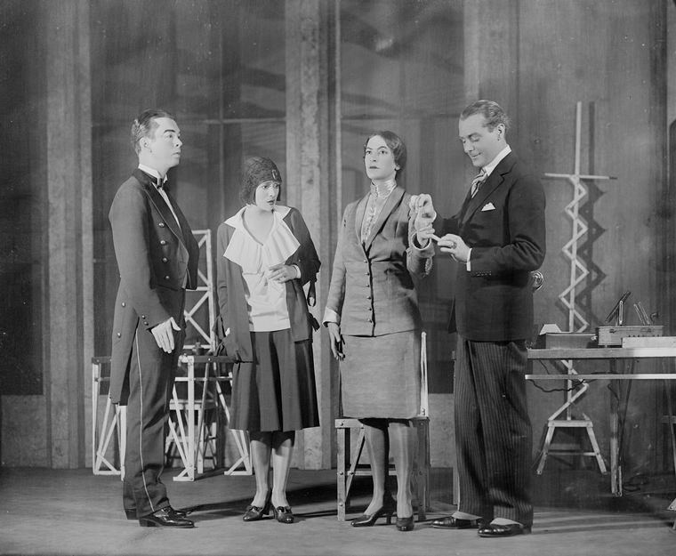
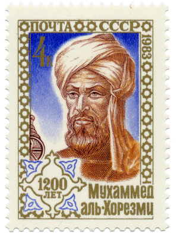
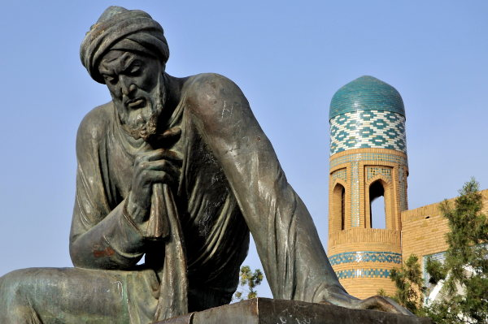
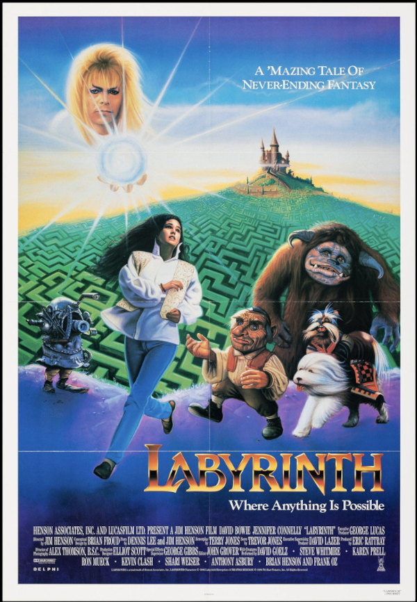
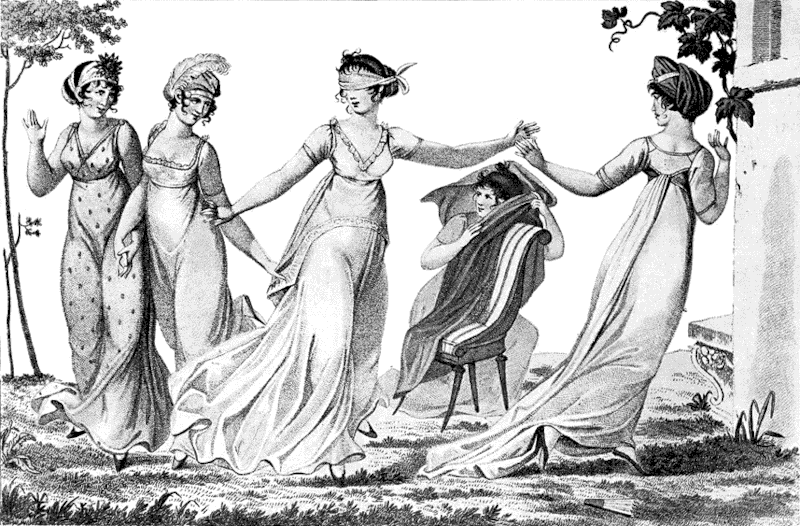
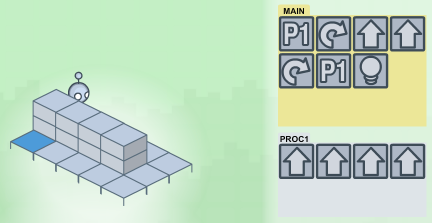
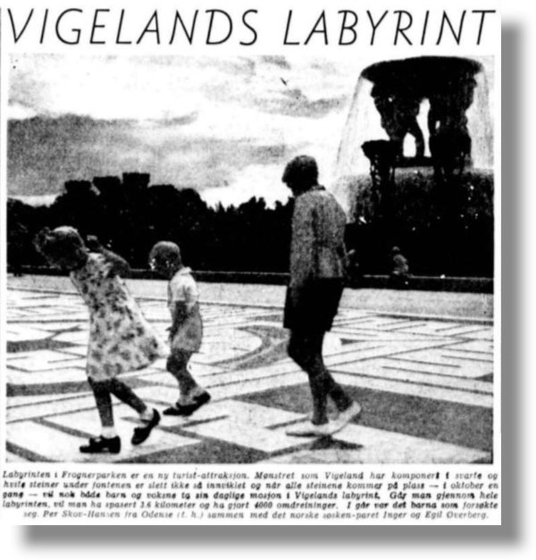
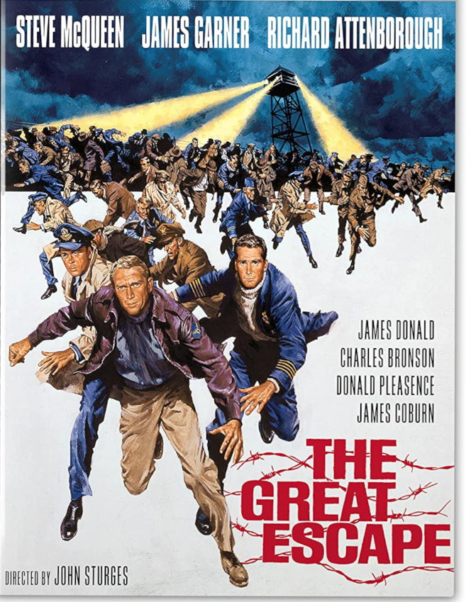
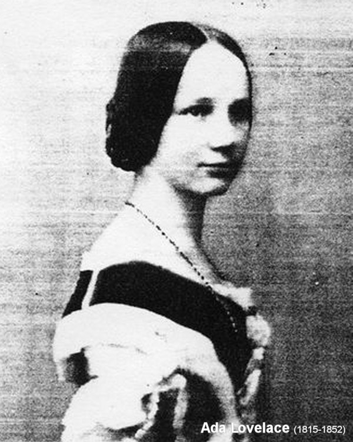
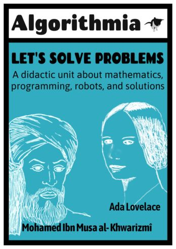

## 
# Algoritmia:{.intro}
# ei innføring i matematikk, programmering, problemløsning, og roboter...

#

# Uten datamaskin {.tip}
- Oppgaven er ment som en **lærerveiledning**, og gjennomføres i grupp på klasseromet.
- Algoritmia er ment både for lærer uten programmering erfaring som vil starte med koding for barn, og for første innledning av programmering for barn. Den trenger lite materiel og tid (heller ikke datamaskiner), og kunnskap nivå om programmering begrep kan settes opp og ned om behov.
- Formålet er å utføre en lekert og dyp følt først introduksjon om programmering og computing som verktøy for å løse problemer, utforske gjennom samspill de grunnleggende kunnskapene, prinsipper og ferdigheter som kreves for å ta opp og forsøke å løse noen form for problem, og å peke på kunnskapdeling, samarbeid og kommunikasjon som hovedprosess hjørnesteiner.

#

# Målene & læringsutbytte{.activity}

## Kunnskap

- Grunnleggende begreper i matematikk: algoritmer, problem, løsning, grupper, sekvens, symbol, tegn, operander, resultat, rutenett, kart, orientering, koordinatsystem.

- Grunnleggende begreper i programmering og databehandling: språk, programmeringsspråk, program, programmerer, funksjon, kommandoer, script (manus), inngang, utgang, kompilator, kjøretid, rekursjon, iterasjon, robot, m.m.

- Grunnleggende begreper og metoder for problemløsning.

## Ferdigheter

- Grafisk og oral uttrykk, romlig orientering, autonomi, kapasitet til å analysere komplekse situasjoner og kontekster, samarbeid og deltakende ferdigheter anvendt på problemløsning.

## Prosedyrer
- Gruppespill, delta i samling til å evaluere prosesser og resultater, opprettelse og bruk av grafisk symbolikk språk anvendt på reelle
situasjoner, opprettelse av kart, tegning, skriving og utførelse av programmer og algoritmer.

## Verdier og holdninger

- Verdsettelse av kommunikasjon - samarbeid - respekt - solidaritet - teamarbeid som grunnleggende verktøy for problemløsning og felles velvære og trivsel.

# Forberedelser {.activity}

- [ ] Enkeltøkt (50 / 110 minuter med pause)

- [ ] 2 lommetørkle for å bind for øynene på "robotene"

- [ ] 2 baller eller bokser

- [ ] En tavle, kritt

- [ ] Papir og blyant for deltakerne

- [ ] Litt ro, ikke for mye :)

# Aktivitetet 1 - Hallo Verden! {.activity}

## {.tip}
Improviser! Det handler om å finskrue nivåen til folket!
#

- [ ] Halo! (...) Hallo verden er det enkleste programmet programmerere bruker når de ønsker å innføre et nytt **programmeringsspråk**. Og det er som regel bare et program som viser disse ordene, en program som hilser, som en dag forventer vi, skall en robot hilse oss av seg selv. Vi vil lære litt om programmering i dag. Hvem kan fortelle hva programmering er bra for?

- [ ] Ja, for å **løse problemer, akkurat**. I dag skal vi snakke om problemer og hvordan vi løser dem... Vet noen hva som er et problem? Har noen et eksempel? Og hva er en løsning?

- [ ] Det var en gang, for lenge, lenge siden, en mann som het **Muhammad ibn Mūsā al-Khwārizmī**, -**Al-Khuwarizmi**- som han ble kalt, oppfunnet **algebra**, som betyr "**endring**". Han oppfant og beskrevet et sett av enkle operasjoner, som hovedsakelig besto av å bevege ting - **tall**, **mengder** - fra ett sted til et annet, noe som bidro enormt til å løse matteproblemer som **ligninger** bedre enn noensinne. Det var en Revolusjon. De nye metoder han utviklet var så gode og praktiske at **vi i dag kaller serien av trinn eller instruksjoner å følge for å løse et problem, en algoritme**.

- [ ] **Al-Khuwarizmi**s navn betyr "**fra Khuarizmi**" som er en østpersisk by i **Usbekistan** som heter **Khiva** nå, som er litt av en **labyrint** med noen av de vakreste vegger, dører og tårn du noen gang kan finne. Men han levde i **Bagdad**, og noen sier at han kjente tyven til Bagdad, og han jobbet i **Visdomshuset**. Og det er takket være ham og hans arbeid at vi bruker tallene vi bruker nå her i Europa.

## {.tip}
Det er mulig å strekke seg litt her på de to matematiske operasjonene (**reduksjon** og **balansering** [**Hisab al-jabr w’al-muqabala** (kan oversettes med «**gjenopprettelse og forenkling**»)]) som er kjernen i hans verk, hvorav den ene gir navnet til **Algebra**, og tilpasse det til barnas nivå. Selv om de er både enkelt nok, var de faktisk et massivt fremskritt for vitenskapen.
#

- [ ] Algoritmer er list med instrukser. For demonstrasjon skal jeg skrive noe instrukser på tavle og dere må følge dem.

## {.tip}
Skriv da første program på tavla: "Si "Hallo verden!". (Men hvem sier det, og hvordan, or når?) Det går an å improvisere noe moro òg...

# Aktivitetet 2 - Vår egen programmeringspråk, la os spille! {.activity}

Innføring til grunnleggende datakonsepter og problemløsning, og forklaring av første spillet (5/10 min) Vi lager en slags datamaskin av oss selv og klasseromet, og definere sammen en først og helt vårt programmeringsprøk.

- [ ] Programmering brukes hovedsakelig til å løse problemer. Og et program er en algoritme for å løse et bestemt problem. Programmerere skriver programmer. De bruker **programmeringsspråk**, som er som menneskelige språk. Disse språkene har **ord**, **kommandoer** eller **instruksjoner** og **navn** eller **adjektiver** for å definere ting, og uttrykke handlingene (bevegelser, relasjoner), nevne skuespillerne, rollene og deltakere (mennesker, ting) eller beskrive konteksten (tid, rom, humør), som alle andre språk.
Vi kommer til å definere et enkelt problem, og vi skal bruke et kritt på tavla (eller en penn på tavla) for å *lage en enkel programmeringsspråk* og dermed hjelpe oss med å løse problemet vårt.

- [ ] En "robot" må ut av klassen, men for å åpne døren må den først finne nøkkelen. Nøkkelen er en ball som vi i hemmelighet har plassert i gulvet et sted. Vi trenger noen frivillige.

- [ ] Ei programmerer skriver kommandoene (som setninger) : **flytt fremover**, **sving til høyre**, **sving til venstre**, **se ned på gulvet etter nøkkelen**, **åpne døren**...

## Husk! {.tip}
Det er barna (eller elev-lærerne :)) som skal lage eget programmeringsspråk. De må avtale i grupp hvilken kommandoer som skal brukes. Du starter med å skrive dem på norsk, som vanlig menneskelig språktekst.
Vil de oppmuntre deg å skrive tegn i stedet for en helt setning?
Det var lurt!

#

- [ ] Da vil hun bestemme hvilken kommando hun skal bruke etter behov ved å peke på den på tavla.

- [ ] En annen "sanntids" "kompilator"  ellers **runtime compiler** elev vil lese høyt kommandoen.

- [ ] Roboten vil da følge instruksjonene hun mottar.

- [ ] Vi gjør en enkel test slik at alle vet hvordan det fungerer, og så velger vi frivillige til å lage et løp der to lag vil prøve å finne ballen og komme seg ut av klassen først.

# Aktivitetet 3 - Ut av labyrinten! (30 min) {.activity}

## Ut av labyrinten! - økt 1
To lag konkurrerer om å få roboten ut av labyrinten så fort som mulig. Robotene går denne gangen med **bind for øynene**. Det **bør være** et nivå av **forvirring**. Og det er bra, best hvis det er litt kaos. De to lagene snakker i det minste samtidig, desorientert robotene når de mottar flere instruksjoner, de andre elevene i klassen, som ikke har blitt instruert til å avstå fra deltakelse, vil sannsynligvis prøve å hjelpe eller forvirre robotene, de vil rope (der!, der!, til høyre!, Nei! Andre veien! osv.).

## Litt kaos er bra!{.tip}
Hvis kaos ikke oppstår spontant, bør det oppmuntres (ved hjelp av synonymer for hver kommando (flytt og gå, sving og snu deg, kanskje gjøre bevegelser av utålmodighet for å "motivere" de mer rastløse, gi vage instruksjoner, juble høyt selv eller til og med "jukse"). Øvelsen bør avbrytes før et lag kan komme seg ut av klassen hvis det er mulig.
#

## Vurdering av opplevelsen så langt, forbedring av programmeringspråket og gjennomførelsen

- [ ] Nå må klassen dele sine tanker om spillet og tenke sammen hvordan de kan forbedre det.

- [ ] Minst tre hovednøkkelbegreper skal dukke opp. **Støy**, **synkronisitet** og **navn**.

- [ ] Elever må debattere og finne løsninger for å begrense støyen og for å unngå overlappende roping av vilkårlige kommandoer, til uspesifiserte mål, for å unngå forvirring.

- [ ] Vi kan også forkorte programmene, ved hjelp av tall ved siden av kommandoer, i stedet for å gjenta hver mange ganger.
(5 --> i stedet for --> --> --> --> -->)

- [ ] Viktige konsepter knyttet til programmering kan brukes til å definere ulike deler av prosessen med å gjøre spillet enklere, ved å forbedre kommandoene og organisere dem i grupper eller redusere støy og finne andre bedre måter å kommunisere og utføre oppgaven på. Her er en kort liste: **programming language**, **command**, **object**, **property**, **runtime**, **compiler**, **memory**, **function**, **input**, **output**, **DRY** (Don't Repeat Yourself), **optimization**, **lists**, **loops**, **conditionals**, **variables** and **values**...
[ programmeringsspråk, kommando, objekt, egenskap, kjøretid, kompilator, minne, funksjon, input, output, DRY (Ikke gjenta deg selv), optimalisering, lister, looper, betingelser, variabler og verdier...]

- [ ] **LightBot** var et tidlig og morsomt spill om programmering fremhevet i Hour of Code, og er nyttig for en leken introduksjon av første grunnleggende konsepter som **looper** og **prosedyrer**/**funksjoner**.  [https://lightbot.com/hoclearn.html](https://lightbot.com/hoclearn.html){:target=_blank}

## Ut av labyrinten! - økt 2

## {.tip}
Vi gjentar det tidligere spillet, men nå spiller bare deltakerne mens resten av klassen legger merke til stillhet og vi introduserer forbedrelser som var omtenkt før.
#

- [ ] Lagene spiller hver på sin tur, og utsteder bare én kortere, bedre definert kommando, og kaller roboten som må utføre kommandoen ved navn. Vi må se at nå fungerer alt på en mye mer flytende måte.

- [ ] Hvis tiden ikke er et problem, vil de sannsynligvis ønske å spille igjen, siden de fleste av dem ikke fikk sjansen til å spille en aktiv rolle i spillet. Men i så fall kan vi gjøre et par ting her. En, introdusere noe nytt konsept i pausen - som opprinnelsen til ordet robot, og to, kanskje endre reglene litt, men la dem faktisk endre dem etter noen debatt, med sine egne ideer, kanskje foreslå at i stedet for racing ett lag mot den andre, spillet være denne gangen rundt om å samarbeide alt sammen for å gjøre noe?

# Robots {.activity}

- [ ] Hvem vet hva en robot er? La barna pratte sammen litt om roboter.

- [ ] I **1920** skrev **Karel Čapek** og tok til teatret med store suksesser et skuespill om menn og kvinner som er laget på en fabrikk, og ser akkurat ut som normale mennesker, bortsett fra at de ikke er født av en mor, men fabrikkert i fabrikken, "**Rossum's Universal Robots (R.U.R.)**" [**Rosumovi Umeli Roboti**] fabrikken, som også var navnet på stykket, og (angivelig) ikke har noen følelser, behov eller ønsker, og (angivelig) ikke kan få barn, og da ble de (ikke angivelig) solgt som slaver til å arbeide og arbeide og ikke noe mer enn arbeide. Er det noen som gjetter hvordan det ender? Men det var Karels bror, **Josef Čapek**, som foreslo ordet robot, og også brukte det i en novelle, men denne er en annen fortelling.

  ](./Fairytale-Ball--Beauty-and-the-Beast--Rose-Vincent-1933.jpg)

## {.tip}
**Robot** var en forkortelse for **robotnik**, fra tsjekkisk robotnik "**tvangsarbeider**", fra robota "tvangsarbeid, obligatorisk tjeneste, slaveri", fra robotiti "å jobbe, slave", fra en gammel tsjekkisk kilde som ligner på Old Church Slavonic rabota "tjeneste", fra rabu "slave", fra old slavisk orbu - fra PIE orbh - "**pass fra en status til en annen**" (se foreldreløse). Det slaviske ordet er dermed en fetter til tysk Arbeit "arbeid" (Old High German arabeit).

# Aktivitetet 4 - Den store flukten! {.activity}

(10/15 min.)

- [ ] Nå vil vi bruke kommandoene vi har lært / opprettet for å planlegge hver enkelt av oss vår egen flukt.

- [ ] Ved hjelp av papir og blyant vil vi hver - eller i par, bedre - skrive algoritmen for å få ballen (nøkkel / skatt) midt i klasserommet og komme seg ut gjennom døren.

- [ ] Noen vil skrive programmet før du har hatt tid til å forklare oppgaven og kjøre for å vise den til deg.

- [ ] Andre vil ønske å stå opp og følge veien til nøkkelen og døren og skrive programmet mens de utfører det, slik at de kan telle de nødvendige skritt nøyaktig.

- [ ] Noen andre kan tenke på å tegne en overhead plan av klassen og tegne programkommandoene i plottet labyrinten selv.

- [ ] De bør oppfordres til å hjelpe hverandre og dele sin taktikk for å takle oppgaven.

# Oppsummering {.activity}

## Konklusjoner

Avslutning, konklusjoner og farvel (5 / 10 minutter)

- [ ] Først av deler vi de forskjellige tilnærmingene klassen har funnet for å utføre oppgaven: direkte skriving, gå langs, plotte et kart, tildele oppgaver, finne ut den korteste ruten, forenkling av skrivingen av programmet, kanskje ved hjelp av nye kommandoer, osv...

- [ ] Deretter spør vi hvordan det hele var, og om de tror hva de gjorde i dag og hva de lærte vil være nyttig i fremtiden og hvordan.

- [ ] De bør uttrykke seg fritt før vi oppsummerer alt, muligens ved hjelp av deres innspill.

- [ ] Vi har fulgt en rekke trinn som er felles for nesten alle situasjoner der vi trenger å løse et problem eller utføre en oppgave, både individuelt og i gruppe.

- [ ] Først velger eller definerer vi problemet.

- [ ] Vi bruker eksempler for å avklare. Vi former dem sammen. Rydd opp i tvilen før vi starter.

- [ ] Vi praktiserer problemet, vi kommer inn i saker, å komme oss ut av labyrinten, i vårt enkle tilfelle. Ved hjelp av verktøyene vi har avtalt og fant ut sammen.

- [ ] Et programmeringsspråk som vi har blitt enige om, og vi alle forstår, med noe koder, symboler som indikerer handlinger.

- [ ] Vi mislykkes.

- [ ] Vi innser at noen ting ikke fungerer bra, de kan forbedres.

- [ ] Støy, kaotisk samtidighet, unødvendig gjentagelse av kommandoer, roboter som ikke vet at kommandoene er for dem, osv...

- [ ] Så stopper vi og tenker som en gruppe, og snakker om hva som gikk galt og hva som gikk riktig, og finner vi ut løsninger på hvert mindre problem.

- [ ] Vi stiller tvil fram. Veldig viktig, å spøre.

- [ ] Hvis det er noe vi ikke vet om problemet, hvis vi kanskje til og med trenger å omdefinere problemet, eller hvis vi mangler data, eller trenger å utforske spillets regler og se om vi kanskje bør endre dem.

- [ ] Så spør vi igjen. Oss selv og andre. Og hvis vi fortsatt trenger mer, så spør vi, hvem vet mer om dette?

- [ ] Er det noen bøker om labyrinter og hvordan komme seg ut av dem, kanskje burde vi gå til biblioteket? Noen som er ekspert på å unnslippe labyrinter?

- [ ] Så prøver vi å komme oss ut av labyrinten igjen, denne gangen med nye ideer og nye metoder.

- [ ] Vi har perfeksjonert programmeringsspråket vårt, og måten vi kjører programmene på, så alt går bedre denne gangen. Vi er alle litt flinkere til å unnslippe labyrinter.

- [ ] Definere, prøv, del, omdefinere om nødvendig, spør, spør hvem som vet mer, planlegg, lag verktøy, symboler eller oppdage eller velge nye konsepter og metoder, prøv igjen, del kunnskapen din og utforsk igjen, finn nye, enda mer spennende problemer. Dette er en mulig algoritme for å opprette eller finne nye algoritmer for å løse om ethvert problem du noen gang kan møte.

- [ ] Har dere noen spørsmål? Hadde alle det gøy?

- [ ] En konklusjon som bør komme opp er at det er lettere å løse problemer sammen, dele informasjon og erfaringer, eksperimentere problemet sammen og snakke om det og spørre og stille spørsmål og omdefinere etter behov, jobbe i team.

- [ ] Da bør kanskje lærerne komme seg ut av klasserommet og lese høyt programmet De bruker for å komme seg ut. «Ta til venstre, ta til venstre, gå, gå, gå, håndhilsing, gå, ta til høyre, håndhils, smil, gå, gå, gå, gå, gå, gå, ta til venstre, åpne dør, snu deg, vinke hånd, si farvel, smil, gå bakover, lukk døren, fortsett å smile…

## Problemløsning algoritme

#

# Spranget fra matematikk til datamaskiner {.activity}

-  Vi begynte å snakke om en mann hvis navn brukes til å definere løsningene på problemer. Så vi bør slutte med en annen person.

-  Vet du hvem som regnes som den **første personen som noen gang forestilte seg en "regnemaskin"** og anerkjente sitt fulle potensial, **for å løse ikke bare matematiske problemer, men alle slags problemer**, faktisk, og regnes også som **første personen som noen gang skrevet et dataprogram**, og dermed den **første programmereren noensinne**?

-  Ja! Det er den fascinerende **Ada Lovelace**!

# Vi ønsker å vite mer! {.activity}

- Om **Al-Khuwarizmi**
  - [ ] [https://en.wikipedia.org/wiki/Muhammad_ibn_Musa_al-Khwarizmi](https://en.wikipedia.org/wiki/Muhammad_ibn_Musa_al-Khwarizmi){:target=_blank}
  - [ ] [https://snl.no/Mohamed_Ibn_Musa_al-_Khwarizmî](https://snl.no/Mohamed_Ibn_Musa_al-_Khwarizmî){:target=_blank}
  - [ ] [https://no.wikipedia.org/wiki/Al-Khwârizmî](https://no.wikipedia.org/wiki/Al-Khwârizmî){:target=_blank}
- Om algoritmer
  - [ ] [https://snl.no/algoritme](https://snl.no/algoritme){:target=_blank}
  - [ ] [https://no.wikipedia.org/wiki/Algoritme](https://no.wikipedia.org/wiki/Algoritme){:target=_blank}
  - [ ] [https://ordbokene.no/bm,nn/search?q=algoritme&scope=ei](https://ordbokene.no/bm,nn/search?q=algoritme&scope=ei){:target=_blank}
- Om Algebra
  - [ ] [https://en.wikipedia.org/wiki/History_of_algebra#Al-jabr_wa'l_muqabalah](https://en.wikipedia.org/wiki/History_of_algebra#Al-jabr_wa'l_muqabalah){:target=_blank}
  - [ ] [https://ordbokene.no/bm,nn/search?q=algebra&scope=ei](https://ordbokene.no/bm,nn/search?q=algebra&scope=ei){:target=_blank}
  - [ ] [https://snl.no/algebra](https://snl.no/algebra){:target=_blank}
- Om Programmering
  - [ ] [http://oppgaver.kidsakoder.no/index.html](http://oppgaver.kidsakoder.no/index.html){:target=_blank}
- Om **Ada Lovelace**
  - [ ] [https://codepen.io/mi-mina/full/dXwjvk](https://codepen.io/mi-mina/full/dXwjvk){:target=_blank}
  - [ ] [https://en.wikipedia.org/wiki/Ada_Lovelace](https://en.wikipedia.org/wiki/Ada_Lovelace){:target=_blank}
  - [ ] [https://snl.no/Ada_Lovelace](https://snl.no/Ada_Lovelace){:target=_blank}
- Om roboter
  - [ ] [https://naob.no/ordbok/robot](https://naob.no/ordbok/robot){:target=_blank}
  - [ ] [https://snl.no/robot](https://snl.no/robot){:target=_blank}
  - [ ] [https://snl.no/Karel_Čapek](https://snl.no/Karel_Čapek){:target=_blank}
  - [ ] [https://lightbot.com/resources.html](https://lightbot.com/resources.html){:target=_blank}

# Anerkjennelse
- En idé av Sergio Daroca Fernández, sergiodaroca@gmail.com, utført første gang på **Huerta Santa Marina**-skolen i **Sevilla** med støtte fra **Raquel Sancho** og **Ara Urdambidelus** og de fantastiske **barna i 2A og 2B - 2016**, og andre gangen i Oslos **Gamlebyen Skole** med stor hjelp av **Iris Øiesvold Pride**.

- Engelske versjon, spansk og litt andre på [http://www.flashdance.es](https://http://www.flashdance.es){target=_blank}

- Dette er satt av forfatteren på det offentlige domenet, du kan gjøre med det hva du vil.

- Så vennligst bruk den, del den, forbedre den, del den igjen!

  

