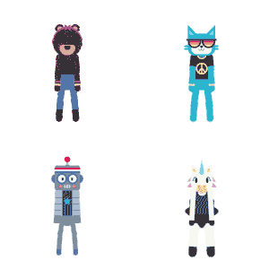

# Introduksjon {.intro}

Gjennom Dansefest lærer elevene om programmeringslogikk og begrepet "hendelser" i programmering gjennom dans og fysisk aktivitet. Se i lærerveiledningen for flere tips til variasjon.

Opplegget er opprinnelig utviklet av code.org. 

## {.tip}
Hendelser lar oss påvirke dataprogrammer og få dem til å utføre bestemte handlinger når vi vil at de skal gjøre det, og gjør programmene interaktive. 
#

# Steg 1: Oppvarming {.activity}

Introduser dagens aktivitet og "hendelser"-begrepet. 

## Sjekkliste {.check}

- [ ] Spør elevene om det er noen av dem som danser

- [ ] Hvordan kan mange dansene vite hva de skal gjøre, og når de skal gjøre det? Hvordan får vi dansere til å danse i takt til musikken og med hverandre?

- [ ] Danserne har i forkant blitt enige om hvilke dansebevegelser som skal utføres, og de har avtalt hvem som skal gjøre hva, når det skal gjøres, og hvor fort det skal gå. Å lage en danserutine ligner svært mye på det å lage en algoritme til en datamaskin. Vi forteller datamaskinen hva den skal gjøre, når den skal gjøre det, og hvor fort det skal gå - blant annet. 

- [ ] Danserne forholder seg vanligvis til takten og rytmen i musikken, mens datamaskinen forholder seg til tastetrykk eller andre *hendelser*. 

- [ ] Eksempel på hendelser kan være at elevene får beskjed om å klappe, hoppe eller gjøre andre bevegelser når læreren teller ned fra 3, løfter en arm i været eller stikker ut tunga. Prøv noen eksempler felles!

# Steg 2: Æ vil bare dans {.activity}

Nå skal vi komme i gang med dansingen! Først må vi øve litt på de forskjellige dansetrinnene:

## Øve dansetrinnene {.check}

- [ ] Elevenes utgangsposisjon er å svaie lett fra side til side i takt, med løse og ledige armer og lave skuldre, begge beina på bakken.

- [ ] Vis dansetrinnene fra [The Big Dance Party](https://docs.google.com/presentation/d/1Guau5AeuqQCcPz06bfhtTmgt_ykaxKZ_JzkhzcECOcQ/edit#slide=id.g441e51501a_0_0){target=_blank} og la elevene øve på en og en bevegelse.

- [ ] Når elevene begynner å få kontroll på dansebevegelsene, tester dere å "trykke på knappene" på dansekontrolleren og ser om elevene husker bevegelsene. 

## {.tip}
Hvordan du ønsker å vise dansekontrolleren, er opp til deg selv. Du kan velge å vise lysbildet på en digital tavle, printe den ut i A3-størrelse og laminere den - eller lage din helt egen kontrollervariant uavhengig av eksempelet fra oppgaven. Det viktigste er at elevene har forstått at når du som lærer gir en instruksjon, skal de utføre dansebevegelsen som hører til instruksjonen.
#

## Dansefest! {.check}
- [ ] Start musikken fra [Spotify-spillelisten.](https://open.spotify.com/playlist/2MiLztu5QGQERdEsZed81b?si=6cF0s1ETQf2vN_ea8B4fIw){target=_blank}

- [ ] Når musikken starter, begynner elevene i utgangsposisjon. 

- [ ] "Trykk" på en valgfri knapp på dansekontrolleren og la elevene utføre den avtalte bevegelsen over noen taktslag, før du "trykker" på en ny knapp.

- [ ] Forsøk å danse til forskjellige låter, og endre på rekkefølgen du "trykker" på dansekontrolleren for hver gang.

#

## Utfordring {.challenge}

Legg til flere dansebevegelser, for eksempel flossing. Kan dere utvikle nye dansebevegelser der og da i klasserommet? Skal dere bytte ut noen av de opprinnelige bevegelsene, eller må dere legge til flere knapper på dansekontrolleren?
Kan ulike elever reagerer forskjellig på samme hendelse? For eksempel at tre elever utfører "High Clap", mens resten av klassen utfører "Shoulder Roll"? Dette er å utvikle, eller lage nye *iterasjoner* av danseprogrammet, og er svært sentralt innen dataprogrammering. Vi søker å utvide og forbedre programmet.

# Steg 3: Oppsummering {.activity}
## Samtale med elevene {.check}
- [ ] Hvilken betydning har hendelser for hvordan et program fungerer?

- [ ] Kan du komme på hendelser du bruker når du spiller spill eller jobber på læringsbrettet/skole-PC-en, for å gi programmet beskjed om å gjøre noe?
# 
#