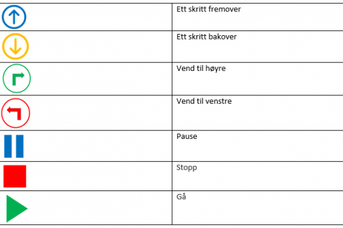

# Innledning{.intro}

Denne oppgaven kan ta alt fra 15-60 minutter avhengig av gruppens størrelse og utholdenhet.

Ved å bruke et forhåndsdefinert «Robotordforråd» samarbeider barna om å sette sammen en rekke symboler til en algoritme. Barna får gjennom denne programmeringsleken en mulighet til å oppdage, utforske og se sammenhenger gjennom algoritmisk tekning.

## {.tip}
Denne øvelsen introduserer barna for prinsippene bak programmering, og kan enkelt knyttes sammen med målsetninger knyttet til
- antall, rom og form
- natur, miljø og teknikk  
- kommunikasjon, språk og tekst.

# Læringsutbytte{.activity}

## Viktige begreper å lære {.check}

Nøkkelord som er viktige i denne leken:

- **Symbol** – et tegn som symboliserer en handling

- **Koding** – omgjøre handlinger til et symbolspråk

- **Algoritme** – en samling av symboler som omgjøres til handling for å nå et mål
#

## Barna... {.check}

- [ ] Lærer å omgjøre virkelige handlinger til instruksjoner
- [ ] Får praktisk erfaring i å kode med symboler
- [ ] Får erfaringer med behov for presisjon innen koding
- [ ] Oppdager og undrer seg over matematiske sammenhenger
- [ ] Utvikler forståelse for grunnleggende matematiske begreper
- [ ] Leker og eksperimenterer med tall, mengde og telling og får erfaring med ulike måter å uttrykke dette på
- [ ] Erfarer størrelser i sine omgivelser og sammenligner disse
- [ ] Bruker kroppen og sansene for å utvikle romforståelse
- [ ] Undersøker og får erfaring med løsning av matematiske problemer og opplever matematikkglede.
- [ ] Leker med språk og symboler
#

# Utstyr {.activity}

- [ ] Laminerte dyrebilder
- [ ] Laminerte kodesymboler
- [ ] Farget maskeringstape for å markere rutenett på gulvet

[**PDF med dyrebilder og kodesymboler kan lastes ned her.**](https://drive.google.com/file/d/1bJSqf3ArvXK-eazcS01VTbo66xD8lOSi/view?usp=sharing)

# Symbolforklaring {.activity}

# Forberedelser {.activity}
- [ ] Marker et rutenett på gulvet ved hjelp av maskeringstape

- [ ] Fest de laminerte dyrefigurene i hver sin rute

- [ ] Marker startpunktet for roboten med for eksempel et kryss

#

# Slik gjør du {.activity}
Del barna inn i små grupper for å introdusere leken – gjerne grupper på 3-5 barn.

**Introduksjon**: Start med å spørre barna om noen har hørt om roboter. Om noen har sett eller tatt på en robot?  Kan en sånn maskin «høre» deg snakke? Forstår den «faktisk» det som blir sagt? Og svaret på dette er «ikke på samme måte som en person gjør».

Roboter trenger en serie med «instruksjoner». Spesifikke ting de har blitt satt til å gjøre. For å kunne gjennomføre en oppgave, må en robot ha en rekke med instruksjoner (som oftest kalt algoritmer) for å fungere. I dag skal vi lære hva som trengs for å få dette til.

Vis kodesymbolene og forklar barna hva de ulike symbolene betyr.

## Gjennomføring av spillet {.check}

- [ ] Et av barna velges til robot
- [ ] Roboten velger hvilket dyr den ønsker å gå til
- [ ] De andre barna er programmerere, og samarbeider med den voksne om å finne ut hvilken vei roboten skal gå for å komme til det valgte dyret
- [ ] Programmererne bruker symbolene for å sette sammen algoritmen som symboliserer den valgte ruten
- [ ] Når algoritmen er klar trygger programmerene på Gå-symbolet for at roboten skal starte å gå
- [ ] Roboten “leser” algoritmen og utfører instruksjonen. Den voksne støtter gjennom å veilede og stille spørsmål underveis.
- [ ] Når roboten kommer frem til det valgte dyret utfører den en handling som symboliserer de ulike dyra - for eksempel å stå på ett ben som en flamingo, eller å gjøre seg liten som en mus.
#
