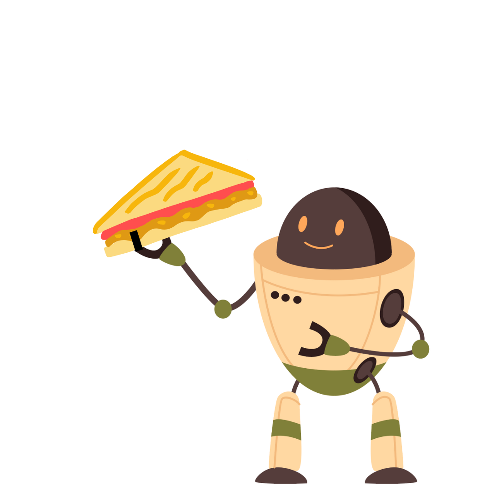

  # Programmer en sandwichrobot!  

 
#  Introduksjon {.intro}
  
I denne oppgaven skal du som lærer bli transformert til å være en sandwichrobot! Elevene dine skal skrive koder som sandwichroboten skal følge, for å smøre en brødskive med smør og syltetøy eller peanøttsmør og syltetøy. 

# Steg 1: Utstyrsoversikt {.activity}

Til å gjennomføre denne oppgaven trenger dere:

- [ ] Ark og skrivesaker til elevene

- [ ] Ferdigskårede brødskiver

- [ ] En krukke syltetøy

- [ ] En pakke smør / en krukke peanøttsmør

- [ ] Praktiske ting som smørekniv, tørkepapir, tallerken eller annet underlag

# Steg 2: Hva er programmering? {.activity}

Start timen ved å prate om koding og algoritmisk tenkning. Det er viktig for oppgaven at elevene forstår hvor tydelig man må være når man skal kode en robot, noe denne aktiviteten vil vise! 

**Kort om koding:**

Koding er som å lage oppskrifter for datamaskiner! Når vi koder, skriver vi en serie instruksjoner som datamaskinen følger, litt som steg-for-steg-instruksjoner for å bake en kake. Hvert steg vi skriver i koden forteller datamaskinen hva den skal gjøre.

Man må være tydelig i instruksene når man koder fordi datamaskinen ikke kan gjette hva vi mener. Den følger bare det vi skriver, helt nøyaktig, steg for steg. Hvis det er en liten feil eller noe er uklart, kan datamaskinen gjøre noe annet enn det vi tenkte, eller stoppe helt opp. Det er som når du følger en oppskrift – hvis det står “ta en kopp sukker” men ikke sier hvilken kopp, kan resultatet bli feil. Derfor må vi være veldig tydelige og nøyaktige når vi koder, slik at datamaskinen forstår oss helt riktig!

# Steg 3: Programmer sandwichroboten {.activity}

Dette skal vi nå teste ut! Klassens sandwichrobot skal nå prøve å smøre noen deilige skiver med smør og syltetøy, men den kan **KUN** bruke kodene klassen skriver på papirene sine for å gjennomføre jobben. 

Elevenes oppgave vil nå være å skrive en kode fra start til slutt som koder sandwichroboten gjennom prosessen om å smøre en brødskive. 

Når elevene er klare med koden sin, kan dere enten be elevene om å lese opp sin kode, eller sandwichroboten kan lese koden mens den jobber. 

Det er viktig at du som lærer "legger bort hodet" mens du er sandwichrobot - du skal ikke tenke selv, men følge elevenes koder til punkt og prikke! 

**Og husk:** det blir som regel aldri en bra sandwich på første forsøk. Elevene må løpende justere kodene sine ut fra resultatet til sandwichroboten, og til slutt kan man ende opp med en deilig sandwich! 
