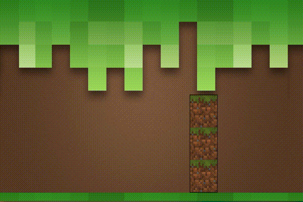
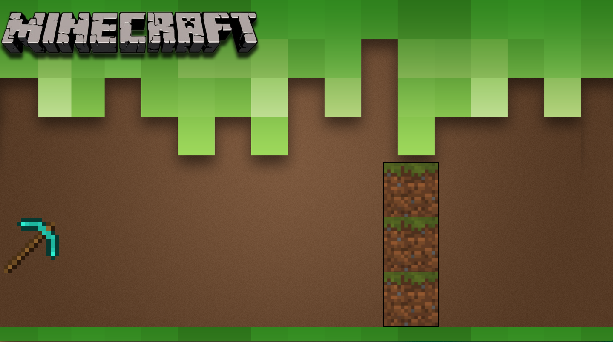

# Introduksjon {.intro}
I denne oppgaven skal du lære å animerer HTML-objekter ved hjelp av CSS. Under ser du hvordan resultatet vil bli til slutt:



Men før vi starter å lage animasjonen over må vi lære om hvordan animasjon fungerer ved hjelp av CSS. Så la oss starte med det grunnleggende!

__For å lære mest mulig bør du åpne en tom `.html`-fil og skrive koden for hånd når du leser oppgaven, da kommer du til å bli en racer i CSS-animasjon!__

# Steg 1: Animasjons-attributtet {.activity}

Animasjon i CSS er ganske enkelt, i utgangspunktet har animasjonen 2 stadier: `start` og `slutt`. Mellom `start` og `slutt` kan du legge inn forskjellige faser, som vi skal se på litt senere. Animasjonen vil heller ikke gå i `loop` (altså gjenta seg selv) med mindre du forteller at den skal gjøre det.


Før vi skal se på et enkelt eksempel skal vi se på `animation`-attributter. Vi skal bruke disse:

```css
#id {
    animation-name: et-navn;
    animation-duration: 1s;
    animation-timing-function: linear|ease|ease-in|ease-out|ease-in-out|step-start|step-end;
    animation-delay: 1s;
    animation-iteration-count: nummer|infinite;
    animation-direction: normal|reverse|alternate|alternate-reverse;
    animation-fill-mode: none|forwards|backwards|both;
}
```


- `name`: Navnet på animasjonen.
- `duration`: Hvor lenge (i sekunder) skal animasjonen vare.
- `timing-function`: Hvordan mellom-fasene er kalkulert.
- `delay`: Hvor mye forsinkelse det skal være før animasjonen starter. Standard er 0 sekund.
- `iteration-count`: Hvor mange ganger skal animasjonen gjentas.
- `direction`: Bestemmer om animasjonen skal gå baklengs eller ikke.
- `fill-mode`: Hvilke stiler som er lagt til før og etter start av animasjonen.

Her er et enkelt eksempel på en boks som går fra venstre til høyre:

<style>
    #boks {
        height: 50px;
        width: 50px;
        background-color: blue;
        position: relative;
        animation-name: frem-og-tilbake;
        animation-duration: 2s;
        animation-iteration-count: infinite;
        animation-direction: alternate;
    }
    @keyframes frem-og-tilbake {
        0% { left:0; }
        100% { left:100px; }
    }
</style>

<div id="boks"></div>
<br>


```html
<!DOCTYPE html>
<html>
<head>
<style>
    #boks {
        height: 50px;
        width: 50px;
        background-color: blue;
        position: relative;
        animation-name: frem-og-tilbake;
        animation-duration: 2s;
        animation-iteration-count: infinite;
        animation-direction: alternate;
    }
    @keyframes frem-og-tilbake {
        0% {
            left: 0px;
        }
        100% {
            left: 100px;
        }
    }
</style>
</head>
<body>
    <div id="boks"></div>
</body>
</html>
```

__La oss se nærmere på koden over:__

Vi har en `<div>` med ID `boks`, den er 50x50px med blå bakgrunnsfarge. Posisjonen er `relative` som vil si at vi har muligheter for å flytte på den.

`animation`-attributtene:
- `name`: frem-og-tilbake
- `duration`: 2s (sekunder)
- `timing-function`: Ikke oppgitt, er `ease` som standard.
- `delay`: Ikke oppgitt, siden vi ønsker at animasjonen skal starte med en gang og standard er `0s`.
- `iteration-count`: infinite (uendelig, så den vil ikke stoppe).
- `direction`: alternate (for at den skal gå frem og tilbake)
- `fill-mode`: Ikke oppgitt, ettersom animasjonen starter med en gang og aldri slutter trenger vi ikke en `fill-mode` før eller etter animasjonen.

`@keyframes frem-og-tilbake` er det vi bruker for å spesifisere hva som skal skje under animasjonen. I dette tilfellet har vi satt navnet til animasjonen med `animation-name: frem-og-tilbake`, vi bruker derfor `@keyframes frem-og-tilbake` for å beskrive animasjonen.

Innen for `@keyframes` kan vi nå spesifisere hva vi vil at animasjonen skal gjøre, vi har to faser, en start og en slutt. `0%` er animasjonens start og `100%` er animasjonens slutt. Derfor vil boksen vår starte til venstre (`left: 0px`) og slutte lengre til høyre (`left: 100px`).

__NB!__ Verdiene i `animation`-attributtene kan også skrives som en egen linje, men det er da litt vanskeligere å finne ut hva som er hva:
```css
#boks {
    animation: frem-og-tilbake 2s ...;
}
```

## Utfordring {.challenge}
- [ ] Skriv koden inn i din favoritt teksteditor, lagre det som en `.html`-fil og gjør oppgavene under.
- [ ] Få animasjonen til å bytte farge fra blå til rød underveis.
- [ ] Klarer du å få boksen til å flytte seg nedover og oppover?
- [ ] Prøv å få boksen til å bevege seg i en firkant.


# Steg 2: @keyframes {.activity}

La oss nå se nærmere på `@keyframes`. `@keyframes` er CSS som forteller hvilke steg en animasjon består av.

Her kommer noen eksempler:
<style>
    #diagonalt {
        height: 50px;
        width: 50px;
        background-color: green;
        position: relative;
        margin-bottom: 100px;
        animation: diagonalt 2s 0s infinite;
    }
    @keyframes diagonalt {
        0% { top: 0px; left: 0px; }
        100% { top: 100px; left: 100px; }
    }
</style>

<div id="diagonalt"></div>

```css
@keyframes diagonalt {
    0% {
      top: 0px;
      left: 0px;
    }
    100% {
      top: 100px;
      left: 100px;
    }
}
```
Dette eksempelet får et objekt til å gå diagonalt siden det starter på `top: 0px; left: 0px;` og ender på `top: 100px; left: 100px;`.

<style>
    #ned {
        height: 50px;
        width: 50px;
        background-color: red;
        position: relative;
        margin-bottom: 100px;
        animation: ned 2s 0s infinite;
    }
    @keyframes ned {
        0% { top: 0px; }
        100% { top: 100px; }
    }
</style>

<div id="ned"></div>

```css
@keyframes ned {
    0% {
      top: 0px;
    }
    100% {
      top: 100px;
    }
}
```
Her går HTML-objektet nedover ved hjelp av `top`-attributtet.


<style>
    #skifte_farge {
        height: 50px;
        width: 50px;
        background-color: blue;
        position: relative;
        animation: skifte_farge 5s 0s infinite;
    }
    @keyframes skifte_farge {
        0% { background-color: blue; }
        50% { background-color: yellow; }
        100% { background-color: red; }
    }
</style>

<div id="skifte_farge"></div>
<br>

```css
@keyframes skift-farge {
    0% {
      background-color: blue;
    }
    50% {
      background-color: yellow;
    }
    100% {
      background-color: red;
    }
}
```
Merk at i dette eksempelet har vi lagt inn `50%`. Dette er et eksempel på at du kan dele inn animasjonen faser mellom `0%` og `100%`. Du kan legge til så mange faser du vil ved å bruke `%`.

**Merk** at du ikke kan endre animasjonens varighet med `@keyframes` og `%`, du må da heller endre på `animation-duration`.


# Steg 3: Pakke ut filene {.activity}
Nå skal vi animere øksen og Minecraft-logoen:


+ Last ned og pakk ut [minecraft_animasjon.zip](minecraft_animasjon.zip).
+ Åpne `index.html` i din favoritt teksteditor og i en nettleser.

Du vil nå ha en nettside som ser noe sånt ut:

{width=100%}

I koden til `index.html` har vi et bakgrunnsbilde og 3 div-er med følgende ID: `pickaxe`, `minecraft` og `block`. Alle disse ID-ene er et bilde på nettsiden, bakgrunnsbildet ligger i CSS-en under `body`.

__Dette skal vi programmere:__
1. `pickaxe`-en skal komme flyvende inn og treffe blokkene.
2. Når øksen har truffet blokkene skal logoen skal komme inn.

# Steg 4: Flyvende øks {.activity}

Nå skal vi få `pickaxe`-en til å fly. Vi begynner med å beskrive animasjonen med `keyframes`.

## Sjekkliste {.check}
- [ ] Lag en `@keyframes` med animasjonsnavnet `move-pickaxe`.
- [ ] La figuren starte utenfor skjermen. **Hint:** bruk en negativ verdi av `left`.
- [ ] La `pickaxe`-bildet bevege seg bort til blokkene. Klarer du å finne ut hvor langt det er? **Hint:** positiv verdi av `left`.
- [ ] Legg til rotasjon med `transform: rotate(antall grader)`.
- [ ] Kan du tenke deg hvor `transform: rotate()` bør være? I `0%` eller `100%`?
- [ ] Prøv deg frem med hvor mange grader du trenger for at den skal bli riktig. **Hint:** 360 grader er én gang og 720 grader er to ganger rundt seg selv.

Så legger vi animasjonen til øksen.

## Sjekkliste {.check}
- [ ] Finn `#pickaxe` i CSS-en.
- [ ] Legg til animasjonsnavnet fra `keyframes` med `animation-name`.
- [ ] Legg til `animation-duration` på `2s`.
- [ ]Legg til et `animation-delay` på `1s`.
- [ ] Sett `animation-timing-function` til `linear`.
- [ ] Sett `animation-fill-mode` til `forwards`.

<style>
    #pickaxe {
        background-image: url("ressurser/pickaxe.png");
        z-index: 1;
        width: 150px;
        height: 150px;
        position: relative;
        animation: move-pickaxe 2s;
        animation-timing-function: linear;
        animation-fill-mode: forwards;
        animation-iteration-count: infinite;
    }
     @keyframes move-pickaxe {
        0% {
            left:0px;
        }
        100% {
            left: 800px;
            transform: rotate(720deg);
        }
    }
</style>

<div id="pickaxe"></div>


<toggle>
<strong>Forslag til kode så langt</strong>
<hide>

```css
#pickaxe {
    background-image: url("pickaxe.png");
    z-index: 1;
    width: 150px;
    height: 150px;
    position: absolute;
    bottom: 150px;
    left: -150px;
    animation: move-pickaxe 2s;
    animation-delay: 1s;
    animation-timing-function: linear;
    animation-fill-mode: forwards;
}
@keyframes move-pickaxe {
    0% {
        left:-150px;
    }
    100% {
        left: 800px;
        transform: rotate(720deg);
    }
}
```

</hide>
</toggle>

# Steg 5: Flyvende logo {.activity}
Nå som du har klart å få `pickaxe` til å fly inn med rotasjon er oppgaven din nå å få `#minecraft` til komme flyvende inn etter at `pickaxe` har stoppet.

+ Bruk det du har lært i oppgaven til å og prøv få logoen til å komme inn når `pickaxe` er ferdig med sin animasjon.


<style>
    #minecraft {
        background-image: url("ressurser/minecraft.png");
        width: 616px;
        height: 154px;
        position: relative;
        left: -900px;
        animation: move_minecraft 4s; /* Chrome, Safari, Opera */
        animation-delay: 1s;
        animation-fill-mode: forwards;
        animation-iteration-count: infinite;
    }
    @keyframes move_minecraft {
        0% {
            left: -900px;
        }
        100% {
            left:250px;
        }
    }
</style>


<div id="minecraft"></div>

<toggle>
<strong>Forslag til kode for Minecraft-logo</strong>
<hide>

```css
#minecraft {
    background-image: url("minecraft.png");
    z-index: 1;
    width: 616px;
    height: 154px;
    position: absolute;
    left: -900px;
    animation: move_minecraft 4s;
    animation-delay: 3s;
    animation-fill-mode: forwards;
}
@keyframes move_minecraft {
    0% {
        left: -900px;
    }
    100% {
        left:400px;
    }
}
```

</hide>
</toggle>

__Gratulerer!__ Du har nå laget din første animasjon!
