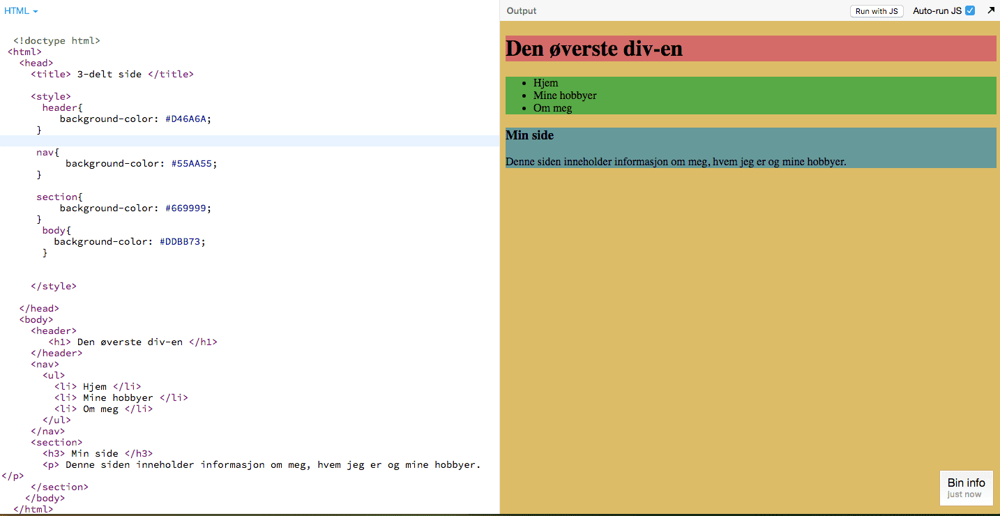

# Introduksjon {.intro}

__Målet med denne oppgaven__ er å lære hvordan man kan organisere en nettside
ved å dele den inn med forskjellige tagger. Dersom du ikke er kjent med
tagg-strukturen i HTML som vi har sett på i de tidligere oppgavene (i oppgavesamlingen _HTML_), så anbefaler
jeg at du går tilbake og se disse. Vi skal også se på hvordan vi kan sette farge
på de forskjellige taggene ved hjelp av CSS, men vi kommer ikke til å gå i
dybden i denne oppgaven. For mer CSS, se spillelisten som heter `CSS`.

I denne oppgaven vil du gjøre oppgaver der du må programmere uten oppskrift,
dersom du står fast kan du trykke på "Se koden så langt" og se én måte å løse
oppgaven på. Det er ingen fasit på oppgavene du gjør her, men vi kommer med et
forslag til hvordan de kan løses.

Når vi er ferdig med oppgaven kommer siden din til å se noe sånt ut, kanskje med
litt mer tekst eller andre farger:


__Lykke til!__


# Steg 1: `<div></div>` {.activity}

`<div>`-taggen er en veldig mye brukt tag. `div` står for `division` eller
seksjon. Vi bruker denne taggen for å organisere forskjellige deler av siden og
brukes ofte sammen med CSS (utseende), som vi skal se på i en senere del av
oppgaven. La oss se på et eksempel:

- [ ] Gå inn på [kidsakoder.no](https://kidsakoder.no).

- [ ] Bruk utviklerverktøy (Chrome: Visning -> Utvikler -> Utviklingsverktøy eller `ctrl + shift + I`, Firefox: Verktøy -> Nettsideutvikler -> Inspector eller `ctrl + shift + C`)

- [ ] Trykk på symbolet helt øverst til venstre () i utviklervindu og holder over
  forskjellige elementer på siden. Se på koden i utviklervindu, ser du at det er
  mange `<div>`-tagger?

- [ ] Trykk på de forskjellige og se hvor på siden du finner dem

- [ ] Finner du `<div>`-taggen til LKK-logoen og menyen

- [ ] Finner du `<div>`-taggen til der hvor nyhetene er plassert?

Under ser du utviklingsverktøyet til Chrome til høyre og kidsakoder.no til
venstre. I utviklervindu ser vi flere `<div>`-tagger inne i hverandre. Disse
skal vi lære mer om.


Som du ser er `<div>`-taggen brukt til å organisere elementer eller ting på
nettsiden. Legg også merke til at alle `<div>`-taggene har en `ID`. Dette er for
at det skal være enklere å holde styr på hva som ligger i disse seksjonene og
for at det skal være enklere å sette design (CSS) på dem.

__La oss prøve ut `<div>`-taggen selv!__


# Steg 2: Vi deler inn hjemmesiden vår i 3 deler {.activity}

Som vi kanskje husker fra oppgaven med [Den forsvunnede
katten](../forsvunnet_katt/forsvunnet_katt.html), så ser oppbyggningen av en tom
nettside slik ut:

```html
<!doctype html>
<html>
  <head>
  </head>
  <body>
  </body>
 </html>
```

Husker du også at vi kan legge til metadata i `<head>` for å blant annet få
tittel på nettsiden vår?

- [ ] Legg til din egen tittel

Når vi skal lage en `<div>` på siden vår må vi legge denne inne i
`<body>`-taggen vår.

- [ ] Lage en `<div>`. Denne skal holde styr på det som er øverst på siden vår.
  Denne kalles ofte for en header (det er ikke det samme som `<head>`).

- [ ] Studer kidsakoder.no med utviklingsverktøyet og se om du finner
  `<header>`-taggen eller en `<div>` med `ID` som inneholder *header*.

Fant du det? Det er en sånn vi prøver å lage, bare at vi skal forenkle det litt.

- [ ] Legg til en overskrift i `<div>`-taggen du akkurat lagde.

<toggle>
<strong>Se koden så langt</strong>
<hide>

  ```html
  <!doctype html>
 <html>
   <head>
     <title> 3-delt side </title>
   </head>
   <body>
     <div>
        <h1> Den øverste div-en </h1>
     </div>
    </body>
  </html>
  ```

  </hide>
</toggle>

- [ ] La oss lage en `<div>` som skal holde styr på navigasjonsmenyen vår. Legg
  denne under der den andre `<div>`-en ble avsluttet

- [ ] La oss nå lage en liste med 3 elementer som skal være menyen vår. Du
  velger selv hva som skal være med i listen.

<toggle>
<strong>Hint</strong>
<hide>

  ```html
       <ul>
         <li> Hjem </li>
         <li> Mine hobbyer </li>
         <li> Om meg </li>
       </ul>
  ```

</hide>
</toggle>

- [ ] Lage en ny `<div>` som skal ha innholdet på siden vår. Inni den kan vi
  skrive en overskrift og legge til litt tekst. Gjerne også et bilde hvis du vil
  det.

<toggle>
<strong>Se koden så langt</strong>
<hide>

  ```html
  <!doctype html>
 <html>
   <head>
     <title> 3-delt side </title>
   </head>
   <body>
     <div>
        <h1> Den øverste div-en </h1>
     </div>
     <div>
       <ul>
         <li> Hjem </li>
         <li> Mine hobbyer </li>
         <li> Om meg </li>
       </ul>
     </div>
     <div>
       <h3> Min side </h3>
       <p> Denne siden inneholder informasjon om meg, hvem jeg er og mine hobbyer. </p>
     </div>
    </body>
  </html>
  ```
  </hide>
</toggle>

__Nå har du delt inn siden i 3 deler: Header, navigasjon og hovedområdet eller
innhold.__


# Steg 3: Vi prøver litt CSS {.activity}

La oss nå sette farge på de 3 `<div>`-ene vi har laget. For å gjøre det bruker
vi attributtet `style=””`. I `style` kan vi legge til variabler som for eksempel
`background-color: favoritt fargen din`.

```html
<div style="background-color: red"></div>
```

- [ ] Prøv å legge til forskjellig farge på hver av `<div>`-ene og se hva som
  skjer.

<toggle>
<strong>Se et eksempel</strong>
<hide>

</hide>
</toggle>

Nå skal vi sette en `ID` på `<div>`-ene våre før vi skal se litt mer på *CSS*.
Kan du tenke deg noen gode IDer vi kan sette på `<div>`-ene våre?


# Steg 4: Vi legger til en ID {.activity}

ID er en fin ting å bruke hvis vi vil ha forskjellig stil på forskjellige
seksjoner på siden vår. Vi har laget 3 `<div>`-tagger hvor en holder styr på
*headeren*, en på *navigasjonsbaren* og en på *innholdet*.

ID lages ved å legge til attributte `id=””` som attributt i `<div>`-taggen.

```html
<div id="navn_på_id-en"> </div>
```

- [ ] Gi en passende `ID` til de 3 `<div>`-ene i steg 2.

<toggle>
<strong>Se et forslag til løsning</strong>
<hide>

  ```html
  <!doctype html>
 <html>
   <head>
     <title> 3-delt side </title>
   </head>
   <body>
     <div id="header" style="background-color: red">
        <h1> Den øverste div-en </h1>
     </div>
     <div id="nav" style="background-color: green">
       <ul>
         <li> Hjem </li>
         <li> Mine hobbyer </li>
         <li> Om meg </li>
       </ul>
     </div>
     <div id="innhold" style="background-color: blue">
       <h3> Min side </h3>
       <p> Denne siden inneholder informasjon om meg, hvem jeg er og mine hobbyer. </p>
     </div>
    </body>
  </html>
  ```
  </hide>
</toggle>

Nå som vi har laget IDer på `<div>`-ene våre skal vi prøve ut en ny måte å lage
CSS på.


# Steg 5: Litt mer CSS {.activity}

Vi endrer hvordan en side ser ut gjennom å bruke språket __CSS__ (som står for
__Cascading Style Sheets__). Dette er et veldig enkelt språk, og du vil lære mer
av dette i senere oppgaver. __CSS__ er bygget opp på denne måten:

```css
selector {
  property: value;
}
```

- [ ] Kan du finne knappene for ‘{‘ og ‘}’ på ditt tastatur? Hva med ‘:’ og ‘;’
  ? Disse trenger vi får å skrive __CSS__

`Selektorer` er som regel HTML-tagger som `h1`, `p`, `img`, `a`. Men de kan også
være IDer og klasser, som vi vil lære om senere.

`Property` kan være for eksempel `background-color` som vi har brukt. Flere
`properties` finner du på [w3schools.com/css](https://w3schools.com/css)

`Value` er det som kommer etter en `property` og er verdien du sender til
`property`. Denne kan være `red`, for eksempel.

Under ser du hvordan du kan legge til CSS i `<head>`-taggen med 3 IDer:

```html
<head>
  <style>
    #header{

    }

    #nav{

    }

    #innhold{

    }
    </style>
</head>
```

- [ ] Ta vekk `style`-attributtene i `<div>`-ene

- [ ] Lagre og last inn siden. Forsvant bakgrunnsfargen

- [ ] Legg til bakgrunnsfargen igjen ved å legge det i *CSS*-en i `<head>`

<toggle>
  <strong>Se et eksempel</strong>
  <hide>
    
  </hide>
</toggle>

Det finnes flere måter å skive farger i CSS på. Vi har nå brukt kjente ord som
`red`, `blue`og `green`. Men vi kan faktisk lage 16 millioner forskjellige
farger ved å bruke en annen metode. For å lage dise fargene skal vi bruke tall
fra 0-9 og bokstaver fra A-Z. Vi setter disse sammen i en kombinasjon av 6 tall
og/eller bokstaver. Siden det tar veldig lang tid å prøve ut alle
kombinasjonene, så bruker vi litt hjelp for å finne de fargene vi vil ha:

- [ ] Gå inn på [paletton.com](http://paletton.com) eller
  [colorpicker.com](http://colorpicker.com) og velg og vrak i masse forskjellige
  farger

- [ ] Erstatt de fargene du har med noen andre du liker ved å bruke `#` foran de
  6 tall/bokstavene. Eksempel: `#338F33` gir en ganske fin grønnfarge.

<toggle>
<strong>Se koden så langt</strong>
<hide>

  ```css
  #nav{
    background-color: #338F33;
  }
  ```
  </hide>
</toggle>

Vi skal se enda mer på CSS etter vi har lært litt mer HTML.

## Utfordring {.challenge}

- [ ] Gå inn på [w3schools.com/css](https://w3schools.com/css) og se om du
  finner en flere “properties” du kan endre på.


# Steg 6: HTML5-tagger {.activity}

Nå har vi sett på hvordan vi kan bruke `<div>`-taggen til å organisere nettsiden
vår, og vi har sett på hvordan vi kan sette stiler på disse ved hjelp av CSS.
Det kommer stadig nye versjoner av HTML og nå er vi på versjon HTML5. Ved denne
versjonen kom det noen nye tagger vi skal se på. Her er en liste over noen:

`<nav>` - holder på navigasjonslenkene til siden

`<header>` - her ligger overskriften til siden eller til en artikkel på siden
(for eksempel h1)

`<main>` - hovedelementene til siden legges her

`<section>` - brukes for å lage en egen seksjon på siden

`<footer>` - denne ligger alltid nederst på siden, der har man gjerne
kontaktinformasjon eller hvem som har skrevet nettsiden. Skroll ned på denne
siden og se hva det står nederst.

`<article>` - dersom man har en artikkel på nettsiden, kan man skrive den inne i
denne taggen

Du kan lese om flere her:

[https://www.w3schools.com/html/html5_new_elements.asp](https://www.w3schools.com/html/html5_new_elements.asp)

Disse taggene gjør det enklere for nettleseren å lese hva innholdet på siden er.
Nå skal vi bytte ut `<div>`-taggene på siden vår med noen av taggene over.

- [ ] Kan du tenke deg hvilke taggen vi bør bruke istedet for `<div>`-ene

- [ ] La oss starte med `<div id=”header”>`, bytt den ut med `<header>`

- [ ] Gjør det samme med `<div id=”nav”>` og `<div id=”innhold”>` NB! Husk å
  fjerne `</div>` og erstatte disse med `</header>, </nav>` og `</section>`

Nå vil `<body>`-en se noe sånt ut:

```html
    <body>
     <header>
        <h1> Den øverste div-en </h1>
     </header>
     <nav>
       <ul>
         <li> Hjem </li>
         <li> Mine hobbyer </li>
         <li> Om meg </li>
       </ul>
     </nav>
     <section>
       <h3> Min side </h3>
       <p> Denne siden inneholder informasjon om meg, hvem jeg er og mine hobbyer.</p>
     </section>
    </body>
```

- [ ] Lagre og kjør og se om du får opp akkurat det samme. Forsvant fargene? For
  å få fargene til å fungere igjen må vi endre CSSen. Siden vi ikke har en ID på
  taggene våre har vi 2 valg: enten sette en ID på dem eller så kan vi gjerne
  `#` i CSSen.

`#nav` i CSS betyr at vi endrer stilen på en tag med ID `nav`. Hvis vi ikke har
noe foran `nav` betyr dette: “for alle `<nav>`-tagger”. Så nå som vi bruker
HTML5-taggene må vi også endre på CSSen vår.

- [ ] Fjern `#` i CSSe

- [ ] Legg til selektorene (taggene) du vil ha CSS på

CSS-en bør se noe sånt ut: (Merk at jeg har sikkert andre farger enn deg)

```css
      header{
          background-color: #D46A6A;
      }

      nav{
           background-color: #55AA55;
      }

      section{
          background-color: #669999;
      }
```

- [ ] Legg til farge på bakgrunnen for hele siden ved å legge til CSS på
  `<body>`-taggen. Velg farge selv.

Nå vil koden se noe sånt ut:



Nå har du lært hvordan man kan dele inn en nettside ved hjelp av `<div>`-taggen
og HTML5-tagger. La oss nå se hvordan vi kan lenke sammen nettsider.
