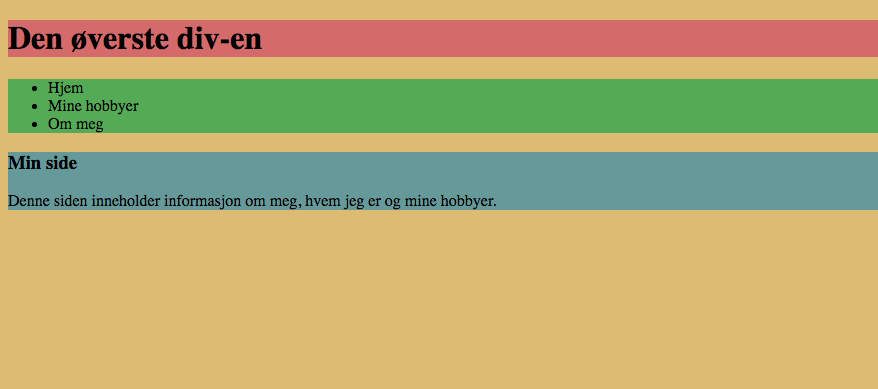
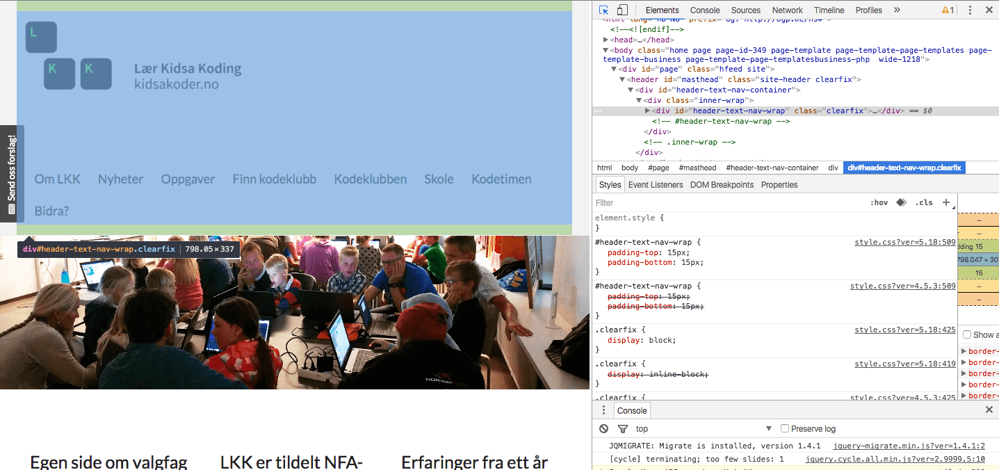
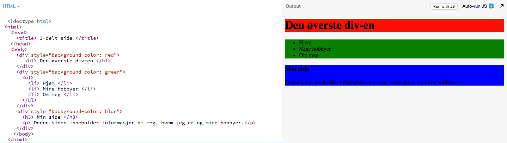
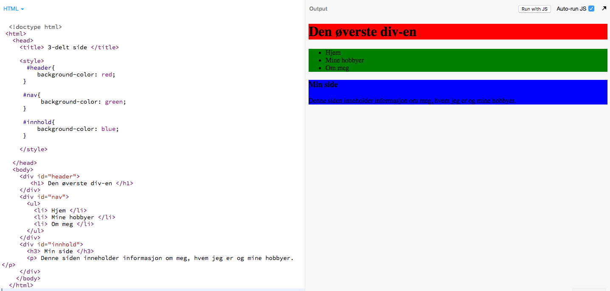
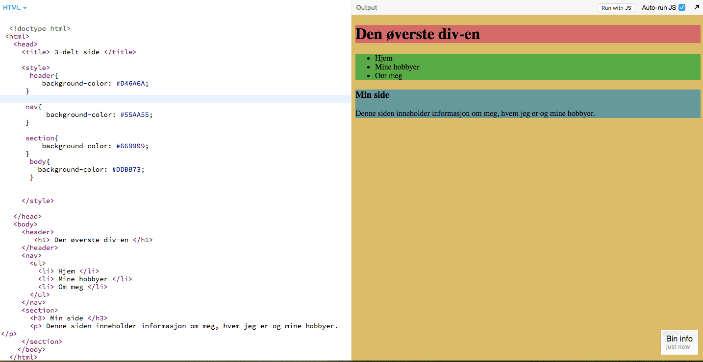

# Introduksjon {.intro}

Målet med denne oppgåva er å lære korleis ein kan organisere ei nettside ved å
dele den inn med ulike taggar. Viss du ikkje er kjent med tagg-strukturen i HTML
som me har sett på i dei andre oppgåvene (i oppgåvesamlinga _HTML_), så anbefalar me at du går tilbake og ser på
det. Me skal sjå korleis me kan setje farge på dei ulike taggane med CSS, men me
kjem ikkje til å gå djupt inn i CSS i denne oppgåva. For meir CSS kan du sjå på
dei spesialiserte oppgåvene.

I denne oppgåva skal du gjere steg der du må programmere utan oppskrift. Viss du
står fast kan du trykkje på "Sjå koden så langt" og sjå ei mogleg løysing. Det
er ingen fasit på oppgåva, men me kjem med forslag til korleis ho kan løysast.

Når me er ferdig med oppgåva kjem sida di til å sjå ut omlag som dette, kanskje
med meir tekst eller andre fargar:



__Lykke til!__


# Steg 1: `<div></div>` {.activity}

`<div>`-taggen er ein tagg som brukast veldig mykje. Teksten `div` står for
`division` eller seksjon. Me brukar denne taggen for å organisere ulike delar av
sida, og den blir ofte brukt saman med CSS (som handlar om utsjånaden), som me
skal sjå på seinare i oppgåva. La oss starte med eit døme:

- [ ] Gå inn på [kidsakoder.no](https://kidsakoder.no).

- [ ] Bruk utviklarverktøyet (Chrome: Visning -> Utvikler -> Utviklingsverktøy eller `ctrl + shift + I`, Firefox: Verktøy -> Nettsideutvikler -> Inspector eller `ctrl + shift + C`).

- [ ] Trykk på symbolet heilt øvst til venstre () i utviklarvindauget og hald over
  ulike element på sida. Sjå på koden i utviklarvindauget. Ser du at det er
  mange `<div>`-taggar?

- [ ] Trykk på dei forskjellige og sjå kor på sida du finn dei.

- [ ] Finn du `<div>`-taggen til LKK-logoen og menyen?

- [ ] Finn du `<div>`-taggen til der nyheitene er plassert?

Under ser du utviklarverktøyet til Chrome til høgre og
[kidsakoder.no](https://kidsakoder.no) til venstre. I utviklarvindauget ser me
fleire `<div>`-taggar inne i kvarandre. Desse skal me lære meir om.



Som du ser blir `<div>`-taggen brukt til å organisere element eller ting på
nettsida. Legg merke til at alle `<div>`-taggane har ein `ID`. Då blir det
enklare å halde styr på kva som ligg i desse seksjonane, og for at det skal vere
enklare å setje design (CSS) på dei.

__La oss prøve ut `<div>`-taggen sjølv!__


# Steg 2: Me deler inn heimesida vår i 3 delar {.activity}

Som me kanskje hugsar frå oppgåva med [Den forsvunne
katten](../forsvunnet_katt/forsvunnet_katt_nn.html), så ser oppbygginga av ei
tom nettside slik ut:

```html
<!doctype html>
<html>
  <head>
  </head>
  <body>
  </body>
 </html>
```

Hugsar du at me kan leggje til metadata i `<head>` for mellom anna å få tittel
på nettsida vår?

- [ ] Legg til din eigen tittel.

  Når me skal lage ein `<div>` på sida vår må me leggje den inne i
  `<body>`-taggen vår.

- [ ] Lag ein `<div>`. Denne skal halde styr på det som er øst på sida vår. Den
  blir ofte kalla for ein header (det er _ikkje_ det same som `<head>`).

- [ ] Studer [kidsakoder.no](https://kidsakoder.no) med utviklarverktøyet og sjå
  om du finn `<header>`-taggen eller ein `<div>` med `ID` som inneheldt
  *header*.

  Fann du det? Det er ein slik me prøver å lage, men me skal ha ein forenkla
  versjon.

- [ ] Legg til ei overskrift i `<div>`-taggen du akkurat laga.

<toggle>
<strong>Sjå koden så langt</strong>
<hide>

  ```html
  <!doctype html>
 <html>
   <head>
     <title> 3-delt side </title>
   </head>
   <body>
     <div>
        <h1> Den øvste div-en </h1>
     </div>
    </body>
  </html>
  ```
  </hide>
</toggle>

- [ ] La oss lage ein `<div>` som skal halde styr på navigasjonsmenyen vår. Legg
  den under der den andre `<div>`-en vart avslutta.

- [ ] No skal me lage ei liste med 3 element som skal vere menyen vår. Du vel
  sjølv kva som skal vere med i lista.

<toggle>
<strong>Hint</strong>
<hide>

  ```html
       <ul>
         <li> Heim </li>
         <li> Hobbyane mine </li>
         <li> Om meg </li>
       </ul>

  ```
</hide>
</toggle>

- [ ] Lage en ny `<div>` som skal ha innhaldet på siden vår. Inni den kan vi
  skrive en overskrift og legge til litt tekst. Gjerne også et bilde hvis du vil
  det.

<toggle>
<strong>Sjå koden så langt</strong>
<hide>

  ```html
  <!doctype html>
 <html>
   <head>
     <title> 3-delt side </title>
   </head>
   <body>
     <div>
        <h1> Den øvste div-en </h1>
     </div>
     <div>
       <ul>
         <li> Heim </li>
         <li> Hobbyane mine </li>
         <li> Om meg </li>
       </ul>
     </div>
     <div>
       <h3> Mi side </h3>
       <p> Denne sida inneheldt informasjon om meg, kven er eg og hobbyane mine. </p>
     </div>
    </body>
  </html>
  ```
  </hide>
</toggle>

__No har du delt inn sida i 3 delar: header, navigasjon og hovudområdet
(innhald)__


# Steg 3: Me prøver litt CSS {.activity}

No skal me setje farge på dei 3 `<div>`-ane me har laga. For å gjere det brukar
me attributten `style=""`. I `style` kan me leggje til variablar som, til dømes,
`background-color: favorittfarga di`.

```html
<div style="background-color: red"></div>
```

- [ ] Prøv å leggje til ulik farge på kvar av `<div>`-ane og sjå kva som skjer.

<toggle>
<strong>Sjå eit døme</strong>
<hide>

</hide>
</toggle>

No skal me setje ein `ID` på `<div>`-ane våre før me ser meir på CSS. Kan du
tenke deg nokre gode ID-ar me kan bruke på `<div>`-ane våre?


# Steg 4: Me legg til ein ID {.activity}

ID er ein fin ting å bruke viss me vil ha ulik stil på ulike seksjonar på sida
vår. Me har laga 3 `<div>`-taggar der ein heldt styr på *headeren*, ein på
*navigasjonslinja* og ein på *innhaldet*.

Du lagar ID ved å leggje til attributten `id=""` i `<div>`-taggen.

```html
<div id="namn_på_id-en"> </div>
```

- [ ] Gi ein passande `ID` til dei 3 `<div>`-ane i steg 2.

<toggle>
<strong>Sjå forslag til løysing</strong>
<hide>

  ```html
  <!doctype html>
 <html>
   <head>
     <title> 3-delt side </title>
   </head>
   <body>
     <div id="header" style="background-color: red">
        <h1> Den øvste div-en </h1>
     </div>
     <div id="nav" style="background-color: green">
       <ul>
         <li> Heim </li>
         <li> Hobbyane mine </li>
         <li> Om meg </li>
       </ul>
     </div>
     <div id="innhald" style="background-color: blue">
       <h3> Mi side </h3>
       <p> Denne sida inneheldt informasjon om meg, kven er eg og hobbyane mine. </p>
     </div>
    </body>
  </html>
  ```
  </hide>
</toggle>

No som me har laga ID-ar på `<div>`-ane våre skal me prøve ein ny måte å lage
CSS på.


# Steg 5: Litt meir CSS {.activity}

Me endrar korleis ei side ser ut gjennom å bruke språket CSS (som står for
__Cascading Style Sheets__). Dette er eit veldig enkelt språk, og du lærer meir
om dette i andre oppgåver. CSS er bygd opp på denne måten:

```css
selector {
  property: value;
}
```

- [ ] Kan du finne knappane for `{` og `}` på tastaturet ditt? Kva med `:` og
  `;`? Me treng alle desse for å skrive CSS.

`Selektorar` er som regel HTML-taggar som `h1`, `p`, `img`, `a`. Men dei kan òg
vere ID-ar og klasser, som me lærer om seinare.

`Property` kan vere, til dømes, `background-color` som me allereie har brukt.
Fleire `properties` finn du på [w3schools.com/css](https://w3schools.com/css).

`Value` er det som kjem etter ein `property` og er verdien du sender til
`property`. Det kan til dømes vere farga `red`.

Under ser du korleis du kan leggje til CSS i `<head>`-taggen med 3 ID-ar:

```html
<head>
  <style>
    #header{

    }

    #nav{

    }

    #innhald{

    }
    </style>
</head>
```

- [ ] Ta bort `style`-attributtane i `<div>`-ane.

- [ ] Lagre og last inn sida. Forsvann bakgrunnsfarga?

- [ ] Legg til bakgrunnsfarga att ved å leggje det i *CSS*-en i `<head>`.

<toggle>
  <strong>Sjå eit døme</strong>
  <hide>
    
  </hide>
</toggle>

Det finst fleire måtar å skrive farger i CSS på. Me har brukt kjente ord som
`red`, `blue` og `green`. Men me kan faktisk lage over 16 millionar ulike farger
ved å bruke ein annan metode. For å lage desse fargene skal me bruke tala 0-9 og
bokstavane A-F. Me set dei saman i ein kombinasjon av 6 tal og/eller bokstavar.
Sidan det tek veldig lang tid å prøve ut desse for å finne fargene me vil ha, så
kan me bruke eit hjelpemiddel:

- [ ] Gå inn på [paletton.com](http://paletton.com) eller
  [colorpicker.com](http://colorpicker.com) og vel mellom mange forskjellige
  farger.

- [ ] Erstatt dei fargene du har med andre du likar ved å bruke `#` framfor
  fargekoden. Til dømes gir `#338F33` ei ganske fin grønnfarge.

<toggle>
<strong>Sjå koden så langt</strong>
<hide>

  ```css
  #nav{
    background-color: #338F33;
  }
  ```
  </hide>
</toggle>

Me skal sjå meir på CSS etter me har lært litt meir HTML.

## Utfordring {.challenge}

- [ ] Gå inn på [w3schools.com/css](https://w3schools.com/css) og sjå om du finn
  fleire "properties" du kan endre på.


# Steg 6: HTML5-taggar {.activity}

No har me sett på korleis me kan bruke `<div>`-taggen til å organisere nettsida
vår, og korleis me kan setje stilar på desse ved hjelp av CSS. Det kjem stadig
nye versjonar av HTML, og no er me på versjon HTML5. Med denne versjonen kom det
nokre nye taggar me skal sjå på. Her er ei liste over nokre:

`<nav>` - heldt på navigasjonslenkene til sida

`<header>` - her ligg overskrifta til sida eller til ein artikkel på sida.

`<main>` - her ligg hovudelementa til sida.

`<section>` - kan brukast for å lage ein eigen seksjon på sida.

`<footer>` - denne ligg alltid nedst på sida, og inneheldt gjerne
kontaktinformasjon eller namnet på den som har skrive nettsida. Rull ned til
botnen på denne sida og sjå kva som står der.

`<article>` - viss ein har ein artikkel på nettsida kan den stå inne i denne
taggen.

Du kan lese om fleire her:

[https://www.w3schools.com/html/html5_new_elements.asp](https://www.w3schools.com/html/html5_new_elements.asp)

Desse taggane gjer det enklare for nettlesaren å sjå kva innhaldet på sida er.
No skal me byte ut `<div>`-taggane på sida vår med nokre av taggane over.

- [ ] Kan du tenke deg kva taggar me bør bruke i staden for `<div>`-ane?

- [ ] La oss starte med `<div id="header">`. Byt den ut med `<header>`.

- [ ] Gjer det same med `<div id="nav">` og `<div id="innhald">`

- [ ] NB! Hugs å fjerne `</div>` og erstatte desse med `</header>`, `</nav>` og
  `</section>`.

No vil `<body>`-en sjå ut som dette:

```html
    <body>
     <header>
        <h1> Den øvste div-en </h1>
     </header>
     <nav>
       <ul>
         <li> Heim </li>
         <li> Hobbyane mine </li>
         <li> Om meg </li>
       </ul>
     </nav>
     <section>
       <h3> Mi side </h3>
       <p> Denne sida inneheldt informasjon om meg, kven er eg og hobbyane mine.</p>
     </section>
    </body>
```

- [ ] Lagre og køyr og sjå om du får opp akkurat det same. Forsvann fargene? For
  å få fargene til å fungere att må me endre CSS-en. Sidan me ikkje har ein ID
  på taggane våre lengre, så har me to val: anten setje ein ID på dei, eller me
  kan fjerne `#` i CSSen.

`#nav` i CSS tyder at me endrar stilen på ein tag med ID-en `nav`. Viss me ikkje
har noko framfor `nav` tyder det "for alle `<nav>`-taggar". Når me brukar
HTML5-taggane må me hugse å endre på CSS-en vår.

- [ ] Fjern `#` i CSS-en.

- [ ] Legg til selektorane (taggane) du vil ha CSS på.

CSS-en bør sjå omlag slik ut, men sannsynlegvis med andre farger:

```css
      header{
          background-color: #D46A6A;
      }

      nav{
           background-color: #55AA55;
      }

      section{
          background-color: #669999;
      }
```

- [ ] Legg til farge på bakgrunnen for heile sida ved å leggje til CSS på
  `<body>`-taggen. Vel ei farge sjølv.

No vil koden sjå omlag slik ut:



No har du lært korleis du kan dele inn ei nettside ved hjelp av `<div>`-taggen
og HTML5-taggar. La oss gå til neste oppgåve og sjå korleis me kan lenke saman
nettsider.
