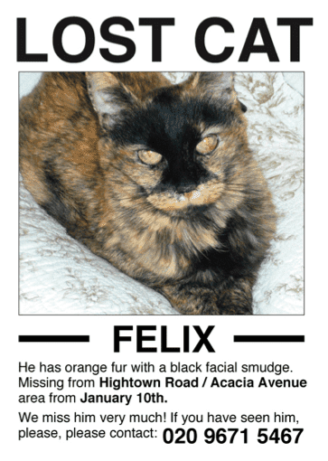
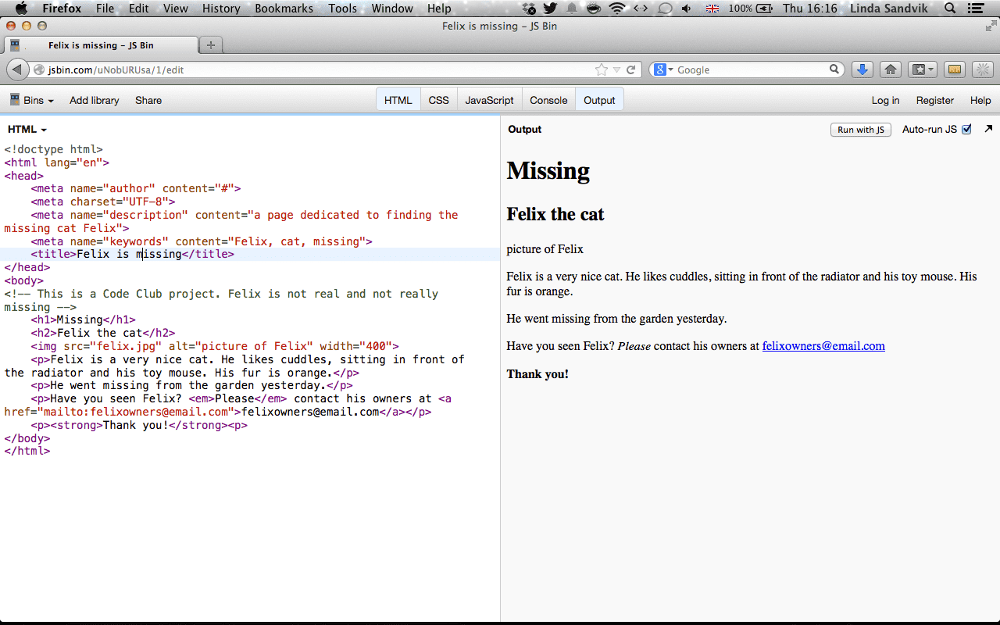

# Introduksjon {.intro}

Katten Felix har forsvunne. Katten Felix har forsvunnet. Eigaren hans har laga
ein plakat for å henge opp i nabolaget, men du har innsett at det er fleire som
kjem til å sjå den viss du lagar ei nettside.




# Steg 1: Felix har forsvunne! {.activity}

- [ ] Lag ei ny mappe som du kallar Felix.

- [ ] Lag eit nytt dokument med namnet `index.html` og lagre det i mappa du
  kalla Felix.

- [ ] No kan du setje opp dokumentet ditt slik du lærte i [Introduksjon til
  web](../introduksjon_til_web/introduksjon_til_web_nn.html).

```html
<!doctype html>
<html>
  <head>
  </head>
  <body>
  </body>
</html>
```

- [ ] Lag ein tittel og ei overskrift. Hugs at tittelen skal plasserast i
  `<head>` og overskrifta skal plasserast i `<body>`.

- [ ] Bruk "Katten Felix har forsvunne" som tittel, og "Forsvunne" som `<h1>`.

- [ ] Rett under `<h1>` kan me lage ein `<h2>` der det står "Katten Felix".

<toggle>
  <strong>Hint</strong>
  <hide>

```html
<!doctype html>
<html>
  <head>
    <title>Katten Felix har forsvunne</title>
  </head>
  <body>
    <h1>Forsvunne</h1>
    <h2>Katten Felix</h2>
  </body>
</html>
```
  </hide>
</toggle>


# Steg 2: Legg til bilete av Felix {.activity}

Me treng eit bilete av Felix, slik at folk veit kva dei skal sjå etter. Frå før
har me lært korleis me legg inn eit bilete som er lagra ein annan stad på
Internett, men denne gongen skal me bruke eit bilete på datamaskina vår.

- [ ] Finn eit bilete på nettet av en katt.

- [ ] Lagre biletet i mappa Felix og la biletet heite `felix.jpg` eller
  `felix.png`, avhengig av om biletet du lastar ned har `.jpg` eller `.png` bak
  namnet sitt.

- [ ] Det er viktig at biletet blir lagt i same mappe som `index.html`.

- [ ] No kan du skrive ``-taggen som du vanlegvis ville gjort, men i
  `src`-attributten, skriv du berre `felix.jpg` eller `felix.png` i staden for
  ein url. Ikkje gløym å leggje inn ein `alt`-attributt!

```html

```

- [ ] Lagre fila di og vis den i nettlesaren.

Viss biletet er litt for stort, så kan me gjere det mindre ved hjelp av
attributten `width`. Me spesifiserer ikkje breidda i centimeter eller meter
eller tommar eller fot, men i noko som kallast `pikslar`. Her har me valt 400
pikslar, men du kan sjølv velje kor stort biletet skal vere. Prøv deg fram meg
ulike tal!

```html

```


# Steg 3: Legg til beskriving av Felix {.activity}

Under biletet vil me beskrive Felix og gi nokre detaljar om når og kor han
forsvann. For å gjere det kan me lage avsnitt, i HTML blir dei ofte kalla
paragrafar etter det engelske ordet "paragraph".

```html
<p>Felix er ein veldig snill katt. Han likar å kose, sitje framfor varmepumpa og
  leikemusa si. Pelsen hans er oransje.</p>
<p>Han forsvann frå hagen i går.</p>
```

Me treng informasjon om korleis ein kan kontakte eigaren viss nokon har sett
eller funne Felix.

```html
<p>Har du sett Felix? Ver snill og kontakt eigaren hans på
  eigarentilfelix@email.com</p>
```

Dette er berre ei leike-epostadresse, men la oss gjere det slik at når nokon
klikkar på den, så blir epostprogrammet deira åpna. Me gjer det på nesten same
måte som når me lagar ei lenke, men i staden for ein __url__ brukar me `mailto`
slik som dette:

```html
<p>Har du sett Felix? Ver snill og kontakt eigaren hans på <a
  href="mailto:eigarentilfelix@email.com">eigarentilfelix@email.com</a></p>
```

__Lagre dokumentet ditt og sjå om det fungerer i nettlesaren!__


# Step 4: Leggje til feit tekst og trykk {.activity}

Me vil verkeleg at folk skal finne Felix, så me vil leggje *trykk* på `ver
snill`. Dette gjer me ved å bruke `em`-taggen.

```html
<p>Har du sett Felix? <em>Ver snill</em> og kontakt eigaren hans på
  eigarentilfelix@email.com</p>
```

Me vil òg at "Tusen takk" skal visast skikkeleg, som me oppnår ved å bruke
`strong`-taggen.

```html
<p><strong>Tusen takk!</strong></p>
```

__Lagre dokumentet ditt og vis det i nettlesaren.__

- [ ] Ser du no korleis "ver snill" visast i *kursiv* og "Tusen takk" i __feit__
  skrift?


# Step 5: Leggje til kommentarar i koden {.activity}

Nokre gonger er det lurt å skrive kommentarar i sjølve HTML-fila. Med
kommentarar meiner me tekst som er meint for at menneske som åpnar fila kan
lese, ikkje som nettlesaren skal lese og vise. Det gjer me ved å bruke den
spesielle koden:

```html
<!-- skriv kva som helst her -->
```

Alt som blir skrive mellom pilene er kommentaren. La oss leggje ein kommentar i
fila som fortel at dette er eit Kodeklubb-prosjekt og at Felix ikkje er ekte.

```html
<!-- Dette er eit Kodeklubb-prosjekt. Felix er ikkje ekte og er ikkje borte. -->
```


# Steg 6: Meir metadata (ting som leggjast i head) {.activity}

La os fortelje kven som har skrive nettsida i fila slik at dei som ser fila veit
at det er deg.

```html
<meta name="author" content="#">
```

Erstatt `#` med namnet ditt.

Det er vanleg å leggje til kva språk nettsida er på. Me gjer det ved å leggje
til ein attributt til `<html>`-taggen.

```html
<html lang="nn"> ... </html>
```

`nn` står for nynorsk.

Det er dessutan god praksis å leggje til teiknsettet (eller alfabetet)
dokumentet er skrive med. Me brukar vanlegvis __UTF-8__.

```html
<meta charset="UTF-8">
```

Me kan òg leggje til ei beskriving av nettsida.

```html
  <meta name="description" content="Ei side laga for å finne katten Felix">
```

Og nokre nøkkelord, separert med komma

```html
<meta name="keywords" content="Felix, katt, forsvunne">
```

No ser sida vår omlag slik ut:



Til venstre har me HTML-koden og til høgre ser du korleis nettlesaren viser sida
vår.

## Kva kan du gjere vidare? {.challenge}

- [ ] Er det noko anna du kan leggje til nettsida som vil hjelpe folk å finne
  Felix? Meir informasjon? Korleis ville du lagt til eit kart over kor han
  forsvann.

- [ ] Mei moro med bilete. Legg til eit bilete som beveger seg. PRøv å leggje
  til biletet `catswithhats.gif` til nettsida. Last ned gifen eller bruk lenka
  [catswithhats.gif](../forsvunnet_katt/ressurser/catswithhats.gif). Åpne det i
  nettlesaren og sjå kva som skjer.

- [ ] Viss Felix blir funne kan du bruke taggen `<del>` for å stryke over
  informasjon som ikkje lengre er sann. Til dømes er ikkje Felix forsvunne
  lengre, så du kan stryke det ordet. Bruk taggen `<ins>` for å setje inn ny
  informasjon, til dømes __Funne__!
