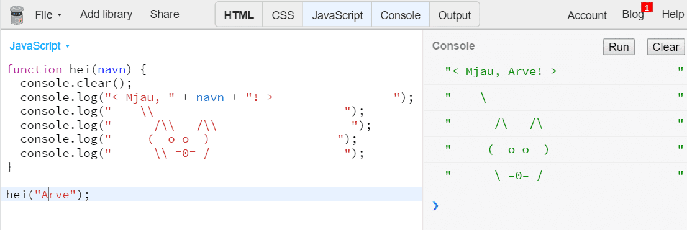
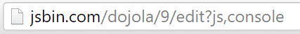
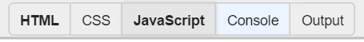
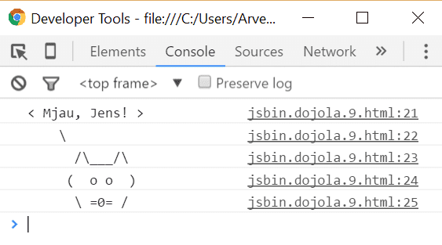

# Introduksjon {.intro}
I denne oppgaven blir du introdusert for programmeringsspråket JavaScript. Du
skal gjøre den klassiske oppgaven *Hei verden*, med en katt.



# Steg 1: Bruke JS Bin {.activity}
Du skal bruke en nettside som heter *JS Bin* for denne oppgaven. JS Bin er en
nettside som lar deg programmere JavaScript. Vi kunne også brukt nettleseren
din direkte, men i JS Bin blir stegene lik for alle, uansett om du bruker
Internet Explorer, Mozilla Firefox, Chrome, Opera, Safari eller en annen
nettleser. I tillegg er det med JS Bin mulig å gjøre denne oppgaven på
nettbrett.

## Tips {.tip}
Her er flere måter å kjøre JavaScript-kode på:
+ Lagre en `.js`-fil i din favoritt teksteditor og åpne den i en nettleser
+ Skrive kode mellom `<script> </script>` i `<body>` eller `<head>` i en HTML-fil,  og åpne den i en nettleser
+ I `<head>`, skrive `<script src="fil_navn.js"></script>`

## Sjekkliste {.check}

- [ ] Åpne JS Bin (http://jsbin.com/?js,console) i et eget vindu.
- [ ] Legg merke til at du får to faner; **JavaScript** og **Console**.
- [ ] Koden skrives i **JavaScript**.
- [ ] Og i **Console** vises tekstbeskjeder som blir skrevet ut.
- [ ] Skriv inn denne koden i fanen **JavaScript**:

  ```js
  console.log("hei verden");
  ```

- [ ] Trykk **Ctrl** + **Enter** (eller bruk knappen <button>Run</button>) og se hva som skjer
  i **Console**.
- [ ] Kan du endre koden til å skrive ditt navn?

## Forklaring {.tip}
Her er en forklaring til koden over:
- `console.log()` betyr at vi ønsker å kjøre kommandoen med navnet `console.log`. Den skriver ut det som er mellom parantesene til `log()` i konsollen.
- `.log` er en av flere utskriftsmetoder. Prøv `console.error`, ser du hva
  forskjellen til `console.log` er?
- Tekst som skrives ut til konsollen ligger  mellom `"`, slik som `"hei verden"`.
- `;` betyr at kodesetningen er ferdig.

# Steg 2: Lage en funksjon {.activity}
En funksjon er nesten som en oppskrift. Funksjoner brukes når man ønsker å
gjenbruke kode flere ganger eller bryte opp et problem til mindre biter. En
funksjon kan både ta i mot og gi fra seg (returnere) data. Din funksjon skal hete `hei`,
ta i mot et `navn` og skrive navnet til konsollen.

## Sjekkliste {.check}

- [ ] Slett koden din fra steg 1.
- [ ] Skriv inn denne koden:

  ```js
  function hei(navn) {
    console.log(navn);
  }
  ```
## Forklaring {.tip}
- `function hei` betyr at funksjonen skal hete `hei`.
- `(navn)` betyr at vi kan sende inn data til funksjonen. `navn` blir her en variabel, den holder på en verdi som kan endres. Vi skal se nærmere på dette senere.
- `{` markerer starten til funksjonen.
- `}` markerer slutten til funksjonen.
- Mellom `{` og `}` er det som funksjonen skal gjøre.


## Sjekkliste {.check}
- [ ] Akkurat nå gjør ikke funksjonen så mye, men la oss teste den ut. Skriv dette
  etter funksjonen:

  ```js
  hei("Emma");
  hei("Jens");
  ```

- [ ] `hei("Emma")` betyr at vi skal kjøre funksjonen og sende inn `"Emma"`.
- [ ] Trykk **Ctrl** + **Enter** for å kjøre koden.
- [ ] Ser du både `"Emma"` og `"Jens"` i konsollen?


Koden til nå:
```js
function hei(navn){
    console.log(navn)
}

hei("Emma");
hei("Jens");
```

## Tips {.tip}
Du kan slette historien i **Console** ved å trykke på knappen <button>Clear</button>, eller legge inn `console.clear();`
i koden din.


# Steg 3: Hei navn! {.activity}
I steg 2 gjorde vi ikke noe annet enn det som `console.log` gjør. Nå skal du få
`hei("Emma")` til å skrive ut `"Hei Emma!"`.

## Sjekkliste {.check}
- [ ] I JavaScript kan vi legge sammen tekst med `+`.
- [ ] La oss endre funksjonen `hei`:

  ```js
  function hei(navn) {
    console.log("Hei " + navn + "!");
  }
  ```

- [ ] Her har vi lagt sammen `"Hei "`, navnet som sendes inn og `"!"`.
- [ ] Kjør koden din.
- [ ] Står det `"Hei Emma!"` og `"Hei Jens!"` i **Console**?
- [ ] Kan du endre koden slik at den skriver ut navnet ditt?

## Forklaring {.tip}
I funksjonen `hei` vil `navn` være en variabel. Den holder på en verdi og denne verdien kan endres. Først er `navn` det samme som `Emma`, så blir `navn` til `Jens`. Variabler er svært nyttig innfor programmering og vi kommer til å bruke masse variabler fremover.

# Steg 4: Katten sier hei {.activity}
I dette siste steget skal du lage en katt som sier hei.

## Sjekkliste {.check}
- [ ] Bytt ut `function hei` ved å kopiere koden under:

  ```js
  function hei(navn) {
    console.log("< Mjau, " + navn + "! >                 ");
    console.log("    \\                           ");
    console.log("      /\\___/\\                   ");
    console.log("     (  o o  )                  ");
    console.log("      \\ =0= /                   ");
  }
  ```

- [ ] Kjør `hei` med ditt eget navn.
- [ ] Er det en katt som sier mjau til deg i konsollen?
- [ ] Klarer du lage en hund eller et annet dyr?

## Bakoverstrek {.tip}
`\` brukes til spesielle bokstaver. `\n` for eksempel betyr *ny linje*. Derfor
må du skrive `\\` dersom du ønsker en vanlig bakoverstrek.

# Steg 5: Dele prosjektet {.activity}
Kanskje hadde det vært kult å sende en kattehilsen til noen av dine beste
venner? La oss lage en personlig hilsen til hver av de.

## Sjekkliste {.check}
- [ ] Sørg for at du kjører `hei` med navnet til din venn:

  ```js
  hei("Navnet til din venn");
  ```
- [ ] Hold inne **Ctrl** + **s** for å lagre.
- [ ] Legg merke til at du nå fikk et tall i adressen. Tallet er versjonen til
  programmet ditt.

  **Versjon 9:** 

  Hver gang du endrer programmet og trykker **Ctrl** + **s**
  får programmet en ny versjon. Slik kan du lagre flere varianter av samme
  program, med forskjellige navn.
- [ ] Trykk på **JavaScript** slik at kodefanen skjules:

  

- [ ] Trykk på <button>Run</button> og sjekk at det ser riktig ut.
- [ ] Kopier nettaddressen og del med vennen din!
- [ ] Gjenta stegene for flere av vennene dine.
- [ ] Hvis du senere ønsker å åpne prosjektet, kan du ta vare på en av lenkene du
  sendte til vennene dine.

## En annen måte å dele programmet {.tip}
Husker du oppgaven [HTML: Publiser nettsiden din](../publiser/publiser.html)? Kanskje du kan laste opp JavaScript-koden til din `Github`-side? Et lite tips er å legge JavaScript-koden inn i `<head>`-taggen ved å bruke disse taggene:  
```html
<script>
</script>
```
Du kan også lagre JavaScript-koden i en egen `.js`-fil, for eksempel `katt.js`. Så kan du referere til den fra en HTML-fil på denne måten:
```html
<head>
    <script src="katt.js"></script>
</head>
```
Husk at `katt.js` må da ligge i samme mappe som HTML-filen. Dette skal vi prøve ut senere.

Men for at dette skal funkere må vi skrive om `console.log()` til:
```js
document.writeln();
```
Denne kommandoen skriver rett på HTML-siden og ikke i `konsollen`. På denne måten vil vennene dine kunne se koden uten å åpne `konsollen`. Problemet med `document.writeln()`er at vi ikke får hver utskrift på en egen linje, derfor må vi også legge til denne CSS-en:
```js
`document.body.style.whiteSpace = "pre"; //gjør at du kan ha flere mellomrom etterhverandre
```

`document.writeln()` legger også til et linjeskift etter den har skrevet ut teksten, dersom du ikke ønsker det kan du bruke `document.write()`.

Nå ser koden slik ut:
```js
function hei(navn) {
    document.writeln("< Mjau, " + navn + "! >                 ");
    document.writeln("    \\                           ");
    document.writeln("      /\\___/\\                   ");
    document.writeln("     ( o o  )                  ");
    document.writeln("      \\ =0= /                   ");
}
document.body.style.whiteSpace = "pre";
```

# Steg 6: Lagre prosjektet på datamaskinen din {.activity}
Det er også mulig å laste ned prosjektet og lagre det på datamaskinen. La oss gjøre det.

## Sjekkliste {.check}
- [ ] Trykk på **File** > **Download**.
- [ ] En `.html`-fil lastes ned.
- [ ] Når filen er lastet ned, åpne filen.
- [ ] Du får et tomt vindu opp, utskriften av katten blir sendt til konsoll. La oss åpne konsollen i din nettleser.
- [ ] **Chrome og Firefox:** Trykk på knappen **F12**. Velg **Console**.
- [ ] **Internet Explorer og Microsoft Edge:** Trykk på knappen **F12**. Velg **Konsoll**.
- [ ] I konsollen skal du se katten mjaue til deg.

  

  Hvis du ikke ser katten, gjør neste steg.

- [ ] Skriv inn `hei("Ditt navn");` og trykk **Enter**.
- [ ] Hva skjer?

__Gratulerer!__ Du har nå skrevet ditt første JavaScript-program!
