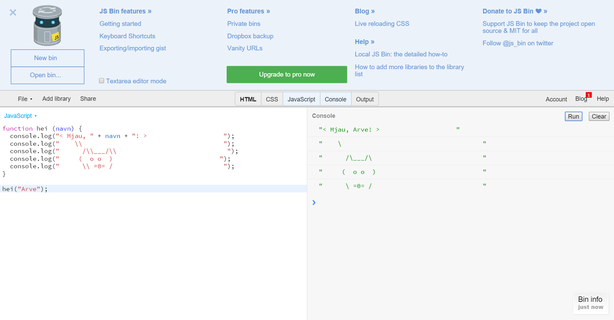

# Introduksjon {.intro}
I denne oppgaven blir du introdusert for programmeringsspråket JavaScript. Du
skal gjøre den klassiske oppgaven *Hello world*, med en katt.



# Steg 1: Bruke JS Bin {.activity}
Du skal bruke en nettside som heter *JS Bin* for denne oppgaven. Dette fordi
JS Bin ser likt ut i alle nettlesere, så da er det enklere å følge stegene.

## Sjekkliste {.check}

- Åpne [JS Bin](http://jsbin.com/?js,console) i et eget vindu.
- Legg merke til at du får to faner; **JavaScript** og **Console**.
- Koden skrives i **JavaScript**.
- Og i **Console** vises tekstbeskjeder som blir skrevet ut.
- Skriv inn denne koden:

  ```js
  console.log("hello world");
  ```

- Trykk **Ctrl** + **Enter** (eller bruk knappen <button>Run</button>) og se hva som skjer
  i **Console**.
- Kan du endre koden til å skrive ditt navn?

## Forklaring {.tip}
Her er en forklaring til koden over:
- `console.log()` betyr at vi ønsker å kjøre kommandoen med navnet `console.log`.
- `.log` er en av flere utskriftsmetoder. Prøv `console.error`, ser du hva
  forskjellen til `console.log` er?
- Tekst skrives mellom `"`, slik som `"hello world"`.
- `;` betyr at kodesetningen er ferdig.

# Steg 2: Lage en funksjon {.activity}
En funksjon er nesten som en oppskrift. Funksjoner brukes når man ønsker å
gjenbruke kode flere ganger eller bryte opp et problem til mindre biter. En
funksjon kan både ta i mot og returnere data. Din funksjon skal hete `hei`,
ta i mot et `navn` og skrive navnet til konsollen.

## Sjekkliste {.check}

- Slett koden din fra steg 1.
- Skriv inn denne koden:

  ```js
  function hei (navn) {
    console.log(navn);
  }
  ```

- `function hei` betyr at funksjonen skal hete `hei`.
- `(navn)` betyr at vi kan sende inn data til funksjonen.
- `{` bestemmer starten til funksjonen.
- `}` bestemmer slutten til funksjonen.
- Mellom `{` og `}` er det som funksjonen skal gjøre.
- Akkurat nå gjør ikke funksjonen så mye, men la oss teste den ut. Skriv dette
  etter funksjonen:

  ```js
  hei("Lars");
  hei("Jens");
  ```

- `hei("Lars")` betyr at vi skal kjøre funksjonen og sende inn `"Lars"`.
- Trykk **Ctrl** + **Enter** for å kjøre koden.
- Ser du både `"Lars"` og `"Jens"` i konsollen?

## Tips {.tip}
Du kan slette historien i **Console** ved å trykke på knappen <button>Clear</button>.

# Steg 3: Hei navn! {.activity}
I steg 2 gjorde vi ikke noe annet enn det som `console.log` gjør. Nå skal vi få
`hei("Lars")` til å skrive ut `"Hei Lars!"`.

## Sjekkliste {.check}
- I JavaScript kan vi legge sammen tekst med `+`.
- Endre `hei`:

  ```js
  function hei (navn) {
    console.log("Hei " + navn + "!");
  }
  ```

- Her har vi lagt sammen `"Hei "`, navnet som sendes inn og `"!"`.
- Kjør koden din.
- Står det `"Hei Lars!"` og `"Hei Jens!"` i **Console**?
- Kan du endre koden slik at den skriver ut navnet ditt?

# Steg 4: Katten sier hei {.activity}
I dette siste steget skal vi lage en katt som sier hei.

## Sjekkliste {.check}
- Endre `function hei`:

  ```js
  function hei (navn) {
    console.log("< Mjau, " + navn + "! >                    ");
    console.log("    \\                                     ");
    console.log("      /\\___/\\                             ");
    console.log("     (  o o  )                            ");
    console.log("      \\ =0= /                             ");
  }
  ```

- Kjør `hei` med ditt eget navn.
- Er det en katt som sier mjau til deg i konsollen?
- Klarer du lage en hund eller et annet dyr?

## Bakoverstrek {.tip}
`\` brukes til spesielle bokstaver. `\n` for eksempel betyr *ny linje*. Derfor
må du skrive `\\` dersom du ønsker en vanlig bakoverstrek.
