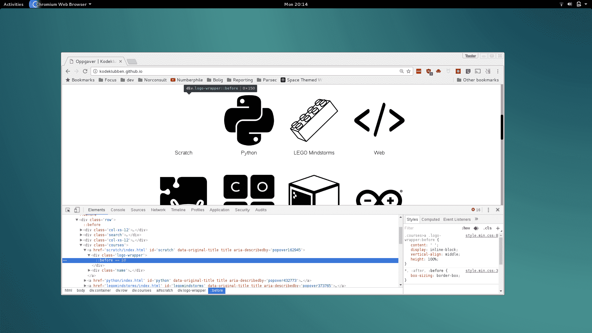
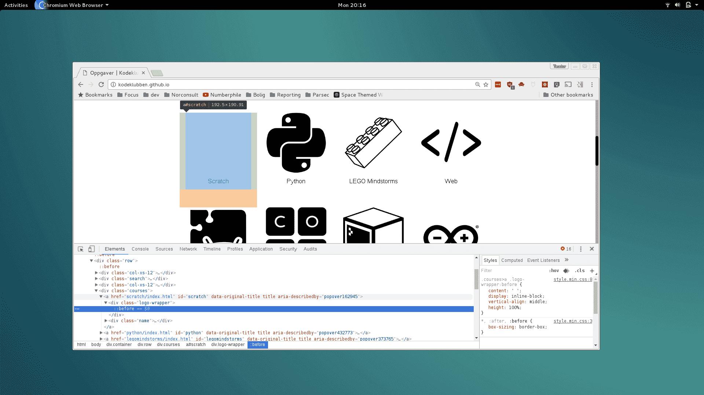
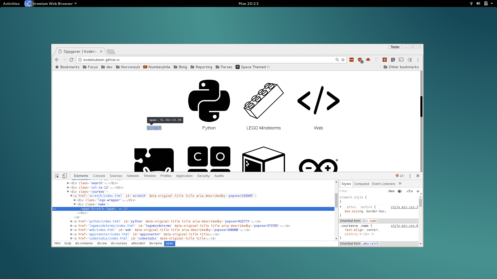
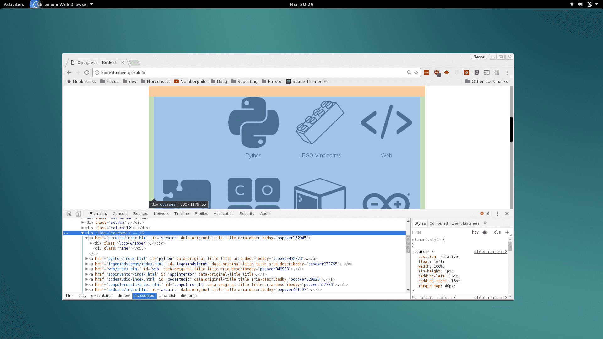
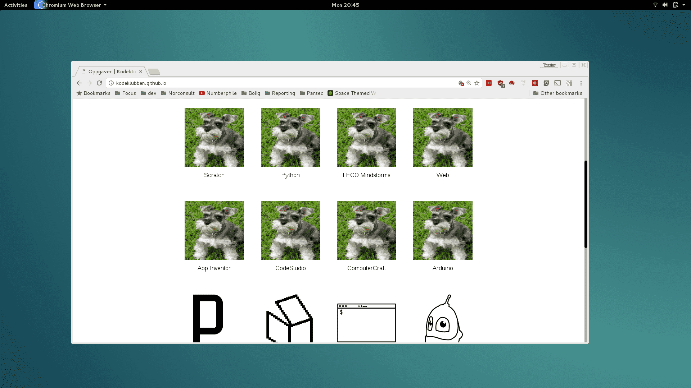
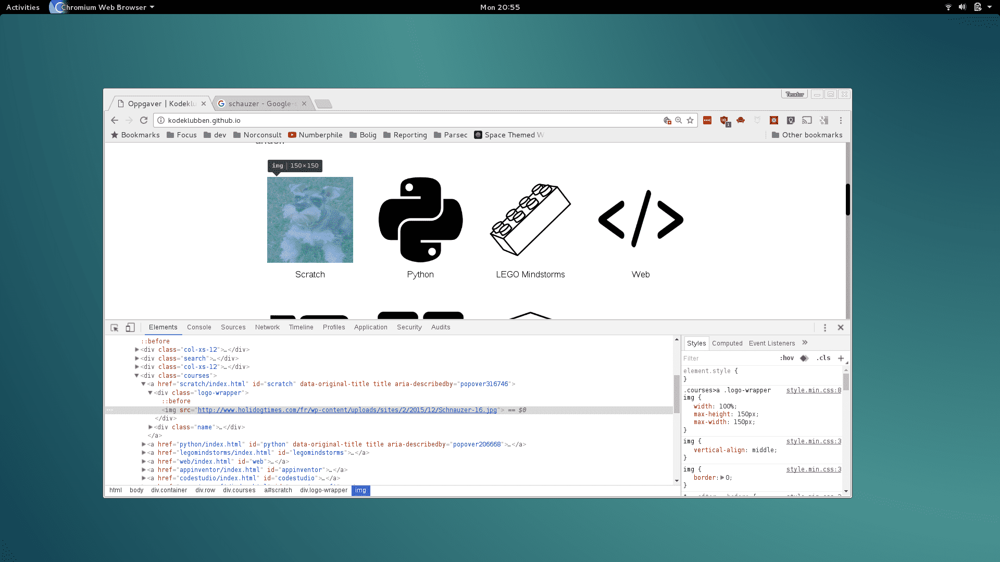

# Introduksjon {.intro}

Målet med oppgaven er å _vise_ hvor HTML finnes i virkelige nettsider, slik som
den siden du er på nå. Når du er ferdig med oppgaven skal du ha litt bedre
kjennskap til HTML, samt enkelt kunne endre på nettsider du er inne på.

Denne oppgaven er demonstrert med nettleseren Google Chrome. Bruk Google Chrome
hvis du har den.

# Steg 1: Se {.activity}

Hvor er da all HTML-koden bak nettsidene vi ser til vanlig? Den er gjemt bak
nettleseren! La oss ta en titt.

## Aktiviteter {.check}

- [ ] Gå til [oppgaver.kidsakoder.no](http://oppgaver.kidsakoder.no) i Chrome eller
  Firefox
- [ ] Høyreklikk på katten og trykk `Inspiser` (norsk) eller `Inspect` (engelsk).

  

  Når vi klikker på `Inspiser`, får vi se en meny til hjelp for utviklere. Denne
  er svært nyttig til webutvikling.

  

  Ser du den fargede teksten, du også? Det er HTML, slik Chrome leser den!
  Nettsidens kildekode.

  Kildekoden til katten ser slik ut:

  ```html
  
  ```

- [ ] Se om du finner igjen `scratch/logo_black.png` i kildekoden. Hold pekeren over
  filnavnet. Ser du filen dukker opp?

- [ ] Inspiser slangen. Hva er filnavnet til slangen? Ser du det samme som meg?

  

  Kildekoden til slangen ser slik ut:

  ```html
  
  ```

## Hva har vi lært? {.protip}

**Høyreklikk og inspiser** finner HTML-koden til elementet vi ser på.

**HTML-kode for bilder** ser slik ut:
```html

```

# Steg 2: Fjern {.activity}

Utviklerverktøyet i nettleseren lar oss tulle med HTML-koden til alle nettsider
vi er på. Vi ødelegger ikke nettsidene, altså!

Alle endringer vi gjør på nettsiden blir altså igjen på vår egen datamaskin. Vi
ødelegger ikke for andre når vi endrer på nettsider!

## Alt borte vekk? {.protip}

Tips: Skulle du fjerne alt for mye, last siden på nytt med oppdater-knappen. Da
blir alt som det var. Prøv!

## Aktiviteter {.check}

Jeg er glad i Minecraft. Men Minecraft er ikke først i listen over kurs! La oss
gjøre noe med det. Vi fjerner alt som er foran!

- [ ] Høyreklikk på katten og inspiser. Finn elementet med katten. Fjern elementet
  med tasten `delete` på tastaturet!

  

- [ ] Yes! Katten ble borte!

  ... men. Vent litt. Slangen gikk ikke til venstre. Hva skjedde nå, mon tro? Og
  det står fremdeles `Scratch` under den tomme plassen?

  

  Ha! Det er en usynlig boks igjen, den som tidligere hadde katten i seg! Den
  heter `<a>`, og er en link:

  ```html
  <a href="scratch/index.html" id="scratch" data-original-title="" title="" aria-describedby="popover162945">
    <div class="logo-wrapper">
    </div>
    <div class="name">
      <span>Scratch</span>
    </div>
  </a>
  ```

- [ ] Trykk på den lille pilen ved siden av linken `<a>`. Da gjemmer vi hva som er
  inni linken!

  

- [ ] Fjern teksten `Scratch`. Merk den som under, og trykk `delete`:

  

  Simsalabim!

  

  La oss fjerne litt mer.

- [ ] Fjern elementet som inneholder alle kursene:
  ```html
  <div class="courses">
  ```

  

  Poff!

  

  Å nei! Nå ble alt borte!

  Last siden på nytt for å få den gamle tilbake.

  Nå må du hjelpe meg å få Minecraft først i køen.

- [ ] Finn elementet som er den usynlige boksen rundt katten. Fjern det!

- [ ] Finn elementet som er den usynlige boksen rundt slangen. Fjern det!

- [ ] Gjør det samme for `Lego Mindstorms`, `Web`, `App Inventor` og `CodeStudio`.

  

  Sånn skal det se ut!

## Hva har vi lært? {.protip}

**HTML** inneholder koder som er usynlige når vi ser på en nettside!

Disse kan være lenker (`<a>`) eller bokser (`<div>`).

Vi kan fremdeles finne og se alle de usynlige kodene når vi bruker `Inspiser`!

# Steg 3: Skap {.activity}

Nå skal vi leke! La oss putte denne rakkeren


på **alle kursene**!



## Aktiviteter {.check}

- [ ] Finn et bilde du liker på internett. Hent bildeadressen ved høyreklikke på bildet:

  

- [ ] Endre alle bildene ved å redigere `src`-attributten til ``-taggen:

  

# Steg 4: Masse moro! {.activity}

Gratulerer! Du er har kommet ett skritt på vei til å bli webutvikler!


